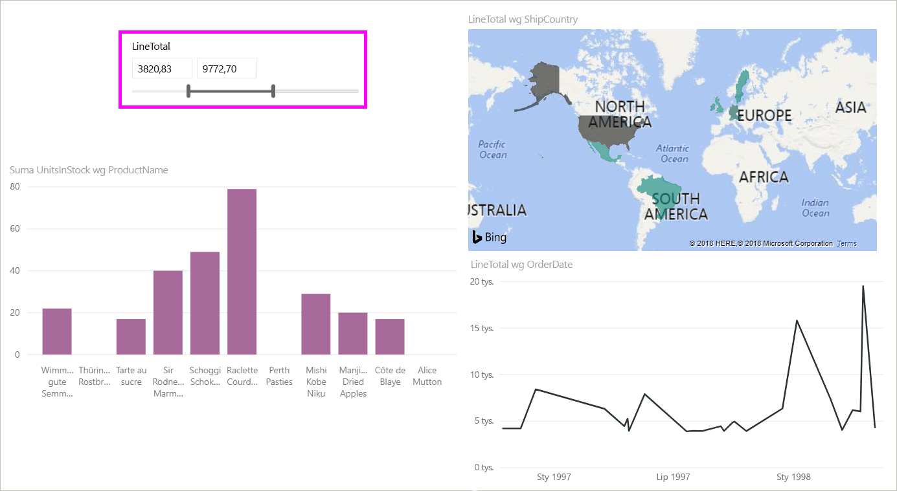
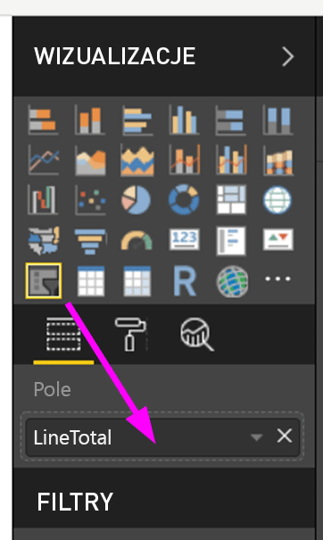
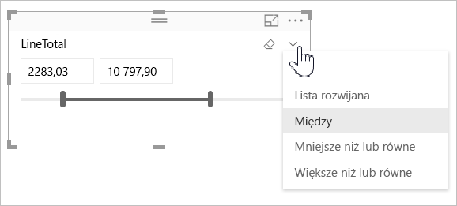
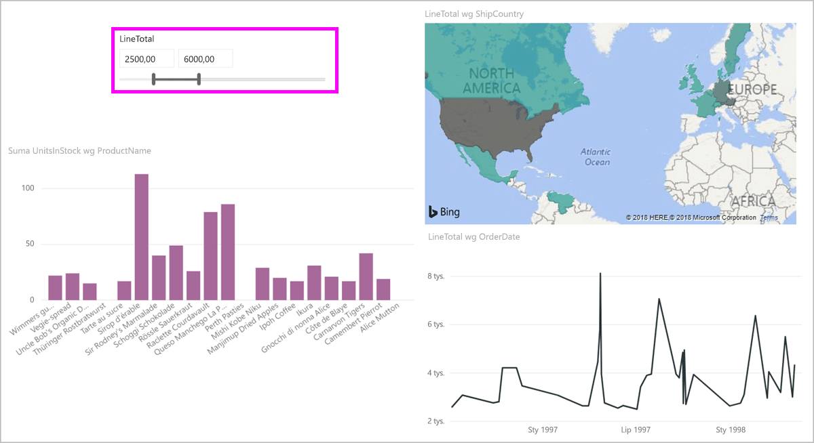
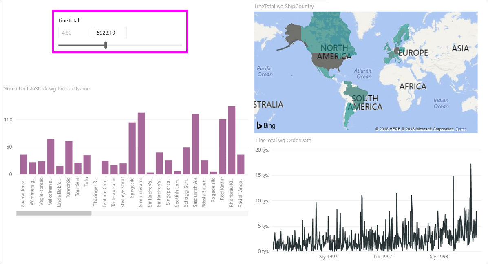
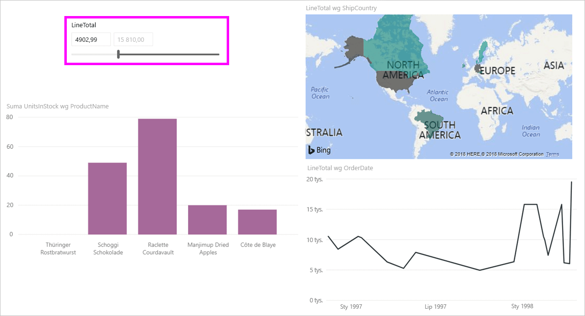

# Używanie fragmentatora zakresu liczbowego w programie Power BI Desktop
Używając **fragmentatora zakresu liczbowego**, możesz zastosować wszelkiego rodzaju filtry do dowolnej kolumny liczbowej w modelu danych. Możesz filtrować liczby **między** wartościami, **mniejsze niż lub równe** określonej liczbie albo **większe niż lub równe** określonej liczbie. Chociaż może to brzmieć prosto, jest to bardzo zaawansowana metoda filtrowania danych.

## Używanie fragmentatora zakresu liczbowego
Fragmentatora zakresu liczbowego możesz używać podobnie jak każdego innego fragmentatora. Po prostu utwórz wizualizację **fragmentatora** dla raportu, a następnie dla wartości **Pole** wybierz wartość liczbową. Na poniższej ilustracji jest zaznaczone pole *LineTotal*.

Wybierz strzałkę w dół w prawym górnym rogu **fragmentatora zakresu liczbowego**, aby wyświetlić menu.

W przypadku zakresu liczbowego możesz wybrać jedną z następujących trzech opcji:

* Między
* Mniejsze niż lub równe
* Większe niż lub równe

Gdy wybierzesz z menu pozycję **Między**, zostanie wyświetlony suwak i będzie można filtrować wartości liczbowe mieszczące się między liczbami. Zamiast używać paska suwaka, możesz kliknąć jedno z pól i wpisać wartość. Jest to wygodne, gdy chcesz utworzyć wycinek między określonymi liczbami, ale stopień szczegółowości przesunięcia paska fragmentatora utrudnia trafienie dokładnie w tę liczbę.

Na poniższej ilustracji strona raportu jest filtrowana według wartości *LineTotal* mieszczących się w zakresie od 2500,00 do 6000,00.

Gdy wybierzemy pozycję **Mniejsze niż lub równe**, zniknie lewy uchwyt (dolna wartość) paska suwaka i będziemy mogli dostosować tylko górną granicę paska suwaka. Na poniższej ilustracji ustawiliśmy górną granicę paska suwaka na 5928,19.

Natomiast gdy wybierzemy pozycję **Większe niż lub równe**, zniknie prawy uchwyt paska suwaka (górna wartość) i będziemy mogli dostosować dolną wartość, jak widać na poniższej ilustracji. Teraz w wizualizacjach na stronie raportu są wyświetlane tylko elementy, których wartość *LineTotal* jest większa niż 4902,99 lub równa tej liczbie.

## Przyciąganie do liczb całkowitych przy użyciu fragmentatora zakresu liczbowego

Fragmentator zakresu liczbowego będzie przyciągany do liczb całkowitych, jeśli typem danych pola bazowego jest **Liczba całkowita**. Pozwala to fragmentatorowi prawidłowo dopasować liczby całkowite. Pola typu **Liczba dziesiętna** pozwalają wprowadzać lub wybierać części ułamkowe. Formatowanie zastosowane w polu tekstowym jest zgodne z formatowaniem ustawionym w polu, mimo że można wpisać lub wybrać bardziej precyzyjne liczby.

## Formatowanie danych wyświetlanych we fragmentatorze zakresów dat

Podczas używania fragmentatora do wyświetlania lub ustawiania zakresu dat daty są zawsze wyświetlane w formacie **Data krótka** na podstawie ustawień regionalnych przeglądarki lub systemu operacyjnego użytkownika. Ten format wyświetlania jest używany niezależnie od ustawień typów danych w podstawowych danych lub podstawowym modelu. 

Na przykład dla podstawowego typu danych może być skonfigurowany format daty długiej (np. *dddd, d MMMM, rrrr*, który w innych wizualizacjach lub sytuacjach będzie formatował datę jako *Środa, 14 marca, 2001*), ale we fragmentatorze zakresów dat ta data byłaby wyświetlana w postaci *14.03.2001*.

Korzystanie z formatu **Data krótka** we fragmentatorze zapewnia, że długość ciągu pozostanie spójna i niewielka w obrębie fragmentatora. 

## Ograniczenia i istotne zagadnienia
Obecnie obowiązują poniższe ograniczenia i istotne zagadnienia dotyczące **fragmentatora zakresu liczbowego**:

* **Fragmentator zakresu liczbowego** filtruje obecnie każdy wiersz podstawowy w danych, ale nie filtruje żadnej wartości zagregowanej. Jeśli na przykład jest używane pole *Kwota sprzedaży*, każda transakcja związana z polem *Kwota sprzedaży* będzie filtrowana w oparciu o to pole, a nie o sumę wartości *Kwota sprzedaży* dla każdego punktu danych wizualizacji.
* Obecnie fragmentator nie współpracuje z miarami.
* W polach tekstowych fragmentatora liczbowego można wpisać dowolną liczbę, nawet spoza zakresu wartości w kolumnie bazowej. Dzięki temu można skonfigurować filtry, jeśli wiadomo, że dane mogą się zmienić.
