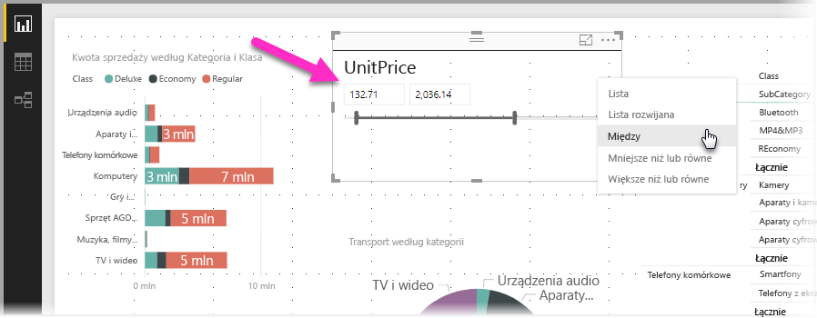
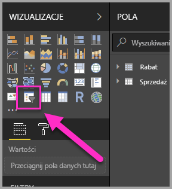
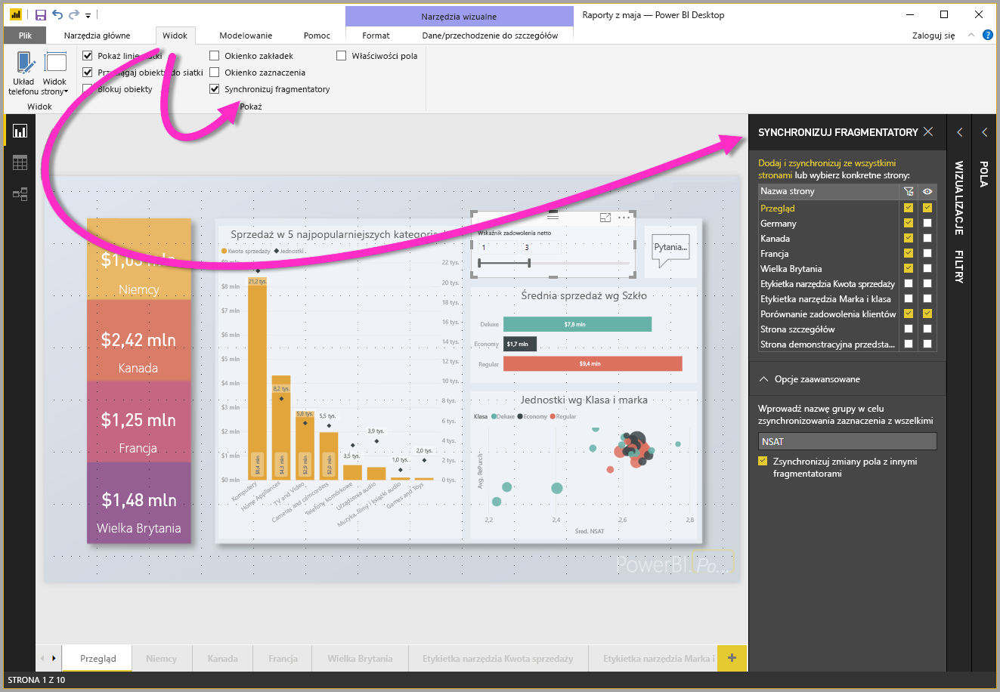
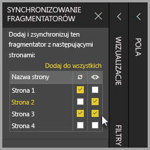

# Korzystanie z fragmentatorów w programie Power BI Desktop

**Fragmentator** w programie **Power BI Desktop** umożliwia filtrowanie wyników wizualizacji na stronie raportu. Przy użyciu fragmentatorów można łatwo dostosować filtr, który jest stosowany przez interakcję z samym fragmentatorem. Można również określić opcje wyświetlania fragmentatora i interakcji z nim. Na poniższej ilustracji przedstawiono fragmentator z widoczną listą rozwijaną *typu*. 

Fragmentator może być wyświetlany w oparciu o jeden z następujących typów:

* Lista
* Lista rozwijana
* Między
* Mniejsze niż lub równe
* Większe niż lub równe

Możesz dodać fragmentator do raportu, klikając wizualizację **fragmentatora** w okienku **Wizualizacje**.

Fragmentatory w programie **Power BI Desktop** oraz w **usłudze Power BI** działają w podobny sposób. Aby zapoznać się z samouczkiem dotyczącym używania fragmentatorów, zobacz artykuł [Fragmentatory w usłudze Power BI (samouczek)](power-bi-visualization-slicers.md).

## Synchronizowanie fragmentatorów na stronach raportu

W programie **Power BI Desktop** można zsynchronizować fragmentatory na wielu stronach raportu. Aby zsynchronizować fragmentatory, w okienku **Widok** na wstążce wybierz pozycję **Synchronizuj fragmentatory**. W przypadku synchronizacji fragmentatorów zostaje wyświetlone okienko **Synchronizuj fragmentatory**, jak pokazano na poniższej ilustracji.

W okienku **Synchronizuj fragmentatory** można określić sposób synchronizacji fragmentatorów na stronach raportu. Można wskazać, czy każdy fragmentator powinien zostać **zastosowany** do każdej strony raportu oraz czy powinien być **widoczny** na każdej stronie raportu.

Na przykład możesz umieścić fragmentator na **stronie 2** raportu, zgodnie z ilustracją poniżej. Następnie możesz określić, czy fragmentator ma być *zastosowany* do każdej wybranej strony i czy powinien być *widoczny* na każdej wybranej stronie raportu. Dla każdego fragmentatora można użyć dowolnej kombinacji opcji. 

Użycie linku **Dodaj do wszystkich** w okienku powoduje zastosowanie wybranego fragmentatora do wszystkich stron raportu.

Należy pamiętać, że opcje widoczne w okienku **Synchronizuj fragmentatory** dotyczą tylko *wybranego fragmentatora*. Możesz zastosować wiele fragmentatorów do różnych stron i za pomocą okienka zdefiniować sposób zastosowania poszczególnych fragmentatorów do rozmaitych stron raportu. 

Chociaż wybór fragmentatorów może podlegać synchronizacji, inne wybrane opcje dotyczące np. stylów, edycji i usuwania *nie* są synchronizowane. 

## Następne kroki

Może zainteresują Cię również następujące artykuły:

* [Fragmentatory w usłudze Power BI (samouczek)](power-bi-visualization-slicers.md)
* [Używanie fragmentatora zakresu liczbowego w programie Power BI Desktop](desktop-slicer-numeric-range.md)
* [Używanie fragmentatora i filtru dat względnych w programie Power BI Desktop](desktop-slicer-filter-date-range.md)

