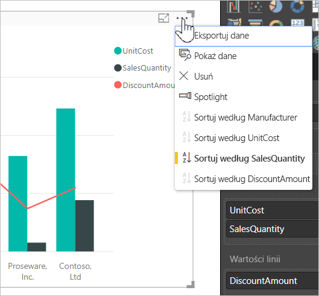
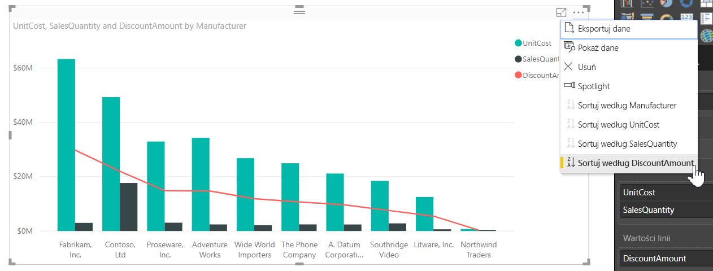
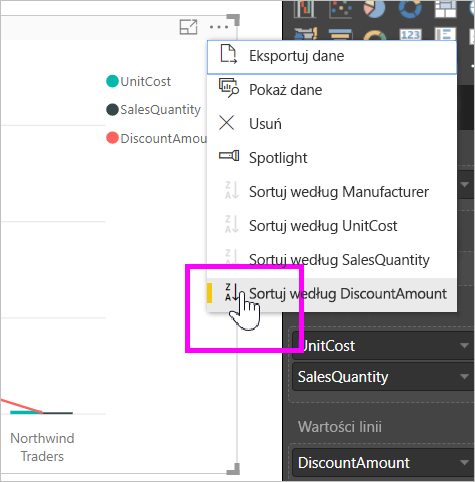
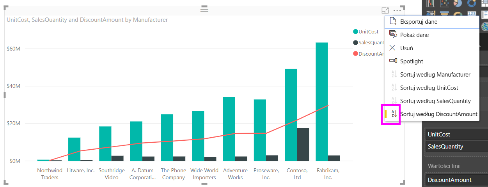
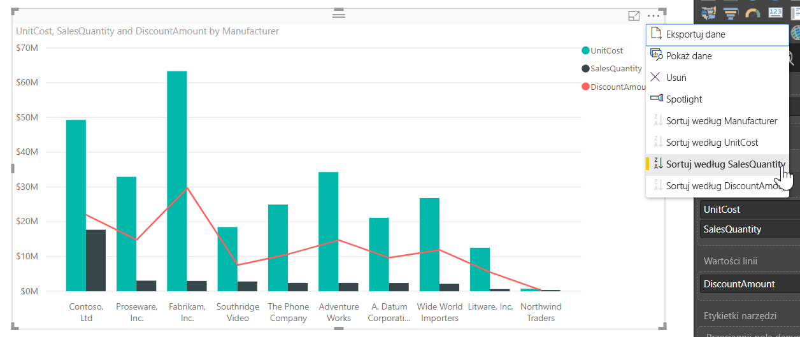
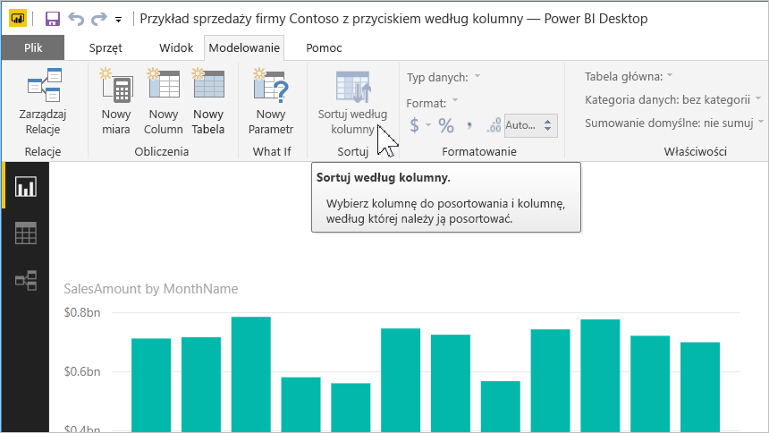
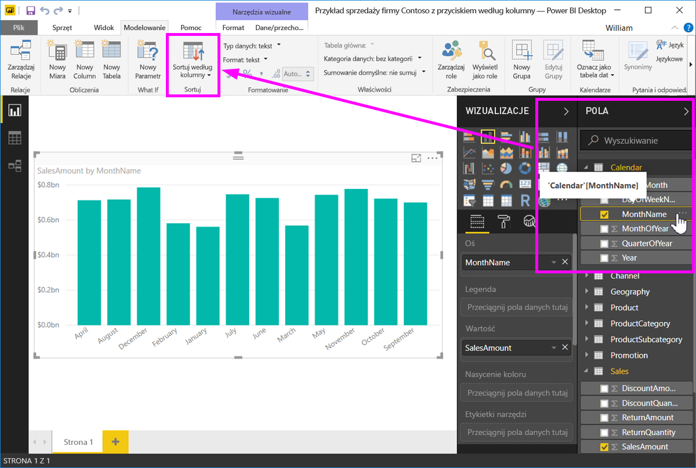
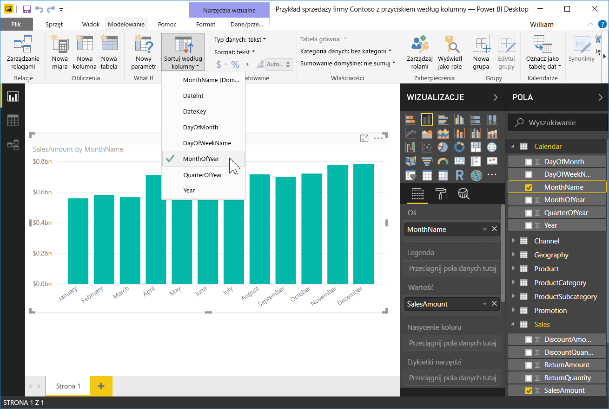
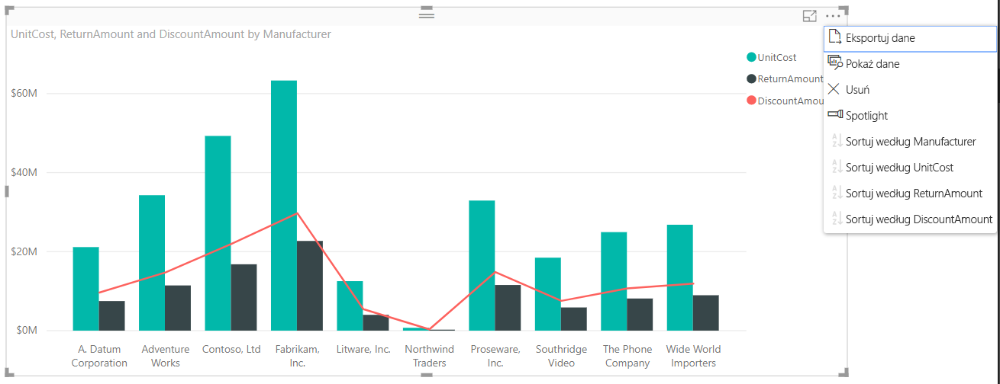

# Sortowanie według kolumny w programie Power BI Desktop
W programie **Power BI Desktop** i **usłudze Power BI** można zmienić wygląd wizualizacji przez posortowanie jej według różnych pól danych. Zmiana sposobu sortowania wizualizacji pozwala wyróżnić informacje do przekazania oraz odzwierciedlić trend (lub wyróżnienie) do przekazania w wizualizacji.

Niezależnie od tego, czy korzystasz z danych liczbowych (takich jak wyniki sprzedaży) czy tekstu (takich jak nazwy stanów), możesz sortować wizualizacje w dowolny sposób i nadawać im odpowiedni wygląd.  Usługa **Power BI** zapewnia dużą elastyczność sortowania i udostępnia szybkie menu. W dowolnej wizualizacji wybierz menu wielokropka (...), wybierz pozycję **Sortuj według**, a następnie wybierz pole, według którego chcesz sortować zawartość, jak pokazano na poniższej ilustracji.

## Szczegółowe informacje i przykład
Użyj przykładu z większą liczbą szczegółów i zobacz, jak on działa w programie **Power BI Desktop**.

Poniższa wizualizacja zawiera 15 pierwszych stanów pod względem pogody (najbardziej słoneczne dni punktowane od 1 do 50, gdzie 1 to najbardziej słoneczne dni). Poniżej przedstawiono wizualizację przed posortowaniem.

Wizualizacja jest obecnie posortowana według kolumny **Cost of living** (Koszty utrzymania) — można to sprawdzić przez dopasowanie koloru malejących słupków do legendy, ale istnieje lepszy sposób na określenie bieżącej kolumny sortowania: okno dialogowe **Sortowanie według** dostępne z menu wielokropka (...) w prawym górnym rogu wizualizacji. Po wybraniu wielokropka jest wyświetlane następujące menu:

Menu wyświetlane po wybraniu wielokropka zawiera kilka ważnych elementów:

* Żółty pasek obok pozycji **Cost of living** (Koszty utrzymania) i pogrubienie pozycji **Cost of living** (Koszty utrzymania).
* Mała ikona obok pozycji **Sortuj według**, która zawiera symbol **Z/A** (Z powyżej A) i strzałkę w dół.

Omówimy je osobno w dwóch następnych sekcjach.

## Wybieranie kolumny na potrzeby sortowania
Obok pozycji **Cost of living** (Koszty utrzymania) w menu **Sortuj według** jest wyświetlany żółty pasek, co oznacza, że wizualizacja jest posortowana według kolumny **Cost of living** (Koszty utrzymania). Sortowanie według innej kolumny jest proste — wystarczy wybrać wielokropek w celu wyświetlenia menu **Sortuj według**, a następnie wybrać inną kolumnę. To bardzo łatwe.

Na poniższej ilustracji jako kolumnę sortowania wybrano kolumnę **Community well-being** (Dobrobyt społeczności). Ta kolumna jest reprezentowana w wizualizacji jako linia, a nie jako słupek. Poniżej przedstawiono wizualizację po wybraniu kolumny **Community well-being** (Dobrobyt społeczności).

Zwróć uwagę na to, jak zmieniła się wizualizacja. Wartości są teraz uporządkowane od największej wartości kolumny „Community well-being” (Dobrobyt społeczności) dla stanów zawartych w tej wizualizacji (w tym przypadku jest to RI, czyli Rhode Island) do najmniejszej wartości (AZ, czyli Arizona). Ogólny wykres nadal obejmuje tylko 15 stanów z najbardziej słonecznymi dniami — zostały one tylko posortowane według innej kolumny wizualizacji.

Co jednak zrobić, aby posortować zawartość rosnąco, a nie malejąco? W następnej sekcji pokazano, jak łatwo można to zrobić.

## Wybieranie kolejności sortowania — od najmniejszej do największej wartości lub od największej do najmniejszej wartości
Gdy przyjrzysz się dokładniej menu **Sortuj według** z poprzedniej ilustracji, zauważysz, że ikona obok pozycji **Sortuj według** zawiera symbol **Z/A** (Z powyżej A). Zobacz:

Gdy jest wyświetlany symbol **Z/A**, oznacza to, że wizualizacja jest posortowana według wybranej kolumny w kolejności od największej do najmniejszej wartości. Chcesz to zmienić? Żaden problem — wystarczy nacisnąć lub kliknąć ikonę **Z/A**, aby zmienić kolejność sortowania na **A/Z** i posortować wizualizację według wybranej kolumny od najmniejszej do największej wartości.

Poniżej przedstawiono tę samą wizualizację po naciśnięciu ikony **Z/A** w menu **Sortuj według** w celu zmiany kolejności sortowania. Stan AZ (Arizona) jest teraz pierwszy na liście, a stan RI (Rhode Island) — ostatni.

Możesz sortować według dowolnej kolumny w wizualizacji — możesz łatwo wybrać kolumnę Weather (Pogoda) jako kolumnę sortowania i wybrać pozycję **Z/A** z menu **Sortuj według**, aby jako pierwsze wyświetlić najbardziej słoneczne stany (największa wartość tej kolumny jest porównywana z liczbą słonecznych dni w tym modelu danych) i zachować wartości pozostałych kolumn wizualizacji dla poszczególnych stanów. Poniżej przedstawiono wizualizację z tymi ustawieniami.

## Sortowanie przy użyciu przycisku Sortuj według kolumny
Dane można też sortować przy użyciu przycisku **Sortuj według kolumny** na wstążce **Modelowanie**.

To rozwiązanie wymaga wybrania kolumny w okienku **Pola**, a następnie wybrania przycisku **Sortuj według kolumny** w celu wybrania kolumny sortowania wizualizacji. Musisz wybrać kolumnę (pole) sortowania w okienku **Pola**, aby włączyć przycisk **Sortuj według kolumny** — w przeciwnym razie przycisk będzie nieaktywny.

Oto typowy przykład: masz dane z każdego dnia tygodnia i chcesz posortować je w kolejności chronologicznej. Poniżej przedstawiono odpowiednią procedurę.

1. Najpierw zwróć uwagę, że w przypadku wybrania wizualizacji bez wybrania kolumny w okienku **Pola** przycisk **Sortuj według kolumny** jest nieaktywny (wyszarzony).
   
   
2. Gdy wybierzesz kolumnę sortowania w okienku **Pola**, przycisk **Sortuj według kolumny** stanie się aktywny.
   
   
3. Po wybraniu wizualizacji można wybrać kolumnę *Day of Week* (Dzień tygodnia) zamiast domyślnej kolumny *Name of Day* (Nazwa dnia), aby posortować wizualizację w odpowiedniej kolejności, czyli według dnia tygodnia.
   
   

To wszystko. Musisz wybrać kolumnę w okienku **Pola**, aby uaktywnić przycisk **Sortuj według kolumny**.

## Powrót do domyślnej kolumny sortowania
Możesz sortować zawartość według dowolnej kolumny, ale czasami może być konieczny powrót do domyślnej kolumny sortowania wizualizacji. Żaden problem. W przypadku wizualizacji, dla której wybrano kolumnę sortowania (obok wybranej kolumny sortowania jest wyświetlany żółty pasek w menu **Sortuj według**, jak opisano wcześniej), otwórz menu **Sortuj według** i ponownie wybierz tę kolumnę, aby przywrócić domyślną kolumnę sortowania wizualizacji.

Oto wcześniejszy wykres:

Gdy wrócisz do menu i wybierzesz ponownie kolumnę **Weather** (Pogoda), wizualizacja będzie domyślnie sortowana alfabetycznie według kolumny **State Code** (Kod stanu), jak pokazano na poniższej ilustracji.

Tak duża liczba opcji sortowania wizualizacji ułatwia utworzenie odpowiedniego wykresu lub obrazu.

