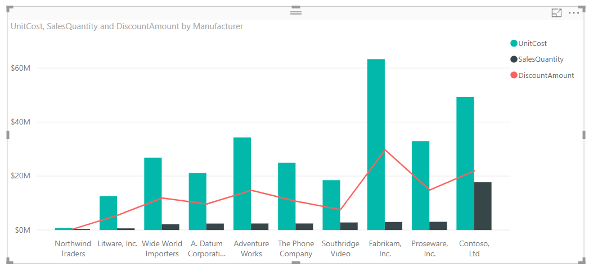

# Sortowanie według kolumny w programie Power BI Desktop
W programie **Power BI Desktop** i **usłudze Power BI** można zmienić wygląd wizualizacji przez posortowanie jej według różnych pól danych. Zmiana sposobu sortowania wizualizacji pozwala wyróżnić informacje do przekazania oraz odzwierciedlić trend (lub wyróżnienie) wizualizacji.

Niezależnie od tego, czy korzystasz z danych liczbowych (takich jak wyniki sprzedaży) czy tekstu (takich jak nazwy stanów), możesz sortować wizualizacje w dowolny sposób i nadawać im odpowiedni wygląd.  Usługa **Power BI** zapewnia dużą elastyczność sortowania i udostępnia szybkie menu. W dowolnej wizualizacji wybierz menu wielokropka (...), a następnie wybierz pole, według którego chcesz sortować zawartość, jak pokazano na poniższej ilustracji.

## Szczegółowe informacje i przykład
Użyj przykładu z większą liczbą szczegółów i zobacz, jak on działa w programie **Power BI Desktop**.

Poniższa wizualizacja przedstawia koszty, ilości i kwoty posortowane według nazwy producenta. Poniżej przedstawiono wizualizację przed dodatkowym posortowaniem.

Wizualizacja jest obecnie posortowana według kolumny **SalesQuantity** — można to sprawdzić przez dopasowanie koloru rosnących słupków do legendy, ale istnieje lepszy sposób na określenie bieżącej kolumny sortowania: przy użyciu menu wielokropka (...) w prawym górnym rogu wizualizacji. Po wybraniu wielokropka jest wyświetlane następujące menu:

* Bieżące pole sortowania to **SalesQuantity**, co można rozpoznać dzięki pogrubieniu pozycji **Sortuj według SalesQuantity** i żółtemu paskowi obok niej. 

* Bieżący kierunek sortowania to kierunek od najmniejszych do największych, co wskazuje mała ikona **A/Z** (A powyżej Z) i strzałka w dół.

Omówimy pole sortowania i kierunek sortowania osobno w dwóch następnych sekcjach.

## Wybieranie kolumny na potrzeby sortowania
Obok pozycji **Sortuj według SalesQuantity** w menu **Więcej opcji** jest wyświetlany żółty pasek, co oznacza, że wizualizacja jest sortowana według kolumny **SalesQuantity**. Sortowanie według innej kolumny jest proste — wystarczy wybrać wielokropek w celu wyświetlenia menu, a następnie wybrać inną kolumnę.

Na poniższej ilustracji jako kolumnę sortowania wybrano kolumnę *DiscountAmount*. Ta kolumna jest reprezentowana w wizualizacji jako linia, a nie jako słupek. Poniżej przedstawiono wizualizację po wybraniu kolumny **DiscountAmount**.

Zwróć uwagę na to, jak zmieniła się wizualizacja. Wartości są teraz uporządkowane od największej wartości kolumny DiscountAmount (Fabrikam Inc. w tej wizualizacji) do najmniejszej wartości (Northwind Traders). 

Co jednak zrobić, aby posortować zawartość rosnąco, a nie malejąco? W następnej sekcji pokazano, jak łatwo można to zrobić.

## Wybieranie kolejności sortowania — od najmniejszej do największej wartości lub od największej do najmniejszej wartości
Gdy przyjrzysz się dokładniej menu **Opcje** z poprzedniej ilustracji, zauważysz, że ikona obok pozycji **Sortuj według DiscountAmount** zawiera symbol **Z/A** (Z powyżej A). Zobacz:

Gdy jest wyświetlany symbol **Z/A**, oznacza to, że wizualizacja jest posortowana według wybranej kolumny w kolejności od największej do najmniejszej wartości. Chcesz to zmienić? Żaden problem — wystarczy nacisnąć lub kliknąć ikonę **Z/A**, aby zmienić kolejność sortowania na **A/Z** i posortować wizualizację według wybranej kolumny od najmniejszej do największej wartości.

Poniżej przedstawiono tę samą wizualizację po naciśnięciu ikony **Z/A** w elemencie menu **Sortuj według DiscountAmount** w celu zmiany kolejności sortowania. Jako pierwszy producent jest teraz wyświetlana firma Northwind Traders, natomiast firma Fabrikam Inc. jest na ostatnim miejscu, czyli odwrotnie niż poprzednio.

Możesz sortować według dowolnej kolumny w wizualizacji — możesz łatwo wybrać kolumnę SalesQuantity jako kolumnę sortowania przy użyciu pozycji **Sortuj według SalesQuantity**, aby jako pierwszych wyświetlić producentów z największą sprzedażą i zachować wartości pozostałych kolumn wizualizacji dla poszczególnych producentów. Poniżej przedstawiono wizualizację z tymi ustawieniami.

## Sortowanie przy użyciu przycisku Sortuj według kolumny
Dane można też sortować przy użyciu przycisku **Sortuj według kolumny** na wstążce **Modelowanie**.

To rozwiązanie wymaga wybrania kolumny w okienku **Pola**, a następnie wybrania przycisku **Sortuj według kolumny** w celu wybrania kolumny sortowania wizualizacji. Musisz wybrać kolumnę (pole) sortowania w okienku **Pola**, aby włączyć przycisk **Sortuj według kolumny** — w przeciwnym razie przycisk będzie nieaktywny.

Oto typowy przykład: masz dane z każdego miesiąca roku i chcesz posortować je w kolejności chronologicznej. Poniżej przedstawiono odpowiednią procedurę.

1. Najpierw zwróć uwagę, że w przypadku wybrania wizualizacji bez wybrania kolumny w okienku **Pola** przycisk **Sortuj według kolumny** jest nieaktywny (wyszarzony).
   
   

2. Gdy wybierzesz kolumnę sortowania w okienku **Pola**, przycisk **Sortuj według kolumny** stanie się aktywny.
   
   
3. Po wybraniu wizualizacji można wybrać kolumnę *MonthOfYear* zamiast domyślnej kolumny *MonthName*, aby posortować wizualizację w odpowiedniej kolejności, czyli według miesiąca roku.
   
   

To wszystko. Musisz wybrać kolumnę w okienku **Pola**, aby uaktywnić przycisk **Sortuj według kolumny**.

## Powrót do domyślnej kolumny sortowania
Możesz sortować zawartość według dowolnej kolumny, ale czasami może być konieczny powrót do domyślnej kolumny sortowania wizualizacji. Żaden problem. W przypadku wizualizacji, dla której wybrano kolumnę sortowania (obok wybranej kolumny sortowania jest wyświetlany żółty pasek w menu wielokropka, jak opisano wcześniej), otwórz menu **Więcej opcji** i ponownie wybierz tę kolumnę, aby przywrócić domyślną kolumnę sortowania wizualizacji.

Oto wcześniejszy wykres:

Gdy wrócisz do menu i wybierzesz ponownie kolumnę **SalesQuantity**, wizualizacja będzie domyślnie sortowana alfabetycznie według kolumny **Manufacturer**, jak pokazano na poniższej ilustracji.

Tak duża liczba opcji sortowania wizualizacji ułatwia utworzenie odpowiedniego wykresu lub obrazu.

