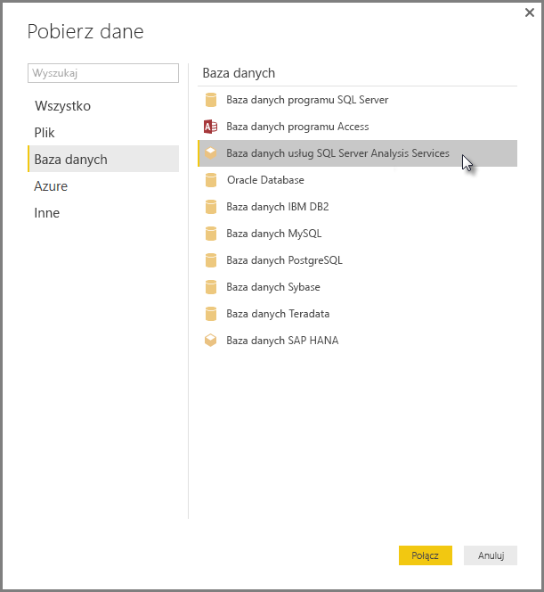

# Łączenie się z modelami wielowymiarowymi usług SSAS w programie Power BI Desktop
Program Power BI Desktop umożliwia dostęp do **modeli wielowymiarowych usług SSAS**, często nazywanych **SSAS MD**.

Aby nawiązać połączenie z bazą danych **SSAS MD**, wybierz pozycję **Pobierz dane &gt; Baza danych &gt; Baza danych programu SQL Server Analysis Services**, jak pokazano na poniższym obrazie:

**Modele wielowymiarowe usług SSAS** w trybie połączenia na żywo są obsługiwane zarówno w usłudze Power BI, jak i w programie Power BI Desktop. Możesz również publikować i przekazywać raporty wykorzystujące **modele wielowymiarowe usług SSAS** w trybie na żywo do usługi Power BI.

## Możliwości i funkcje modeli SSAS MD
W poniższych sekcjach opisano funkcje i możliwości połączeń usługi Power BI i modeli SSAS MD.

### Metadane tabelaryczne modeli wielowymiarowych
W poniższej tabeli przedstawiono związek między obiektami wielowymiarowymi i metadanymi tabelarycznymi, które są zwracane do programu Power BI Desktop. Usługa Power BI wysyła zapytanie do modelu o metadane tabelaryczne i na podstawie zwróconych metadanych uruchamia odpowiednie zapytania języka DAX wobec usług Analysis Services podczas tworzenia wizualizacji takich jak tabela, macierz, wykres lub fragmentator.

| Obiekt wielowymiarowy modelu BISM | Metadane tabelaryczne |
| --- | --- |
| Moduł |Model |
| Wymiar modułu |Tabela |
| Atrybuty wymiaru (klucze), nazwa |Kolumny |
| Grupa miar |Tabela |
| Miara |Miara |
| Miary bez skojarzonej grupy miar |W tabeli o nazwie *Miary* |
| Grupa miar -> Relacja wymiaru modułu |Relacja |
| Perspektywa |Perspektywa |
| KPI |KPI |
| Hierarchie użytkownika/nadrzędny-podrzędny |Hierarchie |

### Miary, grupy miar i wskaźniki KPI
Grupy miar w module wielowymiarowym są widoczne w usłudze Power BI jako tabele ze znakiem ∑ obok w okienku **Pola**. Obliczone miary, które nie mają skojarzonej grupy miar, są zgrupowane w specjalnej tabeli o nazwie *Miary* w metadanych tabelarycznych.

W modelu wielowymiarowym można zdefiniować zestaw miar lub wskaźników KPI w module zlokalizowanym w *folderze wyświetlania*, co może uprościć złożone modele. Usługa Power BI rozpoznaje foldery wyświetlania w metadanych tabelarycznych i przedstawia miary i wskaźniki KPI w folderach wyświetlania. Wskaźniki KPI w wielowymiarowych bazach danych obsługują *wartość*, *cel*, *grafikę stanu* i *grafikę trendu*.

### Typ atrybutu wymiaru
Modele wielowymiarowe obsługują także kojarzenie atrybutów wymiarów ze specyficznymi typami atrybutu wymiaru. Na przykład wymiar **Lokalizacja geograficzna**, w którym atrybuty wymiaru *Miasto*, *Województwo*, *Kraj* i *Kod pocztowy* mają skojarzone odpowiednie typy lokalizacji geograficznej i są widoczne w metadanych tabelarycznych. Usługa Power BI rozpoznaje metadane, umożliwiając tworzenie wizualizacji z mapą. Skojarzenia te można rozpoznać dzięki ikonie *mapy* obok elementu w okienku **Pola** w usłudze Power BI.

Usługa Power BI umożliwia również renderowanie obrazów, jeśli podane zostaną pola zawierające adresy URL (Uniform Resource Locator) obrazów. Można określić typ tych pól jako *Adres URL obrazu* w narzędziach SQL Server Data Tools (lub później w usłudze Power BI), a informacja o typie zostanie dostarczona do usługi Power BI pod postacią metadanych tabelarycznych. Usługa Power BI może następnie pobierać te obrazy z adresu URL i wyświetlać je w wizualizacjach.

### Hierarchie nadrzędny-podrzędny
Modele wielowymiarowe obsługują hierarchie nadrzędny-podrzędny, które są widoczne jako *hierarchia* w metadanych tabelarycznych. Każdy poziom w hierarchii nadrzędny-podrzędny jest przedstawiany jako ukryta kolumna w metadanych tabelarycznych. Atrybut klucza wymiaru z relacją nadrzędny-podrzędny nie jest widoczny w metadanych tabelarycznych.

### Obliczeniowe elementy członkowskie
Modele wielowymiarowe obsługują tworzenie różnych typów *obliczeniowych elementów członkowskich*. Dwa najczęściej używane typy obliczeniowych elementów członkowskich są następujące:

* Obliczeniowe elementy członkowskie hierarchii atrybutów, nierównorzędne z elementem *Wszystkie*
* Obliczeniowe elementy członkowskie w hierarchii użytkownika

Modele wielowymiarowe przedstawiają *obliczeniowe elementy członkowskie w hierarchii atrybutów* jako wartości kolumny. Istnieje kilka dodatkowych opcji i ograniczeń dotyczących przedstawiania tego rodzaju obliczeniowego elementu członkowskiego:

* Atrybut wymiaru może mieć opcjonalną właściwość *UnknownMember*
* Atrybut zawierający obliczeniowe elementy członkowskie nie może być atrybutem klucza wymiaru, chyba że jest to jedyny atrybut wymiaru
* Atrybut zawierający obliczeniowe elementy członkowskie nie może być atrybutem z relacją nadrzędny-podrzędny

Obliczeniowe elementy członkowskie w hierarchiach użytkownika nie są widoczne w usłudze Power BI. Będzie można nawiązać połączenie z modułem zawierającym obliczeniowe elementy członkowskie w hierarchiach użytkownika, ale nie będzie można zobaczyć obliczeniowych elementów członkowskich, jeśli nie są one zgodne z ograniczeniami wymienionymi na poprzedniej liście.

### Zabezpieczenia
Modele wielowymiarowe obsługują zabezpieczenia poziomu komórki i wymiaru za pomocą *ról*. Po połączeniu się z modułem przy użyciu usługi Power BI użytkownik zostaje uwierzytelniony i oceniony pod kątem odpowiednich uprawnień. Jeśli wobec użytkownika zastosowano *zabezpieczenie wymiaru*, odpowiednie elementy członkowskie wymiaru nie są widoczne dla użytkownika w usłudze Power BI. Jednak gdy użytkownik ma określone uprawnienia *zabezpieczeń komórek*, gdzie niektóre komórki są objęte ograniczeniami, użytkownik nie może połączyć się z modułem przy użyciu usługi Power BI.

## Istotne zagadnienia i ograniczenia
Istnieją pewne ograniczenia w użyciu modeli **SSAS MD**:

* Aby działać poprawnie, serwery muszą mieć uruchomiony program SQL Server 2012 SP1 CU4 lub nowszą wersję usługi Analysis Services dla łącznika Power BI Desktop SSAS MD
* *Akcje* i *nazwane zestawy* nie są widoczne w usłudze Power BI, ale można łączyć się z modułami zawierającymi *akcje* lub *nazwane zestawy* i tworzyć wizualizacje oraz raporty.
* Może wystąpić problem polegający na tym, że usługa Power BI wyświetla metadane dla modelu usług SSAS, ale nie można pobrać danych z modelu. Taka sytuacja może wystąpić, gdy w systemie jest zainstalowana 32-bitowa wersja dostawcy MSOLAP i nie ma wersji 64-bitowej. Zainstalowanie wersji 64-bitowej może rozwiązać problem.
* Nie można utworzyć miar „poziom raportu” podczas tworzenia raportu, który jest połączony na żywo z modelem wielowymiarowym usług SSAS. Dostępne są jedynie miary, które zostały zdefiniowane w modelu MD.

## Obsługiwane funkcje modeli SSAS MD w programie Power BI Desktop
W programie Power BI Desktop obsługiwane są następujące funkcje modeli SSAS MD:

* W tej wersji modeli **SSAS MD** obsługiwane jest użycie następujących elementów (uzyskaj [więcej informacji](https://msdn.microsoft.com/library/jj969574.aspx) o tych funkcjach):
  * Foldery wyświetlania
  * Trendy wskaźnika KPI
  * Domyślne elementy członkowskie
  * Atrybuty wymiaru
  * Obliczeniowe elementy członkowskie wymiaru (jeśli wymiar ma więcej niż jeden atrybut, musi to być jeden rzeczywisty element członkowski; nie może to być atrybut klucza wymiaru, chyba że jest to jedyny atrybut, i nie może być atrybutem o relacji nadrzędny-podrzędny)
  * Typy atrybutu wymiaru
  * Hierarchie
  * Miary (z grupami miar lub bez nich)
  * Miary jako wariant
  * Wskaźniki KPI
  * Adresy URL obrazu
  * Zabezpieczenia wymiaru

## Rozwiązywanie problemów 
Poniżej opisano wszystkie znane problemy występujące podczas nawiązywania połączenia z usługami SSAS (SQL Server Analysis Services). 

* **Błąd: nie można załadować schematu modelu** — ten błąd występuje zwykle wtedy, gdy użytkownik nawiązujący połączenie z usługami Analysis Services nie ma dostępu do bazy danych/modułu.
