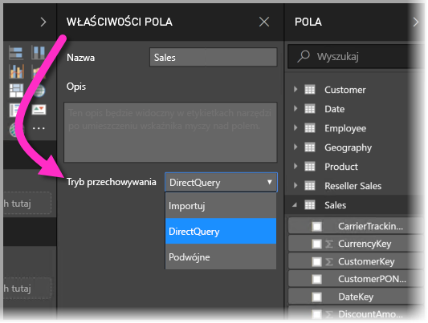
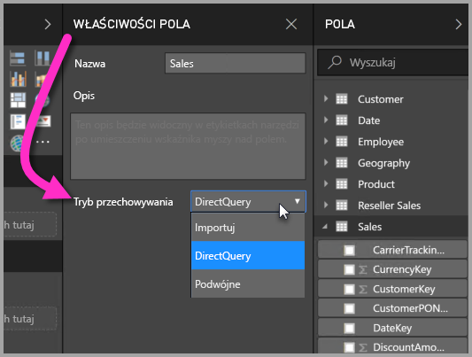

# Tryb magazynu w programie Power BI Desktop (wersja zapoznawcza)

W programie **Power BI Desktop** można wybrać **tryb przechowywania** tabel, co zapewni Ci możliwość kontroli tego, czy dane w tabeli są buforowane w pamięci na potrzeby raportów. 

Ustawienie **trybu przechowywania** ma wiele zalet. Możesz ustawić **tryb przechowywania** indywidualnie dla każdej tabeli w modelu, dzięki czemu pojedynczy zestaw będzie mógł korzystać z jednej lub wielu spośród następujących zalet:

* **Wydajność zapytań** — w miarę, jak użytkownicy pracują z wizualizacjami w raportach usługi Power BI, zapytania języka DAX są przesyłane do zestawu danych. Buforowanie danych w pamięci przez prawidłowe ustawienie **trybu przechowywania** może zwiększyć wydajność zapytań i usprawnić interakcję z raportami.
* **Duże zestawy danych** — tabele, które nie są buforowane, nie używają pamięci na potrzeby buforowania. Możesz włączyć analizę interaktywną dużych zestawów danych, których całkowite buforowanie do pamięci jest niemożliwe, ponieważ są zbyt duże lub zbyt drogie. Możesz wybrać, które tabele są warte buforowania, a które nie.
* **Optymalizacja odświeżania danych** — tabel, które nie są buforowane, nie trzeba odświeżać. Czas trwania odświeżania można skrócić, buforując tylko dane niezbędne do spełnienia warunków umów SLA i wymagań biznesowych.
* **Wymagania niemal w czasie rzeczywistym** — w przypadku tabel z wymaganiami niemal w czasie rzeczywistym rezygnacja z buforowania może ułatwić zmniejszenie opóźnienia danych.
* **Zapis zwrotny** — zapis zwrotny umożliwia użytkownikom biznesowym eksplorowanie scenariuszy warunkowych przez zmienianie wartości komórek. Aplikacje niestandardowe mogą stosować zmiany w źródle danych. Tabele, które nie są buforowane, mogą natychmiast odzwierciedlać zmiany, co pozwala na błyskawiczną analizę efektów.

Ustawienie **trybu przechowywania** w programie **Power BI Desktop** jest jedną z trzech powiązanych funkcji:

* **Modele złożone** — umożliwia użycie w raporcie wielu połączeń danych, takich jak połączenia trybu DirectQuery lub importowanie, w dowolnej kombinacji.
* **Relacje wiele-do-wielu** — dzięki **modelom złożonym** można ustanawiać **relacje wiele-do-wielu** między tabelami, usuwać wymagania dotyczące unikatowych wartości w tabelach, a także usuwać wcześniejsze obejścia, takie jak wprowadzanie nowych tabel tylko w celu ustanowienia relacji. 
* **Tryb przechowywania** — można teraz określić, które wizualizacje wymagają wykonania zapytania dotyczącego źródła danych zaplecza. Wizualizacje niewymagające tej czynności są importowane, nawet jeśli są oparte na trybie DirectQuery, co zwiększa wydajność i redukuje obciążenie zaplecza. Wcześniej nawet proste wizualizacje, takie jak fragmentatory, inicjowały wysyłanie zapytań do źródeł zaplecza. 

Ta kolekcja trzech powiązanych funkcji **modeli złożonych** została opisana w osobnych artykułach:

* **Modele złożone** zostały szczegółowo opisane we własnym artykule: [Modele złożone w programie Power BI Desktop (wersja zapoznawcza)](desktop-composite-models.md).
* **Relacje wiele-do-wielu** zostały opisane we własnym artykule: [Relacje wiele-do-wielu w programie Power BI Desktop (wersja zapoznawcza)](desktop-many-to-many-relationships.md).
* **Tryb przechowywania** został szczegółowo opisany w tym artykule.

## Włączanie funkcji trybu przechowywania w wersji zapoznawczej

Funkcja **Tryb przechowywania** jest dostępna w wersji zapoznawczej i należy ją włączyć w programie **Power BI Desktop**. Aby włączyć **tryb przechowywania**, wybierz pozycję **Plik > Opcje i ustawienia > Opcje > Funkcje w wersji zapoznawczej**, a następnie zaznacz pole wyboru **Modele złożone**. 

Aby funkcja została włączona, należy ponownie uruchomić program **Power BI Desktop**.

## Korzystanie z właściwości trybu przechowywania

**Tryb przechowywania** to właściwość, którą można ustawić dla każdej tabeli w modelu. Aby ustawić **tryb przechowywania**, wybierz tabelę w okienku **Pola**, a następnie kliknij prawym przyciskiem myszy w celu wyświetlenia menu kontekstowego. Z menu kontekstowego wybierz pozycję **Właściwości**.

Wybrany **tryb przechowywania** jest wyświetlany w okienku **Właściwości pola** dla tabeli. W tym miejscu możesz wyświetlić bieżący **tryb przechowywania** lub go zmodyfikować.

Istnieją trzy wartości **trybu przechowywania**:

* **Import** — po ustawieniu wartości **Import** zaimportowane tabele są buforowane. Zapytania przesyłane do zestawu danych usługi Power BI, które zwracają dane z tabel importu, mogą być realizowane tylko w obrębie danych buforowanych.
* **DirectQuery** — to ustawienie powoduje, że tabele trybu DirectQuery nie są buforowane. Zapytania przesyłane do zestawu danych usługi Power BI (na przykład zapytania języka DAX), które zwracają dane z tabel trybu DirectQuery, mogą być realizowane tylko przez wykonywanie zapytań na żądanie do źródła danych. Zapytania przesyłane do źródła danych używają języka zapytań dla tego źródła danych (na przykład SQL).
* **Podwójne** — tabele podwójne mogą działać jak buforowane lub niebuforowane, w zależności od kontekstu zapytania przesłanego do zestawu danych usługi Power BI. W niektórych przypadkach zapytania są realizowane z poziomu danych buforowanych; w innych przypadkach zapytania są realizowane przez wykonanie zapytania na żądanie skierowanego do źródła danych.

Zmiana tabeli na tryb Import jest operacją *nieodwracalną*; trybu nie można ustawić z powrotem na DirectQuery lub Podwójne.

## Ograniczenia dotyczące tabel trybu DirectQuery i Podwójne

Tabele podwójne podlegają tym samym ograniczeniom, co tabele DirectQuery. Obejmują one ograniczone przekształcenia języka M i ograniczone funkcje języka DAX w kolumnach obliczeniowych. Aby uzyskać więcej informacji, zobacz [Implikacje wynikające z użycia zapytania bezpośredniego](desktop-directquery-about.md#implications-of-using-directquery).

## Reguły dotyczące relacji w tabelach z różnymi trybami przechowywania

Relacje muszą być zgodne z regułami zgodnie z **trybem przechowywania** powiązanych tabel. W tej sekcji przedstawiono przykłady prawidłowych kombinacji. Kompletne informacje można znaleźć w artykule [Relacje wiele-do-wielu w programie Power BI Desktop (wersja zapoznawcza)](desktop-many-to-many-relationships.md).

W zestawie danych z pojedynczym źródłem danych następujące kombinacje relacji typu **1-do wielu** są prawidłowe:

| Tabela na po stronie **wiele** | Tabela na po stronie **1** |
| ------------- |----------------------| 
| Podwójne          | Podwójne                 | 
| Importuj        | Import lub Podwójne       | 
| DirectQuery   | DirectQuery lub Podwójne  | 

## Propagacja tabeli podwójnej
Spójrzmy na przykład. Weźmy pod uwagę następujący prosty model, w którym wszystkie tabele pochodzą z jednego źródła obsługującego tryby importu i DirectQuery.

Załóżmy, że na początku wszystkie tabele w tym modelu działają w trybie DirectQuery. Jeśli następnie zmienimy **tryb przechowywania** tabeli *SurveyResponse* na Import, zostanie wyświetlony następujący monit:

Tabele wymiarów (*Customer* (Klient), *Date* (Data) i *Geography* (Geografia)) należy ustawić na **Podwójne**, aby zachować zgodność z opisanymi wcześniej regułami dotyczącymi relacji. Zamiast wymagać, aby te tabele zostały wcześniej ustawione na wartość **Podwójne**, można je ustawić w ramach jednej operacji.

Logika propagacji została zaprojektowana tak, aby ułatwiać pracę z modelami zawierającymi wiele tabel. Załóżmy, że masz model z 50 tabelami i musisz buforować tylko niektóre tabele faktów (transakcyjne). Logika w programie **Power BI Desktop** identyfikuje minimalny zestaw tabel wymiarów, które należy ustawić na tryb **Podwójne**, więc nie musisz tego robić.

Logika propagacji przechodzi tylko do jednej strony relacji **1-do wielu**.

* Zmiana tabeli *Customer* (Klient) na tryb **Import** (zamiast zmiany tabeli *SurveyResponse* (Odpowiedź na ankietę)) jest niedozwolona z powodu relacji z tabelami DirectQuery *Sales* (Sprzedaż) i *SurveyResponse* (Odpowiedź na ankietę).
* Zmiana tabeli *Customer* (Klient) na tryb **Podwójne** (zamiast zmiany tabeli *SurveyResponse* (Odpowiedź na ankietę)) jest dozwolona. Logika propagacji powoduje ustawienie tabeli *Geography* (Geografia) również na wartość **Podwójne**.

## Przykład użycia trybu przechowywania
Kontynuujmy pracę z przykładem z poprzedniej sekcji i wyobraźmy sobie, że stosujemy następujące ustawienia właściwości **trybu przechowywania**:

| Tabela                   | Tryb przechowywania         |
| ----------------------- |----------------------| 
| *Sales*                 | DirectQuery          | 
| *SurveyResponse*        | Importuj               | 
| *Date*                  | Podwójne                 | 
| *Customer*              | Podwójne                 | 
| *Geography*             | Podwójne                 | 

Zastosowanie takich ustawień właściwości trybu przechowywania powoduje następujące zachowania przy założeniu, że tabela *Sales* (Sprzedaż) zawiera dużą ilość danych.
* Tabele wymiarów (*Customer* (Klient), *Date* (Data) i *Geography* (Geografia)) są buforowane, dlatego początkowe czasy ładowania raportu podczas pobierania wartości fragmentatora do wyświetlenia powinny być krótkie.
* Rezygnacja z buforowania tabeli *Sales* (Sprzedaż) powoduje wystąpienie następującego wyniku:
    * Poprawienie czasów odświeżania danych oraz zmniejszenie użycia pamięci
    * Oparte na tabeli *Sales* (Sprzedaż) zapytania dotyczące raportu są uruchamianie w trybie DirectQuery, co może trwać dłużej, ale przebiega niemal w czasie rzeczywistym, ponieważ nie występuje opóźnienie związane z buforowaniem.

* Oparte na tabeli *SurveyResponse* (Odpowiedź na ankietę) zapytania dotyczące raportu są zwracane z pamięci podręcznej i dlatego powinny być wykonywane względnie szybko.

## Zapytania z trafieniami lub chybieniami w pamięci podręcznej

Łącząc interfejs **SQL Profiler** z portem diagnostyki w programie **Power BI Desktop**, można sprawdzić, które zapytania mają trafienia i chybienia w wewnątrzpamięciowej pamięci podręcznej, przeprowadzając śledzenie oparte na następujących zdarzeniach:

* Zdarzenia związane z zapytaniami\Początek zapytania
* Przetwarzanie zapytania\Początek zapytania aparatu magazynu trybu Vertipaq
* Przetwarzanie zapytania\Początek zapytania DirectQuery

Dla każdego zdarzenia typu *Początek zapytania* sprawdź inne zdarzenia o takim samym identyfikatorze *ActivityID*. Jeśli na przykład nie istnieje zdarzenie *Początek zapytania DirectQuery*, ale istnieje zdarzenie *Początek zapytania aparatu magazynu trybu Vertipaq*, odpowiedź na zapytanie pochodziła z pamięci podręcznej.

Zapytania, które odwołują się do tabel trybu **Podwójne**, zwracają dane z pamięci podręcznej, jeśli jest to możliwe, a w przeciwnym razie przywracają tryb DirectQuery.

Kontynuujmy pracę z poprzednim przykładem. Poniższe zapytanie odwołuje się tylko do kolumny z tabeli *Date* (Data) działającej w trybie **Podwójne**. W związku z tym powinno nastąpić trafienie w pamięci podręcznej.

Poniższe zapytanie odwołuje się tylko do kolumny z tabeli *Sales* (Sprzedaż) działającej w trybie **DirectQuery**. W związku z tym *nie* powinno nastąpić trafienie w pamięci podręcznej.

Następujące zapytanie jest interesujące, ponieważ łączy obydwie kolumny. To zapytanie nie spowoduje trafienia w pamięci podręcznej. Możesz początkowo oczekiwać pobrania przez nie wartości *CalendarYear* (Rok kalendarzowy) z pamięci podręcznej i wartości *SalesAmount* (Kwota sprzedaży) ze źródła, a następnie połączenia wyników, ale byłoby to mniej wydajne niż przesłanie operacji SUM/GROUP BY do systemu źródłowego. Jeśli operacja zostanie przekazana do źródła, liczba zwracanych wierszy będzie prawdopodobnie znacznie mniejsza. 

> [!NOTE]
> To zachowanie różni się od [relacji wiele-do-wielu w programie Power BI Desktop (wersja zapoznawcza)](desktop-many-to-many-relationships.md) w przypadku łączenia tabel buforowanych i niebuforowanych.

## Pamięci podręczne powinny być synchronizowane

Zapytania wyświetlane w poprzedniej sekcji pokazują, że tabele **podwójne** czasami generują trafienia w pamięci podręcznej, a czasami nie. Dlatego jeśli pamięć podręczna jest nieaktualna, mogą zostać zwrócone różne wartości. Podczas wykonywania zapytania nie zostanie podjęta próba maskowania problemów związanych z danych, na przykład filtrowania wyników zapytania DirectQuery, w celu dopasowania do wartości buforowanych. To Ty musisz znać przepływy swoich danych i odpowiednio je projektować. W razie potrzeby można skorzystać z opracowanych już technik postępowania w takich przypadkach.

Tryb przechowywania **Podwójne** umożliwia optymalizację wydajności. Powinien być on używany tylko w sposób, który nie uniemożliwia spełnienia wymagań biznesowych. Jako zachowanie alternatywne rozważ użycie metod opisanych w artykule [Relacje wiele-do-wielu w programie Power BI Desktop (wersja zapoznawcza)](desktop-many-to-many-relationships.md).

## Widok danych
Jeśli co najmniej jedna tabela w zestawie danych ma **tryb przechowywania** ustawiony na Import lub Podwójne, jest wyświetlana karta **Widok danych**.

Po wybraniu w *widoku danych** tabele w trybie **Podwójne** i **Import** zawierają dane buforowane. Tabele trybu DirectQuery nie pokazują danych i jest wyświetlany komunikat informujący o tym, że nie można wyświetlić tabel DirectQuery.

## Ograniczenia i istotne zagadnienia

Istnieje kilka ograniczeń tej wersji **trybu przechowywania** oraz jego korelacji z **modelami złożonymi**.

Następujących źródeł wielowymiarowych nie można używać z **modelami złożonymi**:

* SAP HANA
* SAP Business Warehouse
* SQL Server Analysis Services
* Zestawy danych usługi Power BI

W przypadku łączenia ze źródłami wielowymiarowymi w trybie DirectQuery nie można również połączyć się z innym źródłem DirectQuery ani utworzyć kombinacji z danymi importowanymi.

Istniejące ograniczenia użycia trybu DirectQuery nadal obowiązują w przypadku korzystania z **modeli złożonych**. Wiele z tych ograniczeń jest teraz określanych na tabelę, w zależności od **tryb przechowywania** tabeli. Na przykład kolumna obliczeniowa w zaimportowanej tabeli może odwoływać się do innych tabel, ale kolumna obliczeniowa w tabeli DirectQuery jest nadal ograniczona tak, aby odwoływać się tylko do kolumn w tej samej tabeli. Inne ograniczenia mają zastosowanie do modelu jako całości, jeśli dowolne tabele w modelu działają w trybie DirectQuery. Na przykład funkcje **QuickInsights** oraz **Pytania i odpowiedzi** nie są dostępne w modelu, jeśli dowolne uwzględnione w nim tabele mają **tryb przechowywania** ustawiony na DirectQuery. 

## Następne kroki

W poniższych artykułach bardziej szczegółowo opisano modele złożone oraz przedstawiono szczegóły trybu DirectQuery.

* [Modele złożone w programie Power BI Desktop (wersja zapoznawcza)](desktop-composite-models.md)
* [Relacje wiele-do-wielu w programie Power BI Desktop (wersja zapoznawcza)](desktop-many-to-many-relationships.md)

Artykuły dotyczące trybu DirectQuery:

* [Używanie trybu DirectQuery w usłudze Power BI](desktop-directquery-about.md)
* [Źródła danych obsługiwane przez tryb DirectQuery w usłudze Power BI](desktop-directquery-data-sources.md)

