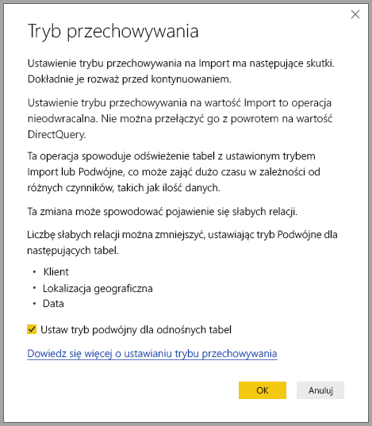

# Tryb przechowywania w programie Power BI Desktop (wersja zapoznawcza)

W programie Microsoft Power BI Desktop można określić *tryb przechowywania* tabel. *Tryb przechowywania* umożliwia kontrolowanie, czy program Power BI Desktop będzie buforować dane tabeli wewnątrz pamięci na potrzeby raportów. 

Ustawienie trybu przechowywania ma wiele zalet. Tryb przechowywania dla każdej tabeli można ustawić indywidualnie w modelu. Ta akcja powoduje włączenie jednego zestawu danych, co zapewnia następujące korzyści:

* **Wydajność zapytań** — w miarę, jak użytkownicy pracują z wizualizacjami w raportach usługi Power BI, zapytania języka DAX (Data Analysis Expressions) są przesyłane do zestawu danych. Buforowanie danych w pamięci przez prawidłowe ustawienie trybu przechowywania może zwiększyć wydajność zapytań i usprawnić interakcję z raportami.

* **Duże zestawy danych** — tabele, które nie są buforowane, nie używają pamięci na potrzeby buforowania. Możesz włączyć analizę interaktywną dużych zestawów danych, których całkowite buforowanie do pamięci jest niemożliwe, ponieważ są zbyt duże lub zbyt drogie. Możesz wybrać, które tabele są warte buforowania, a które nie.

* **Optymalizacja odświeżania danych** — tabel, które nie są buforowane, nie trzeba odświeżać. Czas trwania odświeżania można skrócić, buforując tylko dane niezbędne do spełnienia warunków umów SLA i wymagań biznesowych.

* **Wymagania niemal w czasie rzeczywistym** — w przypadku tabel z wymaganiami niemal w czasie rzeczywistym rezygnacja z buforowania może ułatwić zmniejszenie opóźnienia danych.

* **Zapis zwrotny** — zapis zwrotny umożliwia użytkownikom biznesowym eksplorowanie scenariuszy warunkowych przez zmienianie wartości komórek. Aplikacje niestandardowe mogą stosować zmiany w źródle danych. Tabele, które nie są buforowane, mogą natychmiast odzwierciedlać zmiany, co pozwala na błyskawiczną analizę efektów.

Ustawienie trybu przechowywania w programie Power BI Desktop jest jedną z trzech powiązanych funkcji:

* **Modele złożone** — ta funkcja umożliwia użycie w raporcie co najmniej dwóch połączeń danych, takich jak połączenia trybu DirectQuery lub importowanie, w dowolnej kombinacji. Aby uzyskać więcej informacji, zobacz [Modele złożone w programie Power BI Desktop (wersja zapoznawcza)](desktop-composite-models.md).

* **Relacje wiele-do-wielu** — za pomocą *modeli złożonych* można ustanowić *relacje wiele-do-wielu* między tabelami. Funkcja *Relacje wiele-do-wielu* powoduje usunięcie wymagań dotyczących unikatowych wartości w tabelach. Powoduje również usunięcie poprzednich obejść, np. wprowadzania nowych tabel tylko w celu ustanowienia relacji. Aby uzyskać więcej informacji, zobacz temat [Relacje wiele-do-wielu w programie Power BI Desktop (wersja zapoznawcza)](desktop-many-to-many-relationships.md).

* **Tryb przechowywania** — teraz możesz określić, które wizualizacje wymagają zapytania do wewnętrznych źródeł danych. Wizualizacje, które nie wymagają zapytania, są importowane, nawet jeśli są oparte na trybie DirectQuery. Ta funkcja pomaga zwiększyć wydajność i zmniejszyć obciążenie zaplecza. Wcześniej nawet proste wizualizacje, takie jak fragmentatory, inicjowały zapytania wysyłane do źródeł wewnętrznych. Tryb przechowywania został szczegółowo opisany w tym artykule.

## Korzystanie z właściwości trybu przechowywania

Tryb przechowywania to właściwość, którą można ustawić dla każdej tabeli w modelu. Aby ustawić tryb przechowywania w okienku **Pola**, kliknij prawym przyciskiem myszy tabelę, której właściwości chcesz ustawić, a następnie wybierz polecenie **Właściwości**.

Bieżąca właściwość jest wyświetlana na liście rozwijanej **Tryb przechowywania** w okienku **Właściwości pola** dotyczącym tabeli. W tym miejscu możesz wyświetlić bieżący tryb przechowywania lub go zmodyfikować.

Istnieją trzy wartości trybu przechowywania:

* **Import**: po ustawieniu wartości **Import** zaimportowane tabele są buforowane. Zapytania przesyłane do zestawu danych usługi Power BI, które zwracają dane z tabel importu, mogą być realizowane tylko w obrębie danych buforowanych.

* **DirectQuery**: to ustawienie powoduje, że tabele trybu DirectQuery nie są buforowane. Zapytania przesyłane do zestawu danych usługi Power BI, na przykład zapytania języka DAX (Data Analysis Expressions), które zwracają dane z tabel trybu DirectQuery, mogą być realizowane tylko przez wykonywanie zapytań na żądanie do źródła danych. Zapytania przesyłane do źródła danych używają języka zapytań odpowiedniego dla tego źródła danych, na przykład SQL.

* **Podwójne**: tabele podwójne mogą działać jak buforowane lub niebuforowane, w zależności od kontekstu zapytania przesłanego do zestawu danych usługi Power BI. W niektórych przypadkach zapytania są realizowane w obrębie informacji buforowanych. W innych przypadkach zapytania są realizowane przez wykonywanie zapytania na żądanie do źródła danych.

Zmiana właściwości tabeli na wartość **Import** jest operacją *nieodwracalną*. Tej właściwości nie można zmienić z powrotem ani do trybu DirectQuery, ani Podwójne.

## Ograniczenia dotyczące tabel trybu DirectQuery i Podwójne

Tabele podwójne mają te same ograniczenia funkcjonalne, co tabele DirectQuery. Są to m.in. ograniczone przekształcenia języka M i ograniczone funkcje języka DAX w kolumnach obliczeniowych. Aby uzyskać więcej informacji, zobacz sekcję [Implikacje wynikające z użycia zapytania bezpośredniego](desktop-directquery-about.md#implications-of-using-directquery).

## Propagacja tabeli podwójnej
Weźmy pod uwagę następujący prosty model, w którym wszystkie tabele pochodzą z jednego źródła obsługującego tryby importu i DirectQuery.

Załóżmy, że na początku wszystkie tabele w tym modelu działają w trybie DirectQuery. Jeśli następnie zmienimy **tryb przechowywania** tabeli *SurveyResponse* na Import, zostanie wyświetlone następujące okno z ostrzeżeniem:

Tabele wymiarów (*Customer*, *Geography* i *Date*) mogą mieć ustawienie **Podwójne** w celu zmniejszenia liczby słabych relacji w zestawie danych, a także zwiększenia wydajności. Słabe relacje zwykle obejmują co najmniej jedną tabelę DirectQuery, gdzie logika łączenia nie może być wypchnięta do systemów źródłowych. Fakt, że tabele z ustawieniem **Podwójne** mogą działać w trybie DirectQuery lub Import, pomaga tego uniknąć.

Logika propagacji została zaprojektowana tak, aby ułatwiać pracę z modelami zawierającymi wiele tabel. Załóżmy, że masz model z 50 tabelami i musisz buforować tylko niektóre tabele faktów (transakcyjne). Logika w programie Power BI Desktop oblicza minimalny zestaw tabel wymiarów, które należy ustawić na tryb **Podwójne**, więc nie musisz tego robić samodzielnie.

Logika propagacji przechodzi tylko do jednej strony relacji **1-do wielu**.

## Przykład użycia trybu przechowywania
Kontynuujmy pracę z przykładem z poprzedniej sekcji i wyobraźmy sobie, że stosujemy następujące ustawienia właściwości trybu przechowywania:

| tabela                   | Tryb przechowywania         |
| ----------------------- |----------------------| 
| *Sales*                 | DirectQuery          | 
| *SurveyResponse*        | Importuj               | 
| *Date*                  | Podwójne                 | 
| *Customer*              | Podwójne                 | 
| *Geography*             | Podwójne                 | 

Ustawienie takich właściwości trybu przechowywania powoduje następujące zachowania przy założeniu, że tabela *Sales* (Sprzedaż) zawiera dużą ilość danych.
* Program Power BI Desktop buforuje tabele wymiarów, *Date* (Data), *Customer* (Klient) oraz *Geography* (Geografia), dlatego czasy ładowania raportów początkowych podczas pobierania wartości fragmentatora do wyświetlenia powinny być krótkie.
* Rezygnacja z buforowania tabeli *Sales* (Sprzedaż) powoduje następujące efekty w programie Power BI Desktop:
    * Poprawienie czasów odświeżania danych oraz zmniejszenie użycia pamięci.
    * Zapytania raportów oparte na tabeli *Sales* (Sprzedaż) są uruchamiane w trybie DirectQuery. Realizacja tych zapytań może trwać dłużej, ale są one bardziej zbliżone do czasu rzeczywistego, ponieważ nie wprowadzono opóźnienia buforowania.

* Zapytania raportów oparte na tabeli *SurveyResponse* (Odpowiedź na ankietę) są zwracane z wewnątrzpamięciowej pamięci podręcznej i dlatego powinny być wykonywane względnie szybko.

## Zapytania z trafieniami lub chybieniami w pamięci podręcznej

Łącząc interfejs **SQL Profiler** z portem diagnostyki w programie Power BI Desktop, można sprawdzić, które zapytania mają trafienia i chybienia w wewnątrzpamięciowej pamięci podręcznej, przeprowadzając śledzenie oparte na następujących zdarzeniach:

* Zdarzenia związane z zapytaniami\Początek zapytania
* Przetwarzanie zapytania\Początek zapytania aparatu magazynu trybu Vertipaq
* Przetwarzanie zapytania\Początek zapytania DirectQuery

Dla każdego zdarzenia typu *Początek zapytania* sprawdź inne zdarzenia o takim samym identyfikatorze *ActivityID*. Jeśli na przykład nie istnieje zdarzenie *Początek zapytania DirectQuery*, ale istnieje zdarzenie *Początek zapytania aparatu magazynu trybu Vertipaq*, odpowiedź na zapytanie pochodzi z pamięci podręcznej.

Zapytania, które odwołują się do tabel trybu **Podwójne**, zwracają dane z pamięci podręcznej, jeśli jest to możliwe, a w przeciwnym razie przywracają tryb DirectQuery.

Kontynuujmy pracę z poprzednim przykładem. Poniższe zapytanie odwołuje się tylko do kolumny z tabeli *Date* (Data) działającej w trybie **Podwójne**. W związku z tym zapytanie powinno spowodować trafienie w pamięci podręcznej.

Poniższe zapytanie odwołuje się tylko do kolumny z tabeli *Sales* (Sprzedaż) działającej w trybie **DirectQuery**. W związku z tym *nie* powinno nastąpić trafienie w pamięci podręcznej.

Następujące zapytanie jest interesujące, ponieważ łączy obydwie kolumny. To zapytanie nie powoduje trafienia w pamięci podręcznej. Możesz początkowo oczekiwać pobrania przez nie wartości *CalendarYear* (Rok kalendarzowy) z pamięci podręcznej i wartości *SalesAmount* (Kwota sprzedaży) ze źródła, a następnie połączenia wyników, ale to rozwiązanie byłoby mniej wydajne niż przesłanie operacji SUM/GROUP BY do systemu źródłowego. Jeśli operacja zostanie przekazana do źródła, liczba zwracanych wierszy będzie prawdopodobnie znacznie mniejsza. 

> [!NOTE]
> To zachowanie różni się od [relacji wiele-do-wielu w programie Power BI Desktop (wersja zapoznawcza)](desktop-many-to-many-relationships.md) w przypadku łączenia tabel buforowanych i niebuforowanych.

## Pamięci podręczne powinny być synchronizowane

Zapytania wyświetlane w poprzedniej sekcji pokazują, że tabele z trybem **Podwójne** czasami generują trafienia w pamięci podręcznej, a czasami nie. Dlatego jeśli pamięć podręczna jest nieaktualna, mogą zostać zwrócone różne wartości. Podczas wykonywania zapytania nie zostanie podjęta próba maskowania problemów związanych z danych, na przykład filtrowania wyników zapytania DirectQuery, w celu dopasowania do wartości buforowanych. To Ty musisz znać przepływy swoich danych i odpowiednio je projektować. W razie potrzeby można skorzystać z opracowanych już technik postępowania w takich przypadkach.

Tryb przechowywania *Podwójne* umożliwia optymalizację wydajności. Powinien być on używany tylko w sposób, który nie uniemożliwia spełnienia wymagań biznesowych. Jako zachowanie alternatywne rozważ użycie metod opisanych w artykule [Relacje wiele-do-wielu w programie Power BI Desktop (wersja zapoznawcza)](desktop-many-to-many-relationships.md).

## Widok danych
Jeśli co najmniej jedna tabela w zestawie danych ma tryb przechowywania ustawiony na **Import** lub **Podwójne**, jest wyświetlana karta **Widok danych**.

Po wybraniu na karcie **Widok danych** tabele w trybie **Podwójne** i **Import** zawierają dane buforowane. Tabele trybu DirectQuery nie pokazują danych i jest wyświetlany komunikat informujący o tym, że nie można wyświetlić tabel trybu DirectQuery.

## Ograniczenia i istotne zagadnienia

Istnieje kilka ograniczeń tej wersji trybu przechowywania oraz jego korelacji z modelami złożonymi.

Następujących źródeł wielowymiarowych programu Live Connect nie można używać z modelami złożonymi:

* SAP HANA
* SAP Business Warehouse
* SQL Server Analysis Services
* Zestawy danych usługi Power BI
* Azure Analysis Services

W przypadku łączenia ze źródłami wielowymiarowymi w trybie DirectQuery nie można połączyć się z innym źródłem DirectQuery ani utworzyć kombinacji z danymi importowanymi.

Istniejące ograniczenia użycia trybu DirectQuery obowiązują także w przypadku korzystania z modeli złożonych. Wiele z tych ograniczeń jest teraz określanych na tabelę, w zależności od trybu przechowywania tabeli. Na przykład kolumna obliczeniowa w zaimportowanej tabeli może odwoływać się do innych tabel, ale kolumna obliczeniowa w tabeli DirectQuery jest nadal ograniczona tak, aby odwoływać się tylko do kolumn w tej samej tabeli. Inne ograniczenia mają zastosowanie do modelu jako całości, jeśli dowolne tabele w modelu działają w trybie DirectQuery. Na przykład funkcje QuickInsights oraz Pytania i odpowiedzi nie są dostępne w modelu, jeśli dowolne uwzględnione w nim tabele mają tryb przechowywania ustawiony na DirectQuery. 

## Następne kroki

Aby uzyskać więcej informacji na temat modeli złożonych i trybu DirectQuery, zobacz następujące artykuły:
* [Modele złożone w programie Power BI Desktop (wersja zapoznawcza)](desktop-composite-models.md)
* [Relacje wiele-do-wielu w programie Power BI Desktop (wersja zapoznawcza)](desktop-many-to-many-relationships.md)
* [Używanie zapytania bezpośredniego w usłudze Power BI](desktop-directquery-about.md)
* [Źródła danych obsługiwane przez tryb DirectQuery w usłudze Power BI](desktop-directquery-data-sources.md)
