# Tworzenie etykietek narzędzi opartych na stronach raportu w programie Power BI Desktop
Możesz tworzyć wizualnie bogate **etykietki narzędzi raportu**, wyświetlane po najechaniu kursorem na elementy wizualne, w oparciu o strony raportu utworzonego w programie **Power BI Desktop**. Poprzez utworzenie strony raportu służącej jako etykietka narzędzi, możesz uwzględnić w niestandardowych etykietkach narzędzi elementy wizualne, obrazy i inne kolekcje elementów utworzonych na stronie raportu. 

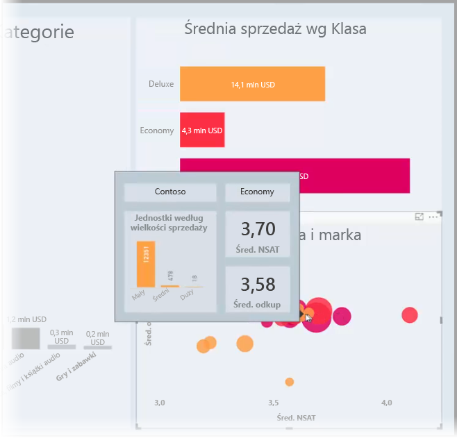

Możesz utworzyć dowolną liczbę stron etykietek narzędzi. Każda strona etykietki narzędzi może być skojarzona z co najmniej jednym polem w raporcie. Dzięki temu po najechaniu kursorem na wizualizację obejmującą wybrane pole jest wyświetlana etykietka narzędzia utworzona na stronie etykietki narzędzi, z filtrowaniem według punktu danych, nad którym znajduje się kursor. 

Istnieje wiele interesujących rzeczy, które można wykonać przy użyciu etykietek narzędzi raportów. Przyjrzyjmy się sposobom tworzenia etykietek narzędzi oraz czynnościom związanym z ich konfiguracją.

### Włączanie wersji zapoznawczej etykietek narzędzi 
Począwszy od wersji programu **Power BI Desktop** z września 2018 r., etykietki narzędzi są ogólnie dostępne i nie trzeba ich włączać. 

Jeśli używasz starszej wersji programu **Power BI Desktop**, możesz je włączyć jako funkcję w wersji zapoznawczej, wybierając kolejno pozycje **Plik > Opcje i ustawienia > Opcje > Funkcje wersji zapoznawczej** w programie Power BI Desktop, a następnie zaznaczając pole wyboru **Etykietki narzędzi strony raportu**. 

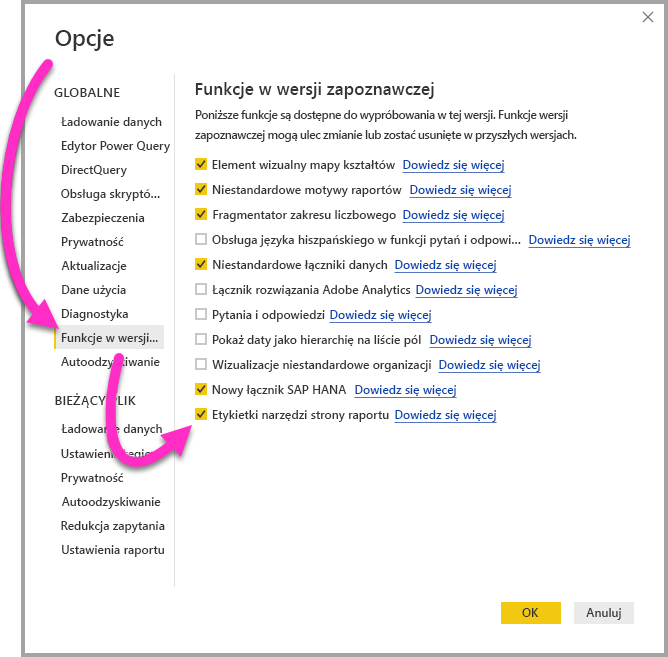

Musisz ponownie uruchomić program **Power BI Desktop** po dokonaniu wyboru, aby włączyć wersję zapoznawczą etykietek narzędzi raportów.

Zawsze zalecamy uaktualnienie programu **Power BI Desktop** do najnowszej wersji, którą można pobrać za pomocą linku na stronie [Uzyskiwanie programu Power BI Desktop](desktop-get-the-desktop.md). 

## Tworzenie strony etykietki narzędzi raportów
Aby rozpocząć, utwórz nową stronę raportu, klikając przycisk **+** w dolnej części kanwy programu **Power BI Desktop** w obszarze kart strony. Przycisk znajduje się obok ostatniej strony raportu. 

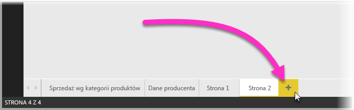

Etykietka narzędzia może być dowolnego rozmiaru, ale pamiętaj, że etykietki narzędzi są wyświetlane nad kanwą raportu, więc dobrze jest zachować rozsądnie małe rozmiary. W okienku **Format** na karcie **Rozmiar strony** możesz zobaczyć nowy szablon rozmiaru strony o nazwie *Etykietka narzędzi*. Opcja ta zapewnia rozmiar kanwy strony raportu dostosowany do etykietki narzędzi.

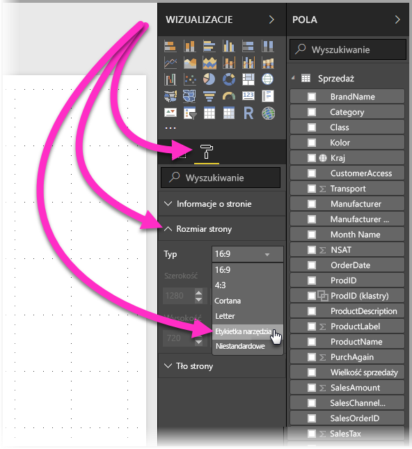

Domyślnie program **Power BI Desktop** dopasuje kanwę raportu do przestrzeni dostępnej na stronie. Często jest to dobre rozwiązanie, ale nie w przypadku etykietek narzędzi. Aby uzyskać lepsze zrozumienie i wgląd w to, jak etykietka narzędzia będzie wyglądać po zakończeniu, możesz zmienić **Widok strony** na rozmiar rzeczywisty. 

W tym celu wybierz kartę **Widok** ze wstążki. Z tego miejsca wybierz pozycję **Widok strony > Rzeczywisty rozmiar**, jak pokazano na poniższej ilustracji.

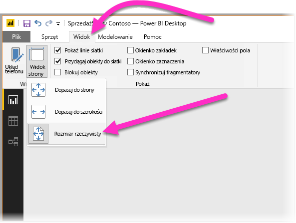

Możesz też nazwać stronę raportu, aby jej przeznaczenie było jasne. Wybierz kartę **Informacje o stronie** w okienku **Format**, a następnie wpisz nazwę w polu **Nazwa** w tym miejscu. Na poniższej ilustracji nazwa etykietki narzędzi raportu to *Tooltip 1*, ale możesz swobodnie wpisać coś bardziej inspirującego.

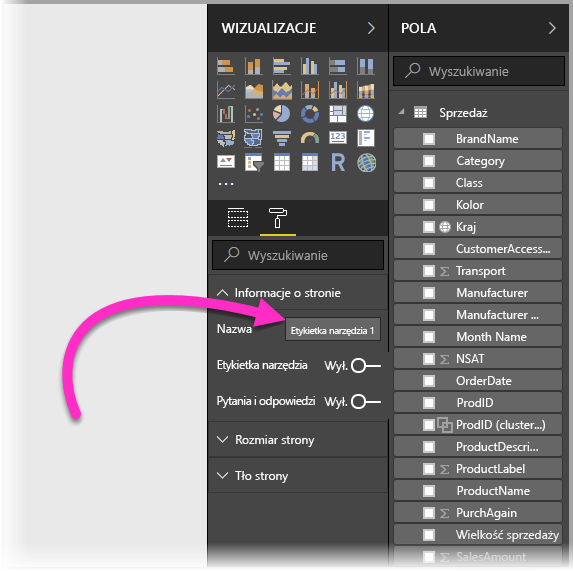

Z tego miejsca możesz utworzyć dowolne elementy wizualne, które chcesz wyświetlać w etykietce narzędzi. Na poniższej ilustracji znajdują się dwie karty i jeden wykres słupkowy grupowany na stronie etykietki narzędzi, a także kolor tła dla strony oraz kolory tła dla poszczególnych elementów wizualnych, dzięki czemu zapewnia się pożądany wygląd.

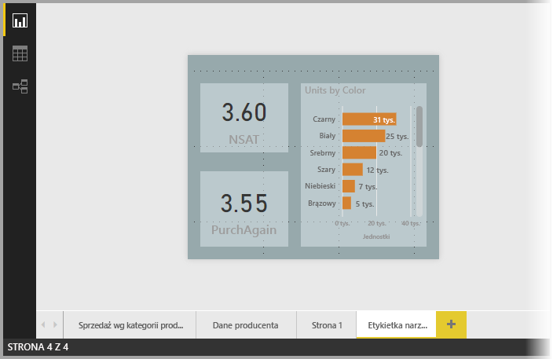

Przed ukończeniem strony raportu etykietki narzędzi i przystosowaniem jej do działania w formie etykietki narzędzie istnieje więcej czynności do wykonania. Należy skonfigurować stronę etykietki narzędzi na kilka sposobów, jak opisano w następnej sekcji. 

## Konfigurowanie strony raportu etykietki narzędzi

Po utworzeniu strony raportu etykietki narzędzi należy skonfigurować stronę, aby program **Power BI Desktop** zarejestrował ją jako etykietkę narzędzi, aby upewnić się, że będzie wyświetlana nad odpowiednimi elementami wizualnymi.

Najpierw musisz przesunąć suwak **Etykietka narzędzi** do pozycji **Wł.** na karcie **Informacje o stronie**, aby zmienić stronę w etykietkę narzędzi. 

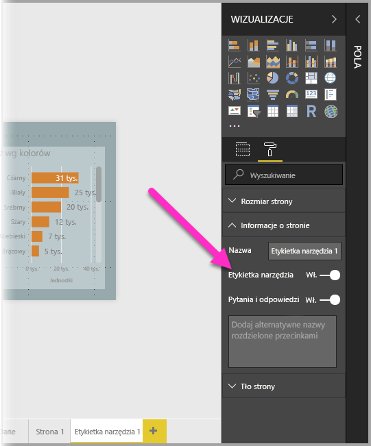

Po ustawieniu suwaka w pozycji włączenia należy określić pola, dla których ma być wyświetlana etykietka narzędzia raportu. Etykietka narzędzia będzie wyświetlana dla elementów wizualnych w raporcie, które zawierają określone pole. Możesz określić pole lub pola, przeciągając je do zasobnika **Pola etykietki narzędzi** w sekcji **Pola** w okienku **Wizualizacje**. Na poniższej ilustracji pole *SalesAmount* zostało przeciągnięte do zasobnika **Pola etykietki narzędzi**.

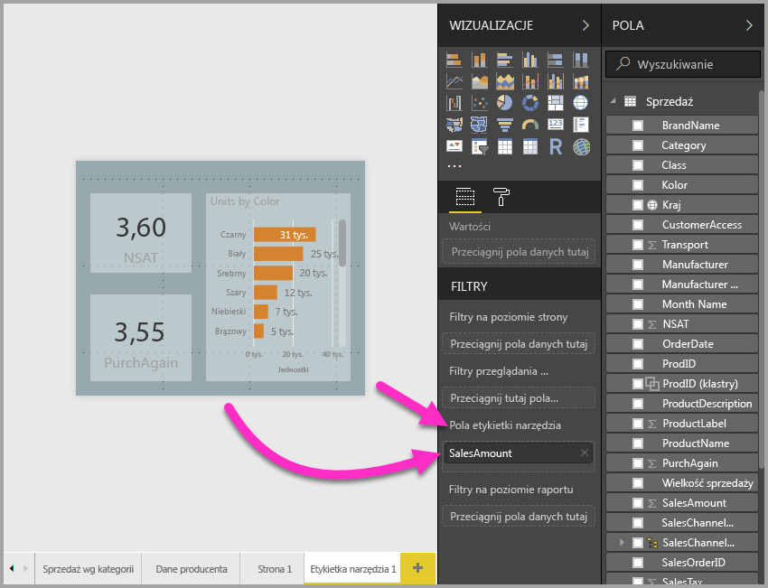
 
W zasobniku **Pola etykietki narzędzi** możesz uwzględnić pola kategorii i numeryczne, w tym miary.

Po zakończeniu utworzona strona raportu etykietki narzędzi będzie używana jako etykietka narzędzia w elementach wizualnych w raporcie, w którym użyto dowolnych pól umieszczonych w zasobniku **Pola etykietki narzędzi**, zastępując domyślną etykietkę narzędzi usługi Power BI.

## Ręczne ustawianie etykietki narzędzi raportu

Poza tworzeniem etykietki narzędzi automatycznie wyświetlanej po najechaniu kursorem na element wizualny zawierający określone pole, możesz też ręcznie ustawić etykietkę narzędzi. 

Wszelkie elementy wizualne obsługujące etykietki narzędzi raportu mają teraz kartę **Etykietka narzędzi** w okienku **Formatowanie**. 

Aby ręcznie ustawić etykietkę narzędzi, wybierz element wizualny, dla którego chcesz określić ręczną etykietkę narzędzi, a następnie w okienku **Wizualizacje** wybierz sekcję **Format** i rozwiń kartę **Etykietka narzędzia**.

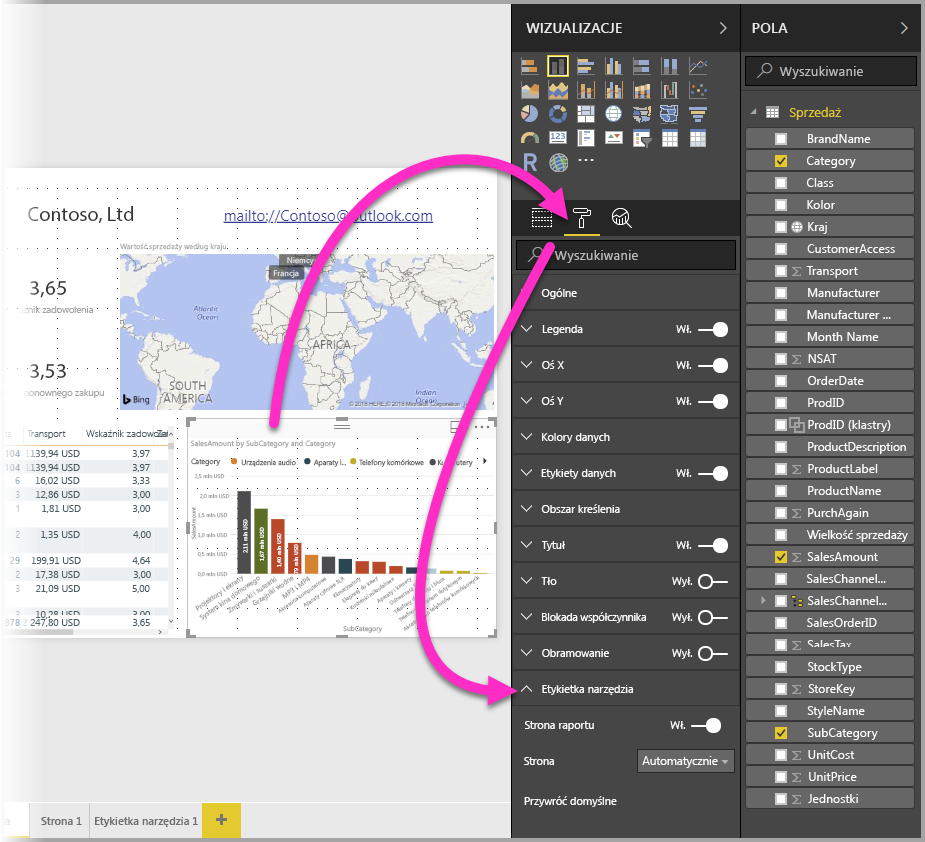

Następnie na liście rozwijanej **Strona** wybierz stronę etykietki narzędzi, której chcesz użyć dla wybranej wizualizacji. Pamiętaj, że tylko strony raportu określone jako **Etykietka narzędzia** są wyświetlane w tym oknie dialogowym.

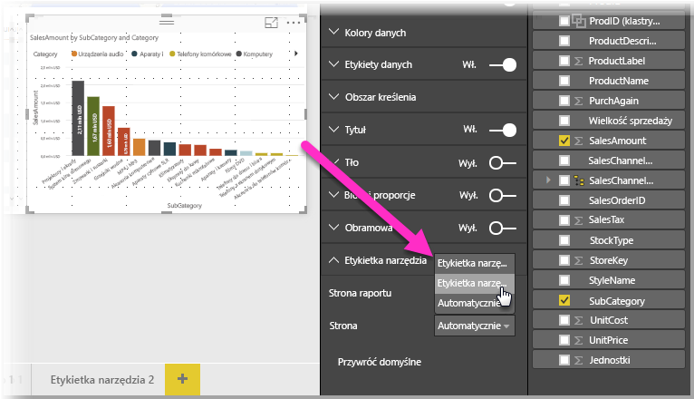

Możliwość ręcznego ustawienia etykietki narzędzia ma wiele zastosowań. Możesz ustawić pustą stronę jako etykietkę narzędzia, aby zastąpić domyślny wybór etykietki narzędzia usługi Power BI. Innym przypadkiem jest sytuacja, w której nie chcesz używać etykietki narzędzia automatycznie wybieranej przez usługę Power BI jako etykietki narzędzia. Jeśli na przykład masz element wizualny zawierający dwa pola, które zostały skojarzone z etykietką narzędzia, usługa Power BI wybierze tylko jedno z nich do wyświetlenia. Może być to działanie niepożądane, więc trzeba ręcznie wybrać etykietkę narzędzia do wyświetlenia.

## Powrót do domyślnych etykietek narzędzi

Jeśli utworzysz ręczną etykietkę narzędzia dla wizualizacji, ale później zdecydujesz, że chcesz użyć domyślnej etykietki narzędzia, zawsze możesz wrócić do domyślnej etykietki narzędzia zapewnianej przez usługę Power BI. Aby to zrobić, po wybraniu elementu wizualnego i rozwinięciu karty **Etykietka narzędzia** wybierz opcję *Automatyczne* z listy rozwijanej **Strona**, aby powrócić do wartości domyślnej.

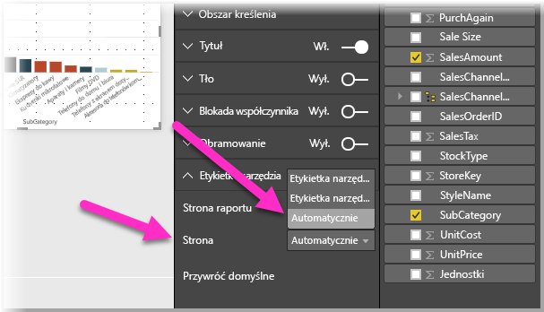

## Niestandardowe etykietki narzędzi raportu oraz wykresy liniowe

Istnieje kilka zagadnień, które należy wziąć pod uwagę w sytuacji, w której etykietki narzędzi raportu wchodzą w interakcję z wykresami liniowymi oraz elementami wizualnymi z wyróżnianiem krzyżowym.

### Etykiety narzędzi raportu oraz wykresy liniowe

Gdy etykietka narzędzia jest wyświetlana dla wykresu liniowego, tylko jedna etykietka narzędzia będzie wyświetlana dla wszystkich linii wykresu. Jest to podobne działanie do domyślnego zachowania etykietki narzędzia dla wykresów liniowych, które również powoduje wyświetlenie tylko jednej etykietki narzędzia. 

Dzieje się tak, ponieważ pole w legendzie nie jest przekazywane przez filtr dla etykietki narzędzi. Na poniższej ilustracji wyświetlana etykietka narzędzia pokazuje wszystkie sprzedane jednostki w tym dniu we wszystkich trzech klasach wyświetlonych w etykietce narzędzia raportu (w tym przykładzie Deluxe, Economy i Regular). 

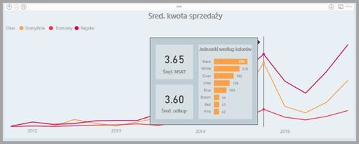

### Etykietki narzędzi raportów i wyróżnianie krzyżowe

Gdy element wizualny zostaje wyróżniony krzyżowo w raporcie, etykietki narzędzi raportu zawsze pokazują wyróżnione krzyżowo dane, nawet w przypadku najechania kursorem na rozmytą sekcję punktu danych. Na poniższej ilustracji kursor znajduje się nad rozmytą sekcją wykresu słupkowego (sekcja, która nie jest wyróżniona), ale etykietka narzędzia raportu nadal pokazuje dane dla wyróżnionej porcji punktu danych (wyróżnione dane).

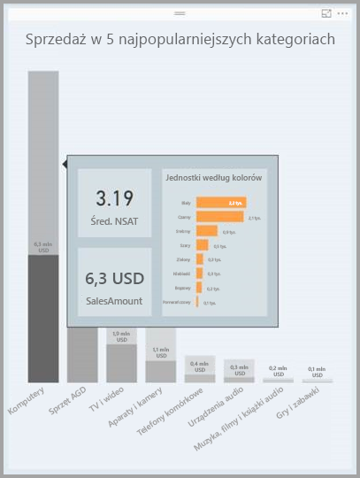

## Ograniczenia i istotne zagadnienia
Należy pamiętać o kilku ograniczeniach i istotnych zagadnieniach dotyczących **etykietek narzędzi**.

* Począwszy od wersji **Power BI Desktop** z września 2018 r., w której wprowadzono ogólną dostępność etykietek narzędzi, wizualizacje kart również obsługują etykietki narzędzi.
* Począwszy od wersji programu **Power BI Desktop** z lipca 2018 r. wizualizacje tabel i macierzy są obsługiwane w przypadku etykietek narzędzi. 
* Etykietki narzędzi nie są obsługiwane podczas wyświetlania raportów w aplikacjach mobilnych. 
* Etykietki narzędzi raportów nie są obsługiwane w przypadku niestandardowych elementów wizualnych. 
* Klastry nie są obecnie obsługiwane jako pola, które można wyświetlać w etykietkach narzędzi raportów. 
* W przypadku wybierania pola do wyświetlenia w ramach etykietek narzędzi raportów, kiedy zastosowane zostaje pole, a nie kategoria, elementy wizualne zawierające to pole będą wyświetlać wyłącznie określoną etykietkę narzędzi po dopasowaniu podsumowania z wybranym polem. 

## Następne kroki
Aby uzyskać więcej informacji o podobnych funkcjach lub interakcji z etykietkami narzędzi raportów, sprawdź następujące artykuły:

* [Używanie przeglądania szczegółowego w programie Power BI Desktop](desktop-drillthrough.md)
* [Wyświetlanie kafelka pulpitu nawigacyjnego lub wizualizacji raportu w trybie koncentracji uwagi](consumer/end-user-focus.md)

