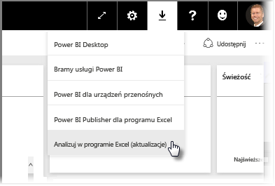
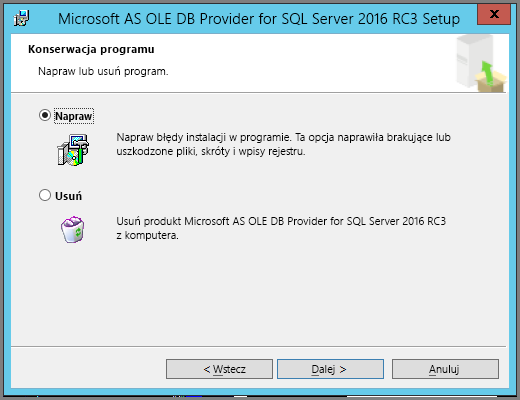
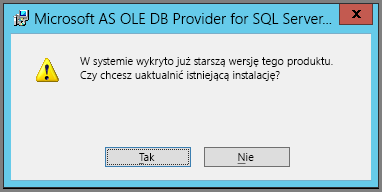

# Rozwiązywanie problemów z analizą w programie Excel
Mogą zaistnieć sytuacje, w których użycie analizy w programie Excel zwróci nieoczekiwane wyniki lub ta funkcja nie będzie działać zgodnie z oczekiwaniami. Ta strona zapewnia rozwiązania typowych problemów związanych z użyciem funkcji analizy w programie Excel.

> [!NOTE]
> Istnieje oddzielna strona poświęcona opisywaniu i włączaniu funkcji [Analizuj w programie Excel](service-analyze-in-excel.md).
> 
> Jeśli napotkasz sytuację, której nie wymieniono poniżej, możesz uzyskać dodatkową pomoc w [witrynie społeczności](http://community.powerbi.com/) albo utworzyć [bilet pomocy technicznej](https://powerbi.microsoft.com/support/).
> 
> 

Ten artykuł zawiera następujące sekcje związane z rozwiązywaniem problemów:

* Aktualizacja bibliotek programu Excel dla dostawcy OLE DB
* Określanie potrzeby aktualizacji bibliotek programu Excel
* Błąd „Nie można nawiązać połączenia”
* Błąd „Niedozwolone”
* Brak modeli danych
* Błąd „Wygasły token”
* Nie można uzyskać dostępu do lokalnych usług Analysis Services
* Nie można przeciągnąć niczego do obszaru wartości tabeli przestawnej (brak miar)

## Aktualizacja bibliotek programu Excel dla dostawcy OLE DB
Aby użyć funkcji **Analizuj w programie Excel**, komputer musi mieć zainstalowanego bieżącego dostawcę AS OLE DB. Ten [wpis społeczności](http://community.powerbi.com/t5/Service/Analyze-in-Excel-Initialization-of-the-data-source-failed/m-p/30837#M8081) jest doskonałym źródłem pomagającym w weryfikowaniu instalacji dostawcy OLE DB lub pobieraniu bieżącej wersji.

Biblioteki programu Excel muszą być dopasowane do wersji systemu Windows pod względem architektury bitowej. Jeśli masz zainstalowany 64-bitowy system Windows, musisz zainstalować 64-bitowego dostawcę OLE DB.

Aby pobrać najnowsze biblioteki programu Excel, odwiedź stronę usługi Power BI i wybierz **strzałkę w dół** w prawym górnym rogu usługi Power BI, a następnie wybierz opcję **Aktualizacje analizy w programie Excel**.

W wyświetlonym oknie dialogowym wybierz opcję **Pobierz (wersja zapoznawcza)**.

## Określanie potrzeby aktualizacji bibliotek programu Excel
Możesz pobrać najnowszą wersję bibliotek dostawcy Excel OLE DB, korzystając z linków w poprzedniej sekcji. Po pobraniu odpowiedniej biblioteki dostawcy OLE DB i rozpoczęciu instalacji wykonywane są kontrole pod kątem bieżącej zainstalowanej wersji.

Jeśli biblioteki klienta dostawcy Excel OLE DB są aktualne, zobaczysz okno dialogowe, które wygląda podobnie do poniższego:

C:\Users\davidi\Desktop\powerbi-content-pr\articles\media\powerbi-desktop-troubleshooting-analyze-in-excel

Alternatywnie, jeśli nowa wersja, którą instalujesz, jest nowsza od wersji na komputerze, zostanie wyświetlone następujące okno dialogowe:

Jeśli zobaczysz okno dialogowe z monitem o uaktualnienie, kontynuuj instalację, aby zainstalować najnowszą wersję dostawcy OLE DB na komputerze.

## Błąd „Nie można nawiązać połączenia”
Główna przyczyna błędu *Nie można nawiązać połączenia* to nieaktualne biblioteki klienta dostawcy OLE DB na komputerze. Aby uzyskać więcej informacji o sposobie określania właściwej aktualizacji i linkach umożliwiających pobieranie, zobacz **Aktualizacja bibliotek programu Excel dla dostawcy OLE DB** we wcześniejszej części tego artykułu.

## Błąd „Niedozwolone”
Niektórzy użytkownicy mają więcej niż jedno konto usługi Power BI. Gdy program Excel próbuje nawiązać połączenie z usługą Power BI przy użyciu bieżących poświadczeń, może użyć poświadczeń bez dostępu do zestawu danych lub raportu, do którego próbujesz uzyskać dostęp.

W takim przypadku użytkownik może zobaczyć błąd **Niedozwolone**, który oznacza logowanie do usługi Power BI przy użyciu poświadczeń bez uprawnień do danego zestawu danych. Po napotkaniu błędu **Niedozwolone** i wyświetleniu monitu o wprowadzenie poświadczeń użyj poświadczeń z uprawnieniami dostępu do zestawu danych, którego chcesz użyć.

Jeśli nadal występują błędy, zaloguj się do usługi Power BI przy użyciu konta z uprawnieniami i upewnij się, że możesz wyświetlać i uzyskiwać dostęp w usłudze Power BI do zestawu danych, do którego próbujesz uzyskać dostęp w programie Excel.

## Brak modeli danych
Jeśli wystąpił błąd **Nie można znaleźć modelu monitu OLAP**, zestaw danych, do którego próbujesz uzyskać dostęp, nie zawiera modelu danych i dlatego nie może być analizowany w programie Excel.

## Błąd „Wygasły token”
Jeśli wystąpi błąd **Wygasły token**, oznacza to, że ostatnio użyto funkcji **Analizuj w programie Excel** na komputerze, którego używasz. Po prostu wprowadź ponownie poświadczenia lub otwórz ponownie plik, a błąd powinien zniknąć.

## Nie można uzyskać dostępu do lokalnych usług Analysis Services
Jeśli próbujesz uzyskać dostęp do zestawu danych, który zawiera połączenia z lokalnymi danymi usług Analysis Services, możesz otrzymać komunikat o błędzie. **Analizowanie w programie Excel** obsługuje łączność z zestawami danych i raportami w lokalnych usługach **Analysis Services** przy użyciu parametrów połączenia, dopóki komputer jest w tej samej domenie co serwer usług **Analysis Services**, a Twoje konto ma dostęp do tego serwera usług **Analysis Services**.

## Nie można przeciągnąć niczego do obszaru wartości tabeli przestawnej (brak miar)
Gdy funkcja **Analizowanie w programie Excel** nawiąże połączenie z zewnętrznym modelem OLAP (w ten sposób program Excel łączy się z usługą Power BI), *tabela przestawna* [wymaga **miar** zdefiniowanych w modelu zewnętrznym](https://support.microsoft.com/kb/234700), ponieważ wszystkie obliczenia są wykonywane na serwerze. Różni się to od pracy z lokalnym źródłem danych (np. tabelami w programie Excel, pracy z zestawami danych w programie **Power BI Desktop** lub **usłudze Power BI**), podczas której model tabelaryczny jest dostępny lokalnie i [można używać niejawnych miar](https://msdn.microsoft.com/library/gg399077.aspx), które są miarami generowanymi dynamicznie i nie są przechowywane w modelu danych. W takich przypadkach zachowanie w programie Excel różni się od zachowania w programie **Power BI Desktop** lub **usłudze Power BI**: mogą istnieć kolumny w danych, które są traktowane jako miary w usłudze Power BI, ale których nie można użyć jako wartości (miar) w programie Excel.

Aby rozwiązać ten problem, możesz skorzystać z kilku opcji:

1. Utwórz [miary w modelu danych w programie **Power BI Desktop**](desktop-tutorial-create-measures.md), a następnie opublikuj model danych w **usłudze Power BI** i uzyskaj dostęp do tego opublikowanego zestawu danych z programu Excel.
2. Utwórz [miary w modelu danych z poziomu narzędzia Excel PowerPivot](https://support.office.com/article/Create-a-Measure-in-Power-Pivot-d3cc1495-b4e5-48e7-ba98-163022a71198).
3. Jeśli zaimportowane dane ze skoroszytu programu Excel zawierały tylko tabele (bez modelu danych), możesz [dodać tabele do modelu danych](https://support.office.com/article/Add-worksheet-data-to-a-Data-Model-using-a-linked-table-d3665fc3-99b0-479d-ba09-a37640f5be42), a następnie wykonać kroki w opcji 2 (bezpośrednio powyżej), aby utworzyć miary w modelu danych.

Po zdefiniowaniu miar w modelu w usłudze Power BI możesz użyć ich w obszarze **Wartości** w tabelach przestawnych programu Excel.

## Następne kroki
[Analizowanie w programie Excel](service-analyze-in-excel.md)

[Samouczek: tworzenie własnych miar w programie Power BI Desktop](desktop-tutorial-create-measures.md)

[Miary w narzędziu PowerPivot](https://msdn.microsoft.com/library/gg399077.aspx)

[Tworzenie miary w narzędziu PowerPivot](https://support.office.com/article/Create-a-Measure-in-Power-Pivot-d3cc1495-b4e5-48e7-ba98-163022a71198)

[Dodawanie danych arkusza do modelu danych przy użyciu tabeli połączonej](https://support.office.com/article/Add-worksheet-data-to-a-Data-Model-using-a-linked-table-d3665fc3-99b0-479d-ba09-a37640f5be42)

[Różnice między tabelami przestawnymi OLAP i innymi niż OLAP w programie Excel](https://support.microsoft.com/kb/234700)

