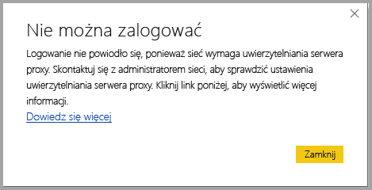
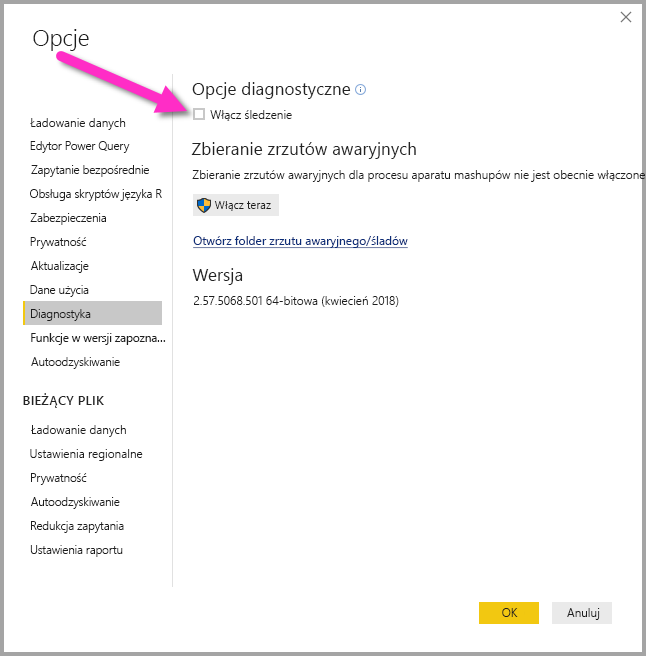

# Rozwiązywanie problemów z logowaniem w programie Power BI Desktop
W pewnych sytuacjach próba zalogowania się do programu **Power BI Desktop** może spowodować wystąpienie błędów. Istnieją dwie główne przyczyny problemów z logowaniem: **błędy uwierzytelniania serwera proxy** i **błędy przekierowywania adresów URL innych niż HTTPS**. 

Aby określić, który problem powoduje błąd logowania, należy najpierw skontaktować się z administratorem i podać informacje diagnostyczne, tak aby mógł on ustalić przyczynę problemu. Śledząc trudności skojarzone z problemem z logowaniem, administratorzy mogą sprawdzić, które z poniższych błędów odnoszą się do Ciebie. 

Przyjrzyjmy się każdemu z tych problemów z osobna. Na końcu tego artykułu omówiliśmy sposób przechwytywania *śladu* w programie Power BI Desktop, co pomaga zidentyfikować rozwiązania problemów.

## Błąd Wymagane uwierzytelnianie serwera proxy

Na poniższym ekranie przedstawiono przykład błędu *Wymagane uwierzytelnianie serwera proxy*.

Z tym błędem zostały skojarzone następujące wyjątki plików śledzenia programu *Power BI Desktop*:

* *Microsoft.PowerBI.Client.Windows.Services.PowerBIWebException*
* *HttpStatusCode: ProxyAuthenticationRequired*

Najbardziej prawdopodobną przyczyną wystąpienia tego błędu jest blokowanie przez serwer uwierzytelniania serwera proxy w sieci żądań internetowych wystawianych przez program **Power BI Desktop**. 

Jeśli sieć używa serwera uwierzytelniania serwera proxy, administrator może rozwiązać ten problem, umieszczając na liście dozwolonych następujące domeny znajdujące się na serwerze uwierzytelniania serwera proxy:

* app.powerbi.com
* api.powerbi.com
* domeny w przestrzeni nazw *.analysis.windows.net

W przypadku klientów należących do chmury dla instytucji rządowych ten problem można rozwiązać, umieszczając następujące domeny na liście dozwolonych na serwerze uwierzytelniania serwera proxy:

* app.powerbigov.us
* api.powerbigov.us
* domeny w przestrzeni nazw *.analysis.usgovcloudapi.net

## Błąd Nieobsługiwane przekierowywanie adresów URL innych niż HTTPS

Bieżące wersje programu **Power BI Desktop** używają bieżącej wersji biblioteki ADAL (Active Directory Authentication Library), która nie zezwala na przekierowywanie do niezabezpieczonych adresów URL (innych niż HTTPS). 

Z tym błędem zostały skojarzone następujące wyjątki plików śledzenia programu *Power BI Desktop*:

* *Microsoft.IdentityModel.Clients.ActiveDirectory.AdalServiceException: nieobsługiwane przekierowywanie adresów URL innych niż HTTPS w widoku internetowym*
* *ErrorCode: non_https_redirect_failed*

Jeśli występuje kod błędu *ErrorCode: non_https_redirect_failed*, oznacza to, że co najmniej jeden dostawca lub strona przekierowania w łańcuchu przekierowania nie jest chronionym punktem końcowym protokołu HTTPS lub że wystawca certyfikatu co najmniej jednego przekierowania nie należy do zaufanych certyfikatów głównych urządzenia. Wszyscy dostawcy w dowolnym łańcuchu przekierowania muszą używać adresu URL protokołu HTTP. Aby rozwiązać ten problem, skontaktuj się z administratorem i poproś, aby na potrzeby witryn uwierzytelniania były używane zabezpieczone adresy URL. 

## Jak zbierać dane śledzenia w programie Power BI Desktop

Aby zbierać dane śledzenia w programie **Power BI Desktop**, wykonaj następujące kroki:

1. Włącz śledzenie w programie **Power BI Desktop**, przechodząc do pozycji **Plik > Opcje i ustawienia > Opcje**, a następnie wybierz pozycję **Diagnostyka** spośród opcji w okienku po lewej stronie. W wyświetlonym okienku zaznacz pole wyboru obok pozycji **Włącz śledzenie**, jak pokazano na poniższej ilustracji. Być może trzeba będzie ponownie uruchomić program **Power BI Desktop**.
   
   

2. Następnie wykonaj kroki odtwarzania błędu. W takiej sytuacji program **Power BI Desktop** dodaje zdarzenia do dziennika śledzenia przechowywanego na komputerze lokalnym.

3. Przejdź do folderu Traces na komputerze lokalnym. Ten folder możesz znaleźć, klikając link w obszarze **Diagnostyka**, w którym włączono śledzenie. Na poprzedniej ilustracji został on wyświetlony jako pozycja *Otwórz folder zrzutu awaryjnego/śladów*. Często znajduje się on na komputerze lokalnym w następującej lokalizacji:

    `C:\Users/<user name>/AppData/Local/Microsoft/Power BI Desktop/Traces`

W tym folderze może istnieć wiele plików śledzenia. Upewnij się, że do administratora wysyłasz tylko najnowsze pliki, co pomoże mu szybko zidentyfikować błąd. 

