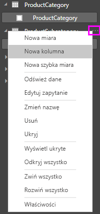
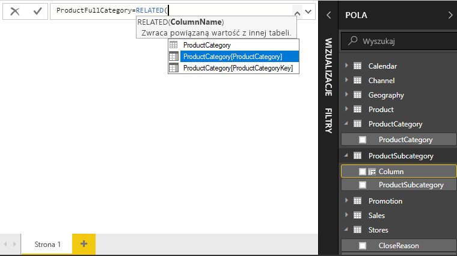
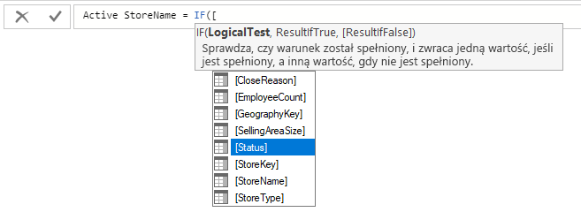

# Samouczek: tworzenie kolumn obliczeniowych w programie Power BI Desktop

Czasami analizowane dane nie zawierają określonego pola, które jest potrzebne do uzyskania szukanych wyników. W tym momencie wkraczają *kolumny obliczeniowe*. Kolumny obliczeniowe używają formuł języka DAX (Data Analysis Expressions) do definiowania wartości kolumny — od zestawiania różnych wartości tekstowych z kilku różnych kolumn do obliczania wartości numerycznej na podstawie innych wartości. Załóżmy na przykład, że w Twoich danych znajdują się kolumny **Miasto** i **Województwo**, ale chcesz uzyskać jedno pole **Lokalizacja** zawierające obie te wartości razem, np. „Warszawa, Mazowieckie”. Dokładnie do tego służą kolumny obliczeniowe.

Kolumny obliczeniowe przypominają [miary](desktop-tutorial-create-measures.md), ponieważ także są oparte na formułach języka DAX, ale różnią się sposobem użycia. Miary są często używane w obszarze **Wartości** wizualizacji do obliczania wyników na podstawie innych pól. Kolumny obliczeniowe są używane jako nowe **pola** w wierszach, na osiach, w legendzie i obszarach grupowania wizualizacji.

Ten samouczek przeprowadzi Cię przez informacje umożliwiające zrozumienie i utworzenie kolumn obliczeniowych wizualizacjach raportu w programie Power BI Desktop. 

### Wymagania wstępne
- Ten samouczek jest przeznaczony dla użytkowników usługi Power BI, którzy są już zaznajomieni z używaniem programu Power BI Desktop na potrzeby tworzenia bardziej zaawansowanych modeli. Użytkownik powinien już wiedzieć, jak korzystać z funkcji **Pobierz dane** i **Edytora Power Query** w celu importowania danych, pracować z wieloma powiązanymi tabelami oraz dodawać pola do kanwy raportów. Jeśli jesteś nowym użytkownikiem programu Power BI Desktop, zapoznaj się z tematem [Wprowadzenie do programu Power BI Desktop](desktop-getting-started.md).
  
- W samouczku jest używany przykład [Contoso Sales Sample for Power BI Desktop](http://download.microsoft.com/download/4/6/A/46AB5E74-50F6-4761-8EDB-5AE077FD603C/Contoso%20Sales%20Sample%20for%20Power%20BI%20Desktop.zip), który zastosowaliśmy również w samouczku [Tworzenie własnych miar w programie Power BI Desktop](desktop-tutorial-create-measures.md). Te dane dotyczące sprzedaży fikcyjnej firmy Contoso, Inc. zostały zaimportowane z bazy danych, dlatego nie będzie można połączyć się ze źródłem danych ani wyświetlić źródła w Edytorze Power Query. Pobierz i wyodrębnij plik na swoim komputerze, a następnie otwórz go w programie Power BI Desktop.

## Tworzenie kolumny obliczeniowej z wartościami z powiązanych tabel

W raporcie sprzedaży chcesz wyświetlić kategorie i podkategorie produktów w postaci pojedynczej wartości w wierszach, np. „Telefony komórkowe — Akcesoria”, „Telefony komórkowe — Smartfony i urządzenia PDA” itd. Lista **Pola**  nie zawiera żadnych pól udostępniających dane, ale istnieje pole **ProductCategory** i pole **ProductSubcategory**, każde we własnej tabeli. Można utworzyć kolumnę obliczeniową, która łączy wartości z tych dwóch kolumn. Formuły języka DAX mogą wykorzystać wszystkie możliwości, jakie daje już posiadany model, w tym relacje między różnymi, już istniejącymi tabelami. 

 

1.  Wybierz wielokropek **Więcej opcji** (...) lub kliknij prawym przyciskiem myszy tabelę **ProductSubcategory** na liście Pola, a następnie wybierz pozycję **Nowa kolumna**. Spowoduje to utworzenie nowej kolumny w tabeli ProductSubcategory.
    
    
    
    Wzdłuż górnej części kanwy raportów zostanie wyświetlony pasek formuły, na którym możesz nadać kolumnie nazwę i wprowadzić formułę języka DAX.
    
    
    
2.  Domyślnie nowa kolumna obliczeniowa nosi po prostu nazwę Kolumna. Jeśli nie zmienisz tej nazwy, dodatkowe nowe kolumny będą mieć nazwy Kolumna 2, Kolumna 3 itd. Chcesz, aby kolumna była łatwa do zidentyfikowania, dlatego ponieważ nazwa **Kolumna** została już wyróżniona na pasku formuły, zmień jej nazwę, wpisując ciąg **ProductFullCategory**, a następnie wpisz znak równości (**=**).
    
3.  Wartości w nowej kolumnie powinny zaczynać się od nazwy ProductCategory. Ponieważ ta kolumna znajduje się w innej, ale powiązanej tabeli, możesz użyć funkcji [RELATED](https://msdn.microsoft.com/library/ee634202.aspx), która pomoże Ci uzyskać ten efekt.
    
    Po znaku równości wpisz **r**. Zostanie wyświetlona lista rozwijana podpowiedzi, która zawiera wszystkie funkcje języka DAX rozpoczynające się od litery R. Wybranie danej funkcji spowoduje wyświetlenie opisu efektów jej działania. Podczas wpisywania lista propozycji jest skalowana w celu przybliżenia do potrzebnej funkcji. Wybierz pozycję **RELATED**, a następnie naciśnij klawisz **Enter**.
    
    
    
    Zostanie wyświetlony nawias otwierający oraz kolejna lista proponowanych powiązanych kolumn, które można przekazać do funkcji RELATED, z opisami i szczegółami oczekiwanych parametrów. 
    
    
    
4.  Potrzebujesz kolumny **ProductCategory** z tabeli **ProductCategory**. Wybierz pozycję **ProductCategory[ProductCategory]**, a następnie naciśnij klawisz **Enter** i wpisz nawias zamykający.
    
    > [!TIP]
    > Błędy składni są najczęściej spowodowane brakującym lub niewłaściwie umieszczonym nawiasem zamykającym, mimo że czasami dodaje go program Power BI Desktop.
    
4. Chcesz, aby kreski i spacje oddzielały kategorie ProductCategory i ProductSubcategory w nowych wartościach, dlatego po nawiasie zamykającym w pierwszym wyrażeniu wpisz spację, handlowe „i” (**&**), podwójny cudzysłów (**"**), spację, kreskę (**-**), kolejną spację, kolejny podwójny cudzysłów i kolejne handlowe „i”. Twoja formuła powinna teraz wyglądać następująco:
    
    `ProductFullCategory = RELATED(ProductCategory[ProductCategory]) & " - " &`
    
    > [!TIP]
    > Jeśli potrzebujesz więcej miejsca, wybierz strzałkę w dół po prawej stronie paska formuły, aby rozwinąć edytor formuł. Naciśnij klawisze **Alt + Enter**, aby przejść do kolejnego wiersza, i klawisz **Tab**, aby przesunąć wpisany tekst.
    
5.  Wprowadź nawias otwierający (**[**), a następnie wybierz kolumnę **[ProductSubcategory]**, aby zakończyć formułę. 
    
    
    
    Do wywołania tabeli ProductSubcategory w drugim wyrażeniu nie trzeba używać innej funkcji RELATED, ponieważ tworzysz kolumnę obliczeniową w tej tabeli. Element [ProductCategory] możesz wprowadzić z prefiksem nazwy tabeli (w pełni kwalifikowana) lub bez (niekwalifikowana).
    
6.  Zakończ formułę, naciskając klawisz **Enter** lub wybierając znacznik wyboru na pasku formuły. Formuła jest weryfikowana, a nazwa kolumny **ProductFullCategory** jest wyświetlana w tabeli **ProductSubcategory** na liście Pola. 
    
    
    
    >[!NOTE]
    >W programie Power BI Desktop kolumny obliczeniowe mają specjalną ikonę na liście pól, co oznacza, że zawierają formuły. W usłudze Power BI (witrynie usługi Power BI) nie ma możliwości zmiany formuł, dlatego kolumny obliczeniowe nie mają ikon.
    
## Używanie nowej kolumny w raporcie

Teraz możesz użyć nowej kolumny ProductFullCategory, aby zapoznać się z kwotą SalesAmount według kategorii ProductFullCategory.

1. Wybierz lub przeciągnij kolumnę **ProductFullCategory** z tabeli **ProductSubcategory** na kanwę raportu, aby utworzyć tabelę przedstawiającą wszystkie nazwy ProductFullCategory.
   
   
    
2. Wybierz lub przeciągnij pole **SalesAmount** (Kwota sprzedaży) z tabeli **Sales** (Sprzedaż) do tabeli, aby wyświetlić kwotę sprzedaży dla każdej pełnej kategorii produktu.
   
   
    
## Tworzenie kolumny obliczeniowej korzystającej z funkcji IF

Model Contoso Sales Sample zawiera dane sprzedaży zarówno dla sklepów aktywnych i nieaktywnych. Upewnij się, czy sprzedaż w sklepach aktywnych jest wyraźnie oddzielona od sprzedaży w sklepach nieaktywnych, tworząc pole Active StoreName (Nazwa sklepu aktywnego). W nowej kolumnie obliczeniowej Active StoreName każdy sklep aktywny będzie wyświetlany z pełną nazwą, a sklepy nieaktywne zostaną zgrupowane w obszarze „Inactive” (Nieaktywne). 

Na szczęście tabela Stores (Sklepy) zawiera kolumnę o nazwie **Status** (Stan), z wartościami „On”(Wł.) dla sklepów aktywnych i „Off” (Wył.) dla sklepów nieaktywnych, której można użyć do tworzenia wartości dla naszej nowej kolumny Active StoreName (Nazwa sklepu aktywnego). Formuła języka DAX użyje funkcji logicznej [IF](https://msdn.microsoft.com/library/ee634824.aspx), aby sprawdzić stan każdego sklepu, i zwróci określoną wartość w zależności od wyniku. Jeśli stan sklepu ma wartość „On” (Wł.), formuła zwróci nazwę sklepu. Jeśli wartość to „Off” (Wył.), formuła przydzieli nazwę Active StoreName o wartości „Inactive” (Nieaktywny). 

1.  Na pasku formuły utwórz nową kolumnę obliczeniową w tabeli **Stores** (Sklepy) i nadaj jej nazwę **Active StoreName** (Nazwa sklepu aktywnego).
    
2.  Po znaku **=** rozpocznij wpisywanie ciągu **IF**. Lista sugestii będzie zawierać elementy, które możesz dodać. Wybierz pozycję **IF**.
    
    
    
3.  Pierwszym argumentem funkcji IF jest dla Jeśli jest logiczny test określający, czy stan sklepu to „On” (Wł.). Wpisz nawias otwierający **[**, co spowoduje wyświetlenie listy kolumn tabeli Stores (Sklepy), i wybierz pozycję **[Status]** (Stan).
    
    
    
4.  Bezpośrednio po pozycji **[Status]** (Stan) wpisz ciąg **="On"**, a następnie wpisz przecinek (**,**), aby zakończyć argument. Etykietka narzędzia sugeruje, że teraz musisz dodać wartość do zwrócenia, jeśli wynik to TRUE.
    
    
    
5.  Jeśli sklep ma stan „On”, chcesz wyświetlić jego nazwę. Wpisz nawias otwierający (**[**) i wybierz kolumnę **[StoreName]**, a następnie wpisz kolejny przecinek, abyśmy mogli wprowadzić nasz trzeci argument. Etykietka narzędzia wskazuje teraz, że musisz dodać wartość do zwrócenia, jeśli wynik to FALSE. 
    
    
    
6.  Potrzebujesz wartości *Inactive* (Nieaktywny), dlatego wpisz **"Inactive"**, a następnie ukończ formułę, naciskając klawisz **Enter** lub wybierając znacznik wyboru na pasku formuły. Formuła zostanie zweryfikowana, a nazwa nowej kolumny zostanie wyświetlona w tabeli **Stores** (Sklepy) na liście pól.
    
    
    
8.  Nowej kolumny Active StoreName (Nazwa sklepu aktywnego) możesz używać w wizualizacji, podobnie jak każdego innego pola. Aby wyświetlić kwoty SalesAmount według nazwy Active StoreName (Nazwa sklepu aktywnego), wybierz pole **Active StoreName** lub przeciągnij je na kanwę, a następnie wybierz pole **SalesAmount** lub przeciągnij je do tabeli. W tej tabeli sklepy aktywne są wyświetlane indywidualnie według nazwy, ale sklepy nieaktywne są grupowane na końcu i oznaczane jako *Inactive* (Nieaktywne). 
    
    
    
## Podsumowanie samouczka
Kolumny obliczeniowe mogą wzbogacić Twoje dane i ułatwić uzyskiwanie szczegółowych informacji. Wiesz już, jak tworzyć kolumny obliczeniowe na liście pól i pasku formuły, używać list podpowiedzi i etykietek narzędzi jako pomocy podczas tworzenia formuł, wywoływać funkcje języka DAX, takie jak RELATED i IF, z odpowiednimi argumentami oraz używać kolumn obliczeniowych w wizualizacjach raportu.

## Następne kroki
Jeśli chcesz poznać więcej szczegółowych informacji na temat formuł języka DAX i tworzyć kolumny obliczeniowe za pomocą bardziej zaawansowanych formuł, zobacz [Podstawy języka DAX w programie Power BI Desktop](desktop-quickstart-learn-dax-basics.md). Ten artykuł skupia się na podstawowych pojęciach dotyczących języka DAX, np. składni, funkcjach i dokładniejszym rozumieniu kontekstu.

Pamiętaj, aby dodać [dokumentację języka Data Analysis Expressions (DAX)](https://msdn.microsoft.com/library/gg413422.aspx) do ulubionych. W tym miejscu znajdziesz szczegółowe informacje dotyczące składni, operatorów i ponad 200 funkcji języka DAX.

