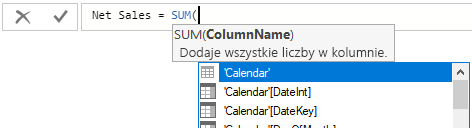

# Samouczek: Tworzenie własnych miar w programie Power BI Desktop
Dzięki miarom możesz tworzyć jedne z najbardziej zaawansowanych rozwiązań analizy danych w programie Power BI Desktop. Miary pomagają w wykonywaniu obliczeń na danych podczas wchodzenia w interakcje z raportami. Ten samouczek przeprowadzi Cię przez informacje umożliwiające tworzenie własnych podstawowych miar w programie Power BI Desktop i ich interpretację.

### Wymagania wstępne
- Ten samouczek jest przeznaczony dla użytkowników usługi Power BI, którzy są już zaznajomieni z używaniem programu Power BI Desktop na potrzeby tworzenia bardziej zaawansowanych modeli. Należy zapoznać się z używaniem funkcji Pobierz dane i Edytor zapytań w celu importowania danych, pracą z wieloma powiązanymi tabelami oraz dodawaniem pól do kanwy raportów. Jeśli jesteś nowym użytkownikiem programu Power BI Desktop, zapoznaj się z tematem [Wprowadzenie do programu Power BI Desktop](desktop-getting-started.md).
  
- Pobierz plik [Contoso Sales Sample for Power BI Desktop](http://download.microsoft.com/download/4/6/A/46AB5E74-50F6-4761-8EDB-5AE077FD603C/Contoso%20Sales%20Sample%20for%20Power%20BI%20Desktop.zip), który zawiera dane dotyczące sprzedaży internetowej fikcyjnej firmy, Contoso, Inc. Te dane zostały zaimportowane z bazy danych, dlatego nie będzie można połączyć się ze źródłem danych ani wyświetlić go w Edytorze zapytań. Wyodrębnij plik na swoim komputerze, a następnie otwórz go w programie Power BI Desktop.

## Informacje o miarach

Miary są najczęściej tworzone automatycznie. W przykładowym pliku sprzedaży firmy Contoso zaznacz pole wyboru obok pola **SalesAmount** w tabeli **Sales** w obszarze pól lub przeciągnij pole **SalesAmount** na kanwę raportu. Zostanie wyświetlona nowa wizualizacja wykresu kolumnowego przedstawiająca sumę wszystkich wartości kolumny SalesAmount w tabeli Sales.

Każde pole wyświetlane w obszarze pól z ikoną z literą sigma  to pole liczbowe, którego wartości można agregować. Zamiast wyświetlać tabelę zawierającą dwa miliony wierszy wartości SalesAmount, program Power BI Desktop wykrył liczbowy typ danych, a następnie automatycznie utworzył i obliczył miarę w celu agregowania danych. Suma to domyślna agregacja dla liczbowego typu danych, ale można łatwo zastosować inne agregacje, takie jak średnia lub liczba. Zrozumienie agregacji jest niezbędne, jeśli chcesz zrozumieć miary, ponieważ każda miara wykonuje agregację określonego typu. 

Aby zmienić agregację wykresu na średnią, w obszarze **Wartość** okienka Wizualizacje kliknij strzałkę w dół obok pola **SalesAmount** i wybierz pozycję **Średnia**. Wizualizacja zmieni się na średnią wszystkich wartości sprzedaży w polu SalesAmount.

Możesz zmienić typ agregacji w zależności od żądanych wyników, ale nie wszystkie typy agregacji mają zastosowanie do każdego liczbowego typu danych. W przypadku pola SalesAmount mają sens opcje Suma i Średnia. Możemy również użyć opcji Minimum i Maksimum. Jednak opcja Liczba nie będzie miała większego sensu w przypadku pola SalesAmount, ponieważ wszystkie wartości liczbowe opisują tu walutę.

Wartości obliczane na podstawie miar zmieniają się w odpowiedzi na interakcje z raportem. Na przykład przeciągnięcie pola **RegionCountryName** z tabeli **Geography** do wykresu spowoduje uśrednienie i wyświetlenie kwot sprzedaży dla każdego kraju.

Gdy wynik miary zmienia się ze względu na interakcję z raportem, oznacza to, że wywierasz wpływ na *kontekst* miary. Za każdym razem, gdy wchodzisz w interakcję z wizualizacjami raportu, zmieniasz kontekst, w którym miara oblicza i wyświetla wyniki.

## Tworzenie i używanie własnych miar

W większości przypadków usługa Power BI automatycznie oblicza i zwraca wartości zgodnie z wybranymi typami pól i agregacji, ale w niektórych przypadkach można utworzyć własne miary w celu wykonywania bardziej złożonych, unikatowych obliczeń. Przy użyciu programu Power BI Desktop można tworzyć własne miary w języku formuł wyrażeń analizy danych (DAX, Data Analysis Expressions). 

Formuły języka DAX używają wielu takich samych funkcji, operatorów i składni jak formuły programu Excel. Jednak funkcje języka DAX zostały opracowane z myślą o pracy z danymi relacyjnymi i wykonywaniu bardziej dynamicznych obliczeń podczas wchodzenia w interakcję z raportami. Istnieje ponad 200 funkcji języka DAX, które wykonują wiele operacji od prostych agregacji, takich jak suma i średnia, po bardziej złożone funkcje statystyczne i filtrowania. Istnieje wiele zasobów, dzięki którym można dowiedzieć się więcej na temat języka DAX. Po ukończeniu tego samouczka zapoznaj się z tematem [Podstawy języka DAX w programie Power BI Desktop](desktop-quickstart-learn-dax-basics.md).

Jeśli tworzysz własną miarę, jest ona dodawana do listy pól dla wybranej tabeli i nosi nazwę miary *modelu*. Niektóre zalety miar modelu to możliwość nadawania im dowolnych nazw w celu ułatwienia ich identyfikacji, możliwość używania ich jako argumentów w innych wyrażeniach języka DAX oraz możliwość używania ich do bardzo szybkiego wykonywania złożonych obliczeń.

>[!TIP]
>Począwszy od wersji programu Power BI Desktop wydanej w lutym 2018 r., wiele typowych obliczeń jest dostępnych jako **szybkie miary**, który zapisują przeznaczone dla Ciebie formuły języka DAX na podstawie danych wejściowych w oknie dialogowym. Te szybkie, zaawansowane obliczenia są również świetnym rozwiązaniem w przypadku nauki języka DAX lub stosowania własnych dostosowanych obliczeń. Aby tworzyć lub eksplorować szybkie miary, wybierz pozycję **Nowa szybka miara** na liście **Więcej opcji** w tabeli lub w obszarze **Obliczenia** na karcie Narzędzia główne wstążki. Zobacz sekcję [Używanie Szybkich miar](desktop-quick-measures.md), aby uzyskać szczegółowe informacje na temat tworzenia i używania szybkich miar.

### Tworzenie miary

Chcesz przeanalizować sprzedaż netto, odejmując rabaty i zwroty od łącznych kwot sprzedaży. Dla dowolnego kontekstu istniejącego w wizualizacji potrzebujesz miary, która odejmuje sumę kwot DiscountAmount i ReturnAmount od łącznej kwoty SalesAmount. Na liście pól nie ma pola odpowiadającego sprzedaży netto (Net Sales), ale masz do dyspozycji bloki konstrukcyjne umożliwiające utworzenie własnej miary, która pozwoli na obliczenie sprzedaży netto. 

1.  Kliknij prawym przyciskiem myszy tabelę **Sales** w obszarze pól lub najedź kursorem na tabelę i wybierz symbol wielokropka (...) dla pozycji **Więcej opcji**, a następnie wybierz pozycję **Nowa miara**. Dzięki temu zapiszesz nową miarę w tabeli Sales, gdzie będzie można ją łatwiej znaleźć.
    
    
    
    Nową miarę możesz również utworzyć, wybierając pozycję **Nowa miara** w grupie Obliczenia na karcie Narzędzia główne wstążki programu Power BI Desktop.
    
    
    
    >[!TIP]
    >Miarę tworzoną na wstążce można utworzyć w dowolnej tabeli, ale będzie można ją łatwiej znaleźć, jeśli utworzysz ją w miejscu, w którym planujesz jej używać. W takim przypadku wybierz najpierw tabelę Sales, aby ją uaktywnić, a następnie wybierz pozycję **Nowa miara**. 
    
    Wzdłuż górnej części kanwy raportów zostanie wyświetlony pasek formuły, na którym można zmienić nazwy miary i wprowadzić formułę języka DAX.
    
    
    
2.  Domyślnie nowa miara otrzymuje nazwę Miara. Jeśli nie zmienisz tej nazwy, dodatkowe nowe miary otrzymają nazwy Miara 2, Miara 3 itd. Miary powinny być łatwe do zidentyfikowania, dlatego wyróżnij pozycję **Miara** na pasku formuły, a następnie wpisz **Net Sales**.
    
3.  Teraz możesz rozpocząć wprowadzanie formuły. Po znaku równości rozpocznij wpisywanie ciągu **Sum**. Podczas wpisywania zostanie wyświetlona lista rozwijania propozycji, która będzie zawierać wszystkie funkcje języka DAX rozpoczynające się od wpisywanych liter. W razie potrzeby przewiń listę w dół, aby wybrać pozycję **SUM**, a następnie naciśnij klawisz Enter.
    
    
    
    Zostanie wyświetlony nawias otwierający z kolejną listą sugestii zawierającą wszystkie dostępne kolumny, które można przekazać do funkcji SUM.
    
    
    
    Wyrażenia zawsze pojawiają się między nawiasami otwierającymi i zamykającymi. Twoje wyrażenie będzie zawierać pojedynczy argument do przekazania do funkcji SUM: kolumnę SalesAmount. Rozpocznij wpisywanie ciągu „SalesAmount”, dopóki na liście nie pozostanie tylko jedna wartość: Sales(SalesAmount). Nazwa kolumny poprzedzona nazwą tabeli to *w pełni kwalifikowana nazwa* kolumny. W pełni kwalifikowane nazwy kolumn ułatwiają odczytywanie formuł. 
    
    
    
4. Wybierz element **Sales[SalesAmount]**, a następnie wpisz nawias zamykający.
    
    > [!TIP]
    > Błędy składniowe są najczęściej powodowane przez brakujące lub błędnie umieszczone nawiasy zamykające.
    
    
    
5.  Aby odjąć dwie inne kolumny:
    1. Po nawiasie zamykającym pierwszego wyrażenia wpisz spację, a następnie operator odejmowania (**-**) i kolejną spację. 
    2. Wprowadź inną funkcję SUM i zacznij wpisywać ciąg „DiscountAmount”, dopóki nie będzie można wybrać kolumny **Sales[DiscountAmount]** jako argumentu. Dodaj nawias zamykający. 
    3. Wpisz spację, kolejny operator odejmowania, spację, kolejną funkcję SUM z argumentem **Sales[ReturnAmount]**, a następnie nawias zamykający.
    
    
    
6.  Naciśnij klawisz Enter lub kliknij znacznik wyboru na pasku formuły, aby ukończyć i zweryfikować formułę. Zweryfikowana miara jest teraz gotowa do użycia na liście pól tabeli Sales. 
    
    
    
Jeśli zabraknie Ci miejsca na formułę lub jeśli chcesz ją wprowadzić w oddzielnych wierszach, wybierz cudzysłów ostrokątny skierowany w dół po prawej stronie na pasku formuły, aby zwolnić więcej miejsca.

Możesz oddzielić części formuły w różnych wierszach, naciskając klawisze **Alt-Enter** lub przenosząc elementy do nowego wiersza przy użyciu **tabulatora**.

### Używanie miary w raporcie
Teraz możesz dodać miarę Net Sales do kanwy raportu i obliczać sprzedaż netto dla innych pól dodawanych do raportu. Aby zapoznać się z wartościami sprzedaży netto według kraju:

1. Wybierz miarę **Net Sales** z tabeli **Sales** lub przeciągnij ją na kanwę raportu.
    
2. Wybierz pole **RegionCountryName** z tabeli **Geography** lub przeciągnij je na wykres.
    
    
    
Aby zobaczyć różnicę między sprzedażą netto i łączną kwotą sprzedaży według kraju, wybierz pole **SalesAmount** lub przeciągnij je na wykres. 

Na wykresie są teraz używane dwie miary: SalesAmount (suma obliczana automatycznie) oraz utworzona przez Ciebie miara Net Sales. Każda miara została obliczona w kontekście innego pola, RegionCountryName.
    
### Używanie miary z fragmentatorem

Możesz dodać fragmentator, aby jeszcze bardziej szczegółowo filtrować sprzedaż netto i kwoty sprzedaży według roku kalendarzowego.
    
1.  Kliknij pusty obszar obok wykresu, a następnie w obszarze **Wizualizacje** kliknij wizualizację **Tabela**. Spowoduje to utworzenie pustej wizualizacji tabeli na kanwie raportu.
    
    
    
2.  Przeciągnij pole **Year** z tabeli **Calendar** do nowej pustej wizualizacji tabeli. Ponieważ Year to pole numeryczne, program Power BI Desktop sumuje jego wartości, ale w tym przypadku agregacja nie ma sensu. 
    
    
    
3.  W obszarze **Wartości** okienka Wizualizacje wybierz strzałkę w dół obok pola **Year**, a następnie wybierz pozycję **Nie sumuj**. W tabeli zostaną teraz wymienione poszczególne lata.
    
    
    
4.  Wybierz ikonę **Fragmentator** w okienku Wizualizacje, aby przekonwertować tabelę na fragmentator.

    
    
5.  Wybierz dowolną wartość we fragmentatorze **Year**, aby odpowiednio filtrować wykres **Net Sales and Sales Amount by Country**. Miary Net Sales i SalesAmount powodują ponowne przeprowadzenie obliczeń i wyświetlenie wyników w kontekście wybranego pola Year. 
    
    

### Używanie miary w ramach innej miary

Chcesz dowiedzieć się, które produkty mają najwyższą kwotę sprzedaży netto na sprzedaną jednostkę, dlatego potrzebujesz miary dzielącej sprzedaż netto przez liczbę sprzedanych jednostek. Możesz utworzyć nową miarę, która dzieli wynik miary Net Sales przez sumę Sales[SalesQuantity].

1.  Utwórz nową miarę o nazwie **Net Sales per Unit** w tabeli Sales.
    
2.  Na pasku formuły rozpocznij wpisywanie ciągu **Net Sales**. Lista sugestii będzie zawierać elementy, które możesz dodać. Wybierz opcję **[Net Sales]**.
    
    
    
    Możesz też przywołać miary, wpisując otwierający nawias kwadratowy (**[**). Lista sugestii będzie zawierać tylko miary do dodania do formuły.
    
    
    
3.  Wprowadź spację, operator dzielenia (**/**), kolejną spację, funkcję SUM, a następnie wpisz **Quantity**. Lista sugestii będzie zawierać wszystkie kolumny, które zawierają słowo Quantity w nazwie. Wybierz pozycję **Sales[SalesQuantity]**, wpisz nawias zamykający i naciśnij klawisz ENTER lub wybierz znacznik wyboru, aby zweryfikować formułę. Formuła powinna wyglądać następująco:
    
    `Net Sales per Unit = [Net Sales] / SUM(Sales[SalesQuantity])`
    
4. Wybierz miarę **Net Sales per Unit** z tabeli Sales lub przeciągnij ją do pustego obszaru na kanwie raportu. Wykres przedstawia kwotę sprzedaży netto na jednostkę wszystkich sprzedanych produktów, przez co nie ma dużej wartości informacyjnej. 
    
    
    
5. Aby uzyskać inny wygląd, zmień typ wizualizacji wykresu na **Mapa drzewa**.
    
    
    
6. Wybierz pole **ProductCategory** lub przeciągnij je do mapy drzewa lub pola Grupa w okienku Wizualizacje. Teraz masz do dyspozycji wartościowe informacje!
    
    
    
7. Spróbuj usunąć pole **ProductCategory** i w zamian przeciągnąć do wykresu pole **ProductName**. 
    
    
    
Owszem, to tylko zabawa. Ale musisz przyznać, że jest to całkiem interesujące! Poeksperymentuj z innymi sposobami filtrowania i formatowania wizualizacji.

## Podsumowanie samouczka
Miary oferują Ci ogromne możliwości uzyskiwania wglądu w dane i zdobywania w ten sposób potrzebnych informacji. Wiesz już, jak tworzyć miary przy użyciu paska formuły, nadawać im znaczące nazwy oraz wyszukiwać i wybierać właściwe elementy formuł, korzystając z list sugestii języka DAX. Znasz również pojęcie kontekstu, w którym wyniki obliczeń w miarach zmieniają się w zależności od innych pól lub innych wyrażeń w formule.

## Następne kroki
- Aby dowiedzieć się więcej na temat szybkich miar programu Power BI Desktop, które oferują wiele typowych obliczeń miar, zobacz [Łatwe wykonywanie typowych i zaawansowanych obliczeń przy użyciu szybkich miar](desktop-quick-measures.md).
  
- Jeśli chcesz uzyskać więcej szczegółowych informacji na temat formuł języka DAX i utworzyć bardziej zaawansowane miary, zobacz [Podstawy języka DAX w programie Power BI Desktop](desktop-quickstart-learn-dax-basics.md). Ten artykuł skupia się na podstawowych pojęciach dotyczących języka DAX, np. składni, funkcjach i dokładniejszym rozumieniu kontekstu.
  
- Pamiętaj, aby dodać [dokumentację języka Data Analysis Expressions (DAX)](https://msdn.microsoft.com/library/gg413422.aspx) do ulubionych. W tym miejscu znajdziesz szczegółowe informacje dotyczące składni, operatorów i ponad 200 funkcji języka DAX.

