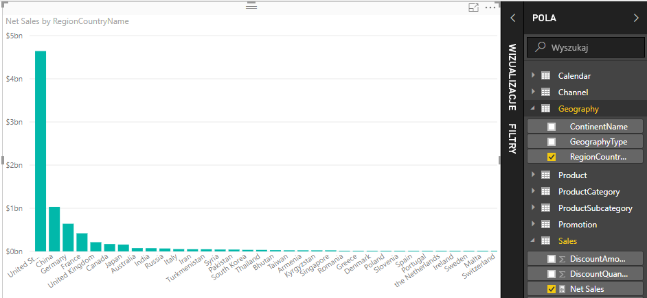

# Samouczek: Tworzenie własnych miar w programie Power BI Desktop
Miary umożliwiają tworzenie jednych z najbardziej zaawansowanych rozwiązań analizy danych w programie Power BI Desktop. Miary pomagają w wykonywaniu obliczeń na danych podczas wchodzenia w interakcje z naszymi raportami. Ten samouczek przeprowadzi Cię przez informacje umożliwiające zrozumienie i utworzenie własnych podstawowych miar w programie Power BI Desktop.

Ten artykuł jest przeznaczony dla użytkowników usługi Power BI, którzy są już zaznajomieni z używaniem programu Power BI Desktop na potrzeby tworzenia bardziej zaawansowanych modeli. Należy zapoznać się z używaniem funkcji Pobierz dane i Edytor zapytań w celu importowania danych, pracą z wieloma powiązanymi tabelami oraz dodawaniem pól do kanwy raportów. Jeśli jesteś nowym użytkownikiem programu Power BI Desktop, zapoznaj się z tematem [Wprowadzenie do programu Power BI Desktop](desktop-getting-started.md).

Aby wykonać kroki opisane w tym samouczku, musisz pobrać plik [Contoso Sales Sample for Power BI Desktop](http://download.microsoft.com/download/4/6/A/46AB5E74-50F6-4761-8EDB-5AE077FD603C/Contoso%20Sales%20Sample%20for%20Power%20BI%20Desktop.zip). Plik zawiera już dane dotyczące sprzedaży internetowej fikcyjnej firmy, Contoso, Inc. Ponieważ dane w pliku zostały zaimportowane z bazy danych, nie będzie można połączyć się ze źródłem danych ani wyświetlić źródła w Edytorze zapytań. Gdy pobierzesz plik na swój komputer, otwórz go w programie Power BI Desktop.

## O co chodzi z tymi miarami?
Miary są najczęściej tworzone automatycznie, np. podczas zaznaczenia pola wyboru obok pola **SalesAmount** w tabeli **Sales** na liście pól lub przeciągnięcia pola **SalesAmount** na kanwę raportu.

Pojawi się nowa wizualizacja wykresu o następującym wyglądzie:

Otrzymujemy wykres kolumnowy przedstawiający łączną sumę wartości sprzedaży z pola SalesAmount.  Nasze pole SalesAmount jest tak naprawdę tylko kolumną o nazwie SalesAmount w zaimportowanej tabeli Sales.

Kolumna SalesAmount zawiera ponad dwa miliony wierszy z wartościami sprzedaży. Możesz się zastanawiać, dlaczego nie jest wyświetlana tabela z wierszami zawierającymi wszystkie te wartości. Program Power BI Desktop wie, że wszystkie te wartości w kolumnie SalesAmount mają liczbowy typ danych, a użytkownik najprawdopodobniej chce je w jakiś sposób agregować — poprzez dodawanie, obliczanie średniej, przeliczanie itp.

Jeśli widzisz pole na liście pól z ikoną sigma , oznacza to, że pole jest liczbowe, a jego wartości można agregować. W takim przypadku po zaznaczeniu pola SalesAmount program Power BI Desktop utworzy własną miarę, obliczy sumę wszystkich kwot sprzedaży i wyświetli ją na wykresie.

Suma jest domyślną metodą agregacji w przypadku zaznaczenia pola z liczbowym typem danych, ale można łatwo zmienić ją na inny rodzaj agregacji.

Jeśli w obszarze **Wartość** klikniemy strzałkę w dół obok pola **SalesAmount**, będziemy mogli wybrać opcję **Średnia**.

Nasza wizualizacja zmieni się na średnią wszystkich wartości sprzedaży w polu SalesAmount.

Możemy zmienić typ agregacji w zależności od żądanych wyników, ale nie wszystkie typy agregacji mają zastosowanie do każdego liczbowego typu danych. W przypadku naszego pola SalesAmount mają sens opcje Suma i Średnia. Możemy również użyć opcji Minimum i Maksimum. Jednak opcja Policz nie będzie miała większego sensu w przypadku pola SalesAmount, ponieważ wszystkie wartości liczbowe opisują tu walutę.

Zrozumienie agregacji jest niezbędne, jeśli chcemy zrozumieć miary, ponieważ każda miara będzie wykonywać agregację określonego typu. Później zobaczymy więcej przykładów użycia agregacji Suma, gdy już utworzysz własne miary.

Wartości obliczane dla miar zawsze zmieniają się w reakcji na nasze interakcje z raportem. Jeśli na przykład przeciągniemy pole **RegionCountryName** z tabeli **Geography** do wykresu, zostaną uśrednione i wyświetlone kwoty sprzedaży dla każdego kraju.

Gdy wynik miary zmienia się ze względu na interakcję z raportem, wpływamy na *kontekst* miary. W rzeczywistości za każdym razem, gdy wchodzisz w interakcję z raportem, zmieniasz kontekst, w którym miara oblicza i wyświetla wyniki.

W większości przypadków usługa Power BI oblicza i zwraca wartości zgodnie z dodanymi polami i wybranymi typami agregacji. Jednak czasami możesz utworzyć własne miary, aby wykonywać bardziej złożone, unikatowe obliczenia.

Przy użyciu programu Power BI Desktop możesz tworzyć własne miary w języku formuł wyrażeń analizy danych (DAX, Data Analysis Expressions). Formuły języka DAX są bardzo podobne do formuł programu Excel. W rzeczywistości język DAX używa wielu takich samych funkcji, operatorów i składni jak formuły programu Excel. Jednak funkcje języka DAX zostały opracowane z myślą o pracy z danymi relacyjnymi i wykonywaniu bardziej dynamicznych obliczeń podczas wchodzenia w interakcję z raportami.

Istnieje ponad 200 funkcji języka DAX, które wykonują wiele operacji od prostych agregacji typu Suma i Średnia po bardziej złożone funkcje statystyczne i filtrowania. Nie będziemy tutaj zbyt szczegółowo omawiać języka DAX, ale istnieje wiele zasobów, dzięki którym możesz uzyskać więcej informacji. Po ukończeniu tego samouczka zapoznaj się z tematem [Podstawy języka DAX w programie Power BI Desktop](desktop-quickstart-learn-dax-basics.md).

Kiedy tworzymy własne miary, są one dodawane do listy Pola dla żądanej tabeli. Jest to tzw. miara *modelowa*, która pozostanie w tabeli w formie pola. Jedną z zalet miar modelowych jest możliwość ich nazywania zgodnie z zapotrzebowaniem, dzięki czemu są łatwiejsze do zidentyfikowania. Ponadto możemy ich używać jako argumentu w innych wyrażeniach DAX, a także bardzo szybko tworzyć miary wykonujące złożone obliczenia.

## Utwórzmy własną miarę
Załóżmy, że chcemy przeanalizować sprzedaż netto. Jeśli przyjrzymy się tabeli Sales na liście pól, zobaczymy, że nie ma pola o nazwie NetSales. Niemniej mamy bloki konstrukcyjne, dzięki którym możemy utworzyć własną miarę do obliczania sprzedaży netto.

Potrzebujemy miary, która będzie odejmować rabaty i zwroty od kwot sprzedaży. Ponieważ chcemy, aby nasza miara obliczała wyniki dla dowolnego kontekstu w naszej wizualizacji, musimy odjąć sumę pól DiscountAmount i ReturnAmount od sumy pola SalesAmount. To rozwiązanie może się wydawać teraz nieco mylące. Nie martw się — za chwilę wszystko będzie bardziej zrozumiałe.

### Sprzedaż netto
1.  Kliknij prawym przyciskiem myszy lub kliknij strzałkę w dół obok tabeli **Sales** na liście pól, a następnie kliknij opcję **Nowa miara**. Dzięki temu upewnimy się, że nowa miara jest zapisana w tabeli Sales, gdzie będzie można ją łatwiej znaleźć.
    
    
    
    > [!TIP]
    > Nową miarę można również utworzyć, klikając przycisk Nowa miara na wstążce na karcie Narzędzia główne programu Power BI Desktop.
    > 
    > 
    > 
    > W przypadku tworzenia miary z poziomu wstążki można ją utworzyć w dowolnej tabeli. Chociaż miara nie musi należeć do konkretnej tabeli, łatwiej będzie ją znaleźć, jeśli zostanie utworzona w najbardziej logicznej tabeli. Jeśli chcesz umieścić ją w konkretnej tabeli, kliknij najpierw tabelę, aby ją uaktywnić. Następnie kliknij przycisk Nowa miara. W tym przypadku utworzymy naszą pierwszą miarę w tabeli Sales.
    > 
    > 
    
    Pasek formuły zostanie wyświetlony wzdłuż górnej krawędzi kanwy raportu. W tym miejscu możesz zmienić nazwę miary i wprowadzić formułę w języku DAX.
    
    
    
    Nadajmy naszej nowej mierze nazwę. Domyślnie nowa miara otrzymuje nazwę Miara. Jeśli nie zmienisz jej nazwy, podczas tworzenia kolejnych miar otrzymają kolejno nazwy Miara 2, Miara 3 itd. Chcemy ułatwić identyfikację naszych miar, więc zmienimy nazwę nowej miary na Net Sales (Sprzedaż netto).
    
2. Wyróżnij pozycję **Miara** na pasku formuły, a następnie wpisz **Net Sales**.
    
    Teraz możemy rozpocząć wprowadzanie formuły.
    
3.  Po znaku równości wpisz **S**. Zobaczysz listę rozwijaną z sugestiami zawierającą wszystkie funkcje DAX zaczynające się od litery S. Im więcej liter wpiszesz, tym dokładniej lista sugestii będzie filtrowana pod kątem funkcji, której potrzebujesz. Wybierz funkcję **SUM**, przewijając w dół, a następnie naciśnij klawisz Enter.
    
    
    
    Po naciśnięciu klawisza Enter zostanie wyświetlony nawias otwierający z kolejną listą sugestii zawierającą wszystkie dostępne kolumny, które możemy przekazać do funkcji SUM.
    
    
    
    Wyrażenie zawsze pojawia się między nawiasem otwierającym i zamykającym. W tym przypadku nasze wyrażenie będzie zawierać jeden argument do przekazania do funkcji SUM — kolumnę do zsumowania. Możemy zawęzić listę kolumn, wprowadzając pierwsze litery nazwy żądanej kolumny. W tym przypadku potrzebujemy kolumny SalesAmount, więc rozpoczniemy od wpisania „salesam” — nasza lista zostanie zawężona i będzie zawierać teraz dwa elementy, które możemy wybrać. W rzeczywistości jest to ta sama kolumna. Jeden z elementów to po prostu [SalesAmount], ponieważ tworzymy miarę w tej samej tabeli, w której znajduje się kolumna SalesAmount. W drugim nazwę kolumny poprzedza nazwa tabeli.
    
    
    
    Ogólnie rzecz biorąc, dobrym rozwiązaniem jest wprowadzenie w pełni kwalifikowanej nazwy kolumny. Dzięki temu formuły będą łatwiejsze do odczytania.
    
4. Wybierz element **Sales[SalesAmount]**, a następnie wpisz nawias zamykający.
    
    > [!TIP]
    > Błędy składniowe są najczęściej powodowane przez brakujące lub błędnie umieszczone nawiasy zamykające.
    > 
    > 
    
    Teraz chcemy odjąć pozostałe dwie kolumny.
    
5.  Po nawiasie zamykającym pierwszego wyrażenia wpisz spację, a następnie operator odejmowania (**-**) oraz kolejną spację. Następnie wprowadź kolejną funkcję SUM z kolumną **Sales[DiscountAmount]** w formie argumentu.
    
    
    
    Zaczyna nam brakować miejsca na wprowadzanie formuły. Żaden problem.
    
6.  Kliknij strzałkę w dół po prawej stronie paska formuły.
    
    
    
    Teraz mamy więcej miejsca. Możemy wprowadzić nowe części formuły w nowym wierszu, naciskając klawisze Alt+Enter. Ponadto możemy przenosić elementy przy użyciu klawisza Tab.
    
    
    
    Teraz możemy dodać ostatnią część naszej formuły.
    
7.  Dodaj kolejny operator odejmowania oraz kolejną funkcję SUM z kolumną **Sales[ReturnAmount]** w formie argumentu.
    
    
    
    Nasza formuła wygląda na gotową.

8.  Naciśnij klawisz Enter lub kliknij znacznik wyboru na pasku formuły, aby zakończyć. Formuła zostanie zatwierdzona i dodana do listy pól w tabeli Sales.

### Dodajmy nową miarę do raportu
Teraz możemy dodać miarę Net Sales do kanwy raportu. Sprzedaż netto będzie obliczana dla innych pól, które dodamy do raportu. Przyjrzyjmy się sprzedaży netto według kraju.

1.  Przeciągnij miarę **Net Sales** z tabeli **Sales** na kanwę raportu.
    
2. Teraz przeciągnij pole **RegionCountryName** z tabeli **Geography** na wykres.
    
    
    
    Dodajmy więcej danych.
    
3.  Przeciągnij pole **SalesAmount** na wykres, aby zobaczyć różnicę między sprzedażą netto i kwotą sprzedaży.
    
    Teraz mamy dwie miary na naszym wykresie. Miarę SalesAmount, która została zsumowana automatycznie, oraz miarę Net Sales, którą utworzyliśmy. W obu przypadkach wyniki były obliczane w kontekście innego pola znajdującego się na wykresie — pola RegionCountryName.
    
    
    
    Dodajmy fragmentator, aby jeszcze bardziej szczegółowo podzielić sprzedaż netto i kwoty sprzedaży według roku kalendarzowego.
    
4.  Kliknij pusty obszar obok wykresu, a następnie w pozycji **Wizualizacje** kliknij opcję Wizualizacja tabeli.
    
    
    
    Spowoduje to utworzenie pustej wizualizacji tabeli na kanwie raportu.
    
    
    
5.  Przeciągnij pole **Year** z tabeli **Calendar** do nowej pustej tabeli.
    
    
    
    Ponieważ Year to pole liczbowe, program Power BI Desktop zsumował jego wartości i wyświetlił wykres. Jednak w takiej postaci nie można użyć pola jako fragmentatora.
    
6. W obszarze **Wartości** kliknij strzałkę w dół obok pola **Year**, a następnie kliknij polecenie **Nie sumuj**.
    
    
    
    Teraz możemy zmienić pole Year w wizualizacji tabeli na fragmentator.

    7.  W obszarze **Wizualizacje** kliknij wizualizację **Fragmentator**.

    
    
    Teraz pole Year jest przedstawiane jako fragmentator. Możemy wybierać poszczególne lata lub grupy lat, a nasze wizualizacje raportu zostaną odpowiednio podzielone.
    
8. Kliknij rok **2013**. Zobaczysz, że wykres uległ zmianie. Nasze miary Net Sales i SalesAmount są ponownie obliczane, aby wyświetlić nowe wyniki tylko dla roku 2013. W tym miejscu znów zmieniliśmy kontekst, w którym nasze miary obliczają i wyświetlają wyniki.
    
    

## Utwórzmy kolejną miarę
Teraz już wiesz, jak tworzyć własne miary. Utwórz kolejną.

### Sprzedaż netto na jednostkę
Co zrobić, jeśli chcemy zobaczyć, które produkty odnotowują najwyższą sprzedaż na jednostkę?

Możemy utworzyć kolejną miarę. W tym przypadku chcemy podzielić sprzedaż netto przez liczbę sprzedanych jednostek. Czyli chcemy podzielić wyniki miary Net Sales przez sumę kolumny Sales[SalesQuantity].

1.  Utwórz nową miarę o nazwie **Net Sales per Unit** (Sprzedaż netto na jednostkę) w tabeli Sales lub Products.
    
    W tej mierze użyjemy miary Net Sales utworzonej wcześniej. Przy użyciu języka DAX możemy przywołać inne miary w naszej formule.
    
2.  Rozpocznij wpisywanie nazwy **Net Sales**. Lista sugestii będzie wyświetlać elementy, które możemy dodać. Wybierz opcję **[Net Sales]**.
    
    
    
    Możesz też przywołać inną miarę, wpisując otwierający nawias kwadratowy (**[**). Lista sugestii pokaże nam tylko te miary, które możemy dodać do naszej formuły.
    
    
    
3.  Tuż po pozycji **[Net Sales]** wpisz spację, a następnie operator dzielenia (**/**), funkcję SUM oraz słowo **Quantity**. Lista sugestii wyświetli wszystkie kolumny, które zawierają słowo Quantity w nazwie. Wybierz kolumnę **Sales[SalesQuantity]**. Formuła powinna teraz wyglądać następująco:
    
    > **Net Sales per Unit = [Net Sales] / SUM(Sales[SalesQuantity])**
    > 
    > 
    
    Wygląda dobrze. Wprowadzanie formuł DAX jest naprawdę proste w przypadku stosowania funkcji wyszukiwania i sugestii edytora DAX. Teraz zobaczmy wyniki uzyskane przy użyciu nowej miary do wyświetlania sprzedaży netto na jednostkę.
    
4. Przeciągnij miarę **Net Sales per Unit** do pustego obszaru na kanwie raportu.
    
    
    
    Wyniki nie są zbyt interesujące? Nie martw się.
    
5.  Zmień typ wizualizacji wykresu na **Mapa drzewa**.
    
    
    
6. Teraz przeciągnij pole **ProductCategory** z tabeli **ProductCategory** do obszaru **Grupa**.
    
    
    
    Zapewnia to przydatne informacje, ale co zrobić, jeśli chcemy sprawdzić sprzedaż netto według produktu?
    
7. Usuń pole **ProductCategory**, a następnie przeciągnij pole **ProductName** z tabeli **Product** do obszaru **Grupa** zamiast tego pola. 
    
    
    
    Owszem, to tylko zabawa. Ale musisz przyznać, że jest to całkiem interesujące! Oczywiście możemy odfiltrować tę mapę drzewa w dowolny sposób, ale wykracza to poza zakres tego samouczka.

## Poznane informacje
Miary zapewniają zaawansowane metody uzyskiwania szczegółowego wglądu w dane. Dowiedzieliśmy się, jak tworzyć miary przy użyciu paska formuły. Możemy nazywać miary w dowolny, sensowny sposób, a lista sugestii ułatwia znajdowanie i wyświetlanie odpowiednich elementów do dodania do formuł. Wprowadziliśmy również pojęcie kontekstu, w którym wyniki obliczeń w miarach zmieniają się z uwzględnieniem innych pól lub innych wyrażeń w formule miary.

## Następne kroki
Jeśli chcesz poznać więcej szczegółowych informacji na temat formuł języka DAX i utworzyć bardziej zaawansowane miary, zobacz [Podstawy języka DAX w programie Power BI Desktop](desktop-quickstart-learn-dax-basics.md). Ten artykuł skupia się na podstawowych pojęciach dotyczących języka DAX, np. składni, funkcjach i dokładniejszym rozumieniu kontekstu.

Pamiętaj, aby dodać [dokumentację języka Data Analysis Expressions (DAX)](https://msdn.microsoft.com/library/gg413422.aspx) do ulubionych. W tym miejscu znajdziesz szczegółowe informacje dotyczące składni, operatorów i ponad 200 funkcji języka DAX.

