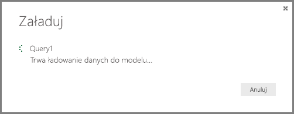

# Samouczek: analiza serwisu Facebook przy użyciu programu Power BI Desktop
Z tego samouczka dowiesz się, jak importować i wizualizować dane z serwisu **Facebook**. Dowiesz się, jak nawiązywać połączenie z określoną stroną serwisu Facebook (stroną usługi Power BI), stosować kroki przekształcania danych i tworzyć wizualizacje.

Oto lista czynności, które wykonasz:

* **Zadanie 1.** Nawiązywanie połączenia ze stroną w serwisie Facebook
* **Zadanie 2.** Tworzenie wizualizacji przy użyciu widoku raportu
  
  * **Krok 1.** Tworzenie wizualizacji mapy drzewa
* **Zadanie 3.** Kształtowanie danych w widoku zapytań
  
  * **Krok 1.** Dzielenie kolumny daty i godziny na dwie kolumny
  * **Krok 2.** Dodawanie wartości zagregowanej z powiązanej tabeli
* **Zadanie 4.** Tworzenie dodatkowych wizualizacji przy użyciu widoku raportu
  
  * **Krok 1.** Ładowanie zapytania do raportu
  * **Krok 2.** Tworzenie wykresu liniowego i wykresu słupkowego

## **Zadanie 1. Nawiązywanie połączenia ze stroną w serwisie Facebook**
W ramach tego zadania zaimportujesz dane ze strony [usługi Microsoft Power BI w serwisie Facebook](https://www.facebook.com/microsoftbi) (adres URL: *https://www.facebook.com/microsoftbi)*.

Każdy może nawiązać połączenie z tą stroną i wykonać poniższe czynności — nie są wymagane żadne szczególne poświadczenia z wyjątkiem własnego konta w serwisie Facebook, które będzie używane w tym kroku.

1. W oknie dialogowym **Wprowadzenie** lub na karcie wstążki **Narzędzia główne** wybierz pozycję **Pobierz dane**.
2. Zostanie wyświetlone okno dialogowe **Pobieranie danych**, umożliwiające wybór różnych źródeł danych. Wybierz pozycję **Facebook** z grupy **Inne**.
   
   
   
   Po wybraniu pozycji **Połącz** zostanie wyświetlone okno dialogowe informujące o ryzyku związanym z korzystaniem z usług innych firm.
   
   
3. Po wybraniu pozycji **Kontynuuj** zostanie wyświetlone okno dialogowe, w którym możesz wkleić nazwę strony (**microsoftbi**) w polu tekstowym **Nazwa użytkownika**. Wybierz pozycję **Ogłoszenia** z listy rozwijanej **Połączenie**.
   
   
4. Kliknij przycisk **OK**.
5. Po wyświetleniu monitu o wprowadzenie poświadczeń zaloguj się przy użyciu swojego konta w serwisie Facebook i zezwól usłudze Power BI na dostęp za pośrednictwem Twojego konta.
   
   

Po nawiązaniu połączenia ze stroną zobaczysz, że dane są ładowane do modelu. 

Następnie dane zostaną wyświetlone w **Edytorze zapytań**. **Edytor zapytań** jest częścią programu Power BI Desktop, ale jest ładowany w oddzielnym oknie, w którym możesz wykonywać wszystkie przekształcenia połączonych danych.

Gdy dane będą już miały formę zgodną z oczekiwaniami, możesz załadować je do programu Power BI Desktop. Wybierz pozycję **Załaduj i zamknij** na karcie wstążki **Narzędzia główne**.

Zobaczysz okno dialogowe z wyświetlonym postępem ładowania danych do modelu danych programu Power BI Desktop.

Po załadowaniu danych zostanie otwarty widok **raportu**, w którym po prawej stronie znajduje się lista **pól** zawierająca kolumny z tabeli.

## **Zadanie 2. Tworzenie wizualizacji przy użyciu widoku raportu**
Po załadowaniu danych ze strony możesz szybko i łatwo analizować je przy użyciu wizualizacji.

**Krok 1.** Tworzenie wizualizacji mapy drzewa

Tworzenie wizualizacji jest łatwe — wystarczy przeciągnąć pole z **listy pól** i upuścić je na **kanwę raportu**.

Przeciągnij pole **Typ** na **kanwę raportu**. Program Power BI Desktop utworzy nową wizualizację na **kanwie raportu**. Następnie przeciągnij pole **Typ** z **listy pól** (to samo, które zostało przeciągnięte na **kanwę raportu**) do obszaru **Wartość**, aby utworzyć wizualizację **słupkową**.

Typ wizualizacji można łatwo zmienić, wybierając inną ikonę w okienku **Wizualizacje**. Zmień typ wizualizacji na typ **Mapa drzewa**, wybierając odpowiednią ikonę z okienka **Wizualizacje**, jak pokazano na poniższej ilustracji.

Następnie dodamy legendę i zmienimy kolor punktu danych. Wybierz ikonę **Formatowanie** w okienku **Wizualizacje** — ikona **Formatowanie** wygląda jak pędzel.

Po wybraniu strzałki w dół obok pozycji **Legenda** zostanie rozwinięta sekcja z wyświetlonymi możliwościami dostosowania legendy wybranej wizualizacji. W tym przypadku wybrano następujące opcje:

* Przesunięto suwak **Legenda** do pozycji **Włączone**, aby wyświetlić legendę.
* Wybrano opcję **Z prawej** na liście rozwijanej **Pozycja legendy**.
* Przesunięto suwak **Tytuł** do pozycji **Włączone**, aby wyświetlić tytuł legendy.
* Wpisano **Typ** jako tytuł legendy.

Na poniższej ilustracji te ustawienia zostały już skonfigurowane i odzwierciedlone na wizualizacji.

Teraz zmienimy kolor jednego z punktów danych. Punkt danych Link powinien być niebieski, ponieważ jest to kolor najczęściej używany dla hiperlinków.

Wybierz strzałkę obok pozycji **Kolory danych**, aby rozwinąć tę sekcję. Zostaną wyświetlone punkty danych oraz strzałki wyboru obok kolorów, umożliwiające wybór innego koloru dla każdego punktu danych.

Po kliknięciu strzałki w dół w polu koloru obok dowolnego punktu danych zostanie wyświetlone okno dialogowe umożliwiające wybór koloru. W tym przypadku wybierzemy jasnoniebieski.

Od razu lepiej. Na poniższej ilustracji widać, że kolor został zastosowany do punktu danych na wizualizacji, a legenda została automatycznie zaktualizowana odpowiednio do koloru w sekcji **Kolory danych**.

## **Zadanie 3. Kształtowanie danych w tabeli**
Po zaimportowaniu wybranej tabeli i utworzeniu wstępnej wizualizacji możesz stwierdzić, że należy wykonać różne czynności związane z kształtowaniem i oczyszczaniem danych, aby w pełni wykorzystać wartość danych.

**Krok 1.** Dzielenie kolumny daty i godziny na dwie kolumny

W tym kroku podzielisz kolumnę **created\_time** (Czas utworzenia) w celu uzyskania wartości daty i godziny. Zawsze, gdy chcesz zmodyfikować istniejące zapytanie w programie Power BI Desktop, należy uruchomić **Edytor zapytań**. W tym celu wybierz pozycję **Edytuj zapytania** na karcie **Narzędzia główne**.

1. W tabeli **Edytora zapytań** przewijaj w prawo, aż znajdziesz kolumnę **created\_time**.
2. Kliknij prawym przyciskiem myszy nagłówek kolumny w tabeli **Podgląd zapytań**, a następnie kliknij kolejno pozycje **Podziel kolumny \> Według ogranicznika**, aby podzielić kolumnę. Wybierz pozycję **Niestandardowy** na liście ograniczników i wprowadź wartość **„T”**. Zwróć uwagę na to, że ta operacja jest także dostępna na karcie wstążki **Narzędzia główne** w grupie **Zarządzanie kolumnami**.
   
   
   
   
3. Zmień nazwy utworzonych kolumn odpowiednio na **created\_date** (Data utworzenia) i **created\_time** (Godzina utworzenia).
4. Zaznacz nową kolumnę, **created\_time**, **** a następnie na wstążce **widoku zapytania** przejdź do karty **Dodaj kolumnę** i wybierz kolejno pozycje **Godzina\>Godzina** w grupie **Z daty i godziny**. To spowoduje dodanie nowej kolumny, zawierającej tylko element godziny z wartości czasowej.
   
   
5. Zmień typ nowej kolumny **Godzina** na typ **Liczba całkowita**. W tym celu przejdź do karty **Narzędzia główne** i wybierz listę rozwijaną **Typ danych** lub kliknij prawym przyciskiem myszy tę kolumnę i wybierz kolejno pozycje **Przekształć\>Liczba całkowita**.
   
   

**Krok 2.** Dodawanie wartości zagregowanej z powiązanej tabeli

W tym kroku dodasz liczbę udostępnień z wartości zagnieżdżonej, aby móc używać jej w wizualizacjach.

1. Przewijaj w prawo aż do kolumny **shares** (Udostępnienia). Zagnieżdżona wartość oznacza, że musimy wykonać kolejne przekształcenie, aby uzyskać wartości rzeczywiste.
2. Wybierz ikonę  w prawym górnym rogu nagłówka kolumny, aby otworzyć konstruktora **Rozwijanie/agregowanie**. Zaznacz pozycję **count** (Liczba) i kliknij przycisk **OK**. To spowoduje dodanie liczby udostępnień do każdego wiersza tabeli.
   
   
   
   Po załadowaniu danych zmień nazwę kolumny na **shares** (Udostępnienia). W tym celu kliknij dwukrotnie nazwę kolumny, kliknij kolumnę prawym przyciskiem myszy lub na wstążce **widoku zapytania** wybierz polecenie **Zmień nazwę** na karcie **Przekształć** w grupie **Dowolna kolumna**.
3. Na koniec zmień typ nowej kolumny **shares** na **Liczba całkowita**. Po zaznaczeniu kolumny możesz zmienić jej typ, klikając ją prawym przyciskiem myszy i wybierając kolejno pozycje **Przekształć\>Liczba całkowita** lub **** przechodząc do karty **Narzędzia główne** i wybierając listę rozwijaną **Typ danych**.

### Tworzone kroki zapytania
W miarę wykonywania przekształceń w widoku zapytania tworzone są kroki zapytania, wyświetlane w formie listy **ZASTOSOWANE KROKI** w okienku **Ustawienia zapytania**. Każdy krok zapytania ma odpowiadającą mu formułę zapytania, określaną także jako formuła języka „M”.

| Zadanie | Krok zapytania | Formuła |
| --- | --- | --- |
| Łączenie ze źródłem danych w serwisie Facebook |Źródło |Facebook.Graph  (&quot;https://graph.facebook.com/microsoftbi/posts&quot;) |
| **Dzielenie kolumn** w celu uzyskania odpowiednich wartości |Podzielono kolumnę według ogranicznika |Table.SplitColumn  (Źródło,&quot;created_time&quot;,Splitter.SplitTextByDelimiter(&quot;T&quot;),{&quot;created_time.1&quot;, &quot;created_time.2&quot;}) |
| **Zmiana typu** nowych kolumn (krok automatyczny) |Zmieniono typ |Table.TransformColumnTypes  (#&quot;Podzielono kolumnę według ogranicznika&quot;,{{&quot;created_time.1&quot;, type date}, {&quot;created_time.2&quot;, type time}}) |
| **Zmiana nazwy **kolumny**** |Zmieniono nazwy kolumn |Table.RenameColumns  (#&quot;Zmieniono typ&quot;,{{&quot;created_time.1&quot;, &quot;created_date&quot;}, {&quot;created_time.2&quot;, &quot;created_time&quot;}}) |
| **Wstawianie **kolumny**** |Wstawiono godzinę |Table.AddColumn  (#&quot;Zmieniono nazwy kolumn&quot;, &quot;Hour&quot;, each Time.Hour([created_time]), type number) |
| **Zmiana typu** |Zmieniono typ1 |Table.TransformColumnTypes  (#&quot;Wstawiono godzinę&quot;,{{&quot;Hour&quot;, type text}}) |
| **Rozwijanie **wartości w zagnieżdżonej tabeli**** |Rozwinięto element shares |Table.ExpandRecordColumn  (#&quot;Zmieniono typ1&quot;, &quot;shares&quot;, {&quot;count&quot;}, {&quot;shares.count&quot;}) |
| **Zmiana nazwy **kolumny**** |Zmieniono nazwy kolumn1 |Table.RenameColumns  (#&quot; Rozwinięto element shares&quot;,{{&quot;shares.count&quot;, &quot;shares&quot;}}) |
| **Zmiana typu** |Zmieniono typ2 |Table.TransformColumnTypes  (#&quot;Zmieniono nazwy kolumn1&quot;,{{&quot;shares&quot;, Int64.Type}}) |

## **Zadanie 4. Tworzenie dodatkowych wizualizacji przy użyciu widoku raportu**
Nadaliśmy danym kształt, którego potrzebujemy do dalszej części analizy, a teraz możemy załadować tabelę wynikową do naszego raportu i utworzyć dodatkowe wizualizacje.

**Krok 1.** Ładowanie zapytania do raportu

Aby załadować wyniki zapytania do raportu, wybierz polecenie **Załaduj i zamknij** w **Edytorze zapytań**. To spowoduje załadowanie wprowadzonych zmian do programu Power BI Desktop i zamknięcie **Edytora zapytań**.

W programie Power BI Desktop upewnij się, że jest otwarty **widok raportu**. Wybierz górną ikonę na pasku po lewej stronie programu Power BI Desktop.

**Krok 2.** Tworzenie wykresu liniowego i wykresu słupkowego

Aby utworzyć wizualizację, można przeciągnąć pola z **listy pól** i upuścić je na **kanwie raportu**.

1. Przeciągnij pole **shares** na **kanwę raportu**, aby utworzyć wykres słupkowy. Następnie przeciągnij pole created\_date na wykres, a program Power BI Desktop zmieni wizualizację na **Wykres liniowy**.
   
   
2. Następnie przeciągnij pole **shares** i upuść je na **kanwie raportu**. Przeciągnij pole **Godzina** do sekcji **Oś** na **liście pól**.
   
   
3. Typ wizualizacji można łatwo zmienić, klikając inną ikonę w okienku **Wizualizacja**. Strzałka na poniższej ilustracji wskazuje ikonę **wykresu słupkowego**.
   
   
4. Zmień typ wizualizacji na **Wykres słupkowy**.
5. **Wykres słupkowy** został utworzony, ale oś wymaga zmian — chcemy, aby wartości były sortowane odwrotnie (od najwyższych do najniższych). Wybierz strzałkę w dół obok pozycji **Oś Y**, aby rozwinąć tę sekcję. Zmień typ osi z typu **Ciągłe** na **Podzielone na kategorie**, aby dostosować sortowanie (poniższa ilustracja przedstawia oś przed wybraniem tej opcji — na kolejnej ilustracji zobaczysz oczekiwany efekt).

Od razu lepiej. Na stronie znajdują się teraz trzy wizualizacje, których rozmiar można zmienić, aby wypełnić stronę raportu.

Jak widać, wizualizacje w raporcie można bardzo łatwo dostosowywać, aby przedstawić dane w odpowiedni sposób. Program Power BI Desktop zapewnia kompleksowy zbiór funkcji przeznaczonych do pobierania danych z różnorodnych źródeł danych i kształtowania ich odpowiednio do potrzeb analizy w celu zaprezentowania tych danych w interaktywnych, zaawansowanych wizualizacjach. Gdy raport jest gotowy, można [przekazać go do usługi Power BI](desktop-upload-desktop-files.md) i tworzyć na jego podstawie pulpity nawigacyjne, które następnie można udostępniać innym użytkownikom usługi Power BI.

Możesz pobrać końcowy efekt pracy z tym samouczkiem [tutaj](http://download.microsoft.com/download/1/4/E/14EDED28-6C58-4055-A65C-23B4DA81C4DE/FacebookAnalytics.pbix).

### Gdzie znajdę więcej informacji?
* [Zapoznaj się z innymi samouczkami dotyczącymi programu Power BI Desktop](http://go.microsoft.com/fwlink/?LinkID=521937)
* [Obejrzyj filmy wideo dotyczące programu Power BI Desktop](http://go.microsoft.com/fwlink/?LinkID=519322)
* [Odwiedź forum usługi Power BI](http://go.microsoft.com/fwlink/?LinkID=519326)
* [Przeczytaj blog poświęcony usłudze Power BI](http://go.microsoft.com/fwlink/?LinkID=519327)

