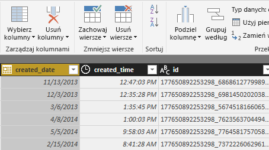
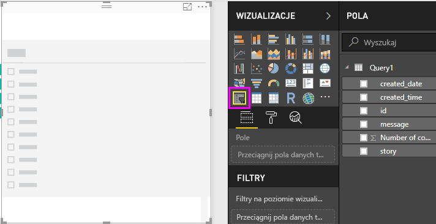

# Samouczek: analiza serwisu Facebook przy użyciu programu Power BI Desktop

Z tego samouczka dowiesz się, jak można zaimportować dane z usługi Facebook i użyć ich w programie Power BI Desktop. Nawiążesz połączenie ze stroną usługi Power BI w serwisie Facebook i zaimportujesz z niej dane, zastosujesz przekształcenia do zaimportowanych danych i skorzystasz z danych w wizualizacjach raportów.

## Nawiązywanie połączenia ze stroną w serwisie Facebook

W tym samouczku używane są dane ze [strony usługi Microsoft Power BI w serwisie Facebook](https://www.facebook.com/microsoftbi) (*https://www.facebook.com/microsoftbi*). Aby połączyć się z tą stroną i zaimportować z niej dane, nie potrzebujesz żadnych specjalnych poświadczeń — z wyjątkiem dotyczących konta osobistego usługi Facebook.

1. Otwórz program Power BI Desktop i wybierz opcję **Pobierz dane** w oknie dialogowym **Wprowadzenie** lub na karcie **Narzędzia główne** na wstążce, wybierz opcję **Pobierz dane**, a następnie wybierz opcję **Więcej...**.
   
2. W oknie dialogowym **Pobierz dane** wybierz opcję **Facebook** z grupy **Usługi online**, a następnie wybierz opcję **Połącz**.
   
   
   
   Zostanie wyświetlone okno dialogowe informujące o ryzyku związanym z korzystaniem z usług innych firm.
   
   
   
3. Wybierz opcję **Kontynuuj**. Zostanie wyświetlone okno dialogowe **Facebook**.
   
4. Wpisz lub wklej nazwę strony **microsoftbi** do pola tekstowego **Nazwa użytkownika**, wybierz opcję **Wpisy** z listy rozwijanej **Połączenie**, a następnie Wybierz opcję **OK**.
   
   
   
5. Po wyświetleniu monitu o wprowadzenie poświadczeń zaloguj się na swoje konto w serwisie Facebook i zezwól usłudze Power BI na dostęp za pośrednictwem Twojego konta.
   
   

   Po połączeniu się ze stroną usługi Power BI w serwisie Facebook widoczny jest podgląd danych **Wpisy** strony. 
   
   
   
## Kształtowanie i przekształcanie zaimportowanych danych

Chcesz zobaczyć i pokazać, które wpisy mają najwięcej komentarzy w czasie, ale zwracasz uwagę, że w podglądzie danych **Wpisy** dane **created_time** są trudne do odczytania i zinterpretowania i w ogóle nie ma żadnych komentarzy. Trzeba wykonać pewne działania związane z kształtowaniem i oczyszczeniem danych, aby jak najwięcej z nich odczytać. Aby dokonać edycji danych przed zaimportowaniem ich do programu Power BI Desktop lub po ich zaimportowaniu, możesz skorzystać z **Edytora Power Query** programu Power BI Desktop. 

### Dzielenie kolumny z datą i godziną

Najpierw należy rozdzielić wartości daty i godziny w kolumnie **created_time** kolumny, aby były bardziej czytelne. 

1. W podglądzie danych serwisu Facebook wybierz opcję **Edytuj**. 
   
   
   
   **Edytor Power Query** programu Power BI Desktop otwiera nowe okno i wyświetla podgląd danych ze strony usługi Power BI w serwisie Facebook. 
   
   
   
2. Wybierz kolumnę **created_time**. Zwróć uwagę, że obecnie ma ona tekstowy typ danych, co jest oznaczone przez ikonę **ABC**, znajdującą się w nagłówku kolumny. Kliknij prawym przyciskiem myszy na nagłówku i na liście rozwijanej wybierz opcję **Podziel kolumnę > Według ogranicznika** lub w obszarze **Przekształcenie** na karcie Narzędzia główne wstążki wybierz opcję **Podziel kolumnę > Według ogranicznika**.  
   
   
   
3. W oknie dialogowym **Podział kolumny według ogranicznika** z listy rozwijanej wybierz opcję **Niestandardowy**, w danych wejściowych pola wprowadź **T** (znak, który rozpoczyna składnik godziny w wartościach created_time) i wybierz opcję **OK**. 
   
   
   
   Kolumna dzieli się na dwie kolumny zawierające ciągi występujące przed ogranicznikiem **T** i po nim o nazwach odpowiednio **created_time.1** i **created_time.2**. Zauważ, że usługa Power BI automatycznie wykryła i zmieniła typy danych na **Data** dla pierwszej kolumny i **Godzina** dla drugiej kolumny, a także wprowadziła formatowanie wartości daty i godziny, co zwiększyło ich czytelność.
   
4. Zmień nazwy kolumn, dwukrotnie klikając nagłówek każdej kolumny lub zaznaczając każdą z kolumn, a następnie wybierając opcję **Zmień nazwę** w grupie **Wszystkie kolumny** na karcie **Przekształć** wstążki i wpisując odpowiednio nowe nagłówki kolumn **created_date** i **created_time**.
   
   
   
### Rozszerzenie zagnieżdżonych kolumn

Teraz, gdy dane daty i godziny wyglądają już w wymagany sposób, udostępnisz komentarze poprzez rozwinięcie zagnieżdżonej kolumny. 

1. Wybierz kolumnę **object_link**, a następnie wybierz ikonę , aby otworzyć okno dialogowe **Rozwijanie/Agregacja**. Wybierz pozycję **połączenia**, a następnie wybierz opcję **OK**. 
   
   
   
   Nagłówek kolumny zmieni się na **object_link.connections**.
2. Ponownie wybierz ikonę , znajdującą się na górze kolumny **object_link.connections**, wybierz opcję **komentarze**, a następnie wybierz opcję **OK**. Nagłówek kolumny zmieni się na **object_link.connections.comments**.
   
3. Wybierz ikonę , znajdującą się na górze kolumny **object_link.connections.comments**, ale tym razem w oknie dialogowym wybierz pozycję **Agreguj** zamiast Rozwiń. Wybierz pozycję **Liczba identyfikatorów**, a następnie wybierz opcję **OK**. 
   
   
   
   Obecnie w kolumnie wyświetlana jest liczba komentarzy dla każdego komunikatu. 
   
4. Zmień nazwę kolumny **Count of object_link.connections.comments.id** na **Liczba komentarzy**.
   
5. Wybierz strzałkę w dół obok nagłówka kolumny **Liczba komentarzy** i wybierz opcję **Sortuj malejąco**, aby wyświetlić wpisy posortowane od najczęściej do najrzadziej komentowanych. 
   
   
   
### Przejrzenie kroków zapytania

Ponieważ dane zostały przekształcone w **Edytorze Power Query**, każdy krok został zarejestrowany w obszarze **Zastosowane kroki** okienka **Ustawienia zapytania**, znajdującego się po prawej stronie okna Edytora Power Query. Można przejrzeć wstecz Zastosowane kroki, aby zobaczyć, jakie dokładnie zmiany wprowadzono, a następnie w razie potrzeby je edytować, usunąć lub zmienić (chociaż może to być ryzykowne, ponieważ zmiana wcześniejszych kroków może zaszkodzić efektom późniejszych). 

Po zastosowaniu wszystkich wykonanych do tej pory operacji przekształcania danych Twój zestaw Zastosowane kroki powinien wyglądać następująco:
   
   
   
   >[!TIP]
   >Zastosowane kroki są formułami zapisanymi w **języku Power Query**, znanym również jako język **M**. Aby wyświetlić i edytować formuły, wybierz opcję **Edytor zaawansowany** w grupie **Zapytanie** na karcie Narzędzia główne na wstążce. 

### Importowanie przekształconych danych

Jeśli dane Ci odpowiadają, zaimportuj je do programu Power BI Desktop, wybierając opcję **Zamknij i zastosuj** > **Zamknij i zastosuj** na karcie Narzędzia główne na wstążce. 
   
   
   
   Zostanie wyświetlone okno dialogowe pokazujące postęp ładowania danych do modelu danych programu Power BI Desktop. 
   
   
   
   Po załadowaniu danych zostaną one wyświetlone w widoku raportu jako nowe zapytanie na liście Pola.
   
   
   
## Korzystanie z danych w wizualizacjach raportów 

Po załadowaniu danych ze strony serwisu Facebook możesz szybko i łatwo je analizować przy użyciu wizualizacji. Tworzenie wizualizacji jest łatwe. Po prostu zaznacz pole lub przeciągnij je z listy **Pola** na kanwę raportów.

### Utworzenie wykresu słupkowego

1. W widoku raportu w programie Power BI Desktop z listy pól wybierz pole **komunikat** lub przeciągnij je na kanwę. Na kanwie zostanie wyświetlona tabela przedstawiająca wszystkie komunikaty z wpisów. 
   
   
   
2. Po wybraniu tej tabeli z listy Pola wybierz również pole **Liczba komentarzy** lub przeciągnij je do tabeli. 
   
3. Wybierz ikonę **Skumulowany wykres słupkowy** w okienku Wizualizacje. W miejsce tabeli pojawi się wykres słupkowy przedstawiający liczbę komentarzy na wpis. 
   
   
   
4. W prawym górnym rogu wizualizacji wybierz wielokropek (...), a następnie wybierz opcję **Sortuj według liczby komentarzy**, aby posortować tabelę według malejącej liczbę komentarzy. 
   
   
   
5. Zwróć uwagę, że największa liczba komentarzy jest skojarzona z komunikatami **Puste** (te wpisy mogą zawierać wątki, łącza, filmy wideo lub inną zawartość nietekstową). Aby odfiltrować pusty wiersz, w obszarze **Filtry** u dołu okienka Wizualizacje wybierz opcję **komunikat (wszystkie)**, zaznacz pole wyboru **Zaznacz wszystkie**, a następnie wybierz pozycję **Puste**, aby usunąć jej zaznaczenie. Wpis w obszarze Filtry zmienia się na **komunikat nie jest (Pusty)**, a z wizualizacji wykresu zniknie pusty wiersz. 
   
   
   
### Formatowanie wykresu

Wizualizacja staje się bardziej interesująca, ale większe części tekstowych treści wpisów nie są widoczne na wykresie. Aby wyświetlić więcej tekstowej treści wpisu:

1. Za pomocą uchwytów na wizualizacji wykresu zmień rozmiar wykresu na możliwie jak największy. 
   
2. Po wybraniu wykresu w okienku Wizualizacje wybierz **ikonę Formatuj** (wałek malarski).
   
3. Wybierz strzałkę w dół znajdującą się obok **osi Y** i przesuń suwak obok pozycji **Rozmiar maksymalny** całkiem do prawej strony (50%). 
4. Zmniejsz również **Rozmiar tekstu** do wartości **10**, aby można było zmieścić więcej tekstu.
   
   
   
   Wykres zawiera teraz więcej treści wpisów. 
   
   
   
Na osi X (liczba komentarzy) wykresu nie są wyświetlane dokładne wartości, przez co wydaje się, że na wykresie brakuje osi X. Aby zmienić te sytuację, możesz użyć etykiet danych. 

1. Wybierz ikonę Formatuj, a następnie wybierz suwak obok **osi X**, aby go **wyłączyć**. 
   
2. Wybierz suwak obok pozycji **Etykiety danych**, aby go **włączyć**. Teraz wykres zawiera dokładną liczbę komentarzy dla każdego wpisu.
   
   
   
### Edytowanie typu danych

Tak jest lepiej, ale wszystkie etykiety danych mają rozwinięcie dziesiętne w postaci **.0**, co rozprasza uwagę i może być mylące, ponieważ **Liczba wpisów** musi być liczbą całkowitą. Należy zmienić typ danych kolumny **Liczba wpisów** na Liczba całkowita.

1. Aby dokonać edycji typu danych, na liście Pola kliknij prawym przyciskiem myszy pozycję **Zapytanie1** lub przesuń nad nią kursor myszy i wybierz wielokropek **Więcej opcji** (...), a następnie wybierz opcję **Edytuj zapytanie**. Możesz również wybrać opcję **Edytuj zapytania** w obszarze **Dane zewnętrzne** obszaru na karcie Narzędzia główne wstążki, a następnie z listy rozwijanej wybrać opcję **Edytuj zapytania**. **Edytor Power Query** programu Power BI Desktop zostanie otwarty w osobnym oknie.
   
        
   
2. W Edytorze Power Query wybierz kolumnę **Liczba komentarzy** i zmień typ danych na **Liczba całkowita** za pomocą jednej z poniższych metod: 
   - Wybierając ikonę **1.2** położoną obok nagłówka kolumny **Liczba komentarzy**, a następnie wybierając z listy rozwijanej opcję **Liczba całkowita** lub
   - Klikając prawym przyciskiem myszy nagłówek kolumny i wybierając pozycję **Zmień typ > Liczba całkowita** lub
   - Wybierając opcję **Typ danych: Liczba dziesiętna** w grupie **Przekształć** na karcie Narzędzia główne lub w grupie **Wszystkie kolumny** na karcie **Przekształć** i wybierając opcję **Liczba całkowita**.
   
   Ikona w nagłówku kolumny zmienia się na **123**, określający typ danych Liczba całkowita.
   
   
   
3. Wybierz opcję **Zamknij i zastosuj** lub po prostu **Zastosuj**, aby zmiany zostały wprowadzone przy pozostawieniu otwartego okna Edytora Power Query. Po wprowadzeniu zmian etykiety danych na wykresie staną się liczbami całkowitymi. 
   
   
   
### Utworzenie fragmentatora dat

Chcesz zwizualizować liczbę komentarzy do wpisów w miarę upływu czasu. Możesz utworzyć wizualizację fragmentatora, pozwalającego na filtrowanie danych wykresu w różnych horyzontach czasowych. 

1. Kliknij pusty obszar na kanwie, a następnie w okienku Wizualizacje wybierz **ikonę Fragmentator**. Zostanie wyświetlona pusta wizualizacja fragmentatora. 
   
   
   
2. Na liście Pola zaznacz pole **created_date** lub przeciągnij je do nowego fragmentatora. W miejsce fragmentatora pojawi się suwak zakresu dat oparty o typ danych Data tego pola.
   
   
   
3. Przesuwaj uchwyty suwaka, wybierając różne zakresy dat. Zwróć uwagę, jak w miarę przesuwania suwaka filtrowane są dane wykresu. Można również we fragmentatorze wybrać pola daty i wpisać w nie określone daty lub wybrać je z podręcznego kalendarza.
    
   
   
### Formatowanie wizualizacji

Możesz nadać wykresowi bardziej opisowy i atrakcyjny tytuł. 

1. Po wybraniu wykresu wybierz ikonę **Formatuj**, a następnie wybierz strzałkę listy rozwijanej, aby rozwinąć pozycję **Tytuł**.
2. Zmień wartość pola **Tekst tytułu** na **Komentarze na wpis**. 
3. Wybierz strzałkę listy rozwijanej obok pola **Kolor czcionki** i wybierz kolor zielony odpowiadający zielonym paskom wizualizacji.
4. Zwiększ **Rozmiar tekstu** do wartości **10** i zmień wartość w polu **Rodzina czcionek** na **Segoe (pogrubienie)**.

Wypróbuj inne opcje i ustawienia formatowania, aby zmienić wygląd swoich wizualizacji. 

## Tworzenie większej liczby wizualizacji

Jak widać, wizualizacje w raporcie można bardzo łatwo dostosowywać, aby przedstawić dane w odpowiedni sposób. Na przykład spróbuj użyć danych zaimportowanych z serwisu Facebook, aby utworzyć ten wykres liniowy przedstawiający liczbę komentarzy w miarę upływu czasu.

Program Power BI Desktop zapewnia kompleksowy zbiór funkcji przeznaczonych do pobierania danych z różnorodnych źródeł danych i kształtowania ich odpowiednio do potrzeb analizy w celu zaprezentowania tych danych w zaawansowanych interaktywnych wizualizacjach. Gdy raport jest gotowy, można [przekazać go do usługi Power BI](desktop-upload-desktop-files.md) i utworzyć na jego podstawie pulpity nawigacyjne, które następnie można udostępniać innym użytkownikom usługi Power BI.

## Następne kroki
* [Zapoznaj się z innymi samouczkami dotyczącymi programu Power BI Desktop](http://go.microsoft.com/fwlink/?LinkID=521937)
* [Obejrzyj filmy wideo dotyczące programu Power BI Desktop](http://go.microsoft.com/fwlink/?LinkID=519322)
* [Odwiedź forum usługi Power BI](http://go.microsoft.com/fwlink/?LinkID=519326)
* [Przeczytaj blog poświęcony usłudze Power BI](http://go.microsoft.com/fwlink/?LinkID=519327)

