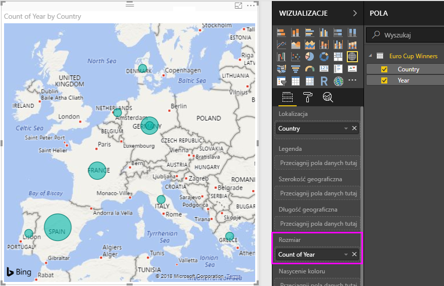

# Samouczek: analizowanie danych strony internetowej przy użyciu programu Power BI Desktop

Jako zagorzały fan piłki nożnej chcesz utworzyć raport obejmujący zwycięzców Mistrzostw Europy UEFA (Puchar Europy) w minionych latach. Za pomocą programu Power BI Desktop możesz zaimportować dane ze strony internetowej do raportu i utworzyć wizualizacje uwzględniające te dane. Z tego samouczka dowiesz się, jak używać programu Power BI Desktop, aby:

- Łączyć się ze źródłem danych i poruszać się w obrębie jego dostępnych tabel,
- Kształtować i przekształcać dane w **Edytorze Power Query**,
- Nazywać zapytanie i importować je do raportu programu Power BI Desktop oraz 
- Tworzyć i dostosowywać wizualizację mapy i wykresu kołowego.

## Nawiązywanie połączenia z internetowym źródłem danych

Dane zwycięzców UEFA można znaleźć w tabeli wyników na stronie Wikipedii Piłkarskich Mistrzostw Europy UEFA dostępnej pod adresem http://en.wikipedia.org/wiki/UEFA_European_Football_Championship. 

Należy pamiętać, że połączenia internetowe są nawiązywane tylko przy użyciu uwierzytelniania podstawowego. Witryny internetowe wymagające uwierzytelniania mogą nie działać poprawnie z łącznikiem internetowym.

Aby zaimportować dane:

1. Na karcie wstążki **Narzędzia główne** w programie Power BI Desktop rozwiń strzałkę obok pozycji **Pobierz dane**, a następnie wybierz pozycję **Internet**.
   
    
   
   >[!NOTE]
   >Można również wybrać samą pozycję **Pobierz dane** lub wybrać pozycję **Pobierz dane** w oknie dialogowym **Wprowadzenie** usługi Power BI, wybrać pozycję **Internet** w sekcji **Wszystkie** lub **Inne** w oknie dialogowym **Pobieranie danych**, a następnie wybrać pozycję **Połącz**.
   
2. W oknie dialogowym **Z Internetu** wklej adres URL `http://en.wikipedia.org/wiki/UEFA_European_Football_Championship` do pola tekstowego **Adres URL**, a następnie kliknij przycisk**OK**.
   
    
   
   Po połączeniu ze stroną internetową Wikipedii okno dialogowe **Nawigator** usługi Power BI będzie zawierać listę dostępnych tabel na stronie. Można wybrać dowolną nazwę tabeli, aby wyświetlić podgląd jej danych. Tabela **Results[edit]** zawiera potrzebne dane, ale jeszcze nie w pożądanym kształcie. Te dane zostaną przekształcone i wyczyszczone dane przed załadowaniem do raportu. 
   
   
   
   >[!NOTE]
   >Okienko **Podgląd** zawiera ostatnio wybraną tabelę, ale wszystkie wybrane tabele zostaną załadowane do **Edytora Power Query** po wybraniu pozycji **Edytuj** lub **Załaduj**. 
   
3. Wybierz tabelę**Results[edit]** z listy **Nawigator**, a następnie wybierz pozycję **Edytuj**. 
   
   Otwiera podgląd tabeli w **Edytorze Power Query**, w którym można zastosować przekształcenia w celu wyczyszczenia danych. 
   
   
   
## Kształtowanie danych w Edytorze Power Query

Chcesz ułatwić wyszukiwanie danych, wyświetlając tylko lata i kraje, które wygrały. Te kroki kształtowania i czyszczenia danych można wykonać za pomocą **Edytora Power Query**.

Najpierw należy usunąć wszystkie kolumny z wyjątkiem **Year** (Rok) i **Final Winners** (Zwycięzcy finału) z tabeli.

1. W siatce **Edytora Power Query** wybierz kolumny **Year** i **Final Winners** (przytrzymaj klawisz **Ctrl**, aby wybrać wiele elementów).
   
2. Kliknij prawym przyciskiem myszy i wybierz polecenie **Usuń inne kolumny** z listy rozwijanej lub wybierz pozycję **Usuń kolumny** > **Usuń inne kolumny** z grupy **Zarządzanie kolumnami** na karcie wstążki **Narzędzia główne**, aby usunąć wszystkie pozostałe kolumny z tabeli. 
   
    lub 

Następnie usuń dodatkowe słowo**Details** (Szczegóły) z komórek kolumny **Year**.

1. Wybierz kolumnę **Year**.
   
2. Kliknij prawym przyciskiem myszy i wybierz pozycję **Zamień wartości** z listy rozwijanej lub wybierz pozycję **Zamień wartości** z grupy **Przekształcenie** na karcie wstążki **Narzędzia główne** (można ją znaleźć także w grupie **Dowolna kolumna** na karcie **Przekształcenie**). 
   
    lub 
   
3. W oknie dialogowym **Zamienianie wartości** wpisz wartość **Details** w polu tekstowym **Wartość do znalezienia** i pozostaw pole tekstowe **Zamień na** puste, a następnie kliknij przycisk **OK**, aby usunąć słowo „Details” z wpisów w kolumnie **Year**.
   
   

Niektóre komórki w kolumnie **Year** zawierają tylko słowo „Year” zamiast wartości roku. Można odfiltrować zawartość kolumny **Year**, aby wyświetlać tylko wiersze, które nie zawierają słowa „Year”. 

1. Wybierz strzałkę listy rozwijanej filtru w kolumnie **Year**.
   
2. W polu listy rozwijanej przewiń w dół i usuń zaznaczenie pola wyboru obok pozycji **Year**, a następnie kliknij przycisk **OK**, aby usunąć wiersze zawierające tylko słowo „Year” w kolumnie **Year**. 

   

Po wyczyszczeniu danych w kolumnie **Year** można zająć się kolumną **Final Winner** (Zwycięzca finału). Ponieważ mamy teraz do czynienia tylko z danymi zwycięzców finału, możemy zmienić nazwę tej kolumny na **Country**. Aby zmienić nazwę kolumny:

1. Kliknij dwukrotnie lub naciśnij i przytrzymaj nagłówek kolumny **Final Winner**, lub 
   - Kliknij prawym przyciskiem myszy nagłówek kolumny **Final Winners**, a następnie wybierz pozycję **Zmień nazwę** z listy rozwijanej, lub 
   - Wybierz kolumnę **Final Winner** i wybierz pozycję **Zmień nazwę** z grupy **Dowolna kolumna** na karcie wstążki **Przekształcenie**. 
   
    lub 
   
2. Wpisz ciąg **Country** w nagłówku i naciśnij klawisz **Enter**, aby zmienić nazwę kolumny.

Można również odfiltrować wiersze, takie jak „2020”, z wartościami null w kolumnie **Country**. Można użyć menu filtrowania, jak w przypadku wartości kolumny **Year**, lub można:

1. Kliknąć prawym przyciskiem myszy w komórce **Country** w wierszu **2020**, który ma wartość *null*. 
2. Wybierz pozycję **Filtry tekstu** > **Nie równa się** w menu kontekstowym, aby usunąć wszystkie wiersze zawierające wartość tej komórki.
   
   
   
## Importowanie zapytania do widoku raportu

Teraz, gdy dane zostały już ukształtowane w pożądany sposób, można nazwać zapytanie „Euro Cup Winners” (Zwycięzcy Pucharu Europy) i zaimportować je do raportu.

1. W okienku **Ustawienia zapytania** w polu tekstowym **Nazwa** wpisz **Euro Cup Winners** i naciśnij klawisz **Enter**.
   
   

2. Wybierz pozycję **Zamknij i zastosuj** > **Zamknij i zastosuj** na karcie wstążki **Narzędzia główne**.
   
   
   
Zapytanie jest ładowane do **widoku raportu** programu Power BI Desktop, gdzie jest widoczne w okienku **Pola**. 
   
   
>[!TIP]
>Możesz zawsze wrócić do **Edytora Power Query**, aby edytować lub uściślić zapytanie przez:
>- Wybranie wielokropka **Więcej opcji** (**...**) obok pozycji **Euro Cup Winners** w okienku **Pola**, a następnie wybranie pozycji **Edytuj zapytanie** z listy rozwijanej, lub
>- Wybranie pozycji **Edytuj zapytania** > **Edytuj zapytania** w grupie**Dane zewnętrzne** na karcie wstążki **Narzędzia główne** w widoku raportu. 

## Tworzenie wizualizacji

Aby utworzyć wizualizację na podstawie danych: 

1. Wybierz pole **Country** w okienku **Pola** lub przeciągnij je do kanwy raportów. Program Power BI Desktop rozpoznaje dane jako nazwy krajów i automatycznie tworzy wizualizację **mapy**. 
   
   
   
2. Powiększ mapę, przeciągając uchwyty w narożnikach, tak aby były widoczne wszystkie nazwy zwycięskich krajów.  

   
   
3. Mapa przedstawia identyczne punkty danych dla każdego kraju, który zwyciężył w Mistrzostwach Europy. Aby zmienić rozmiar każdego punktu danych w celu odzwierciedlenia, jak często dany kraj wygrał, przeciągnij pole **Year** do obszaru **Przeciągnij pola danych tutaj** w sekcji **Rozmiar** w dolnej części okienka **Wizualizacje**. Pole automatycznie zmieni się w miarę **Count of Year** (Liczba lat), a wizualizacja mapy teraz będzie przedstawiać większe punkty danych dla krajów, które wygrały więcej turniejów. 
   
   
   

## Dostosowywanie wizualizacji

Jak widać, tworzenie wizualizacji opartych na danych jest bardzo proste. Wizualizacje można również łatwo dostosowywać, aby lepiej przedstawiały dane w wybrany sposób. 

### Formatowanie mapy
Można zmienić wygląd wizualizacji, zaznaczając ją, a następnie wybierając ikonę **Formatuj** (wałek malarski) w okienku **Wizualizacje**. Na przykład punkty danych „Germany” (Niemcy) w wizualizacji mogą być mylące, ponieważ Republika Federalna Niemiec wygrała dwa turnieje, a Niemcy jeden. Na mapie dwa punkty zostały nałożone na siebie, a nie oddzielone lub dodane. Aby wskazać tę różnice, można inaczej pokolorować te dwa punkty. Można również nadać mapie bardziej opisowy i atrakcyjny tytuł. 

1. Po wybraniu wizualizacji wybierz ikonę **Formatuj**, a następnie wybierz pozycję **Kolory danych**, aby rozwinąć opcje kolorów danych. 
   
   
   
2. Ustaw suwak **Pokaż wszystko** na **Wł.**, a następnie wybierz listę rozwijaną obok pola **West Germany** i wybierz kolor żółty. 
   
   
   
3. Wybierz pozycję **Tytuł**, aby rozwinąć opcje tytułu, i w polu **Tekst tytułu** zastąp bieżący tytuł wyrażeniem **Euro Cup Winners**. 
4. Zmień **Kolor czcionki** na czerwony, **Rozmiar tekstu** na **12**, a **Rodzinę czcionek** na **Segoe (pogrubienie)**. 
   
   
   

Teraz wizualizacja mapy wygląda następująco:

   
### Zmienianie typu wizualizacji
Aby zmienić typ wizualizacji, można ją zaznaczyć, a następnie wybrać inną ikonę w górnej części okienka **Wizualizacje**. Na przykład w wizualizacji mapy brakuje danych Związku Radzieckiego i Czechosłowacji, ponieważ te kraje już nie istnieją na mapie świata. Inny typ wizualizacji, taki jak mapa drzewa lub wykres kołowy, może być dokładniejszy, ponieważ zawiera wszystkie wartości. 

Aby zmienić mapę w wykres kołowy, wybierz mapę, a następnie wybierz ikonę **Wykres kołowy** w okienku **Wizualizacje**. 
   

>[!TIP]
>- Możesz użyć opcji formatowania **Kolory danych**, aby pozycje „Germany” (Niemcy) i „West Germany” (Republika Federalna Niemiec) miały ten sam kolor. 
>- Aby razem zgrupować na wykresie kołowym kraje z największą liczbą zwycięstw, wybierz wielokropek (**...**) w prawym górnym rogu wizualizacji, a następnie wybierz opcję **sortowania według liczby lat** z listy rozwijanej. 

Program Power BI Desktop zapewnia kompleksowy zbiór funkcji przeznaczonych do pobierania danych z różnorodnych źródeł danych i kształtowania ich odpowiednio do potrzeb analizy w celu zaprezentowania tych danych w zaawansowanych interaktywnych wizualizacjach. Gdy raport jest gotowy, można [przekazać go do usługi Power BI](desktop-upload-desktop-files.md) i tworzyć na jego podstawie pulpity nawigacyjne, które następnie można udostępniać innym użytkownikom usługi Power BI.

## Zobacz także
* [Zapoznaj się z innymi samouczkami dotyczącymi programu Power BI Desktop](http://go.microsoft.com/fwlink/?LinkID=521937)
* [Obejrzyj filmy wideo dotyczące programu Power BI Desktop](http://go.microsoft.com/fwlink/?LinkID=519322)
* [Odwiedź forum usługi Power BI](http://go.microsoft.com/fwlink/?LinkID=519326)
* [Przeczytaj blog poświęcony usłudze Power BI](http://go.microsoft.com/fwlink/?LinkID=519327)

