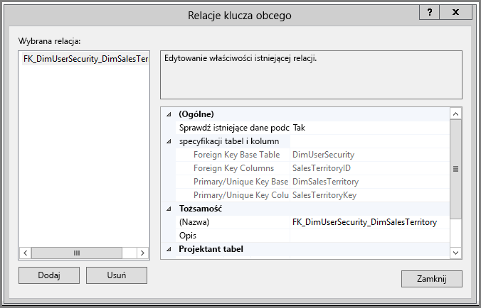
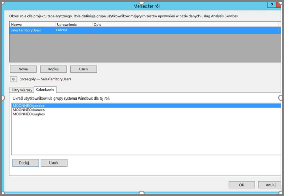
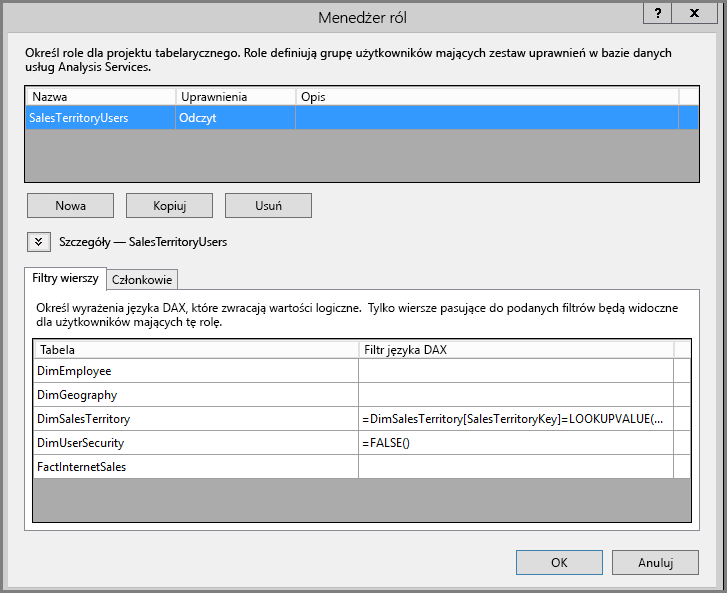
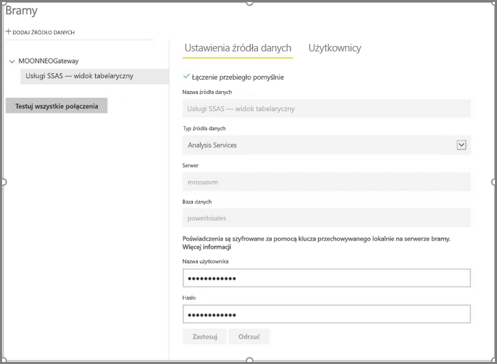
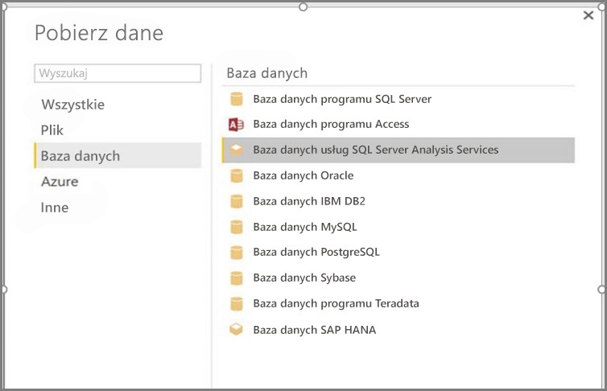
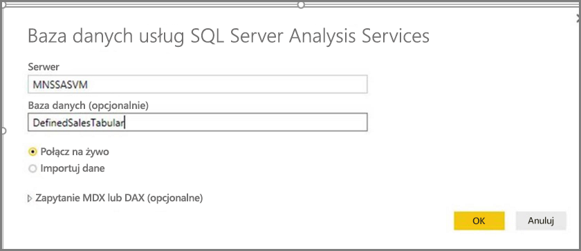
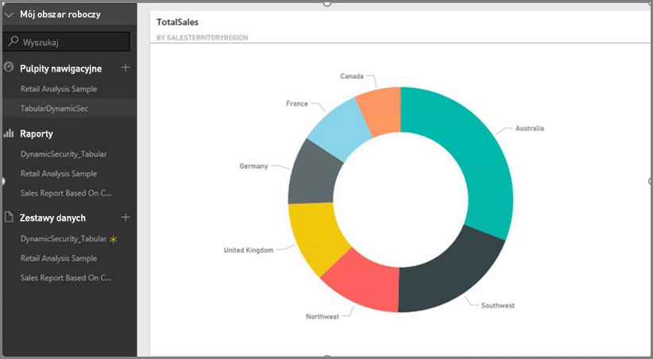
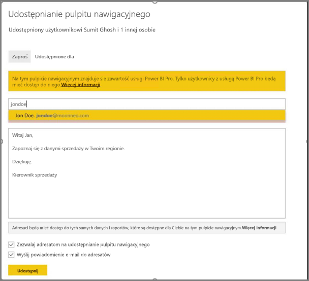
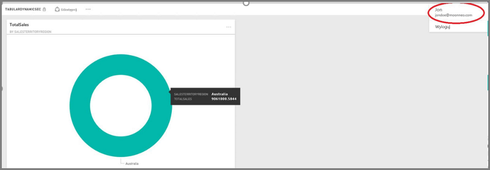

# <a name="dynamic-row-level-security-with-analysis-services-tabular-model"></a>Dynamiczne zabezpieczenia na poziomie wiersza z modelem tabelarycznym usług Analysis Services
W tym samouczku przedstawiono kroki niezbędne do zaimplementowania **zabezpieczeń na poziomie wiersza** w ramach **modelu tabelarycznego usług Analysis Services**  oraz stosowanie ich w raportach usługi Power BI. Kroki w tym samouczku zaprojektowano tak, aby można było je prześledzić i nauczyć się niezbędnych czynności, wykonując je na przykładowym zestawie danych.

W samouczku opisano szczegółowo następujące kroki pomagające zrozumieć elementy wymagane do zaimplementowania dynamicznych zabezpieczeń na poziomie wiersza w modelu tabelarycznym usług Analysis Services:

* Tworzenie nowej tabeli zabezpieczeń w bazie danych **AdventureworksDW2012**
* Tworzenie modelu tabelarycznego z wymaganymi tabelami faktów i wymiarów
* Definiowanie ról i uprawnień użytkowników
* Wdrażanie modelu w wystąpieniu **tabelarycznym usług Analysis Services**
* Używanie programu Power BI Desktop do tworzenia raportu wyświetlającego dane odpowiadające użytkownikowi uzyskującemu dostęp do raportu
* Wdrażanie raportu w **usłudze Power BI**
* Tworzenie nowego pulpitu nawigacyjnego na podstawie raportu oraz
* Udostępnianie pulpitu nawigacyjnego współpracownikom

Do wykonania kroków opisanych w tym samouczku wymagana jest baza danych **AdventureworksDW2012**, którą można pobrać z **[repozytorium](https://github.com/Microsoft/sql-server-samples/releases/tag/adventureworks)**.

## <a name="task-1-create-the-user-security-table-and-define-data-relationship"></a>Zadanie 1. Tworzenie tabeli zabezpieczeń użytkownika i definiowanie relacji danych
Opublikowano już wiele artykułów opisujących sposób definiowania dynamicznych zabezpieczeń na poziomie wiersza w modelu **tabelarycznym usług SQL Server Analysis Services (SSAS)**. W przypadku naszej próbki postępujemy zgodnie z artykułem [Implement Dynamic Security by Using Row Filters](https://msdn.microsoft.com/library/hh479759.aspx) (Wdrażanie dynamicznych zabezpieczeń przy użyciu filtrów wierszy). W poniższych krokach objaśniono pierwsze zadanie z tego samouczka:

1. W naszym przykładzie używamy relacyjnej bazy danych **AdventureworksDW2012**. W tej bazie danych utwórz tabelę **DimUserSecurity**, jak pokazano na poniższej ilustracji. W tym przykładzie do utworzenia tabeli używamy narzędzia SQL Server Management Studio (SSMS).
   
   
2. Po utworzeniu i zapisaniu tabeli musimy utworzyć relację między kolumną **SalesTerritoryID** tabeli **DimUserSecurity** i kolumną **SalesTerritoryKey** tabeli **DimSalesTerritory**, jak pokazano na poniższej ilustracji. Można to zrobić w narzędziu **SSMS** przez kliknięcie prawym przyciskiem myszy tabeli **DimUserSecurity** i wybranie opcji **Projekt**. Następnie wybierz pozycję **Projektant tabel -> Relacje...** z menu.
   
   
3. Zapisz tabelę, a następnie dodaj do niej kilka wierszy z informacjami o użytkownikach, ponownie klikając prawym przyciskiem myszy tabelę **DimUserSecurity**, a następnie wybierając opcję **Edytuj pierwszych 200 wierszy**. Po dodaniu tych użytkowników wiersze tabeli **DimUserSecurity** wyglądają podobnie jak na poniższej ilustracji:
   
   
   
   Wrócimy do tych użytkowników w kolejnych zadaniach.
4. Następnie wykonamy *sprzężenie wewnętrzne* z tabelą **DimSalesTerritory**, która zawiera szczegóły regionu skojarzonego z użytkownikiem. Poniższy kod wykonuje *sprzężenie wewnętrzne*, a poniższa ilustracja przedstawia wygląd tabeli po pomyślnym wykonaniu *sprzężenia wewnętrznego*.
   
       select b.SalesTerritoryCountry, b.SalesTerritoryRegion, a.EmployeeID, a.FirstName, a.LastName, a.UserName from [dbo].[DimUserSecurity] as a join  [dbo].[DimSalesTerritory] as b on a.[SalesTerritoryKey] = b.[SalesTerritoryID]
   
   
5. Zwróć uwagę, że powyższy obraz pokazuje informacje na przykład o tym, którzy użytkownicy są odpowiedzialni za poszczególne regiony sprzedaży. Dane te są wyświetlane dzięki relacji utworzonej w **kroku 2**. Zwróć także uwagę, że użytkownik **Jon Doe należy do regionu sprzedaży Australia**. Do Johna Doe wrócimy w kolejnych krokach i zadaniach.

## <a name="task-2-create-the-tabular-model-with-facts-and-dimension-tables"></a>Zadanie 2. Tworzenie modelu tabelarycznego z tabelami faktów i wymiarów
1. Po przygotowaniu magazynu danych relacyjnych należy zdefiniować model tabelaryczny. Model można utworzyć przy użyciu programu **SQL Server Data Tools (SSDT)**. Aby uzyskać więcej informacji na temat tego, jak zdefiniować model tabelaryczny, zobacz [Create a New Tabular Model Project](https://msdn.microsoft.com/library/hh231689.aspx) (Tworzenie nowego projektu modelu tabelarycznego).
2. Zaimportuj wszystkie niezbędne tabele do modelu w sposób przedstawiony poniżej.
   
    
3. Po zaimportowaniu niezbędnych tabeli należy zdefiniować rolę o nazwie **SalesTerritoryUsers** z uprawnieniami **odczytu**. Można to osiągnąć, klikając menu **Model** programu SQL Server Data Tools, a następnie klikając opcję **Role**. W oknie dialogowym **Menedżer ról** kliknij przycisk **Nowy**.
4. Na karcie **Członkowie** okna **Menedżer ról** dodaj użytkowników zdefiniowanych w tabeli **DimUserSecurity** w części **Zadanie 1, krok 3**.
   
    
5. Następnie dodaj odpowiednie funkcje dla tabel **DimSalesTerritory** i **DimUserSecurity**, jak pokazano poniżej na karcie **Filtry wierszy**.
   
    
6. W tym kroku używamy funkcji **LOOKUPVALUE**, aby zwrócić wartości dla kolumny, w której nazwa użytkownika systemu Windows jest taka sama jak nazwa użytkownika zwracana przez funkcję **USERNAME**. Zapytania można następnie ograniczyć do sytuacji, gdzie wartości zwracane przez funkcję **LOOKUPVALUE** odpowiadają wartościom w tej samej lub powiązanej tabeli. W kolumnie **Filtr języka DAX** wpisz następujący wzór:
   
       =DimSalesTerritory[SalesTerritoryKey]=LOOKUPVALUE(DimUserSecurity[SalesTerritoryID], DimUserSecurity[UserName], USERNAME(), DimUserSecurity[SalesTerritoryID], DimSalesTerritory[SalesTerritoryKey])
    W tej formule funkcja **LOOKUPVALUE** zwraca wszystkie wartości kolumny **DimUserSecurity[SalesTerritoryID]**, gdzie wartość **DimUserSecurity[UserName]** jest identyczna z nazwą użytkownika zalogowanego obecnie do systemu Windows, a wartość **DimUserSecurity[SalesTerritoryID]** jest identyczna z wartością **DimSalesTerritory[SalesTerritoryKey]**.
   
    > [!IMPORTANT]
    > Należy pamiętać, że funkcja języka DAX [USERELATIONSHIP](https://msdn.microsoft.com/query-bi/dax/userelationship-function-dax) nie jest obsługiwana w przypadku korzystania z zabezpieczeń na poziomie wiersza.

   Zbiór wartości SalesTerritoryKey zwracany przez funkcję **LOOKUPVALUE** jest następnie używany do ograniczania wierszy wyświetlanych w tabeli **DimSalesTerritory**. Wyświetlane są tylko wiersze, dla których wartość **SalesTerritoryKey** dla wiersza znajduje się w zestawie identyfikatorów zwracanych przez funkcję **LOOKUPVALUE**.
8. Dla tabeli **DimUserSecurity** w kolumnie **Filtr języka DAX** wpisz następującą formułę:
   
       =FALSE()

    Formuła określa, że wszystkie kolumny są rozwiązywane do fałszywego warunku logicznego, w związku z czym nie można wykonać zapytań dla żadnych kolumn w tabeli **DimUserSecurity**.
1. Teraz musimy przetworzyć i wdrożyć model. Informacje pomocne we wdrażaniu modelu można znaleźć w [artykule na temat wdrażania](https://msdn.microsoft.com/library/hh231693.aspx).

## <a name="task-3-adding-data-sources-within-your-on-premises-data-gateway"></a>Zadanie 3. Dodawanie źródeł danych w lokalnej bramie danych
1. Po wdrożeniu modelu tabelarycznego i przygotowaniu go do użycia musisz dodać połączenie ze źródłem danych do lokalnego serwera tabelarycznego usług Analysis Services w portalu usługi Power BI.
2. Aby umożliwić **usłudze Power BI** dostęp do lokalnej usługi analizy, musisz zainstalować i skonfigurować w danym środowisku **[lokalną bramę danych](service-gateway-onprem.md)**.
3. Po poprawnym skonfigurowaniu bramy musisz utworzyć połączenie źródła danych dla swojego wystąpienia tabelarycznego usług **Analysis Services**. Ten artykuł pomoże w [dodawaniu źródła danych w portalu usługi Power BI](service-gateway-enterprise-manage-ssas.md).
   
   
4. Po ukończeniu poprzedniego kroku brama jest skonfigurowana i gotowa do interakcji z lokalnym źródłem danych **usług Analysis Services**.

## <a name="task-4-creating-report-based-on-analysis-services-tabular-model-using-power-bi-desktop"></a>Zadanie 4. Tworzenie raportu na podstawie modelu tabelarycznego usług analizy przy użyciu programu Power BI Desktop
1. Uruchom program **Power BI Desktop** i wybierz opcję **Pobierz dane > Baza danych**.
2. Z listy źródeł danych wybierz pozycję **Baza danych usług SQL Server Analysis Services** i wybierz pozycję **połącz**.
   
   
3. Wypełnij szczegóły wystąpienia tabelarycznego usług **Analysis Services** i wybierz opcję **Połączenie na żywo**. Wybierz przycisk **OK**. W przypadku usługi **Power BI** zabezpieczenia dynamiczne działają tylko z **połączeniem na żywo**.
   
   
4. Zobaczysz, że wdrożony model znajduje się w wystąpieniu usług **Analysis Services**. Wybierz odpowiedni model i kliknij przycisk **OK**.
   
   
5. Program **Power BI Desktop** wyświetli teraz wszystkie dostępne pola po prawej stronie kanwy, w okienku **Pola**.
6. W okienku **Pola** po prawej stronie wybierz miarę **SalesAmount** z tabeli **FactInternetSales** i wymiar **SalesTerritoryRegion** z tabeli **SalesTerritory**.
7. Ten raport będzie prosty, nie będziemy więc dodawać żadnych kolejnych kolumn. Aby uzyskać bardziej znaczącą reprezentację danych, zmienimy wizualizację na **Wykres pierścieniowy**.
   
   
8. Gdy raport będzie gotowy, możesz opublikować go bezpośrednio w portalu usługi Power BI. Na wstążce **Narzędzia główne** w programie **Power BI Desktop** wybierz polecenie **Publikuj**.

## <a name="task-5-creating-and-sharing-a-dashboard"></a>Zadanie 5. Tworzenie i udostępnianie pulpitu nawigacyjnego
1. Utworzyliśmy raport i kliknęliśmy przycisk **Publikuj** w programie **Power BI Desktop**, więc raport został opublikowany w usłudze **Power BI**. Po wprowadzeniu w życie nasz modelowy scenariusz zabezpieczeń można zademonstrować przy użyciu przykładu utworzonego w poprzednich krokach.
   
   W swojej roli użytkownik **Sales Manager - Sumit** może wyświetlać dane z wszystkich regionów sprzedaży. Tworzy więc ten raport (raport utworzony w poprzednich krokach zadania) i publikuje go w usłudze Power BI.
   
   Po opublikowaniu raportu tworzy pulpit nawigacyjny w usłudze Power BI o nazwie **TabularDynamicSec** na podstawie tego raportu. Na poniższej ilustracji należy zauważyć, że kierownik ds. sprzedaży (Sumit) może wyświetlać dane odpowiadające wszystkim regionom sprzedaży.
   
   
2. Teraz Sumit udostępnia pulpit nawigacyjny swojemu współpracownikowi, Jonowi Doe, odpowiedzialnemu za sprzedaż w regionie Australii.
   
   
   
   
3. Gdy Jon Doe loguje się do usługi **Power BI** i wyświetla udostępniony pulpit nawigacyjny utworzony przez Sumita, powinien widzieć **tylko** sprzedaż w regionie, za który jest odpowiedzialny. Tak więc Jon Doe loguje się, przechodzi do pulpitu nawigacyjnego udostępnionego przez Sumita i widzi **tylko** sprzedaż w regionie Australii.
   
   
4. Gratulacje! Dynamiczne zabezpieczenia na poziomie wiersza zdefiniowane w lokalnym modelu tabelarycznym **usług Analysis Services** zostały pomyślnie odzwierciedlone i wprowadzone w **usłudze Power BI**. Usługa Power BI korzysta z właściwości **effectiveusername** do wysyłania poświadczeń bieżącego użytkownika usługi Power BI do lokalnego źródła danych w celu uruchomienia zapytania.

## <a name="task-6-understanding-what-happens-behind-the-scenes"></a>Zadanie 6. Omówienie procesów zachodzących w tle
1. W tym zadaniu założono, że znasz narzędzie SQL Profiler, ponieważ musisz zarejestrować ścieżkę profilera programu SQL Server w lokalnym wystąpieniu tabelarycznym usług SSAS.
2. Sesja zostaje zainicjowana, gdy tylko użytkownik (w tym przypadku Jon Doe) uzyskuje dostęp do pulpitu nawigacyjnego w usłudze Power BI. Możesz zobaczyć, że rola **salesterritoryusers** zostaje natychmiast wprowadzona w życie, z obowiązującą nazwą użytkownika **<EffectiveUserName>jondoe@moonneo.com</EffectiveUserName>**
   
       <PropertyList><Catalog>DefinedSalesTabular</Catalog><Timeout>600</Timeout><Content>SchemaData</Content><Format>Tabular</Format><AxisFormat>TupleFormat</AxisFormat><BeginRange>-1</BeginRange><EndRange>-1</EndRange><ShowHiddenCubes>false</ShowHiddenCubes><VisualMode>0</VisualMode><DbpropMsmdFlattened2>true</DbpropMsmdFlattened2><SspropInitAppName>PowerBI</SspropInitAppName><SecuredCellValue>0</SecuredCellValue><ImpactAnalysis>false</ImpactAnalysis><SQLQueryMode>Calculated</SQLQueryMode><ClientProcessID>6408</ClientProcessID><Cube>Model</Cube><ReturnCellProperties>true</ReturnCellProperties><CommitTimeout>0</CommitTimeout><ForceCommitTimeout>0</ForceCommitTimeout><ExecutionMode>Execute</ExecutionMode><RealTimeOlap>false</RealTimeOlap><MdxMissingMemberMode>Default</MdxMissingMemberMode><DisablePrefetchFacts>false</DisablePrefetchFacts><UpdateIsolationLevel>2</UpdateIsolationLevel><DbpropMsmdOptimizeResponse>0</DbpropMsmdOptimizeResponse><ResponseEncoding>Default</ResponseEncoding><DirectQueryMode>Default</DirectQueryMode><DbpropMsmdActivityID>4ea2a372-dd2f-4edd-a8ca-1b909b4165b5</DbpropMsmdActivityID><DbpropMsmdRequestID>2313cf77-b881-015d-e6da-eda9846d42db</DbpropMsmdRequestID><LocaleIdentifier>1033</LocaleIdentifier><EffectiveUserName>jondoe@moonneo.com</EffectiveUserName></PropertyList>
3. Na podstawie żądania obowiązującej nazwy użytkownika usługi Analysis Services przekształcają żądanie na rzeczywiste poświadczenia moonneo\jondoe po przekazaniu zapytania do lokalnej usługi Active Directory. Gdy usługi **Analysis Services** otrzymają rzeczywiste poświadczenia z usługi Active Directory, na podstawie dostępu i uprawnień użytkownika do danych usługi **Analysis Services** zwracają jedynie dane, do których ma on uprawnienia.
4. Jeśli w pulpicie nawigacyjnym zachodzi dodatkowa aktywność, na przykład Jon Doe przechodzi z pulpitu nawigacyjnego do bazowego raportu, narzędzie SQL Profiler pokazuje konkretne zapytanie powracające do modelu tabelarycznego Analysis Services jako zapytanie DAX.
   
   
5. Poniżej można także zobaczyć zapytanie DAX wykonywane w celu wypełnienia danych dla tego raportu.
   
   ```
   EVALUATE
     ROW(
       "SumEmployeeKey", CALCULATE(SUM(Employee[EmployeeKey]))
     )
   
   <PropertyList xmlns="urn:schemas-microsoft-com:xml-analysis">``
             <Catalog>DefinedSalesTabular</Catalog>
             <Cube>Model</Cube>
             <SspropInitAppName>PowerBI</SspropInitAppName>
             <EffectiveUserName>jondoe@moonneo.com</EffectiveUserName>
             <LocaleIdentifier>1033</LocaleIdentifier>
             <ClientProcessID>6408</ClientProcessID>
             <Format>Tabular</Format>
             <Content>SchemaData</Content>
             <Timeout>600</Timeout>
             <DbpropMsmdRequestID>8510d758-f07b-a025-8fb3-a0540189ff79</DbpropMsmdRequestID>
             <DbPropMsmdActivityID>f2dbe8a3-ef51-4d70-a879-5f02a502b2c3</DbPropMsmdActivityID>
             <ReturnCellProperties>true</ReturnCellProperties>
             <DbpropMsmdFlattened2>true</DbpropMsmdFlattened2>
             <DbpropMsmdActivityID>f2dbe8a3-ef51-4d70-a879-5f02a502b2c3</DbpropMsmdActivityID>
           </PropertyList>
   ```

## <a name="considerations"></a>Istotne zagadnienia
Istnieje kilka zagadnień, które należy wziąć pod uwagę podczas pracy z zabezpieczeniami na poziomie wiersza, usługami SSAS i usługą Power BI:

1. Lokalne zabezpieczenia na poziomie wiersza w usłudze Power BI są dostępne tylko w przypadku połączenia na żywo.
2. Wszelkie zmiany w danych po przetworzeniu modelu będą natychmiast dostępne dla użytkowników, którzy uzyskują dostęp do raportu za pomocą **połączenia na żywo** z usługi Power BI.

