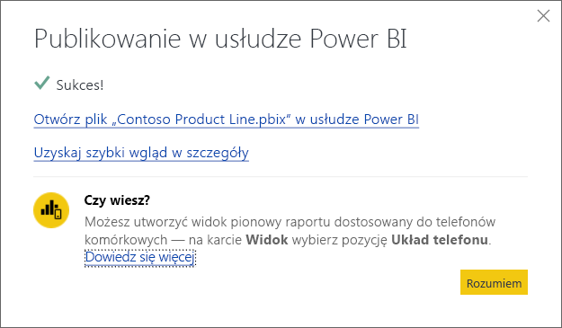

# Publikowanie z programu Power BI Desktop
Gdy publikujesz plik programu **Power BI Desktop** w usłudze **Power BI**, dane w modelu i wszystkie raporty utworzone przez Ciebie w widoku **Raporty** są publikowane w Twoim obszarze roboczym usługi Power BI. W nawigatorze swojego obszaru roboczego zobaczysz nowy zestaw danych z tą samą nazwą oraz wszystkie raporty.

Publikowanie z programu **Power BI Desktop** działa tak samo, jak używanie funkcji **Pobierz dane** w usłudze Power BI w celu nawiązania połączenia i przekazania pliku programu **Power BI Desktop**.

> [!NOTE]
> Wszelkie zmiany wprowadzone w raporcie w usłudze Power BI, takie jak dodawanie, usuwanie lub zmienianie wizualizacji w raportach, nie zostaną zapisane w oryginalnym pliku programu **Power BI Desktop**.
> 
> 

## Aby opublikować zestaw danych i raporty programu Power BI Desktop
1. W programie Power BI Desktop wybierz kolejno pozycje \> **Plik** \> **Publikuj** \> **Publikuj w usłudze Power BI** lub kliknij przycisk **Publikuj** na wstążce.  
   
2. Zaloguj się do usługi Power BI.

Po zakończeniu publikowania zostanie wyświetlony link umożliwiający otworzenie raportu w witrynie usługi Power BI.  
    

## Ponowne publikowanie lub zastępowanie zestawu danych opublikowanego z programu Power BI Desktop
Gdy publikujesz plik programu **Power BI Desktop**, zestaw danych i wszystkie raporty utworzone w programie **Power BI Desktop** są przekazywane do witryny usługi Power BI. Gdy ponownie publikujesz swój plik programu **Power BI Desktop**, zestaw danych w witrynie usługi Power BI jest zastępowany zaktualizowanym zestawem danych z pliku programu **Power BI Desktop**.

To wszystko jest dość oczywiste, jest jednak kilka kwestii, o których należy wiedzieć:

* Jeśli w usłudze Power BI masz już co najmniej dwa zestawy danych o takiej samej nazwie, co plik programu **Power BI Desktop**, publikowanie może zakończyć się niepowodzeniem. Upewnij się, że w usłudze Power BI istnieje tylko jeden zestaw danych o takiej samej nazwie. Możesz również zmienić nazwę pliku i opublikować, tworząc nowy zestaw danych o tej samej nazwie, co plik.
* Jeśli zmienisz nazwę kolumny lub miary bądź ją usuniesz, wszelkie wizualizacje znajdujące się w usłudze Power BI, które używają tego pola, mogą zostać uszkodzone. 
* Usługa Power BI ignoruje pewne zmiany formatu istniejących kolumn. Na przykład zmianę formatu kolumny z 0,25 na 25%.
* Jeśli dla istniejącego zestawu danych w usłudze Power BI masz skonfigurowany harmonogram odświeżania i dodasz nowe źródła danych do pliku, a następnie ponownie opublikujesz, konieczne będzie zalogowanie się do nich w oknie *Zarządzanie źródłami danych* przed następnym zaplanowanym odświeżeniem.

