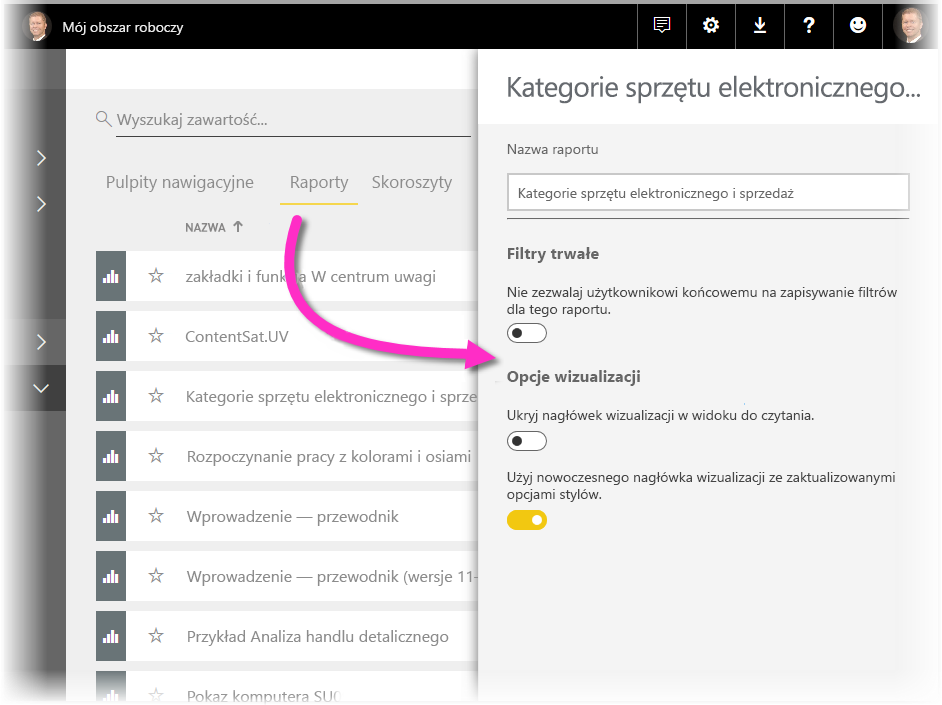

# Używanie elementów wizualizacji do ulepszania raportów usługi Power BI

W programie **Power BI Desktop** można stosować elementy wizualizacji, takie jak tapeta i ulepszone nagłówki, aby poprawić wygląd raportów.

Począwszy od wersji programu **Power BI Desktop** z lipca 2018 r. można stosować w raportach ulepszenia, by w ten sposób jeszcze bardziej zwiększać atrakcyjność analiz i raportów. Ulepszenia omówione w tym artykule to między innymi: 

* Stosowanie **tapety** w raportach w celu wzbogacenia tła lub wyróżnianie elementów historii opowiadanej przy użyciu danych.
* Używanie udoskonalonych **nagłówków wizualizacji** w poszczególnych wizualizacjach w celu utworzenia idealnie wyrównanych wizualizacji na kanwie raportu. 

W poniższych sekcjach opisano sposób używania tych ulepszeń i stosowania ich w raportach.

## Używanie tapety w raportach usługi Power BI

Szary obszar poza stroną raportu można formatować przy użyciu **tapety**. Strzałka na poniższej ilustracji wskazuje obszar stosowania tapety. 

Można ustawić tapetę na poszczególnych stronach lub wybrać tę samą tapetę na każdej stronie raportu. Aby ustawić tapetę, dotknij ikony **Formatowanie** lub kliknij ją, gdy w raporcie nie wybrano wizualizacji. W okienku zostanie wyświetlona karta**Tapeta**.

Możesz wskazać kolor do zastosowania jako **tapetę**, wybierając listę rozwijaną **Kolor**, lub wybrać przycisk **Dodaj obraz** w celu wybrania obrazu, który chcesz zastosować jako tapetę. Możesz również zastosować przezroczystość tapety — koloru lub obrazu — za pomocą suwaka **Przezroczystość**.

Warto zapamiętać następujące definicje dotyczące **tapety**:

* Szary obszar poza raportem to obszar **tapety**.
* Obszar na kanwie, w którym można umieszczać wizualizacje, jest nazywany **stroną** raportu. Można ją modyfikować w **okienku Formatowanie** przy użyciu listy rozwijanej **Tło strony**.

**Strona** raportu zawsze znajduje się na wierzchu (przed tapetą), a **tapeta** znajduje się za nią i elementem położonym najgłębiej na stronie raportu. Zastosowanie przezroczystości do strony oznacza również zastosowanie jej do wizualizacji w tym raporcie, dzięki czemu tapeta będzie widoczna w tle przez wizualizacje.

W przypadku wszystkich nowych raportów domyślne ustawienia są następujące:

* Kolor **strony** raportu jest ustawiony na **biały**, a przezroczystość na **100%**
* Kolor **tapety** jest ustawiony na **biały**, a przezroczystość na **0%**

W przypadku ustawienia przezroczystości tła strony na więcej niż 50% podczas tworzenia lub edytowania raportu pojawia się kropkowane obramowanie pokazujące granicę obramowania kanwy raportu. 

Ważne jest, aby pamiętać, że kropkowana granica jest wyświetlana *tylko* podczas edytowania raportu i *nie* jest widoczna dla osób przeglądających opublikowany raport, np. gdy zostanie on wyświetlony w **usłudze Power BI**.

> [!NOTE]
> Jeśli używasz tapet z ciemnymi tłami i ustawisz biały lub bardzo jasny kolor tekstu, pamiętaj, że funkcja **eksportowania do formatu PDF** nie obejmuje tapety, więc wyeksportowana zawartość z białymi czcionkami będzie niemal niewidoczna w wyeksportowanym pliku PDF. Zobacz [Eksportowanie do formatu PDF](desktop-export-to-pdf.md), aby uzyskać więcej informacji na temat **eksportowania do formatu PDF**.

## Używanie ulepszonych nagłówków wizualizacji w raportach usługi Power BI

Począwszy od wersji programu **Power BI Desktop** z lipca 2018 r. znacznie ulepszono nagłówki wizualizacji w raportach. Główne ulepszenia polegają na tym, że nagłówek został odłączony od wizualizacji, dzięki czemu można dostosować jego położenie zgodnie z własnymi preferencjami dotyczącymi układu i pozycjonowania. Nagłówek jest teraz wyświetlany w obrębie wizualizacji, a nie nad nią jako element przestawny. 

Domyślnie nagłówek pojawia się wewnątrz wizualizacji wyrównany z tytułem. Na poniższej ilustracji przedstawiono nagłówek (ikona pinezki, ikona rozszerzania i ikona wielokropka) znajdujący się w obrębie wizualizacji i wyrównany do prawej strony, w tym samym położeniu w poziomie, co tytuł wizualizacji.

Jeśli wizualizacja nie ma tytułu, nagłówek jest wyświetlany jako przestawny nad górną częścią wizualizacji i jest wyrównany do prawej strony, jak pokazano na poniższej ilustracji. 

W przypadku umieszczenia wizualizacji przy górnej krawędzi raportu nagłówek wizualizacji zostanie w zamian przyciągnięty do jej dolnej części. 

Każda wizualizacja ma również w sekcji **Formatowanie** okienka **Wizualizacje** kartę o nazwie **Nagłówek wizualizacji**. Na tej karcie można dostosować wszystkie rodzaje właściwości nagłówka wizualizacji

> [!NOTE]
> Widoczność przełączników nie wpływa na raport podczas jego tworzenia lub edytowania. Aby zobaczyć efekt, należy opublikować raport i wyświetlić go w trybie do czytania. Takie zachowanie gwarantuje dostępność w nagłówkach wielu opcji istotnych podczas edytowania, w szczególności ikon ostrzeżeń wyświetlających alerty dotyczące problemów z edytowaniem.

W przypadku raportów wyświetlanych tylko w **usłudze Power BI** można dostosować sposób użycia nagłówków wizualizacji, przechodząc do pozycji **Mój obszar roboczy > Raporty**, a następnie wybierając ikonę **Ustawienia**. W tym obszarze znajdują się ustawienia raportu, dla którego wybrano pozycję **Ustawienia**. W tym miejscu można dostosowywać ustawienia, jak pokazano na poniższej ilustracji.

### Włączanie ulepszonych nagłówków wizualizacji w istniejących raportach

Nowy nagłówek wizualizacji to domyślne zachowanie we wszystkich nowych raportach. W przypadku istniejących raportów należy włączyć to zachowanie w programie **Power BI Desktop**, przechodząc do pozycji **Plik > Opcje i ustawienia > Opcje**, a następnie zaznaczając pole wyboru **Użyj nowoczesnego nagłówka wizualizacji ze zaktualizowanymi opcjami stylu** w sekcji **Ustawienia raportu**.

## Następne kroki
Aby uzyskać więcej informacji na temat programu **Power BI Desktop** oraz dowiedzieć się, jak rozpocząć pracę w tym programie, zapoznaj się z następującymi artykułami.

* [Co to jest Power BI Desktop?](desktop-what-is-desktop.md)
* [Omówienie zapytań w programie Power BI Desktop](desktop-query-overview.md)
* [Źródła danych w programie Power BI Desktop](desktop-data-sources.md)
* [Łączenie się z danymi w programie Power BI Desktop](desktop-connect-to-data.md)
* [Kształtowanie i łączenie danych w programie Power BI Desktop](desktop-shape-and-combine-data.md)
* [Typowe zadania dotyczące zapytań w programie Power BI Desktop](desktop-common-query-tasks.md)   

