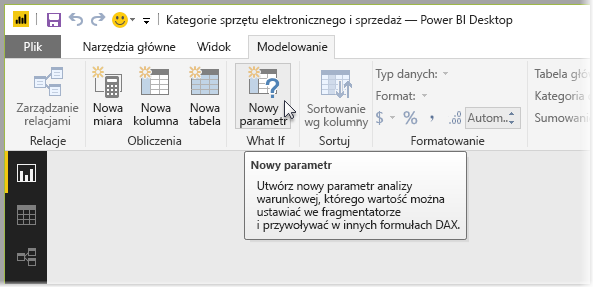
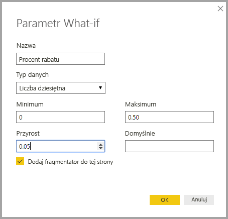
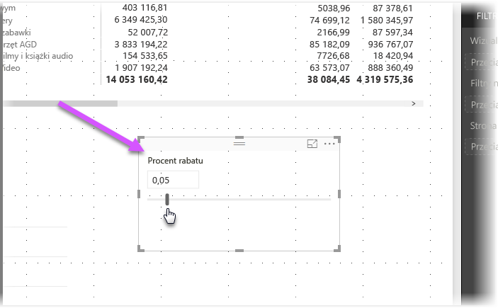
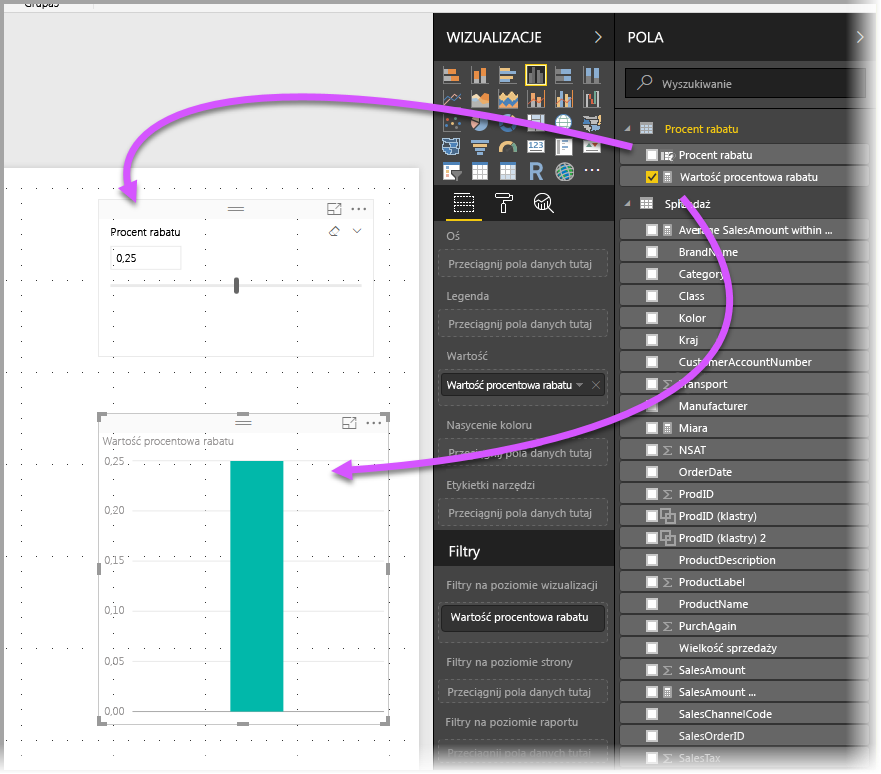
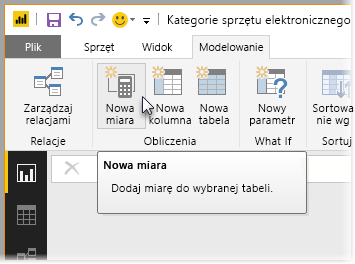
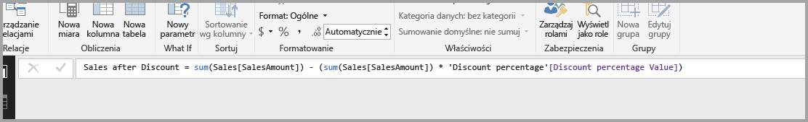
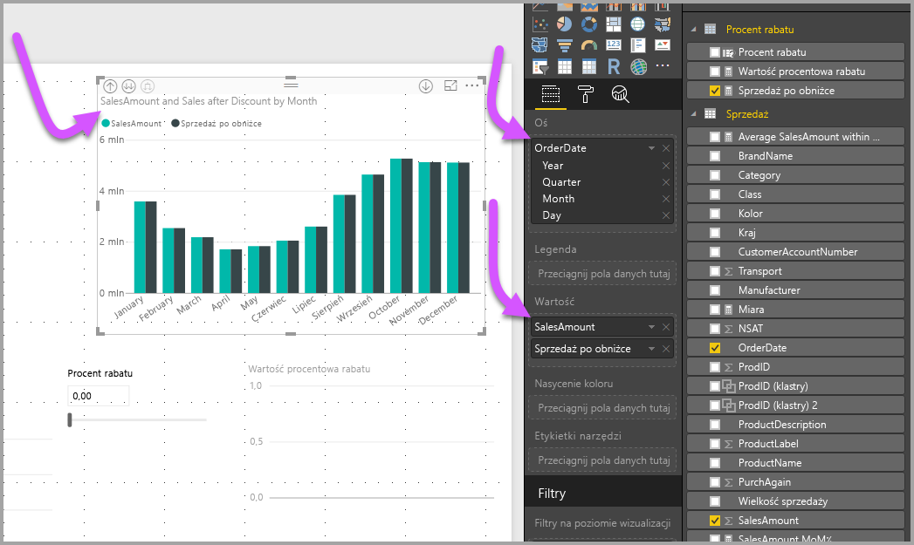
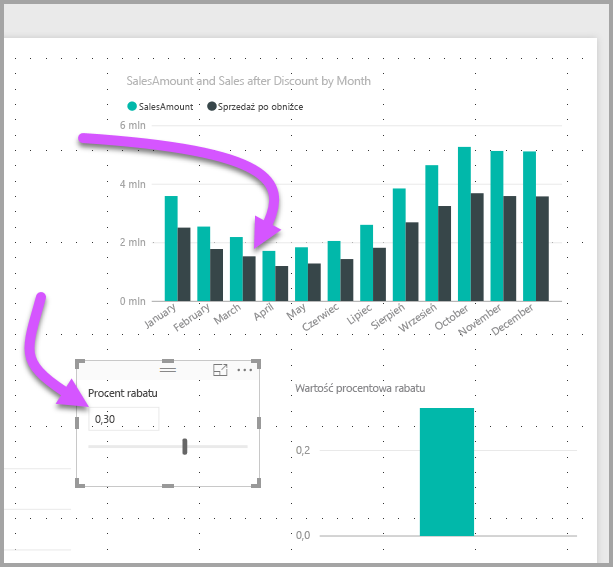

# Tworzenie i używanie parametrów analizy warunkowej w celu wizualizacji zmiennych w usłudze Power BI Desktop
Wersja programu **Power BI Desktop** wydana w sierpniu 2017 r. umożliwia tworzenie zmiennych **analizy warunkowej** dla raportów, używanie zmiennych jako fragmentatorów, a co za tym idzie, wizualizowanie i szacowanie różnych wartości kluczowych w raportach.

Parametr **analizy warunkowej** znajduje się na karcie **Modelowanie** w programie **Power BI Desktop**. Po jego wybraniu zostanie wyświetlone okno dialogowe, w którym można skonfigurować parametr.

## Tworzenie parametru analizy warunkowej
Aby utworzyć parametr **analizy warunkowej**, wybierz przycisk **Analiza warunkowa** na karcie **Modelowanie** w programie **Power BI Desktop**. Poniższa ilustracja przedstawia utworzony parametr o nazwie *Discount percentage* (Procent rabatu) z typem danych *Decimal number* (Liczba dziesiętna). Wartość *Minimum* jest ustawiona na zero, a wartość *Maximum* na 0,50 (pięćdziesiąt procent). Wartość *Increment* (Przyrost) ustawiono na 0,05 (5 procent). O tyle zostanie dostosowany parametr po użyciu w raporcie.

> [!NOTE]
> W przypadku liczb dziesiętnych upewnij się, że poprzedzasz je cyfrą zero: na przykład 0,50, a nie ,50. W przeciwnym razie liczba będzie nieprawidłowa, a wybranie przycisku **OK** nie będzie możliwe.
> 
> 

Dla wygody pole wyboru **Dodaj fragmentator do tej strony** automatycznie umieszcza fragmentator wraz z parametrem **analizy warunkowej** na bieżącej stronie raportu.

Podczas tworzenia parametru **analizy warunkowej** oprócz parametru tworzona jest także miara, która służy do wizualizacji bieżącej wartości parametru **analizy warunkowej**.

Co istotne, po utworzeniu parametru **analizy warunkowej** zarówno ten parametr, jak i miara stają się częścią modelu. Są więc dostępne w raporcie i można ich użyć na innych stronach raportu. Ponieważ są one częścią modelu, można usunąć fragmentator ze strony raportu. Możesz także później przeciągnąć parametr **analizy warunkowej** z listy **Pola** na kanwę raportu (zamieniając wizualizację na fragmentator), aby łatwo przywrócić parametr do raportu.

## Korzystanie z parametru analizy warunkowej
Utwórzmy prosty przykład z użyciem parametru **analizy warunkowej**. W poprzedniej sekcji utworzyliśmy parametr **analizy warunkowej**, a teraz użyjemy go do utworzenia nowej miary, której wartość jest dostosowywana przez suwak. W tym celu tworzymy nową miarę.

Nowa miara to po prostu łączna wartość sprzedaży z zastosowanym rabatem. Można oczywiście tworzyć interesujące, złożone miary, umożliwiające użytkownikom raportów wizualizację zmiennej parametru **analizy warunkowej**. Możesz na przykład utworzyć raport, który umożliwia sprzedawcom oszacowanie swojego wynagrodzenia w przypadku zrealizowania określonych celów sprzedażowych lub określenie zależności między większą sprzedażą a większym rabatem.

Po wpisaniu formuły miary na pasku formuły i nadaniu jej nazwy **Sales after discount** (Sprzedaż po rabacie) wyświetlone zostaną wyniki:

Następnie tworzymy wizualizację kolumnową z parametrem *OrderDate* (Data zamówienia) na osi i wartościami *SalesAmount* (Kwota sprzedaży) oraz *Sales after discount* (Sprzedaż po rabacie), czyli nowo utworzoną miarą.

Następnie po przeciągnięciu suwaka widzimy, że kolumna *Sales after discount* odzwierciedla kwotę sprzedaży po rabacie.

I to już wszystko. Można użyć parametrów **analizy warunkowej** w wielu sytuacjach, aby umożliwić użytkownikom raportów zapoznanie się z różnymi scenariuszami, które tworzymy w raportach.

