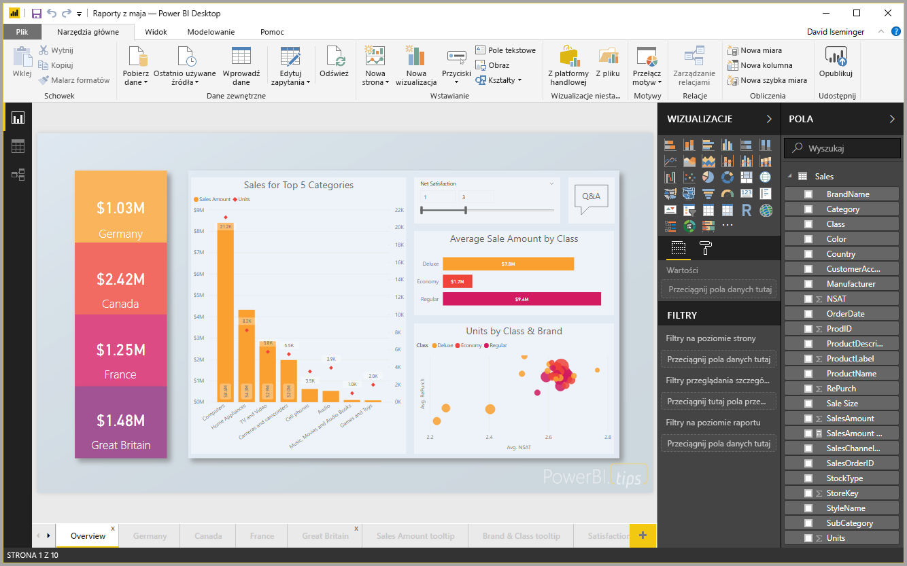
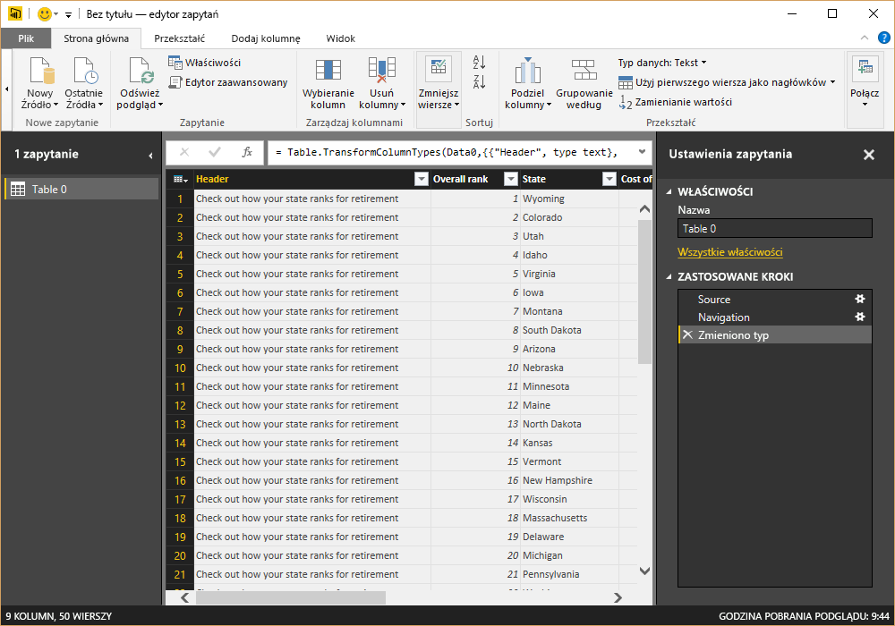
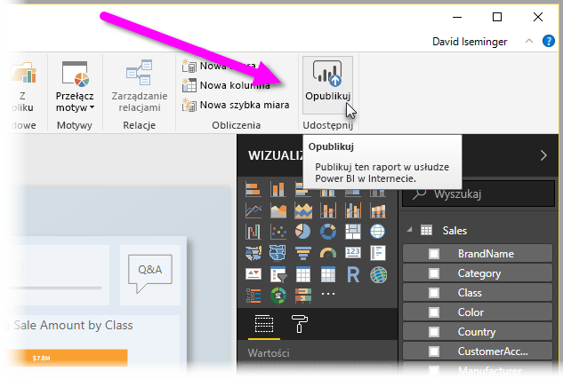

# Czym jest program Power BI Desktop?

Program **Power BI Desktop** to bezpłatna aplikacja, którą można zainstalować na komputerze lokalnym i która umożliwia nawiązywanie połączenia z danymi oraz ich przekształcanie i wizualizowanie. Przy użyciu programu **Power BI Desktop** można nawiązywać połączenia z wieloma różnymi źródłami danych i łączyć je (proces często zwany modelowaniem) w modelu danych umożliwiającym kompilowanie wizualizacji i kolekcji wizualizacji, które można udostępniać innym osobom wewnątrz organizacji w postaci raportów. Większość użytkowników, którzy pracują przy projektach obejmujących analizę biznesową, używa programu **Power BI Desktop** do tworzenia raportów, a następnie udostępnia te raporty innym za pomocą **usługi Power BI**.

Najbardziej typowe zastosowania programu **Power BI Desktop** to:

* Łączenie się z danymi
* Przekształcanie i oczyszczanie tych danych w celu utworzenia modelu danych
* Tworzenie wizualizacji, takich jak wykresy lub grafy, oferujących wizualną reprezentację danych
* Tworzenie raportów, które są kolekcjami wizualizacji i składają się z co najmniej jednej strony
* Udostępnianie raportów innym osobom za pomocą **usługi Power BI**

Osoby najczęściej odpowiedzialne za takie zadania określane są często jako *analitycy danych* (a czasami po prostu *analitycy*) lub specjaliści ds. analizy biznesowej (często określani jako *twórcy raportów*). Jednak wiele osób, które nie uznają się za analityka lub twórcę raportów, używa programu **Power BI Desktop** do tworzenia atrakcyjnych raportów lub do pobierania danych z różnych źródeł i kompilowania modeli danych, które można udostępniać współpracownikom i organizacjom.

Program **Power BI Desktop** umożliwia tworzenie złożonych raportów bogatych w elementy wizualne przy użyciu danych z wielu źródeł. Taki raport można następnie udostępniać innym użytkownikom w organizacji. 

## Łączenie się z danymi
Aby rozpocząć korzystanie z programu **Power BI Desktop**, w pierwszym kroku należy połączyć się z danymi. Z poziomu programu **Power BI Desktop** możesz łączyć się ze źródłami danych różnego rodzaju. Aby połączyć się z danymi, po prostu wybierz wstążkę **Narzędzia główne**, a następnie wybierz opcję **Pobierz dane > Więcej**. Na poniższym rysunku przedstawiono wyświetlane okno **Pobieranie danych**. Zawiera ono wiele kategorii, z którymi program Power BI Desktop może się łączyć.

Po wybraniu typu danych zostanie wyświetlony monit o podanie informacji, takich jak adres URL i poświadczenia, wymaganych przez program Power BI Desktop do połączenia ze źródłem danych w imieniu użytkownika.

Po połączeniu z co najmniej jednym źródłem danych można przekształcać dane w miarę indywidualnych potrzeb.

## Przekształcanie i oczyszczanie danych, tworzenie modelu

W programie Power BI Desktop można oczyszczać i przekształcać dane za pomocą wbudowanego **Edytora zapytań**. Za pomocą Edytora zapytań można wprowadzać zmiany danych, takie jak zmiana ich typu, usuwanie kolumn lub łączenie danych z wielu źródeł danych. To trochę tak jak z rzeźbieniem — można rozpocząć pracę z dużym blokiem gliny (lub danych), a następnie usuwać lub dodawać elementy w miarę potrzeb do momentu, w którym dane przyjmą pożądany kształt. 

Każda zmiana danych (taka jak zmiana nazwy tabeli, przekształcenie typu danych lub usunięcie kolumn) jest rejestrowana w **Edytorze zapytań**, a następnie wykonywana za każdym razem, gdy to zapytanie połączy się ze źródłem danych. Dzięki temu dane są zawsze kształtowane zgodnie z Twoimi instrukcjami.

Na poniższym rysunku przedstawiono okienko **Ustawienia zapytania** dla zapytania, które zostało uformowane i przekształcone w model.

 

Gdy dane osiągną pożądaną formę, można tworzyć wizualizacje. 

## Tworzenie wizualizacji 

Po utworzeniu modelu danych możesz przeciągać *pola* na kanwę raportu, aby tworzyć *wizualizacje*. *Wizualizacja* jest graficzną reprezentacją danych w modelu. Poniższa wizualizacja przedstawia prosty wykres kolumnowy. 

Istnieje wiele różnych typów wizualizacji, które można wybrać w programie Power BI Desktop. Aby utworzyć lub zmienić wizualizację, wystarczy wybrać ikonę wizualizacji w okienku **Wizualizacje**. Wizualizacja wybrana na kanwie raportu zmienia się zgodnie z wybranym typem. W przypadku rezygnacji z wyboru wizualizacji zostanie utworzona nowa wizualizacja w oparciu o dokonany wybór.

## Tworzenie raportów

W większości przypadków należy utworzyć kolekcję wizualizacji obejmującą różne aspekty danych, których użyto do utworzenia modelu w programie Power BI Desktop. Kolekcja wizualizacji w jednym pliku programu Power BI Desktop jest nazywana *raportem*. Raport może zawierać jedną lub więcej stron, tak samo jak plik programu Excel może zawierać jeden lub więcej arkuszy. Na poniższym rysunku widać pierwszą stronę raportu programu Power BI Desktop o nazwie Overview (Przegląd) (kartę można znaleźć w dolnej części rysunku). Ten raport składa się z dziesięciu stron.

## Udostępnianie raportów

Gdy raport jest gotowy do udostępnienia innym osobom, można **opublikować** go w **usłudze Power BI** i udostępnić w organizacji wszystkim użytkownikom z licencją usługi Power BI. Aby opublikować raport programu Power BI Desktop, należy wybrać przycisk **Publikuj** na wstążce **Narzędzia główne** w programie Power BI Desktop.

Po wybraniu przycisku **Publikuj** program Power BI Desktop łączy Cię z **usługą Power BI** przy użyciu konta usługi Power BI, a następnie wyświetla monit o wybranie, gdzie w usłudze Power BI chcesz udostępnić raport, na przykład w obszarze roboczym, obszarze roboczym zespołu lub innym miejscu w usłudze Power BI. Do udostępniania raportów w usłudze Power BI jest wymagana licencja usługi Power BI.

## Następne kroki

Aby rozpocząć korzystanie z programu **Power BI Desktop**, należy najpierw pobrać i zainstalować aplikację. Istnieją dwa sposoby uzyskania programu **Power BI Desktop**:

* [Pobranie programu Power BI Desktop z Internetu](desktop-get-the-desktop.md)
* [Uzyskanie programu Power BI Desktop ze Sklepu Windows](http://aka.ms/pbidesktopstore)
