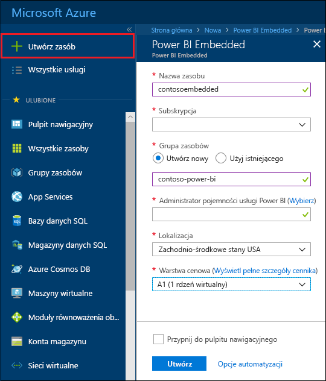
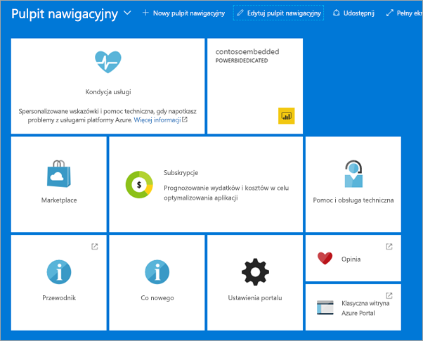

# Tworzenie pojemności usługi Power BI Embedded w witrynie Azure Portal

Ten artykuł zawiera szczegółowe instrukcje dotyczące tworzenia pojemności usługi Power BI Embedded na platformie Microsoft Azure. Power BI Embedded ułatwia korzystanie z funkcji usługi Power BI, pozwalając szybko dodawać do aplikacji atrakcyjne wizualizacje, raporty i pulpity nawigacyjne.

Jeśli nie masz subskrypcji platformy Azure, przed rozpoczęciem utwórz [bezpłatne konto](https://azure.microsoft.com/free/).

> [!VIDEO https://www.youtube.com/embed/aXrvFfg_iSk]

## Zanim rozpoczniesz

Do wykonania czynności opisanych w tym przewodniku Szybki start potrzebne są następujące elementy:

* **Subskrypcja platformy Azure:** odwiedź stronę [Bezpłatna wersja próbna platformy Azure](https://azure.microsoft.com/free/) i utwórz konto.
* **Usługa Azure Active Directory:** Twoja subskrypcja musi być skojarzona z dzierżawą usługi Azure Active Directory (AAD). Ponadto ***musisz zalogować się do platformy Azure przy użyciu konta z tej dzierżawy***. Konta Microsoft nie są obsługiwane. Aby dowiedzieć się więcej, zobacz [Authentication and user permissions (Uwierzytelnianie i uprawnienia użytkownika)](https://docs.microsoft.com/azure/analysis-services/analysis-services-manage-users).
* **Dzierżawa usługi Power BI:** co najmniej jedno konto w dzierżawie usługi AAD musi być zarejestrowane w celu korzystania z usługi Power BI.
* **Grupa zasobów:** użyj swojej grupy zasobów lub [utwórz nową](https://docs.microsoft.com/azure/azure-resource-manager/resource-group-overview).

## Tworzenie pojemności

1. Zaloguj się w witrynie [Azure Portal](https://portal.azure.com/).

2. Wybierz pozycję **Utwórz zasób** > **Dane i analiza**.

3. W polu wyszukiwania wpisz *Power BI Embedded*.

4. W sekcji Power BI Embedded wybierz pozycję **Utwórz**.

5. Podaj wymagane informacje, a następnie wybierz pozycję **Utwórz**.

    

    |Ustawienie |Opis |
    |---------|---------|
    |**Nazwa zasobu**|Nazwa identyfikująca pojemność. Nazwa zasobu jest wyświetlana w portalu administracyjnym usługi Power BI oraz w witrynie Azure Portal.|
    |**Subskrypcja**|Subskrypcja, w ramach której chcesz utworzyć pojemność.|
    |**Grupa zasobów**|Grupa zasobów zawierająca nową pojemność. Wybierz istniejącą grupę zasobów lub utwórz nową grupę. Aby uzyskać więcej informacji, zobacz [Omówienie usługi Azure Resource Manager](https://docs.microsoft.com/azure/azure-resource-manager/resource-group-overview).|
    |**Administrator pojemności usługi Power BI**|Administratorzy pojemności usługi Power BI mogą wyświetlać pojemność w portalu administracyjnym usługi Power BI i przyznawać uprawnienia do przypisywania innym użytkownikom. Domyślnie Twoje konto ma uprawnienia administratora pojemności. Konto administratora pojemności musi należeć do dzierżawy usługi Power BI.|
    |**Lokalizacja**|Lokalizacja hostowania usługi Power BI dla Twojej dzierżawy. To ustawienie jest konfigurowane automatycznie — nie można wybrać innej lokalizacji.|
    |**Warstwa cenowa**|Wybierz jednostkę SKU (rozmiar pamięci i liczbę rdzeni wirtualnych), która spełnia Twoje wymagania.  Aby uzyskać więcej informacji, zobacz [Power BI Embedded pricing (Cennik usługi Power BI Embedded)](https://azure.microsoft.com/pricing/details/power-bi-embedded/).|

6. Wybierz pozycję **Utwórz**.

Tworzenie pojemności zwykle trwa krócej niż minutę, a często zaledwie kilka sekund. Jeśli wybierzesz opcję **Przypnij do pulpitu nawigacyjnego**, możesz przejść do pulpitu nawigacyjnego i wyświetlić nową pojemność. Możesz też wybrać pozycję **Wszystkie usługi** > **Power BI Embedded**, aby sprawdzić, czy pojemność jest gotowa.

## Następne kroki

Aby zacząć korzystać z nowej pojemności usługi Power BI Embedded, przejdź do portalu administracyjnego usługi Power BI w celu przypisania obszarów roboczych. Aby uzyskać więcej informacji, zobacz [Zarządzanie pojemnościami w usługach Power BI Premium i Power BI Embedded](https://powerbi.microsoft.com/documentation/powerbi-admin-premium-manage/).

Jeśli nie potrzebujesz tej pojemności, możesz ją wstrzymać, aby zatrzymać naliczanie opłat. Aby uzyskać więcej informacji, zobacz [Pause and start your Power BI Embedded capacity in the Azure portal (Wstrzymywanie i uruchamianie pojemności usługi Power BI Embedded w witrynie Azure Portal)](azure-pbie-pause-start.md).

Aby rozpocząć osadzanie zawartości usługi Power BI w aplikacji, zobacz [Jak osadzić pulpity nawigacyjne, raporty i kafelki usługi Power BI](https://powerbi.microsoft.com/documentation/powerbi-developer-embedding-content/).

Masz więcej pytań? [Zadaj pytanie społeczności usługi Power BI](http://community.powerbi.com/)