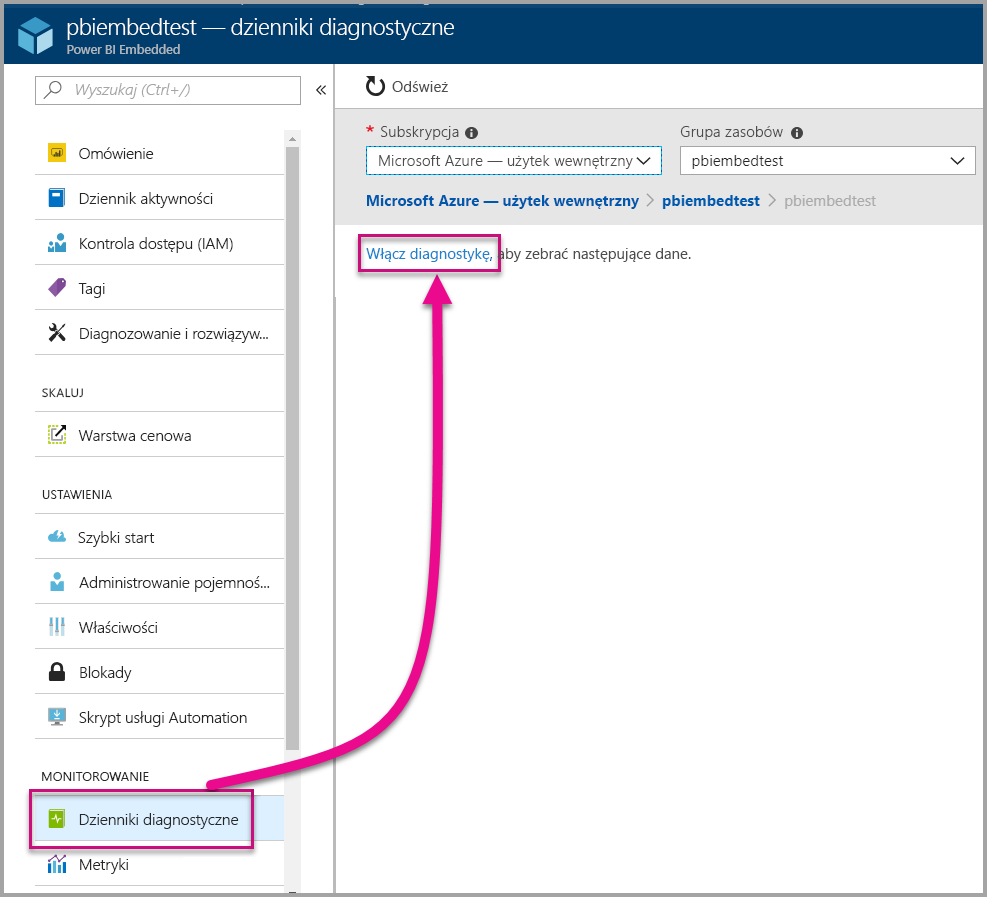
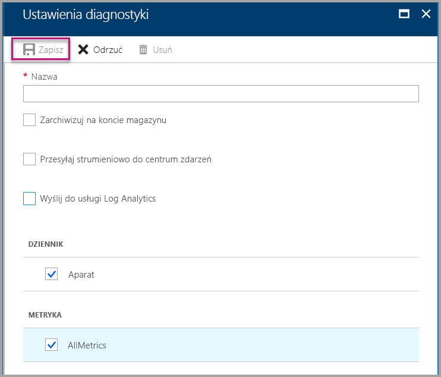
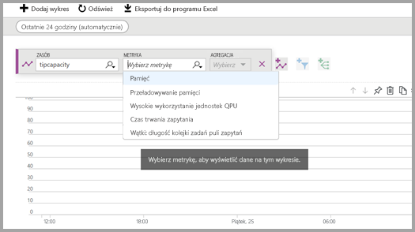
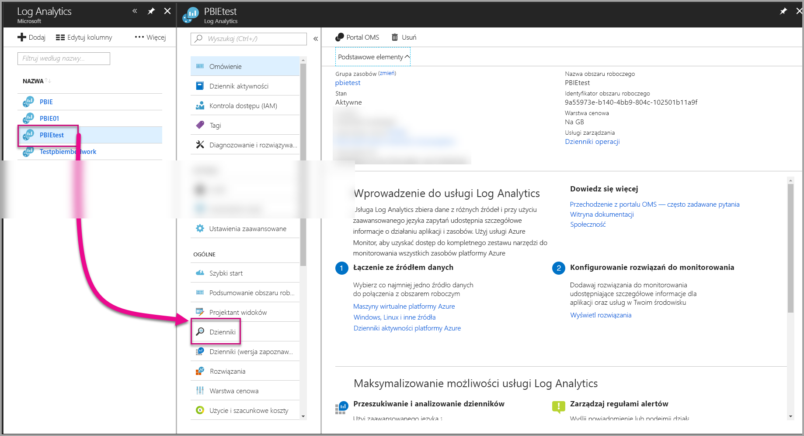
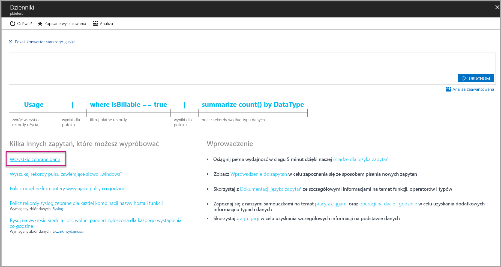
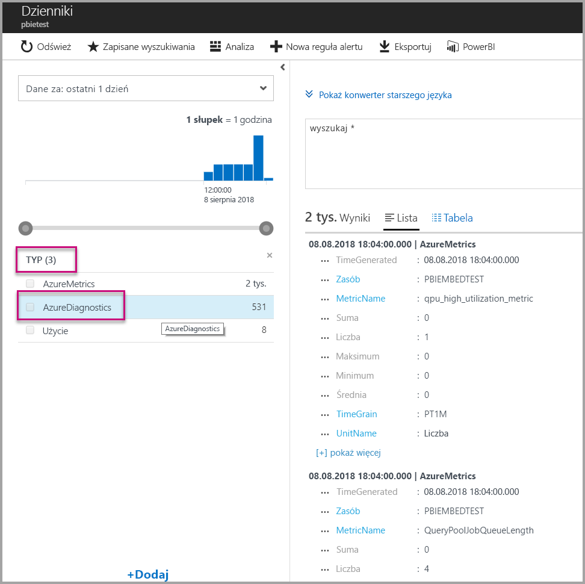
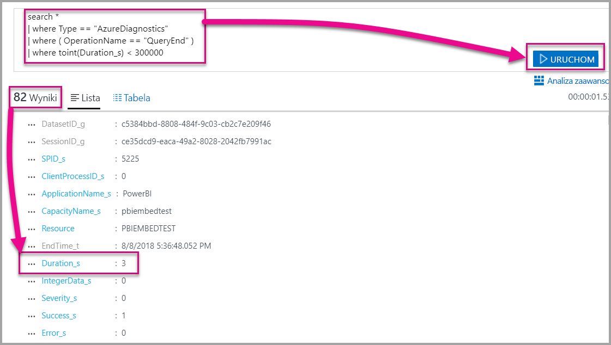
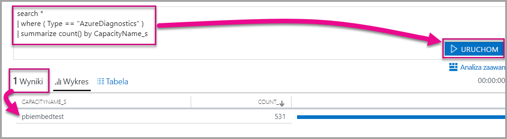

# <a name="diagnostic-logging-for-power-bi-embedded-in-azure"></a>Rejestrowanie diagnostyczne dla usługi Power BI Embedded na platformie Azure

Korzystając z [dzienników diagnostycznych zasobu na platformie Azure](https://docs.microsoft.com/azure/monitoring-and-diagnostics/monitoring-overview-of-diagnostic-logs), można rejestrować wiele zdarzeń produkcyjnych, przekazywać je do narzędzia do analizy i uzyskiwać wgląd w zachowanie zasobu.

Korzystanie z diagnostyki pozwala uzyskać odpowiedzi na kilka scenariuszy, takich jak:

* Wykrywanie zapytań długotrwałych lub powodujących problemy.
* Wykrywanie błędów po osiągnięciu limitu pojemności.
* Tworzenie wartości pochodnych z [metryk pojemności](https://powerbi.microsoft.com/blog/power-bi-developer-community-april-update/).
* Śledzenie użycia określonych zestawów danych.

## <a name="set-up-diagnostics-logging"></a>Konfigurowanie rejestrowania diagnostycznego

### <a name="azure-portal"></a>Witryna Azure Portal

1. W witrynie [Azure Portal](https://portal.azure.com) > zasób Power BI Embedded wybierz opcję **Dzienniki diagnostyczne** w lewym okienku nawigacyjnym, a następnie wybierz opcję **Włącz diagnostykę**.

    

2. W obszarze **Ustawienia diagnostyczne** określ następujące opcje:

    * **Nazwa** — wprowadź nazwę tworzonych ustawień diagnostyki.

    * **Zarchiwizuj na koncie magazynu** — aby użyć tej opcji, należy połączyć się z istniejącym kontem magazynu. Zobacz temat [Tworzenie konta magazynu](https://docs.microsoft.com/azure/storage/common/storage-create-storage-account) i postępuj zgodnie z instrukcjami, aby utworzyć konto magazynu. Następnie wybierz swoje konto magazynu, powracając do tej strony w portalu. Może upłynąć kilka minut, zanim konta nowo utworzonego magazynu pojawią się w menu rozwijanym. Pliki dziennika są przechowywane w formacie JSON.
    * **Przesyłaj strumieniowo do centrum zdarzeń** — aby użyć tej opcji, należy połączyć się z istniejącą przestrzenią nazw usługi Event Hub i centrum zdarzeń. Aby dowiedzieć się więcej, zobacz temat [Tworzenie przestrzeni nazw usługi Event Hubs i centrum zdarzeń za pomocą witryny Azure Portal](https://docs.microsoft.com/azure/event-hubs/event-hubs-create).
    * **Wyślij do usługi Log Analytics** — aby skorzystać z tej opcji, użyj istniejącego obszaru roboczego lub utwórz nowy obszar roboczy usługi Log Analytics, wykonując następujące kroki, prowadzące do [utworzenia nowego obszar roboczego](https://docs.microsoft.com/azure/log-analytics/log-analytics-quick-collect-azurevm#create-a-workspace) w portalu. Ta funkcja korzysta z usługi [Azure Log Analytics](https://docs.microsoft.com/azure/log-analytics/log-analytics-overview), która zapewnia wbudowane funkcje analizy, pulpitów nawigacyjnych i powiadomień. Usługa Log Analytics umożliwia łączenie większej ilości danych z innych zasobów oraz uzyskanie pojedynczego i pełnego widoku danych znajdujących się we wszystkich zasobach aplikacji. Można ją również połączyć z [usługą Power BI za pomocą jednego kliknięcia](https://docs.microsoft.com/azure/log-analytics/log-analytics-powerbi).
    Aby uzyskać więcej informacji dotyczących przeglądania dzienników w usłudze Log Analytics, zobacz temat [Przeglądanie dzienników w usłudze Log Analytics](https://docs.microsoft.com/azure/log-analytics/log-analytics-activity).
    * **Aparat** — wybierz tę opcję, aby zarejestrować zestaw poniżej [wymienionych zdarzeń](#whats-logged) aparatu.
    * **AllMetrics** — wybierz tę opcję, aby przechowywać pełne dane w [Metrykach](https://docs.microsoft.com/azure/analysis-services/analysis-services-monitor#server-metrics). Jeśli dokonujesz archiwizacji na koncie magazynu, możesz wybrać okres przechowywania dzienników diagnostycznych. Dzienniki są usuwane automatycznie po upływie okresu przechowywania.

3. Wybierz pozycję **Zapisz**.

    Aby zmienić sposób zapisywania dzienników diagnostycznych, możesz wrócić do tej strony, aby zmodyfikować ustawienia.

    

### <a name="using-powershell-to-enable-diagnostics"></a>Włączanie diagnostyki przy użyciu programu PowerShell

Aby włączyć metryki i rejestrowanie diagnostyki przy użyciu programu PowerShell, użyj następujących poleceń:

* Aby włączyć magazyn dzienników diagnostycznych na koncie magazynu, użyj tego polecenia:

    ```powershell
    Set-AzureRmDiagnosticSetting -ResourceId [your resource id] -StorageAccountId [your storage account id] -Enabled $true
    ```
    Identyfikator konta magazynu jest identyfikatorem zasobu konta magazynu, do którego chcesz wysłać dzienniki.

* Aby włączyć strumieniowe przesyłanie dzienników diagnostycznych do centrum zdarzeń, użyj tego polecenia:

    ```powershell
    Set-AzureRmDiagnosticSetting -ResourceId [your resource id] -ServiceBusRuleId [your service bus rule id] -Enabled $true
    ```
* Identyfikator reguły usługi Azure Service Bus jest ciągiem o następującym formacie:

    ```powershell
    {service bus resource ID}/authorizationrules/{key name}
    ```

* Aby włączyć wysyłanie dzienników diagnostycznych do obszaru roboczego usługi Log Analytics, użyj tego polecenia:

    ```powershell
        Set-AzureRmDiagnosticSetting -ResourceId [your resource id] -WorkspaceId [resource id of the log analytics workspace] -Enabled $true
    ```

* Identyfikator zasobu obszaru roboczego usługi Log Analytics można uzyskać za pomocą następującego polecenia:

    ```powershell
    (Get-AzureRmOperationalInsightsWorkspace).ResourceId
    ```

Można połączyć te parametry, aby uaktywnić wiele opcji danych wyjściowych.

### <a name="rest-api"></a>Interfejs API REST

Dowiedz się, jak [zmienić ustawienia diagnostyczne przy użyciu interfejsu API REST usługi Azure Monitor](https://docs.microsoft.com/rest/api/monitor/). 

### <a name="resource-manager-template"></a>Szablon usługi Menedżer zasobów

Dowiedz się, jak [włączyć ustawienia diagnostyczne podczas tworzenia zasobu przy użyciu szablonu usługi Menedżer zasobów](https://docs.microsoft.com/azure/monitoring-and-diagnostics/monitoring-enable-diagnostic-logs-using-template).

## <a name="whats-logged"></a>Co zostało zarejestrowane?

Możesz wybrać kategorię **Aparat** i/lub **AllMetrics**.

### <a name="engine"></a>Aparat

Kategoria aparatu określa, że rejestrowane będą następujące zdarzenia zasobu, a każdemu z tych zdarzeń towarzyszą właściwości:

|     Nazwa zdarzenia     |     Opis zdarzenia     |
|----------------------------|----------------------------------------------------------------------------------|
|    Logowanie inspekcji    |    Rejestruje wszystkie nowe zdarzenia połączenia z aparatem od rozpoczęcia śledzenia.    |
|    Inicjowanie sesji    |    Rejestruje wszystkie zdarzenia inicjowania sesji od rozpoczęcia śledzenia.    |
|    Początek zapytania w trybie Vertipaq    |    Rejestruje wszystkie zdarzenia początku zapytania SE trybu VertiPaq od rozpoczęcia śledzenia.    |
|    Początek zapytania    |    Rejestruje wszystkie zdarzenia początku zapytania od czasu rozpoczęcia śledzenia.    |
|    Koniec zapytania    |    Rejestruje wszystkie zdarzenia końca zapytania od czasu rozpoczęcia śledzenia.    |
|    Koniec zapytania w trybie Vertipaq    |    Rejestruje wszystkie zdarzenia końca zapytania SE trybu VertiPaq od rozpoczęcia śledzenia.    |
|    Wylogowanie inspekcji    |    Rejestruje wszystkie zdarzenia rozłączenia z aparatem od rozpoczęcia śledzenia.    |
|    Błąd    |    Rejestruje wszystkie zdarzenia błędów aparatu od rozpoczęcia śledzenia.    |

</br>
</br>

| Nazwa właściwości | Przykład końca zapytania w trybie Vertipaq | Opis właściwości |
|-------------------|---------------------------------------------------------------------------------------------------------------------------------------------------------------------------------------------------------|--------------------------------------------------------------------------------------------------------------------------|
| EventClass | XM_SEQUERY_END | Klasa zdarzenia jest używana do kategoryzowania zdarzenia. |
| EventSubclass | 0 | Podklasa zdarzenia udostępnia dodatkowe informacje o poszczególnych klasach zdarzeń. (na przykład 0: skanowanie VertiPaq) |
| RootActivityId | ff217fd2-611d-43c0-9c12-19e202a94f70 | Identyfikator działania głównego. |
| CurrentTime | 2018-04-06T18:30:11.9137358Z | Czas rozpoczęcia zdarzenia, gdy jest dostępny. |
| StartTime | 2018-04-06T18:30:11.9137358Z | Czas rozpoczęcia zdarzenia, gdy jest dostępny. |
| Identyfikator zadania | 0 | Identyfikator zadania na potrzeby sprawdzania postępu. |
| ObjectID | 464 | Identyfikator obiektu |
| ObjectType | 802012 | ObjectType |
| ObjectName | SalesLT Customer | ObjectName |
| ObjectPath | 5eaa550e-06ac-4adf-aba9-dbf0e8fd1527.Model.SalesLT Customer | Ścieżka obiektu. Rozdzielana przecinkami lista elementów nadrzędnych, począwszy od elementu nadrzędnego obiektu. |
| ObjectReference | <Object><Table>SalesLT Customer</Table><Model>Model</Model><Database>5eaa550e-06ac-4adf-aba9-dbf0e8fd1527</Database></Object> | Odwołanie do obiektu. Kodowane w formacie XML w przypadku wszystkich elementów nadrzędnych. Sam obiekt jest opisywany przy użyciu tagów. |
| EndTime | 2018-04-06T18:30:11.9137358Z | Czas zakończenia zdarzenia, gdy jest dostępny. |
| Czas trwania | 0 | Czas trwania zdarzenia (w milisekundach). |
| SessionType | Użytkownik | Typ sesji (jednostka, która doprowadziła do wykonania operacji). |
| ProgressTotal | 0 | Łączny postęp. |
| IntegerData | 0 | Dane w postaci liczb całkowitych. |
| Ważność | 0 | Poziom ważności wyjątku. |
| Powodzenie | 1 | 1 = powodzenie. 0 = niepowodzenie (na przykład wartość 1 oznacza powodzenie sprawdzenia uprawnień, a wartość 0 oznacza niepowodzenie tego sprawdzenia). |
| Błąd | 0 | Numer błędu podanego zdarzenia. |
| TextData | SET DC_KIND=\"AUTO\";  SELECT  [SalesLT Customer (464)].[rowguid (606)] AS [SalesLT Customer (464)$rowguid (606)]  FROM [SalesLT Customer (464)]; [Szacowany rozmiar (liczba przesłanych bajtów): 850 6800] | Dane tekstowe skojarzone ze zdarzeniem. |
| ConnectionID | 3 | Unikatowy identyfikator połączenia. |
| DatasetID | 5eaa550e-06ac-4adf-aba9-dbf0e8fd1527 | Identyfikator zestawu danych, w którym uruchomiono instrukcję użytkownika. |
| SessionID | 3D063F66-A111-48EE-B960-141DEBDA8951 | Identyfikator GUID sesji. |
| SPID | 180 | Identyfikator procesu serwera. Jednoznacznie identyfikuje sesję użytkownika. Odpowiada bezpośrednio identyfikatorowi GUID sesji używanemu przez XML/A. |
| ClientProcessID | null | Identyfikator procesu aplikacji klienckiej. |
| ApplicationName | null | Nazwa aplikacji klienckiej, która utworzyła połączenie z serwerem. |
| CapacityName | pbi641fb41260f84aa2b778a85891ae2d97 | Nazwa zasobu pojemności usługi Power BI Embedded. |
| RequestParameters |  |  |
| RequestProperties |  |  |

### <a name="allmetrics"></a>AllMetrics

Zaznaczenie opcji **AllMetrics** powoduje rejestrowanie danych wszystkich metryk, których można użyć z zasobem Power BI Embedded.

   

## <a name="manage-your-logs"></a>Zarządzanie dziennikami

Dzienniki są zwykle dostępne w ciągu kilku godzin po skonfigurowaniu rejestrowania. Zarządzanie dziennikami na Twoim koncie magazynu zależy od Ciebie:

* Aby zabezpieczyć dzienniki poprzez ograniczenie dostępu do nich, użyj standardowych metod kontroli dostępu platformy Azure.
* Usuń dzienniki, których już nie chcesz przechowywać na koncie magazynu.
* Pamiętaj, aby ustawić okres przechowywania, dzięki czemu stare dzienniki będą usuwane z konta magazynu.

## <a name="view-logs-in-log-analytics"></a>Wyświetlanie dzienników w usłudze Log Analytics

Metryki i zdarzenia serwera są zintegrowane ze zdarzeniami xEvent w usłudze Log Analytics w celu prowadzenia analiz równoczesnych. Usługę Log Analytics można skonfigurować w taki sposób, aby odbierać zdarzenia z innych usług platformy Azure, zapewniające całościowy obraz danych dzienników diagnostycznych w ramach architektury.

Aby wyświetlić dane diagnostyczne w usłudze Log Analytics, otwórz stronę **Dzienniki** z menu po lewej stronie lub z obszaru Zarządzanie, jak pokazano poniżej.



Gdy zbieranie danych zostało już włączone, w pozycji **Dzienniki** wybierz opcję **Wszystkie zebrane dane**.



W pozycji **Typ** wybierz opcję **AzureDiagnostics**, a następnie wybierz pozycję **Zastosuj**. Usługa AzureDiagnostics obejmuje zdarzenia aparatu. Należy zauważyć, że zapytanie usługi Log Analytics jest tworzone na bieżąco.



Wybierz pozycję **EventClass\_s** lub jedną z nazw zdarzeń. Usługa Log Analytics będzie kontynuować konstruowanie zapytania. Pamiętaj, aby zapisywać zapytania, dzięki czemu będzie można skorzystać z nich później.

Pamiętaj, aby zajrzeć do usługi [Log Analytics](https://docs.microsoft.com/azure/log-analytics/), która udostępnia witrynę sieci Web z rozszerzonymi funkcjami dotyczącymi zapytań, paneli nawigacyjnych i zgłaszania alertów w związku z zebranymi danymi.

### <a name="queries"></a>Zapytania

Istnieją setki zapytań, z których można skorzystać. Poniżej przedstawiono kilka z nich, które ułatwią Ci rozpoczęcie pracy. Aby dowiedzieć się więcej na temat korzystania z nowego języka zapytań dla funkcji wyszukiwania w dziennikach, zobacz artykuł [Informacje na temat wyszukiwania w usłudze Log Analytics](https://docs.microsoft.com/azure/log-analytics/log-analytics-log-search).

* Wynik zapytania, który jest zwracany w czasie krótszym niż pięć minut (300 000 milisekund).

    ```
    search *
    | where Type == "AzureDiagnostics"
    | where ( OperationName == "QueryEnd" )
    | where toint(Duration_s) < 300000
    ```

    

* Określ nazwy pojemności.

    ```
    search *
    | where ( Type == "AzureDiagnostics" )
    | summarize count() by CapacityName_s 
    ```

    

## <a name="next-steps"></a>Następne kroki

Można dowiedzieć się więcej na temat rejestrowania diagnostycznego zasobów platformy Azure.

> [!div class="nextstepaction"]
> [Rejestrowanie diagnostyczne zasobów platformy Azure](https://docs.microsoft.com/azure/monitoring-and-diagnostics/monitoring-overview-of-diagnostic-logs)

> [!div class="nextstepaction"]
> [Set-AzureRmDiagnosticSetting](https://docs.microsoft.com/powershell/module/azurerm.insights/Set-AzureRmDiagnosticSetting)