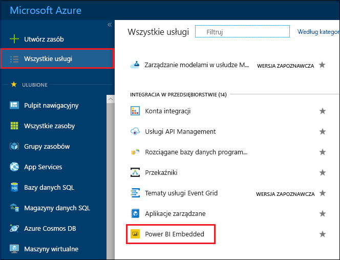
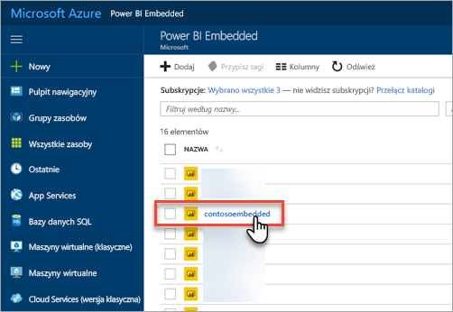
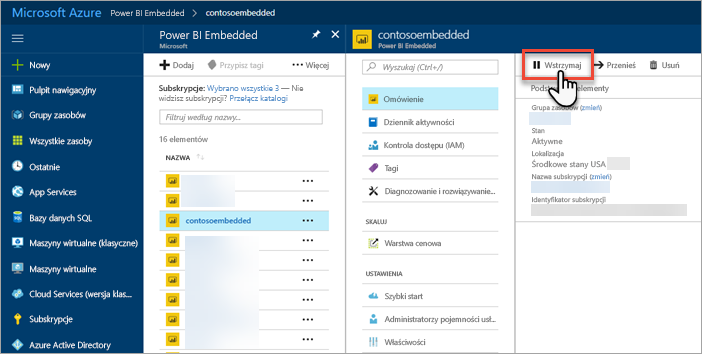
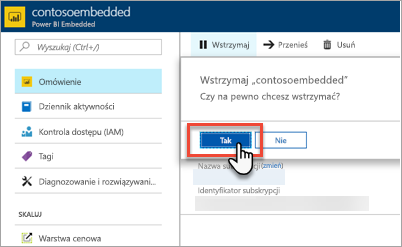
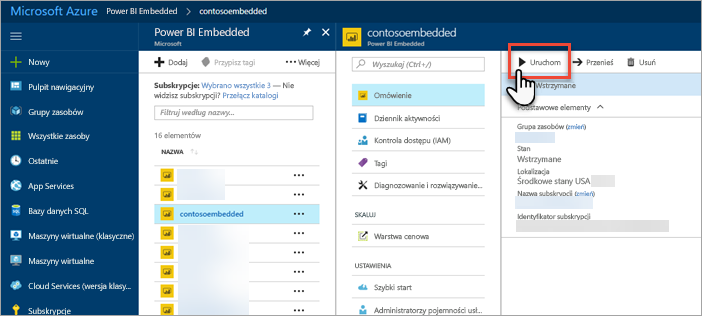
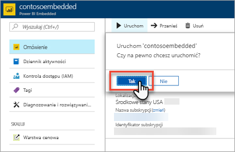

# Wstrzymywanie i uruchamianie pojemności usługi Power BI Embedded w witrynie Azure Portal

Ten artykuł zawiera szczegółowe instrukcje dotyczące wstrzymywania i uruchamiania pojemności usługi Power BI Embedded na platformie Microsoft Azure. Zakłada się, że utworzono pojemność usługi Power BI Embedded. Jeśli tego nie zrobiono, zobacz [Tworzenie pojemności usługi Power BI Embedded w witrynie Azure Portal](azure-pbie-create-capacity.md).

Jeśli nie masz subskrypcji platformy Azure, przed rozpoczęciem utwórz [bezpłatne konto](https://azure.microsoft.com/free/).

## Wstrzymywanie pojemności

Wstrzymanie pojemności powoduje zatrzymanie naliczania opłat. To dobre rozwiązanie, jeśli nie jest ona potrzebna przez pewien czas. Aby wstrzymać pojemność, wykonaj następujące kroki.

> [!NOTE]
> Wstrzymanie pojemności może uniemożliwić korzystanie z zawartości w usłudze Power BI. Przed wstrzymaniem pojemności koniecznie cofnij przypisanie obszarów roboczych, aby uniknąć przerw.

1. Zaloguj się w witrynie [Azure Portal](https://portal.azure.com/).

2. Wybierz pozycję **Wszystkie usługi** > **Power BI Embedded**, aby wyświetlić pojemności.

    

3. Wybierz pojemność, którą chcesz wstrzymać.

    

4. W obszarze szczegółów pojemności wybierz pozycję **Wstrzymaj**.

    

5. Wybierz pozycję **Tak**, aby potwierdzić, że chcesz wstrzymać pojemność.

    

## Uruchamianie pojemności

Po uruchomieniu pojemności możesz wznowić korzystanie z niej. Uruchomienie pojemności powoduje również wznowienie naliczania opłat.

1. Zaloguj się w witrynie [Azure Portal](https://portal.azure.com/).

2. Wybierz pozycję **Wszystkie usługi** > **Power BI Embedded**, aby wyświetlić pojemności.

    

3. Wybierz pojemność, którą chcesz uruchomić.

    

4. W obszarze szczegółów pojemności wybierz pozycję **Uruchom**.

    

5. Wybierz pozycję **Tak**, aby potwierdzić, że chcesz uruchomić pojemność.

    

Po uruchomieniu pojemności zawartość przypisana do tej pojemności stanie się dostępna.

## Następne kroki

Jeśli chcesz przeskalować pojemność w górę lub w dół, zobacz [Skalowanie pojemności usługi Power BI Embedded](azure-pbie-scale-capacity.md).

Aby rozpocząć osadzanie zawartości usługi Power BI w aplikacji, zobacz [Jak osadzić pulpity nawigacyjne, raporty i kafelki usługi Power BI](https://powerbi.microsoft.com/documentation/powerbi-developer-embedding-content/).

Masz więcej pytań? [Zadaj pytanie społeczności usługi Power BI](http://community.powerbi.com/)