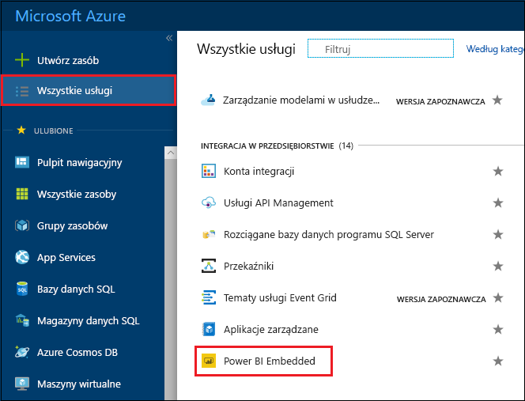
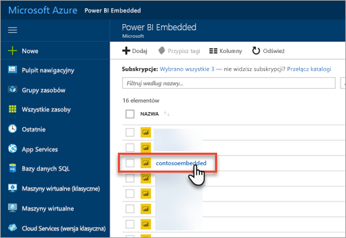
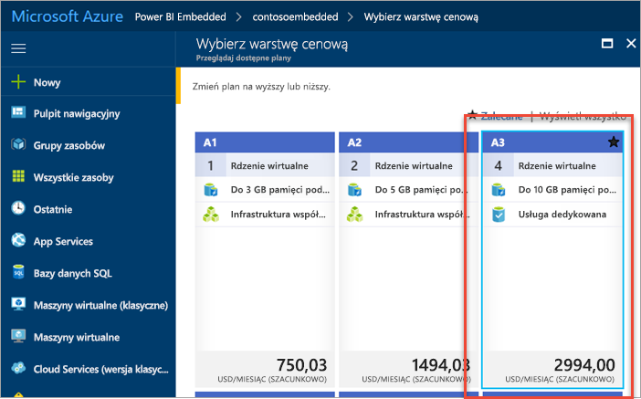
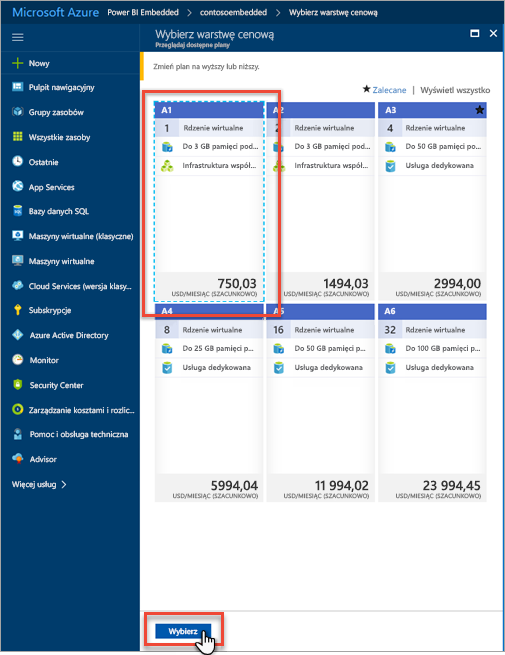
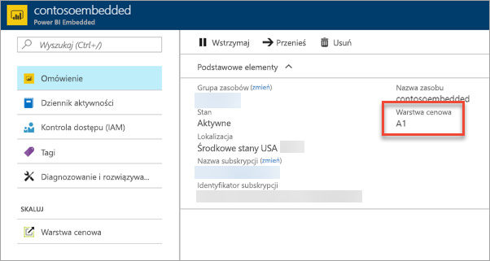

# Skalowanie pojemności usługi Power BI Embedded w witrynie Azure Portal

Ten artykuł zawiera szczegółowe instrukcje dotyczące skalowania pojemności usługi Power BI Embedded na platformie Microsoft Azure. Skalowanie pozwala zwiększać lub zmniejszać rozmiar pojemności.

Zakłada się, że utworzono pojemność usługi Power BI Embedded. Jeśli tego nie zrobiono, zobacz [Tworzenie pojemności usługi Power BI Embedded w witrynie Azure Portal](azure-pbie-create-capacity.md).

> [!NOTE]
> Operacja skalowania może potrwać około minuty. W tym czasie pojemność nie jest dostępna. Załadowanie osadzonej zawartości może okazać się niemożliwe.

## Skalowanie pojemności

1. Zaloguj się w witrynie [Azure Portal](https://portal.azure.com/).

2. Wybierz pozycję **Wszystkie usługi** > **Power BI Embedded**, aby wyświetlić pojemności.

    

3. Wybierz pojemność, którą chcesz przeskalować.

    

4. W odpowiedniej sekcji pojemności wybierz pozycję **Warstwa cenowa** w obszarze **Skalowanie**.

    

    Bieżąca warstwa cenowa jest oznaczona na niebiesko.

    

5. Aby przeskalować w górę lub w dół, wybierz nową warstwę. Nowa warstwa zostanie oznaczona za pomocą przerywanej niebieskiej linii. Wybierz pozycję **Wybierz**, aby zaakceptować zmianę skali na nową warstwę.

    

    Skalowanie pojemności może potrwać do dwóch minut.

6. Upewnij się, że warstwa została zmieniona, wyświetlając kartę Przegląd. Będzie widoczna informacja o bieżącej warstwie cenowej.

    

## Następne kroki

Aby wstrzymać lub uruchomić pojemność, zobacz [Pause and start your Power BI Embedded capacity in the Azure portal (Wstrzymywanie i uruchamianie pojemności usługi Power BI Embedded w witrynie Azure Portal)](azure-pbie-pause-start.md).

Aby rozpocząć osadzanie zawartości usługi Power BI w aplikacji, zobacz [Jak osadzić pulpity nawigacyjne, raporty i kafelki usługi Power BI](https://powerbi.microsoft.com/documentation/powerbi-developer-embedding-content/).

Masz więcej pytań? [Zadaj pytanie społeczności usługi Power BI](http://community.powerbi.com/)
