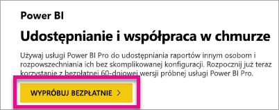

# Tworzenie dzierżawy usługi Azure Active Directory do użycia z usługą Power BI
Dowiedz się, jak utworzyć nową dzierżawę usługi Azure Active Directory (Azure AD) do użycia z Twoją niestandardową aplikacją za pomocą interfejsów API REST usługi Power BI.

Dzierżawa to reprezentacja organizacji w usłudze Azure Active Directory. Jest to dedykowane wystąpienie usługi Azure AD, którą organizacja otrzymuje i której zostaje właścicielem po zarejestrowaniu się w usłudze w chmurze firmy Microsoft, takiej jak Azure, Microsoft Intune lub Office 365. Każda dzierżawa usługi Azure AD jest odrębna i oddzielona od innych dzierżaw usługi Azure AD.

Jeśli masz już dzierżawę usługi Azure AD, możesz zdefiniować aplikację i przypisać uprawnienia, aby aplikacja mogła wykorzystywać interfejsy API REST usługi Power BI.

Być może Twoja organizacja ma już dzierżawę usługi Azure AD, którą możesz wykorzystać w swojej aplikacji. W swojej aplikacji możesz korzystać z tej dzierżawy lub utworzyć nową dzierżawę specjalnie przystosowaną do potrzeb swojej aplikacji. W tym artykule pokazano, jak utworzyć nową dzierżawę.

## Tworzenie dzierżawy usługi Azure Active Directory
Aby zintegrować usługę Power BI z Twoją niestandardową aplikacją, musisz zdefiniować aplikację w usłudze Azure AD. W tym celu potrzebujesz katalogu w usłudze Azure AD. To jest Twoja dzierżawa. Jeśli Twoja organizacja nie ma jeszcze dzierżawy, ponieważ nie korzysta z usługi Power BI ani z usługi Office 365, [musisz ją utworzyć](https://docs.microsoft.com/azure/active-directory/develop/active-directory-howto-tenant). Utworzenie dzierżawy może też okazać się konieczne, jeśli nie chcesz łączyć swojej aplikacji z dzierżawą organizacji. Dzięki temu wszystkie elementy pozostaną oddzielne.

Możesz też utworzyć dzierżawę do celów testowych.

Aby utworzyć nową dzierżawę usługi Azure AD, wykonaj następujące czynności.

1. Przejdź do witryny [Azure Portal](https://portal.azure.com) i zaloguj się przy użyciu konta, które ma subskrypcję platformy Azure.
2. Wybierz **ikonę plusa (+)** i wyszukaj pozycję *Azure Active Directory*.
   
    
3. W wynikach wyszukiwania wybierz pozycję **Azure Active Directory**.
   
    
4. Wybierz pozycję **Utwórz**.
5. Podaj **nazwę organizacji** oraz **początkową nazwę domeny**. Następnie wybierz pozycję **Utwórz**. Spowoduje to utworzenie katalogu.
   
    
   
   > [!NOTE]
   > Domena początkowa będzie częścią domeny onmicrosoft.com. Później można dodać inne nazwy domeny. Do katalogu dzierżawy można przypisać wiele domen.
   > 
   > 
6. Po zakończeniu tworzenia katalogu zaznacz pole informacji, aby zarządzać nowym katalogiem.

Katalog został utworzony. Następnie dodamy użytkownika do dzierżawy.

## Tworzenie użytkowników w dzierżawie usługi Azure Active Directory
Skoro mamy już katalog, utwórzmy co najmniej dwóch użytkowników. Jeden będzie administratorem globalnym dzierżawy, a drugi będzie naszym głównym użytkownikiem do osadzania. Myśl o tym jak o koncie usługi.

1. W witrynie Azure Portal upewnij się, że jesteś w menu wysuwanym usługi Azure Active Directory.
   
    
   
    Jeśli nie, wybierz ikonę usługi Azure Active Directory na pasku usług po lewej stronie.
   
    
2. W obszarze **Zarządzanie** wybierz pozycję **Użytkownicy i grupy**.
   
    
3. Wybierz pozycję **Wszyscy użytkownicy**, a następnie pozycję **+ Nowy użytkownik**.
4. Podaj nazwisko i nazwę użytkownika dla tego użytkownika. Będzie on administratorem globalnym dla dzierżawy. Zmień także **rolę katalogu** na *administratora globalnego*. Możesz również wyświetlić hasło tymczasowe. Gdy wszystko będzie gotowe, wybierz przycisk **Utwórz**.
   
    
5. Te same czynności wykonasz później w przypadku zwykłego użytkownika w dzierżawie. Możesz także wykorzystać tę procedurę w przypadku głównego konta osadzania. Tym razem pozostawimy pozycję **Rola katalogu** w ustawieniu *Użytkownik*. Pamiętaj, aby zanotować hasło. Następnie wybierz pozycję **Utwórz**.
   
    
6. Zaloguj się do usługi Power BI przy użyciu konta użytkownika utworzonego w kroku 5. Aby to zrobić, przejdź do [witryny powerbi.com](https://powerbi.microsoft.com/get-started/) i wybierz pozycję **Wypróbuj bezpłatnie** w obszarze *Power BI — współpraca w chmurze i udostępnianie*.
   
    
   
    Podczas tworzenia konta zostanie wyświetlony monit z propozycją bezpłatnego wypróbowania usługi Power BI Pro przez 60 dni. Możesz się na to zdecydować, aby stać się użytkownikiem wersji Pro. Teraz możesz również zacząć tworzenie osadzonego rozwiązania, jeśli tego szukasz.
   
   > [!NOTE]
   > Upewnij się, że logujesz się przy użyciu adresu e-mail, który został podany dla konta użytkownika.
   > 
   > 

## Następne kroki
Gdy masz już dzierżawę usługi Azure AD, możesz z niej korzystać do testowania elementów w usłudze Power BI i/lub możesz przejść do osadzania pulpitów nawigacyjnych i raportów usługi Power BI w swojej aplikacji. Aby uzyskać więcej informacji na temat osadzania elementów, zobacz [Jak osadzić pulpity nawigacyjne, raporty i kafelki usługi Power BI](embedding-content.md).

[Co to jest katalog usługi Azure AD?](https://docs.microsoft.com/azure/active-directory/active-directory-whatis)  
[Jak uzyskać dzierżawę usługi Azure Active Directory](https://docs.microsoft.com/azure/active-directory/develop/active-directory-howto-tenant)  

Masz więcej pytań? [Zadaj pytanie społeczności usługi Power BI](http://community.powerbi.com/)

