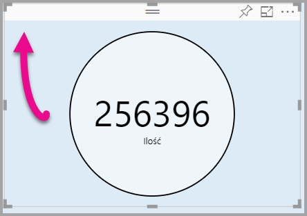

# <a name="tutorial-adding-formatting-options-to-a-power-bi-custom-visual"></a>Samouczek: Dodawanie opcji formatowania do wizualizacji niestandardowej usługi Power BI

W tym samouczku przedstawimy sposób dodawania typowych właściwości do wizualizacji.

Z tego samouczka dowiesz się, jak wykonywać następujące czynności:
> [!div class="checklist"]
> * Dodawanie właściwości wizualizacji.
> * Tworzenie pakietu wizualizacji.
> * Importowanie wizualizacji niestandardowej do raportu programu Power BI Desktop.

## <a name="adding-formatting-options"></a>Dodawanie opcji formatowania

1. W usłudze **Power BI** wybierz pozycję **Formatuj stronę**.

    Powinien zostać wyświetlony następujący komunikat: *Dla tej wizualizacji nie są dostępne opcje formatowania.*

    

2. W programie **Visual Studio Code** otwórz plik *capabilities.json*.

3. Przed tablicą **dataViewMappings** dodaj **obiekty** (po wierszu 8).

    ```json
    "objects": {},
    ```
    

4. Zapisz plik **capabilities.json**.

5. W usłudze **Power BI** przejrzyj ponownie opcje formatowania.

    > [!Note]
    > Jeśli nie widzisz zmiany opcji formatowania, wybierz pozycję **Załaduj wizualizację niestandardową**.

    

6. Ustaw opcję **Tytuł** na *Włączony*. Zauważ, że w lewym górnym rogu wizualizacji nie jest już wyświetlana nazwa miary.

    

    

### <a name="adding-custom-formatting-options"></a>Dodawanie niestandardowych opcji formatowania

Właściwości niestandardowe można dodać, aby umożliwić konfigurowanie koloru okręgu oraz szerokości obramowania.

1. W programie PowerShell zatrzymaj wizualizację niestandardową.

2. W programie Visual Studio Code w pliku **capabilities.json** wstaw poniższy fragment kodu JSON do obiektu z etykietą **objects**.

    ```json
    "circle": {
     "displayName": "Circle",
     "properties": {
         "circleColor": {
             "displayName": "Color",
             "description": "The fill color of the circle.",
             "type": {
                 "fill": {
                     "solid": {
                         "color": true
                     }
                 }
             }
         },
         "circleThickness": {
             "displayName": "Thickness",
             "description": "The circle thickness.",
             "type": {
                 "numeric": true
                 }
             }
         }
     },
    ```

    Fragment kodu JSON opisuje grupę o nazwie circle, która składa się z dwóch opcji o nazwie circleColor i circleThickness.

   

3. Zapisz plik **capabilities.json**.

4. W **okienku Eksploratora** z wnętrza folderu **src** wybierz pozycję **settings.ts**. *Ten plik reprezentuje ustawienia wizualizacji początkowej*.

5. W pliku **settings.ts** zastąp dwie klasy poniższym kodem.

    ```typescript
    export class CircleSettings {
     public circleColor: string = "white";
     public circleThickness: number = 2;
    }
    export class VisualSettings extends DataViewObjectsParser {
     public circle: CircleSettings = new CircleSettings();
    }
    ```

    

    Ten moduł definiuje dwie klasy. Klasa **CircleSettings** definiuje dwie właściwości o nazwach odpowiadających obiektom zdefiniowanym w pliku **capabilities.json** (**circleColor** i  **circleThickness**), a także ustawia wartości domyślne. Klasa **VisualSettings** dziedziczy klasę **DataViewObjectParser** oraz dodaje właściwość o nazwie **circle**, która jest zgodna z obiektem zdefiniowanym w pliku *capabilities.json* i zwraca wystąpienie elementu **CircleSettings**.

6. Zapisz plik **settings.ts**.

7. Otwórz plik **visual.ts**.

8. W klasie **Visual** dodaj poniższą właściwość.

    ```typescript
    private visualSettings: VisualSettings;
    ```
    Ta właściwość zawiera odwołanie do obiektu **VisualSettings** opisującego ustawienia wizualizacji.

    

9. W klasie **Visual** dodaj poniższą metodę przed metodą **update**. Ta metoda jest używana do wypełniania opcji formatowania.

    ```typescript
    public enumerateObjectInstances(options: EnumerateVisualObjectInstancesOptions): VisualObjectInstanceEnumeration {
     const settings: VisualSettings = this.visualSettings ||
    VisualSettings.getDefault() as VisualSettings;
     return VisualSettings.enumerateObjectInstances(settings, options);
    }
    ```
    Ta metoda jest używana do wypełniania opcji formatowania.

    

10. W metodzie **update** po deklaracji zmiennej **radius** dodaj następujący kod.

    ```typescript
    this.visualSettings = VisualSettings.parse<VisualSettings>(dataView);
    this.visualSettings.circle.circleThickness = Math.max(0, this.visualSettings.circle.circleThickness)this.visualSettings.circle.circleThickness = Math.min(10, this.visualSettings.circle.circleThickness);
    ```
    Ten kod pobiera opcje formatowania. Dostosowuje on każdą wartość przekazaną do właściwości **circleThickness**, konwertując ja na 0, jeśli jest ujemna, lub na 10, jeśli jest większa niż 10.

    

11. W **elemencie circle** zmodyfikuj wartość przekazaną do **stylu fill** na poniższe wyrażenie.

    ```typescript
    this.visualSettings.circle.circleColor
    ```

    

12. W **elemencie circle** zmodyfikuj wartość przekazaną do **stylu stroke-width** na poniższe wyrażenie.

    ```typescript
    this.visualSettings.circle.circleThickness
    ```

    

13. Zapisz plik visual.ts.

14. Uruchom wizualizację w programie PowerShell.

    ```powershell
    pbiviz start
    ```

15. W usłudze **Power BI** na przestawnym pasku narzędzi nad wizualizacją wybierz pozycję **Przełącz automatyczne ponowne ładowanie**.

16. W obszarze opcji **formatowania wizualizacji** rozwiń węzeł **Okrąg**.

    

    Zmodyfikuj opcje **Kolor** i **Grubość**.

    Zmodyfikuj opcję **Grubość** na wartość mniejszą niż zero i większą niż 10. Następnie zauważ, że wizualizacja aktualizuje wartość do dopuszczalnej wartości minimalnej lub maksymalnej.

## <a name="packaging-the-custom-visual"></a>Tworzenie pakietu wizualizacji niestandardowej

Wprowadź wartości właściwości dla projektu wizualizacji niestandardowej, zaktualizuj plik ikony, a następnie utwórz pakiet wizualizacji niestandardowej.

1. W programie **PowerShell** zatrzymaj wizualizację niestandardową.

2. Otwórz plik **pbiviz.json** w programie **Visual Studio Code**.

3. W obiekcie **visual** zmodyfikuj właściwość **displayName** aplikacji *Circle Card*.

    Jeśli w okienku **Wizualizacje** ustawisz kursor na ikonie, pojawi się nazwa wyświetlana.

    

4. We właściwości **description** wprowadź następujący tekst.

    *Displays a formatted measure value inside a circle* (Wyświetla sformatowaną wartość miary wewnątrz okręgu)

5. Opcjonalnie w obiekcie **author** wprowadź informacje o sobie.

6. Zapisz plik **pbiviz.json**.

7. W obiekcie **assets** zwróć uwagę na to, że dokument definiuje ścieżkę do ikony. Ikona to obraz wyświetlany w okienku **_Wizualizacje_**. Musi być to plik **PNG** o wymiarach *20 pikseli na 20 pikseli*.

8. W Eksploratorze Windows skopiuj plik icon.png, a następnie wklej go, aby zastąpić domyślny plik znajdujący się w folderze assets.

9. W programie Visual Studio Code w okienku Eksploratora rozwiń folder assets, a następnie wybierz plik icon.png.

10. Przejrzyj ikonę.

    

11. W programie Visual Studio Code upewnij się, że wszystkie pliki zostały zapisane.

12. Aby utworzyć pakiet wizualizacji niestandardowej, w programie PowerShell wprowadź poniższe polecenie.

    ```powershell
    pbiviz package
    ```

    

Teraz pakiet stanowi dane wyjściowe folderu **dist** projektu. Pakiet zawiera wszystkie elementy wymagane do zaimportowania wizualizacji niestandardowej do raportu usługi Power BI lub raportu programu Power BI Desktop. Masz teraz utworzony pakiet wizualizacji niestandardowej, który jest gotowy do użycia.

## <a name="importing-the-custom-visual"></a>Importowanie wizualizacji niestandardowej

Teraz możesz otworzyć raport programu Power BI Desktop i zaimportować wizualizację niestandardową Circle Card.

1. Otwórz program **Power BI Desktop** i utwórz nowy raport z dowolnym *przykładowym zestawem danych*.

2. W okienku **_Wizualizacje_** wybierz **wielokropek**, a następnie wybierz pozycję **Importuj z pliku**.

    

3. W **oknie importowania** wybierz pozycję **Importuj**.

4. W oknie otwierania przejdź do folderu **dist** w katalogu projektu.

5. Wybierz plik **circleCard.pbiviz**, a następnie wybierz pozycję **Otwórz**.

6. Po pomyślnym zaimportowaniu wizualizacji wybierz przycisk **OK**.

7. Sprawdź, czy wizualizacja została dodana do okienka **_Wizualizacje_**.

    

8. Umieść kursor nad ikoną **Circle Card** i zwróć uwagę na wyświetloną etykietkę narzędzia.

## <a name="debugging"></a>Debugowanie

Aby uzyskać wskazówki dotyczące debugowania wizualizacji niestandardowej, zobacz [przewodnik po debugowaniu](https://microsoft.github.io/PowerBI-visuals/docs/how-to-guide/how-to-debug/).

## <a name="next-steps"></a>Następne kroki

Nowo utworzoną wizualizację można udostępnić do użytku innym, przesyłając ją do usługi **AppSource**. Aby uzyskać więcej informacji na temat tego procesu, zobacz [Publikowanie wizualizacji niestandardowych w usłudze AppSource](office-store.md).