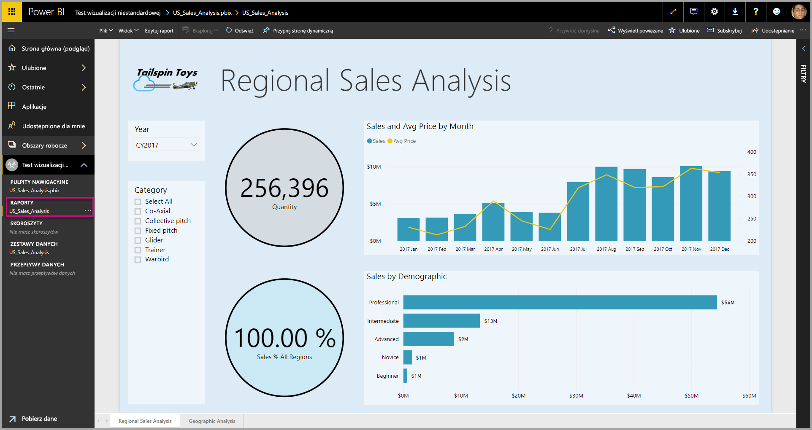

# <a name="tutorial-developing-a-power-bi-custom-visual"></a>Samouczek: tworzenie wizualizacji niestandardowej w usłudze Power BI

Umożliwiamy deweloperom łatwe dodawanie wizualizacji niestandardowych do usługi Power BI w celu korzystania z nich na pulpicie nawigacyjnym i w raportach. Aby ułatwić Ci rozpoczęcie pracy, opublikowaliśmy kod dla wszystkich naszych wizualizacji w usłudze GitHub.

Wraz z platformą wizualizacji udostępniliśmy nasze narzędzia i zestaw testów, aby pomóc społeczności kompilować wizualizacje niestandardowe wysokiej jakości na potrzeby usługi Power BI.

W tym samouczku przedstawiono sposób tworzenia wizualizacji niestandardowej usługi Power BI o nazwie Circle Card, która umożliwia wyświetlanie sformatowanej wartości miary wewnątrz okręgu. Wizualizacja Circle Card obsługuje dostosowywanie koloru wypełnienia i grubości konturu.

W raporcie usługi Power BI Desktop karty są modyfikowane w celu przekształcenia ich w karty Circle Card.

  

Z tego samouczka dowiesz się, jak wykonywać następujące czynności:
> [!div class="checklist"]
> * Tworzenie wizualizacji niestandardowej usługi Power BI.
> * Opracowywanie wizualizacji niestandardowej z elementami wizualnymi D3.
> * Konfigurowanie powiązania danych przy użyciu elementów wizualnych.
> * Formatowanie wartości danych.

## <a name="prerequisites"></a>Wymagania wstępne

* Jeśli nie masz konta usługi **Power BI Pro**, na początku [zacznij korzystać z bezpłatnej wersji próbnej](https://powerbi.microsoft.com/en-us/pricing/).
* Musisz mieć zainstalowany program [Visual Studio Code](https://www.visualstudio.com/).

## <a name="setting-up-the-developer-environment"></a>Konfigurowanie środowiska deweloperskiego

Oprócz wymagań wstępnych istnieje kilka narzędzi, które należy zainstalować.

### <a name="installing-nodejs"></a>Instalowanie środowiska node.js

1. Aby zainstalować środowisko Node.js, w przeglądarce internetowej przejdź do środowiska [Node.js](https://nodejs.org).

2. Pobierz najnowszą wersję Instalatora MSI.

3. Uruchom instalatora, a następnie wykonaj kroki instalacji. Zaakceptuj warunki umowy licencyjnej i wszystkie wartości domyślne.

   

4. Uruchom ponownie komputer.

### <a name="installing-packages"></a>Instalowanie pakietów

Teraz musisz zainstalować pakiet **pbiviz**.

1. Otwórz program Windows PowerShell po ponownym uruchomieniu komputera.

2. Aby zainstalować plik pbiviz, wprowadź poniższe polecenie.

    ```powershell
    npm i -g powerbi-visuals-tools
    ```

### <a name="creating-and-installing-a-certificate"></a>Tworzenie i instalowanie certyfikatu

1. Aby utworzyć certyfikat, uruchom poniższe polecenie.

    ```powershell
    pbiviz --create-cert
    ```

  Zwraca ono wynik tworzący *hasło*. W tym przypadku *hasło* to **_15105661266553327_**.

  

2. Teraz musimy zainstalować certyfikat. Aby zainstalować certyfikat, wprowadź poniższe polecenie.

    ```powershell
    pbiviz --install-cert
    ```

3. W Kreatorze importu certyfikatów sprawdź, czy lokalizacja magazynu została ustawiona na wartość Bieżący użytkownik. Następnie wybierz pozycję *Dalej*.

      

4. W kroku **Plik do zaimportowania** wybierz pozycję *Dalej*.

5. W kroku **Ochrona klucza prywatnego** w polu Hasło wklej hasło otrzymane na etapie tworzenia certyfikatu.  Ponownie w tym przypadku jest to wartość **_15105661266553327_**.

      

6. W kroku **Magazyn certyfikatów** wybierz opcję **Umieść wszystkie certyfikaty w następującym magazynie**. Następnie wybierz pozycję *Przeglądaj*.

      

7. W oknie **wybieranie magazynu certyfikatów** wybierz pozycję **Zaufane główne urzędy certyfikacji**, a następnie przycisk *OK*. Następnie wybierz pozycję *Dalej* na ekranie **Magazyn certyfikatów**.

      

8. Aby ukończyć importowanie, wybierz pozycję **Zakończ**.

9. Jeśli pojawi się ostrzeżenie o zabezpieczeniach, wybierz pozycję **Tak**.

    

10. Po wyświetleniu powiadomienia o pomyślnym ukończeniu importowania wybierz przycisk **OK**.

    

> [!Important]
> Nie zamykaj sesji programu Windows PowerShell.

## <a name="creating-a-custom-visual"></a>Tworzenie wizualizacji niestandardowej

Teraz po skonfigurowaniu środowiska nadszedł czas na utworzenie wizualizacji niestandardowej.

Możesz [pobrać ](https://github.com/Microsoft/PowerBI-visuals-circlecard) pełny kod źródłowy na potrzeby tego samouczka.

1. W programie Windows PowerShell sprawdź, czy zainstalowano pakiet narzędzi wizualnych usługi Power BI.

    ```powershell
    pbiviz
    ```
    Powinna zostać zwrócona pomoc.

    <pre><code>
        +syyso+/
    oms/+osyhdhyso/
    ym/       /+oshddhys+/
    ym/              /+oyhddhyo+/
    ym/                     /osyhdho
    ym/                           sm+
    ym/               yddy        om+
    ym/         shho /mmmm/       om+
        /    oys/ +mmmm /mmmm/       om+
    oso  ommmh +mmmm /mmmm/       om+
    ymmmy smmmh +mmmm /mmmm/       om+
    ymmmy smmmh +mmmm /mmmm/       om+
    ymmmy smmmh +mmmm /mmmm/       om+
    +dmd+ smmmh +mmmm /mmmm/       om+
            /hmdo +mmmm /mmmm/ /so+//ym/
                /dmmh /mmmm/ /osyhhy/
                    //   dmmd
                        ++

        PowerBI Custom Visual Tool

    Usage: pbiviz [options] [command]

    Commands:

    new [name]        Create a new visual
    info              Display info about the current visual
    start             Start the current visual
    package           Package the current visual into a pbiviz file
    update [version]  Updates the api definitions and schemas in the current visual. Changes the version if specified
    help [cmd]        display help for [cmd]

    Options:

    -h, --help      output usage information
    -V, --version   output the version number
    --install-cert  Install localhost certificate
    </code></pre>

    <a name="ssl-setup"></a>

2. Przejrzyj dane wyjściowe, w tym listę obsługiwanych poleceń.

     

3. Aby utworzyć projekt wizualizacji niestandardowej, wprowadź poniższe polecenie. **CircleCard** to nazwa projektu.

    ```PowerShell
    pbiviz new CircleCard
    ```
    

4. Przejdź do folderu projektu.

    ```powershell
    cd CircleCard
    ```
5. Uruchom wizualizację niestandardową. Wizualizacja CircleCard teraz działa i jest hostowana na komputerze.

    ```powershell
    pbiviz start
    ```

    

> [!Important]
> Nie zamykaj sesji programu Windows PowerShell.

### <a name="testing-the-custom-visual"></a>Testowanie wizualizacji niestandardowej

W tej sekcji przetestujemy wizualizację niestandardową CircleCard, przekazując raport programu Power BI Desktop, a następnie edytując raport, aby wyświetlić wizualizację niestandardową.

1. Zaloguj się do witryny [PowerBI.com](https://powerbi.microsoft.com/) > przejdź do **ikony koła zębatego** > wybierz pozycję **Ustawienia**.

      

2. Wybierz pozycję **Deweloper**, a następnie zaznacz pole wyboru **Włącz wizualizację dewelopera na potrzeby testu**.

    

3. Przekaż raport programu Power BI Desktop.  

    Pobierz dane > Pliki > Plik lokalny.

    Możesz [pobrać](https://microsoft.github.io/PowerBI-visuals/docs/step-by-step-lab/images/US_Sales_Analysis.pbix) przykładowy raport programu Power BI Desktop, jeśli jeszcze nie został utworzony.

     

    Teraz w celu wyświetlenia raportu wybierz pozycję **US_Sales_Analysis** w sekcji **Raport** w okienku nawigacji po lewej stronie.

    

4. Teraz musisz edytować raport w usłudze Power BI.

    Przejdź do pozycji **Edytuj raport**.

    

5. Wybierz pozycję **Wizualizacja dewelopera** w okienku **Wizualizacje**.

    

    > [!Note]
    > Ta wizualizacja reprezentuje wizualizację niestandardową, którą uruchomiono na komputerze. Jest ona dostępna tylko po włączeniu ustawień dewelopera.

6. Zauważ, że wizualizacja została dodana do kanwy raportu.

    

    > [!Note]
    > Jest to bardzo prosta wizualizacja, która zawiera liczbę wywołań metody aktualizacji. Na tym etapie wizualizacja nie pobiera jeszcze żadnych danych.

7. Po wybraniu nowej wizualizacji w raporcie przejdź do okienka Pola > rozwiń węzeł Sprzedaż > wybierz pozycję Ilość.

    

8. Aby przetestować nową wizualizację, zmień rozmiar wizualizacji i zwróć uwagę na przyrosty wartości aktualizacji.

    

Aby zatrzymać wizualizację niestandardową działającą w programie PowerShell, naciśnij klawisze Ctrl+C. Po wyświetleniu monitu o przerwanie zadania wsadowego wprowadź Y, a następnie naciśnij klawisz Enter.

## <a name="adding-visual-elements"></a>Dodawanie elementów wizualnych

Teraz musisz zainstalować **bibliotekę D3 języka JavaScript**. D3 to biblioteka języka JavaScript umożliwiająca tworzenie dynamicznych, interaktywnych wizualizacji danych w przeglądarkach internetowych. Korzysta ona z szeroko implementowanych standardów SVG HTML5 i CSS.

Teraz możesz tworzyć wizualizację niestandardową, aby wyświetlić okrąg z tekstem.

> [!Note]
> Wiele wpisów tekstowych na potrzeby tego samouczka można skopiować [stąd](https://github.com/uve/circlecard).

1. Aby zainstalować **bibliotekę D3** w programie PowerShell, wpisz poniższe polecenie.

    ```powershell
    npm i d3@3.5.5 --save
    ```

    

2. Aby zainstalować definicje typów dla **biblioteki D3**, wprowadź poniższe polecenie.

    ```powershell
    npm i @types/d3@3.5
    ```

    

    To polecenie powoduje zainstalowanie definicji języka TypeScript w oparciu o pliki JavaScript, umożliwiając utworzenie wizualizacji niestandardowej w języku TypeScript (który jest nadzbiorem języka JavaScript). Program Visual Studio Code to idealne środowisko IDE do tworzenia aplikacji w języku TypeScript.

3. Uruchom program [Visual Studio Code](https://code.visualstudio.com/).

    Program **Visual Studio Code** można uruchomić z programu PowerShell przy użyciu poniższego polecenia.

    ```powershell
    code .
    ```

4. W **okienku Eksploratora** rozwiń folder **node_modules**, aby sprawdzić, czy zainstalowano **bibliotekę d3**.

    

5. Sprawdź plik TypeScript **index.d.ts**, rozwijając węzeł node_modules > @types > d3 w **okienku Eksploratora**.

    

6. Wybierz plik **pbiviz.json**.

7. Aby zarejestrować **bibliotekę d3**, wprowadź następujące odwołanie do pliku w tablicy externalJS. Pamiętaj o dodaniu *przecinka* między istniejącym odwołaniem do pliku i nowym odwołaniem do pliku.

    ```javascript
    "node_modules/d3/d3.min.js"
    ```
    

8. Zapisz zmiany pliku **pbiviz.json**.

### <a name="developing-the-visual-elements"></a>Tworzenie elementów wizualnych

Teraz możemy zapoznać się ze sposobem tworzenia wizualizacji niestandardowej w celu wyświetlenia okręgu i przykładowego tekstu.

1. W **okienku Eksploratora** rozwiń folder **src** i wybierz pozycję **visual.ts**.

    > [!Note]
    > Zwróć uwagę na komentarze w górnej części pliku **visual.ts**. Uprawnienie do korzystania z pakietów wizualizacji niestandardowych usługi Power BI jest udzielane bezpłatnie zgodnie z warunkami licencji MIT. Zgodnie z umową komentarze należy pozostawić na początku pliku.

2. Usuń następującą domyślną logikę wizualizacji niestandardowej z klasy Visual.
    * Cztery deklaracje prywatnych zmiennych na poziomie klasy.
    * Wszystkie wiersze kodu z konstruktora.
    * Wszystkie wiersze kodu z metody update.
    * Wszystkie pozostałe wiersze w module, w tym metody parseSettings i enumerateObjectInstances.

    Upewnij się, że kod modułu wygląda podobnie do poniższego.

    ```typescript
    module powerbi.extensibility.visual {
    "use strict";
    export class Visual implements IVisual {

        constructor(options: VisualConstructorOptions) {

        }

        public update(options: VisualUpdateOptions) {

            }
        }
    }
    ```

3. Pod deklaracją klasy *Visual* wstaw poniższe właściwości na poziomie klasy.

    ```typescript
     private host: IVisualHost;
     private svg: d3.Selection<SVGElement>;
     private container: d3.Selection<SVGElement>;
     private circle: d3.Selection<SVGElement>;
     private textValue: d3.Selection<SVGElement>;
     private textLabel: d3.Selection<SVGElement>; 
    ```

    

4. Dodaj następujący kod do *konstruktora*.

    ```typescript
    this.svg = d3.select(options.element)
                 .append('svg')
                 .classed('circleCard', true);
    this.container = this.svg.append("g")
                         .classed('container', true);
    this.circle = this.container.append("circle")
                             .classed('circle', true);
    this.textValue = this.container.append("text")
                                 .classed("textValue", true);
    this.textLabel = this.container.append("text")
                                 .classed("textLabel", true);
    ```

    Ten kod dodaje grupę SVG w wizualizacji, a następnie dodaje trzy kształty: okrąg i dwa elementy tekstowe.

    Aby sformatować kod w dokumencie, kliknij prawym przyciskiem myszy i zaznacz dowolne miejsce w **dokumencie programu Visual Studio Code**, a następnie wybierz pozycję **Formatuj dokument**.

      

    Aby poprawić czytelność, zalecane jest formatowanie dokumentu po wklejeniu każdego nowego fragmentu kodu.

5. Dodaj następujący kod do metody *update*.

    ```typescript
    let width: number = options.viewport.width;
    let height: number = options.viewport.height;
    this.svg.attr({
     width: width,
     height: height
    });
    let radius: number = Math.min(width, height) / 2.2;
    this.circle
     .style("fill", "white")
     .style("fill-opacity", 0.5)
     .style("stroke", "black")
     .style("stroke-width", 2)
    .attr({
     r: radius,
     cx: width / 2,
     cy: height / 2
    });
    let fontSizeValue: number = Math.min(width, height) / 5;
    this.textValue
     .text("Value")
     .attr({
         x: "50%",
         y: "50%",
         dy: "0.35em",
         "text-anchor": "middle"
     }).style("font-size", fontSizeValue + "px");
    let fontSizeLabel: number = fontSizeValue / 4;
    this.textLabel
     .text("Label")
     .attr({
         x: "50%",
         y: height / 2,
         dy: fontSizeValue / 1.2,
         "text-anchor": "middle"
     })
     .style("font-size", fontSizeLabel + "px");
    ```

    *Ten kod ustawia szerokość i wysokość wizualizacji, a następnie inicjuje atrybuty i style elementów wizualnych.*

6. Zapisz plik **visual.ts**.

7. Zapisz plik **capabilities.json**.

    W wierszu 14 usuń cały element objects (wiersze 14–60).

8. Zapisz plik **capabilities.json**.

9. W programie PowerShell uruchom wizualizację niestandardową.

    ```powershell
    pbiviz
    ```

### <a name="toggle-auto-reload"></a>Przełącz automatyczne ponowne ładowanie

1. Przejdź z powrotem do raportu usługi Power BI.
2. Na przestawnym pasku narzędzi nad wizualizacją dewelopera wybierz pozycję **Przełącz automatyczne ponowne ładowanie**.

    

    Dzięki tej opcji masz pewność, że wizualizacja będzie automatycznie ponownie ładowana po każdym zapisaniu projektu.

3. Z **okienka Pola** przeciągnij pole **Ilość** do wizualizacji dewelopera.

4. Upewnij się, że wizualizacja wygląda podobnie do poniższej.

    

5. Zmień rozmiar wizualizacji.

    Zauważ, że wartość okręgu i tekstu jest skalowana tak, aby pasowała do dostępnych wymiarów wizualizacji.

    Metoda update jest wywoływana w sposób ciągły w przypadku zmiany rozmiaru wizualizacji, co powoduje ponowne płynne skalowanie elementów wizualnych.

    Masz teraz utworzone elementy wizualne.

6. Kontynuuj uruchamianie wizualizacji.

## <a name="configuring-data-binding"></a>Konfigurowanie powiązania danych

Zdefiniuj role danych i mapowania widoku danych, a następnie zmodyfikuj logikę wizualizacji niestandardowej, aby wyświetlić wartość i nazwę wyświetlaną miary.

### <a name="configuring-the-capabilities"></a>Konfigurowanie możliwości

Zmodyfikuj plik **capabilities.json**, aby zdefiniować rolę danych i mapowania widoku danych.

1. W programie Visual Studio Code w pliku **capabilities.json** usuń całą zawartość (wiersze 3–12) z tablicy **dataRoles**.

2. Wewnątrz tablicy **dataRoles** wstaw następujący kod.

    ```json
    {
     "displayName": "Measure",
     "name": "measure",
     "kind": "Measure"
    }
    ```
    Tablica **dataRoles** definiuje teraz pojedynczą rolę danych typu **miara**, która nosi nazwę **measure** i jest wyświetlana jako **Miara**. Ta rola danych umożliwia przekazywanie pola miary lub pola, które jest podsumowywane.

3. Usuń całą zawartość (wiersze 10–31) z wnętrza tablicy **dataViewMappings**.

4. Wewnątrz tablicy **dataViewMappings** wstaw następującą zawartość.

    ```json
            {
            "conditions": [
                { "measure": { "max": 1 } }
            ],
            "single": {
                "role": "measure"
            }
           }
    ```
    Tablica **dataViewMappings** definiuje teraz jedno pole, które można przekazać do roli danych o nazwie **measure**.

5. Zapisz plik **capabilities.json**.

6. W usłudze Power BI zwróć uwagę, że wizualizację można skonfigurować za pomocą elementu **Miara**.

    

    > [!Note]
    > Projekt wizualizacji nie zawiera jeszcze logiki powiązania danych.

### <a name="exploring-the-dataview"></a>Eksplorowanie widoku danych

1. Na przestawnym pasku narzędzi nad wizualizacją wybierz pozycję **Pokaż widok danych**.

    

2. Rozwiń węzeł w dół do pozycji **single**, a następnie zanotuj wartość.

    

3. Rozwiń węzeł w dół do elementu **metadata**, a następnie do tablicy **columns**. W szczególności zwróć uwagę na wartości **format** i **displayName**.

    

4. Aby przełączyć się z powrotem do wizualizacji, na przestawnym pasku narzędzi nad wizualizacją wybierz pozycję **Pokaż widok danych**.

    

### <a name="configuring-data-binding"></a>Konfigurowanie powiązania danych

1. W programie **Visual Studio Code** w pliku **visual.ts** dodaj następującą instrukcję jako pierwszą instrukcję metody update.

    ```typescript
    let dataView: DataView = options.dataViews[0];
    ```
    

    Ta instrukcja przypisuje element *dataView* do zmiennej w celu ułatwienia dostępu i deklaruje zmienną w celu odwołania do obiektu *dataView*.

2. W metodzie **update** zastąp element text("Value")** poniższym kodem.

    ```typescript
    .text(dataView.single.value as string)
    ```
    

3. W metodzie **update** zastąp element **.text(“Label”)** poniższym kodem.

    ```typescript
    .text(dataView.metadata.columns[0].displayName)
    ```
    

4. Zapisz plik **visual.ts**.

5. W usłudze **Power BI** przejrzyj wizualizację, która teraz zawiera wartość i nazwę wyświetlaną.

Role danych zostały skonfigurowane, a wizualizacja została powiązana z widokiem danych.

Z następnego samouczka dowiesz się, jak dodać opcje formatowania do wizualizacji niestandardowej.

## <a name="next-steps"></a>Następne kroki

> [!div class="nextstepaction"]
> [Dodawanie opcji formatowania](custom-visual-develop-tutorial-format-options.md)