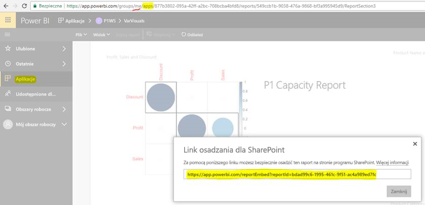

# Osadzanie raportów lub pulpitów nawigacyjnych z aplikacji

W usłudze **Power BI** można tworzyć aplikacje, aby zebrać w jednym miejscu powiązane **pulpity nawigacyjne** i **raporty**, a następnie publikować je dla dużych grup użytkowników w organizacji. Używanie tych aplikacji ma znaczenie, gdy wszyscy Twoi użytkownicy są użytkownikami usługi Power BI, więc można udostępniać im zawartość za pomocą aplikacji usługi Power BI. Chcemy podzielić się kilkoma prostymi krokami umożliwiającymi osadzenie zawartości opublikowanej aplikacji Power BI w aplikacji innej firmy.

## Jak uzyskać adres URL osadzania raportu na potrzeby osadzania

1. Utwórz wystąpienie aplikacji w obszarze roboczym użytkownika („Mój obszar roboczy”), udostępniając ją sobie lub prowadząc innego użytkownika przez ten przepływ.

2. Otwórz żądany raport w usłudze Power BI.

3. Wybierz pozycję Plik -> Osadź w usłudze SharePoint Online i skopiuj adres URL osadzania raportu (widać go na poniższym zrzucie ekranu) lub wywołaj interfejs API REST GetReports/GetReport i wyodrębnij odpowiednie pole embedURL raportu z odpowiedzi (pamiętaj, że wywołanie REST nie powinno mieć identyfikatora obszaru roboczego w adresie URL, ponieważ wystąpienie aplikacji zostało utworzone w obszarze roboczym użytkownika).

4. Zastosuj adres URL osadzania uzyskany w kroku 3 w zestawie SDK języka JavaScript.

    

## Jak uzyskać adres URL osadzania pulpitu nawigacyjnego na potrzeby osadzania

1. Utwórz wystąpienie aplikacji w obszarze roboczym użytkownika („Mój obszar roboczy”), udostępniając ją sobie lub prowadząc innego użytkownika przez ten przepływ.

2. Wywołaj interfejs API REST GetDashboards i wyodrębnij odpowiednie pole embedURL pulpitu nawigacyjnego z odpowiedzi (pamiętaj, że wywołanie REST nie powinno mieć identyfikatora obszaru roboczego w adresie URL, ponieważ wystąpienie aplikacji zostało utworzone w obszarze roboczym użytkownika).

3. Zastosuj adres URL osadzania uzyskany w kroku 4 w naszym zestawie SDK języka JavaScript.

## Następne kroki

Zapoznaj się także ze sposobem osadzania z obszarów roboczych aplikacji dla klientów innych firm i swojej organizacji.

> [!div class="nextstepaction"]
>[Osadź dla klientów innych firm](embed-sample-for-customers.md)

> [!div class="nextstepaction"]
>[Osadź dla swojej organizacji](embed-sample-for-your-organization.md)