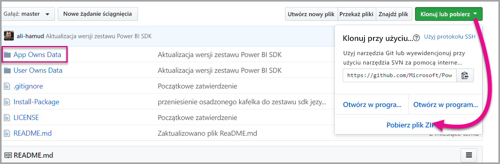

# <a name="tutorial-embed-a-power-bi-dashboard-tile-or-report-into-your-application-for-sovereign-clouds"></a>Samouczek: Osadzanie pulpitu nawigacyjnego, kafelka lub raportu usługi Power BI w aplikacji dla suwerennych chmur

Dowiedz się, jak osadzać zawartość analityczną w aplikacjach procesów biznesowych dla suwerennej chmury. Do osadzania raportu, pulpitu nawigacyjnego lub kafelka w aplikacjach internetowych można użyć zestawu .NET SDK usługi Power BI z interfejsem API języka JavaScript usługi Power BI.

Usługa Power BI obsługuje również suwerenne (prywatne) chmury.

Suwerenne chmury to:

* U.S. Government Community Cloud (GCC)

* U. S. Military Contractors (DoDCON)

* U. S. Military (DoD)

* Power BI for Germany Cloud

* Power BI for China Cloud


Do rozpoczęcia pracy z tym przewodnikiem jest wymagane **konto usługi Power BI**. Jeśli nie masz skonfigurowanego konta, w zależności od typu suwerennej chmury możesz [utworzyć nowe konto usługi Power BI dla instytucji rządowej USA](../service-govus-signup.md), [konto usługi Power BI for Germany Cloud](https://powerbi.microsoft.com/power-bi-germany/?ru=https%3A%2F%2Fapp.powerbi.de%2F%3FnoSignUpCheck%3D1) lub [konto usługi Power BI for China Cloud](http://www.21vbluecloud.com/powerbi/).

> [!NOTE]
> Chcesz osadzić pulpit nawigacyjny dla swojej organizacji? Zobacz [Integrate a dashboard into an app for your organization (Integrowanie pulpitu nawigacyjnego z aplikacją dla organizacji)](integrate-dashboard.md).

Aby zintegrować pulpit nawigacyjny z aplikacją internetową, należy użyć interfejsu API usługi **Power BI** oraz **tokenu dostępu** autoryzacji usługi Azure Active Directory (AD) w celu uzyskania pulpitu nawigacyjnego. Następnie należy załadować pulpit nawigacyjny przy użyciu tokenu osadzania. Interfejs API usługi **Power BI** zapewnia dostęp programowy do określonych zasobów usługi **Power BI**. Aby uzyskać więcej informacji, zobacz [Power BI REST API (Interfejs API REST usługi Power BI)](https://docs.microsoft.com/rest/api/power-bi/), Power BI .NET SDK (Zestaw SDK platformy .NET dla usługi Power BI) i [Power BI JavaScript API (Interfejs API języka JavaScript usługi Power BI)](https://github.com/Microsoft/PowerBI-JavaScript).

## <a name="download-the-sample"></a>Pobieranie przykładu

W tym artykule przedstawiono kod używany w [przykładzie App Owns Data](https://github.com/Microsoft/PowerBI-Developer-Samples) w witrynie GitHub. Aby korzystać z tego przewodnika, możesz pobrać przykład.



* Government Community Cloud (GCC):
1. Zastąp plik Cloud.config plikiem GCCCloud.config.

2. Zaktualizuj elementy applicationId (identyfikator aplikacji natywnej), workspaceId, user (użytkownik główny) i password w pliku Web.config.

3. Dodaj parametry chmury GCC do pliku web.config w następujący sposób.

```xml
<add key="authorityUrl" value="https://login.windows.net/common/oauth2/authorize/" />
<add key="resourceUrl" value="https://analysis.usgovcloudapi.net/powerbi/api" />
<add key="apiUrl" value="https://api.powerbigov.us/" />
<add key="embedUrlBase" value="https://app.powerbigov.us" />
```

* Military Contractors (DoDCON):
1. Zastąp plik Cloud.config plikiem TBCloud.config.

2. Zaktualizuj elementy applicationId (identyfikator aplikacji natywnej), workspaceId, user (użytkownik główny) i password w pliku Web.config.

3. Dodaj parametry chmury DoDCON do pliku web.config w następujący sposób.

```xml
<add key="authorityUrl" value="https://login.windows.net/common/oauth2/authorize/" />
<add key="resourceUrl" value="https://high.analysis.usgovcloudapi.net/powerbi/api" />
<add key="apiUrl" value="https://api.high.powerbigov.us/" />
<add key="embedUrlBase" value="https://app.high.powerbigov.us" />
```

* Military (DoD):
1. Zastąp plik Cloud.config plikiem PFCloud.config.

2. Zaktualizuj elementy applicationId (identyfikator aplikacji natywnej), workspaceId, user (użytkownik główny) i password w pliku Web.config.

3. Dodaj parametry chmury DoDCON do pliku web.config w następujący sposób.

```xml
<add key="authorityUrl" value="https://login.windows.net/common/oauth2/authorize/" />
<add key="resourceUrl" value="https://mil.analysis.usgovcloudapi.net/powerbi/api" />
<add key="apiUrl" value="https://api.mil.powerbigov.us/" />
<add key="embedUrlBase" value="https://app.mil.powerbigov.us" />
```

* Parametry usługi Power BI for Germany Cloud
1. Zastąp plik Cloud.config zawartością usługi Power BI for Germany Cloud.

2. Zaktualizuj elementy applicationId (identyfikator aplikacji natywnej), workspaceId, user (użytkownik główny) i password w pliku Web.config.

3. Dodaj parametry usługi Power BI for Germany Cloud do pliku web.config w następujący sposób.

```xml
<add key="authorityUrl" value=https://login.microsoftonline.de/common/oauth2/authorize/" />
<add key="resourceUrl" value="https://analysis.cloudapi.de/powerbi/api" />
<add key="apiUrl" value="https://api.powerbi.de/" />
<add key="embedUrlBase" value="https://app.powerbi.de" />
```

* Parametry usługi Power BI for China Cloud
1. Zastąp plik Cloud.config zawartością usługi [Power BI for China Cloud](https://github.com/Microsoft/PowerBI-Developer-Samples/blob/master/App%20Owns%20Data/PowerBIEmbedded_AppOwnsData/CloudConfigs/Power%20BI%20operated%20by%2021Vianet%20in%20China/Cloud.config).

2. Zaktualizuj elementy applicationId (identyfikator aplikacji natywnej), workspaceId, user (użytkownik główny) i password w pliku Web.config.

3. Dodaj parametry usługi Power BI for China Cloud do pliku web.config w następujący sposób.

```xml
<add key="authorityUrl" value=https://login.chinacloudapi.cn/common/oauth2/authorize/" />
<add key="resourceUrl" value="https://analysis.chinacloudapi.cn/powerbi/api" />
<add key="apiUrl" value="https://api.powerbi.cn/" />
<add key="embedUrlBase" value="https://app.powerbi.cn" />
```

## <a name="step-1---register-an-app-in-azure-ad"></a>Krok 1. Rejestrowanie aplikacji w usłudze Azure AD

Zarejestruj aplikację w usłudze Azure AD, aby wykonywać wywołania interfejsu API REST. Aby uzyskać więcej informacji, zobacz [Rejestrowanie aplikacji usługi Azure AD, aby osadzić zawartość usługi Power BI](register-app.md). Ze względu na to, że istnieją różne przynależności suwerennych chmur, do rejestrowania aplikacji są używane oddzielne adresy URL.

* Government Community Cloud (GCC) — https://app.powerbigov.us/apps 

* Military Contractors (DoDCON) — https://app.high.powerbigov.us/apps 

* Military (DoD) — https://app.mil.powerbigov.us/apps

* Power BI for Germany Cloud — https://app.powerbi.de/apps

* Power BI for China Cloud — https://app.powerbi.cn/apps

Jeśli pobrano [przykład osadzania na potrzeby klienta](https://github.com/Microsoft/PowerBI-Developer-Samples/tree/master/App%20Owns%20Data), użyj uzyskanego identyfikatora **applicationId**, aby możliwe było uwierzytelnienie przykładu w usłudze Azure AD. Aby skonfigurować przykład, zmień parametr **applicationId** w pliku *web.config*.

## <a name="step-2---get-an-access-token-from-azure-ad"></a>Krok 2. Uzyskiwanie tokenu dostępu z usługi Azure AD

W aplikacji należy uzyskać **token dostępu** z usługi Azure AD, aby móc wykonywać wywołania interfejsu API REST usługi Power BI. Aby uzyskać więcej informacji, zobacz [Uwierzytelnianie użytkowników i uzyskiwanie tokenów dostępu usługi Azure AD dla aplikacji usługi Power BI](get-azuread-access-token.md). Ze względu na to, że istnieją różne przynależności suwerennych chmur, do uzyskiwania dostępu do tokenu aplikacji są używane oddzielne adresy URL.

* Government Community Cloud (GCC) — https://login.microsoftonline.com

* Military Contractors (DoDCON) — http://login.microsoftonline.us

* Military (DoD) — https://login.microsoftonline.us

* Power BI for Germany Cloud — https://login.microsoftonline.de

* Power BI for China Cloud — https://login.chinacloudapi.cn

Przykłady tego można zobaczyć w każdym tokenie dostępu w pliku **Controllers\HomeController.cs**.

## <a name="step-3---get-a-content-item"></a>Krok 3. Pobieranie elementu zawartości

Aby osadzić zawartość usługi Power BI, należy wykonać kilka czynności w celu zapewnienia, że zostanie ona osadzona poprawnie. Wszystkie te kroki można wykonać bezpośrednio w interfejsie API REST, jednak przykładowa aplikacja i podane tutaj przykłady korzystają z zestawu .NET SDK.

### <a name="create-the-power-bi-client-with-your-access-token"></a>Tworzenie klienta programu Power BI przy użyciu tokenu dostępu

Token dostępu umożliwia utworzenie obiektu klienta usługi Power BI, który pozwoli na interakcję z interfejsami API usługi Power BI. Obiekt klienta usługi Power BI przez opakowywanie tokenu AccessToken przy użyciu obiektu *Microsoft.Rest.TokenCredentials*.

```csharp
using Microsoft.IdentityModel.Clients.ActiveDirectory;
using Microsoft.Rest;
using Microsoft.PowerBI.Api.V2;

var tokenCredentials = new TokenCredentials(authenticationResult.AccessToken, "Bearer");

// Create a Power BI Client object. This is used to call the Power BI APIs.
using (var client = new PowerBIClient(new Uri(ApiUrl), tokenCredentials))
{
    // Your code to embed items.
}
```

### <a name="get-the-content-item-you-want-to-embed"></a>Pobieranie elementu zawartości, który ma zostać osadzony

Użyj obiektu klienta usługi Power BI do pobrania odwołania do elementu, który ma zostać osadzony. Można osadzać pulpity nawigacyjne, kafelki lub raporty. Oto przykład pobierania pierwszego pulpitu nawigacyjnego, kafelka lub raportu z danego obszaru roboczego.

Przykład jest dostępny w pliku **Controllers\HomeController.cs** [przykładu App Owns Data](https://github.com/Microsoft/PowerBI-Developer-Samples/tree/master/App%20Owns%20Data).

#### <a name="reports"></a>Raporty

```csharp
using Microsoft.PowerBI.Api.V2;
using Microsoft.PowerBI.Api.V2.Models;

// You need to provide the workspaceId where the dashboard resides.
ODataResponseListReport reports = client.Reports.GetReportsInGroupAsync(workspaceId);

// Get the first report in the group.
Report report = reports.Value.FirstOrDefault();
```

#### <a name="dashboards"></a>Pulpity nawigacyjne

```csharp
using Microsoft.PowerBI.Api.V2;
using Microsoft.PowerBI.Api.V2.Models;

// You need to provide the workspaceId where the dashboard resides.
ODataResponseListDashboard dashboards = client.Dashboards.GetDashboardsInGroup(workspaceId);

// Get the first report in the group.
Dashboard dashboard = dashboards.Value.FirstOrDefault();
```

#### <a name="tiles"></a>Kafelki

```csharp
using Microsoft.PowerBI.Api.V2;
using Microsoft.PowerBI.Api.V2.Models;

// To retrieve the tile, you first need to retrieve the dashboard.

// You need to provide the workspaceId where the dashboard resides.
ODataResponseListDashboard dashboards = client.Dashboards.GetDashboardsInGroup(workspaceId);

// Get the first report in the group.
Dashboard dashboard = dashboards.Value.FirstOrDefault();

// Get a list of tiles from a specific dashboard
ODataResponseListTile tiles = client.Dashboards.GetTilesInGroup(workspaceId, dashboard.Id);

// Get the first tile in the group.
Tile tile = tiles.Value.FirstOrDefault();
```

### <a name="create-the-embed-token"></a>Tworzenie tokenu osadzania

Za pomocą interfejsu API języka JavaScript można wygenerować token osadzania. Token osadzania jest specyficzny dla osadzanego elementu. Za każdym razem, gdy osadzasz fragment zawartości usługi Power BI, musisz utworzyć dla niego nowy token. Aby uzyskać więcej informacji, łącznie z tym, którego parametru **accessLevel** używać, zobacz [Token osadzania](https://docs.microsoft.com/rest/api/power-bi/embedtoken).

> [!IMPORTANT]
> Ponieważ tokeny osadzania są przeznaczone tylko do celów testowania przez deweloperów, liczba tokenów osadzania, które może wygenerować konto główne usługi Power BI, jest ograniczona. Dla scenariuszy osadzania w środowisku produkcyjnym [należy kupić pojemność](https://docs.microsoft.com/power-bi/developer/embedded-faq#technical). Nie ma żadnego ograniczenia generowania tokenów osadzania, gdy zostanie kupiona pojemność.

Przykład jest dostępny w pliku **Controllers\HomeController.cs** [przykładu osadzania dla organizacji](https://github.com/Microsoft/PowerBI-Developer-Samples/tree/master/App%20Owns%20Data).

Założono, że utworzono klasę **EmbedConfig** i **TileEmbedConfig**. Przykład jest dostępny w plikach **Models\EmbedConfig.cs** i **Models\TileEmbedConfig.cs**.

#### <a name="reports"></a>Raporty

```csharp
using Microsoft.PowerBI.Api.V2;
using Microsoft.PowerBI.Api.V2.Models;

// Generate Embed Token.
var generateTokenRequestParameters = new GenerateTokenRequest(accessLevel: "view");
EmbedToken tokenResponse = client.Reports.GenerateTokenInGroup(workspaceId, report.Id, generateTokenRequestParameters);

// Generate Embed Configuration.
var embedConfig = new EmbedConfig()
{
    EmbedToken = tokenResponse,
    EmbedUrl = report.EmbedUrl,
    Id = report.Id
};
```

#### <a name="dashboards"></a>Pulpity nawigacyjne

```csharp
using Microsoft.PowerBI.Api.V2;
using Microsoft.PowerBI.Api.V2.Models;

// Generate Embed Token.
var generateTokenRequestParameters = new GenerateTokenRequest(accessLevel: "view");
EmbedToken tokenResponse = client.Dashboards.GenerateTokenInGroup(workspaceId, dashboard.Id, generateTokenRequestParameters);

// Generate Embed Configuration.
var embedConfig = new EmbedConfig()
{
    EmbedToken = tokenResponse,
    EmbedUrl = dashboard.EmbedUrl,
    Id = dashboard.Id
};
```

#### <a name="tiles"></a>Kafelki

```csharp
using Microsoft.PowerBI.Api.V2;
using Microsoft.PowerBI.Api.V2.Models;

// Generate Embed Token for a tile.
var generateTokenRequestParameters = new GenerateTokenRequest(accessLevel: "view");
EmbedToken tokenResponse = client.Tiles.GenerateTokenInGroup(workspaceId, dashboard.Id, tile.Id, generateTokenRequestParameters);

// Generate Embed Configuration.
var embedConfig = new TileEmbedConfig()
{
    EmbedToken = tokenResponse,
    EmbedUrl = tile.EmbedUrl,
    Id = tile.Id,
    dashboardId = dashboard.Id
};
```

## <a name="step-4---load-an-item-using-javascript"></a>Krok 4. Ładowanie elementu przy użyciu języka JavaScript

Języka JavaScript można użyć do załadowania pulpitu nawigacyjnego do elementu div na stronie internetowej. W przykładzie użyto modelu EmbedConfig/TileEmbedConfig wraz z widokami dla pulpitu nawigacyjnego, kafelka lub raportu. Aby uzyskać pełną próbkę użycia interfejsu API języka JavaScript, można użyć [próbki usługi Microsoft Power BI Embedded](https://microsoft.github.io/PowerBI-JavaScript/demo).

Próbka takiej aplikacji jest dostępna w [próbce osadzania dla organizacji](https://github.com/Microsoft/PowerBI-Developer-Samples/tree/master/App%20Owns%20Data).

### <a name="viewshomeembeddashboardcshtml"></a>Views\Home\EmbedDashboard.cshtml

```csharp
<script src="~/scripts/powerbi.js"></script>
<div id="dashboardContainer"></div>
<script>
    // Read embed application token from Model
    var accessToken = "@Model.EmbedToken.Token";

    // Read embed URL from Model
    var embedUrl = "@Html.Raw(Model.EmbedUrl)";

    // Read dashboard Id from Model
    var embedDashboardId = "@Model.Id";

    // Get models. models contains enums that can be used.
    var models = window['powerbi-client'].models;

    // Embed configuration used to describe the what and how to embed.
    // This object is used when calling powerbi.embed.
    // This also includes settings and options such as filters.
    // You can find more information at https://github.com/Microsoft/PowerBI-JavaScript/wiki/Embed-Configuration-Details.
    var config = {
        type: 'dashboard',
        tokenType: models.TokenType.Embed,
        accessToken: accessToken,
        embedUrl: embedUrl,
        id: embedDashboardId
    };

    // Get a reference to the embedded dashboard HTML element
    var dashboardContainer = $('#dashboardContainer')[0];

    // Embed the dashboard and display it within the div container.
    var dashboard = powerbi.embed(dashboardContainer, config);
</script>
```

### <a name="viewshomeembedtilecshtml"></a>Views\Home\EmbedTile.cshtml

```csharp
<script src="~/scripts/powerbi.js"></script>
<div id="tileContainer"></div>
<script>
    // Read embed application token from Model
    var accessToken = "@Model.EmbedToken.Token";

    // Read embed URL from Model
    var embedUrl = "@Html.Raw(Model.EmbedUrl)";

    // Read tile Id from Model
    var embedTileId = "@Model.Id";

    // Read dashboard Id from Model
    var embedDashboardeId = "@Model.dashboardId";

    // Get models. models contains enums that can be used.
    var models = window['powerbi-client'].models;

    // Embed configuration used to describe the what and how to embed.
    // This object is used when calling powerbi.embed.
    // This also includes settings and options such as filters.
    // You can find more information at https://github.com/Microsoft/PowerBI-JavaScript/wiki/Embed-Configuration-Details.
    var config = {
        type: 'tile',
        tokenType: models.TokenType.Embed,
        accessToken: accessToken,
        embedUrl: embedUrl,
        id: embedTileId,
        dashboardId: embedDashboardeId
    };

    // Get a reference to the embedded tile HTML element
    var tileContainer = $('#tileContainer')[0];

    // Embed the tile and display it within the div container.
    var tile = powerbi.embed(tileContainer, config);
</script>
```

### <a name="viewshomeembedreportcshtml"></a>Views\Home\EmbedReport.cshtml

```csharp
<script src="~/scripts/powerbi.js"></script>
<div id="reportContainer"></div>
<script>
    // Read embed application token from Model
    var accessToken = "@Model.EmbedToken.Token";

    // Read embed URL from Model
    var embedUrl = "@Html.Raw(Model.EmbedUrl)";

    // Read report Id from Model
    var embedReportId = "@Model.Id";

    // Get models. models contains enums that can be used.
    var models = window['powerbi-client'].models;

    // Embed configuration used to describe the what and how to embed.
    // This object is used when calling powerbi.embed.
    // This also includes settings and options such as filters.
    // You can find more information at https://github.com/Microsoft/PowerBI-JavaScript/wiki/Embed-Configuration-Details.
    var config = {
        type: 'report',
        tokenType: models.TokenType.Embed,
        accessToken: accessToken,
        embedUrl: embedUrl,
        id: embedReportId,
        permissions: models.Permissions.All,
        settings: {
            filterPaneEnabled: true,
            navContentPaneEnabled: true
        }
    };

    // Get a reference to the embedded report HTML element
    var reportContainer = $('#reportContainer')[0];

    // Embed the report and display it within the div container.
    var report = powerbi.embed(reportContainer, config);
</script>
```

## <a name="next-steps"></a>Następne kroki

* Przykładowa aplikacja jest dostępna w witrynie GitHub do przeglądu. Powyższe przykłady są oparte na tym przykładzie. Aby uzyskać więcej informacji, zobacz [próbkę osadzania dla organizacji](https://github.com/Microsoft/PowerBI-Developer-Samples/tree/master/App%20Owns%20Data).

* Aby uzyskać więcej informacji na temat interfejsu API języka JavaScript, zapoznaj się z tematem dotyczącym [interfejsu API języka JavaScript w usłudze Power BI](https://github.com/Microsoft/PowerBI-JavaScript).

* Aby uzyskać więcej informacji o usłudze Power BI for Germany Cloud, zapoznaj się z tematem [Usługa Power BI for Germany Cloud — często zadawane pytania](https://docs.microsoft.com/power-bi/service-govde-faq)

* [Jak migrować zawartość kolekcji obszarów roboczych usługi Power BI do usługi Power BI](migrate-from-powerbi-embedded.md)

Ograniczenia i istotne zagadnienia

* Obecnie konta GCC obsługują tylko możliwości P i EM

Masz więcej pytań? [Zadaj pytanie społeczności usługi Power BI](http://community.powerbi.com/)