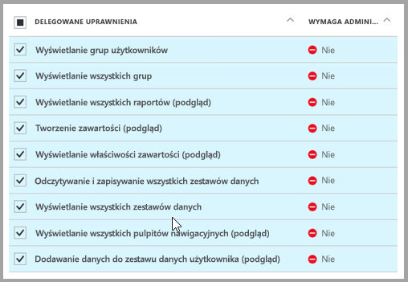

# <a name="tutorial-embed-a-power-bi-report-dashboard-or-tile-into-an-application-for-your-customers"></a>Samouczek: osadzanie raportu, pulpitu nawigacyjnego lub kafelka usługi Power BI w aplikacji dla klientów
Usługa **Power BI Embedded na platformie Azure** umożliwia osadzanie raportów, pulpitów nawigacyjnych lub kafelków w aplikacji przy użyciu struktury **app owns data** (aplikacja jest właścicielem danych). Struktura **app owns data** dotyczy posiadania aplikacji, która używa usługi Power BI jako osadzonej platformy do analizy. Używanie struktury **app owns data** jest zazwyczaj scenariuszem obejmującym **dewelopera ISV**. Jako **deweloper ISV** możesz tworzyć zawartość usługi **Power BI** służącą do wyświetlania raportów, pulpitów nawigacyjnych lub kafelków w aplikacji, która jest w pełni zintegrowana i interaktywna — użytkownicy aplikacji nie muszą posiadać licencji usługi Power BI. W tym samouczku przedstawiono sposób integrowania raportu w aplikacji przy użyciu zestawu .NET SDK usługi **Power BI** z interfejsem API języka JavaScript usługi **Power BI** w przypadku używania usługi **Power BI Embedded na platformie Azure**  dla klientów korzystających ze struktury **app owns data**.

Z tego samouczka dowiesz się, jak wykonywać następujące czynności:
>[!div class="checklist"]
>* Rejestrowanie aplikacji na platformie Azure.
>* Osadzanie raportu usługi Power BI w aplikacji.

## <a name="prerequisites"></a>Wymagania wstępne
Do rozpoczęcia pracy potrzebne jest konto usługi **Power BI Pro** (**konto główne**) oraz subskrypcja platformy **Microsoft Azure**.

* Jeśli nie masz konta usługi **Power BI Pro**, na początku [zacznij korzystać z bezpłatnej wersji próbnej](https://powerbi.microsoft.com/en-us/pricing/).
* Jeśli nie masz subskrypcji platformy Azure, przed rozpoczęciem utwórz [bezpłatne konto](https://azure.microsoft.com/free/?WT.mc_id=A261C142F).
* Musisz mieć własną konfigurację [dzierżawy usługi Azure Active Directory](create-an-azure-active-directory-tenant.md).
* Musisz mieć zainstalowany program [Visual Studio](https://www.visualstudio.com/) (w wersji 2013 lub nowszej).

## <a name="set-up-your-embedded-analytics-development-environment"></a>Konfigurowanie środowiska deweloperskiego analizy osadzonej

Przed rozpoczęciem osadzania raportów, pulpitów nawigacyjnych lub kafelków w aplikacji należy upewnić się, że środowisko skonfigurowano w sposób umożliwiający osadzanie. W ramach konfiguracji należy wykonać następujące działania.

Możesz użyć [narzędzia obsługi dołączania](https://aka.ms/embedsetup/AppOwnsData), aby szybko zacząć pracę i pobrać przykładową aplikację, która pomoże przeprowadzić Cię przez proces tworzenia środowiska i osadzania raportu.

Jeśli jednak chcesz ręcznie skonfigurować środowisko, kontynuuj czytanie.
### <a name="register-an-application-in-azure-active-directory-azure-ad"></a>Rejestrowanie aplikacji w usłudze Azure Active Directory (Azure AD)

Aplikację można zarejestrować w usłudze Azure Active Directory, aby zapewnić aplikacji dostęp do interfejsów API REST usługi Power BI. Dzięki temu można ustanowić tożsamość aplikacji i określić jej uprawnienia do zasobów REST usługi Power BI.

1. Zaakceptuj [Warunki interfejsu API usługi Microsoft Power BI](https://powerbi.microsoft.com/api-terms).

2. Zaloguj się w witrynie [Azure Portal](https://portal.azure.com).
 
    

3. W okienku nawigacji po lewej stronie wybierz pozycję **Wszystkie usługi** i **Rejestracje aplikacji**, a następnie kliknij przycisk **Rejestrowanie nowej aplikacji**.
   
    </br>
    

4. Postępuj zgodnie z monitami i utwórz nową aplikację. W przypadku struktury „app owns data” użyj typu aplikacji **Natywna**. Podaj również **Identyfikator URI przekierowania**, którego usługa **Azure AD** używa do zwracania odpowiedzi tokenu. Wprowadź wartość powiązaną z Twoją aplikacją (np. `http://localhost:13526/Redirect`).

    

### <a name="apply-permissions-to-your-application-within-azure-active-directory"></a>Stosowanie uprawnień do aplikacji w usłudze Azure Active Directory

Musisz włączyć dodatkowe uprawnienia aplikacji oprócz tych, które zostały podane na stronie rejestrowania aplikacji. Musisz zalogować się na konto *główne* używane do osadzania, które musi być kontem administratora globalnego.

### <a name="use-the-azure-active-directory-portal"></a>Korzystanie z portalu usługi Azure Active Directory

1. Przejdź do obszaru [Rejestracje aplikacji](https://portal.azure.com/#blade/Microsoft_AAD_IAM/ApplicationsListBlade) w witrynie Azure Portal i wybierz aplikację, której używasz do osadzania.
   
    

2. Wybierz pozycję **Ustawienia**, a następnie w obszarze **Dostęp do interfejsu API** wybierz pozycję **Wymagane uprawnienia**.
   
    

3. Wybierz pozycję **Windows Azure Active Directory**, a następnie upewnij się, że wybrana jest pozycja **Uzyskuj dostęp do katalogu jako zalogowany użytkownik**. Wybierz pozycję **Zapisz**.
   
    

4. Wybierz pozycję **Dodaj**.

    

5. Wybierz pozycję **Wybierz interfejs API**.

    

6. Wybierz pozycję **Usługa Power BI**, a następnie wybierz pozycję **Wybierz**.

    

7. Wybierz wszystkie uprawnienia w obszarze **Delegowane uprawnienia**. W celu zapisania wyborów musisz je zaznaczać pojedynczo. Po zakończeniu wybierz pozycję **Zapisz**.
   
    

8. W obszarze **Wymagane uprawnienia** wybierz pozycję **Udziel uprawnień**.
   
    Wykonanie akcji **Udziel uprawnień** jest konieczne, aby usługa Azure AD nie wysyłała do *konta głównego* monitów o wyrażenie zgody. Jeśli konto, z którego wykonywana jest ta akcja, jest kontem administratora globalnego, musisz udzielić uprawnień do tej aplikacji wszystkim użytkownikom w swojej organizacji. Jeśli jest to *konto główne*, które nie ma uprawnień administratora globalnego, musisz udzielić uprawnień do tej aplikacji tylko *kontu głównemu*.
   
    

## <a name="set-up-your-power-bi-environment"></a>Konfigurowanie środowiska usługi Power BI

### <a name="create-an-app-workspace"></a>Tworzenie obszaru roboczego aplikacji

W przypadku osadzania raportów, pulpitów nawigacyjnych lub kafelków dla klientów należy umieścić zawartość w obszarze roboczym aplikacji. Konto *główne* musi być kontem administratora obszaru roboczego aplikacji.

1. Rozpocznij od utworzenia obszaru roboczego. Wybierz pozycję **Obszary robocze** > **Utwórz obszar roboczy aplikacji**. W tym miejscu jest umieszczana zawartość, do której aplikacja musi uzyskiwać dostęp.

    

2. Nadaj nazwę obszarowi roboczemu. Jeśli odpowiedni **Identyfikator obszaru roboczego** nie jest dostępny, edytuj go, aby skorzystać z unikatowego identyfikatora. Musi to być również nazwa aplikacji.

    

3. Istnieje kilka opcji do ustawienia. Jeśli wybierzesz opcję **Publiczny**, wszystkie osoby w organizacji będą mogły zobaczyć zawartość tego obszaru roboczego. Z drugiej strony opcja **Prywatny** oznacza, że tylko członkowie obszaru roboczego będą mogli wyświetlić jego zawartość.

    

    Nie możesz zmienić ustawienia Publiczny/Prywatny po utworzeniu grupy.

4. Ponadto możesz zdecydować, czy członkowie uzyskają dostęp do **edycji** lub **tylko do wyświetlania**.

    

5. Dodaj adresy e-mail osób, które mają mieć dostęp do obszaru roboczego, a następnie wybierz opcję **Dodaj**. Nie można dodawać aliasów grupy, tylko osoby.

6. Zdecyduj wobec każdej osoby, czy jest członkiem, czy administratorem. Administratorzy mogą edytować obszar roboczy, w tym dodawać innych członków. Członkowie mogą edytować zawartość w obszarze roboczym, chyba że mają dostęp tylko do wyświetlania. Administratorzy i członkowie mogą opublikować aplikację.

    Teraz możesz wyświetlić nowy obszar roboczy. Usługa Power BI tworzy obszar roboczy i otwiera go. Zostanie on wyświetlony na liście obszarów roboczych, których członkiem jesteś. Jako że jesteś administratorem, możesz wybrać wielokropek (...), aby powrócić i wprowadzić zmiany, dodając nowych członków lub zmieniając ich uprawnienia.

    

### <a name="create-and-publish-your-reports"></a>Tworzenie i publikowanie raportów

Raporty i zestawy danych można tworzyć przy użyciu programu Power BI Desktop, a następnie publikować je w obszarze roboczym aplikacji. Aby móc publikować raporty w obszarze roboczym aplikacji, użytkownik końcowy publikujący je musi mieć licencję usługi Power BI Pro.

1. Pobierz przykład [Blog Demo](https://github.com/Microsoft/powerbi-desktop-samples) (Pokaz bloga) z usługi GitHub.

    

2. Otwórz przykładowy raport PBIX w programie **Power BI Desktop**.

   

3. Opublikuj w **obszarze roboczym aplikacji**.

   

    Teraz możesz przeglądać raport w trybie online za pomocą usługi Power BI.

   

## <a name="embed-your-content-using-the-sample-application"></a>Osadzanie zawartości za pomocą przykładowej aplikacji

Wykonaj następujące kroki, aby rozpocząć osadzanie zawartości za pomocą przykładowej aplikacji.

1. Pobierz [przykład App Owns Data](https://github.com/Microsoft/PowerBI-Developer-Samples) (dane należą do aplikacji) z usługi GitHub, aby rozpocząć pracę.

    

2. Otwórz plik Web.config w przykładowej aplikacji. Aby pomyślnie uruchomić aplikację, należy wypełnić 5 pól: **clientId**, **groupId**, **reportId**, **pbiUsername** i **pbiPassword**.

    

    W polu **clientId** podaj **identyfikator aplikacji** z platformy **Azure**. Za pomocą wartości **clientId** aplikacja identyfikuje się dla użytkowników, od których żądasz uprawnień. Aby uzyskać wartość **clientId**, wykonaj następujące czynności:

    Zaloguj się w witrynie [Azure Portal](https://portal.azure.com).

    

    W okienku nawigacji po lewej stronie wybierz pozycję **Wszystkie usługi** i pozycję **Rejestracje aplikacji**.

     Wybierz aplikację, dla której chcesz uzyskać wartość **clientId**.

    

    Powinien zostać wyświetlony **identyfikator aplikacji** wymieniony jako identyfikator GUID. Użyj tego **identyfikatora aplikacji** jako wartości **clientId** dla aplikacji.

    

    W polu **groupId** podaj **identyfikator GUID obszaru roboczego aplikacji** z usługi Power BI.

    

    W polu **reportId** podaj **identyfikator GUID** z usługi Power BI.

    

    * W polu **pbiUsername** określ główne konto użytkownika usługi Power BI.
    * W polu **pbiPassword** podaj hasło głównego konta użytkownika usługi Power BI.

3. Uruchom aplikację!

    Najpierw wybierz pozycję **Uruchom** w programie **Visual Studio**.

    

    Następnie wybierz pozycję **Osadź raport**. W zależności od zawartości, która ma być testowana — raporty, pulpity nawigacyjne lub kafelki — wybierz tę opcję w aplikacji.

    

    Teraz możesz przeglądać raport w przykładowej aplikacji.

    

## <a name="embed-your-content-within-your-application"></a>Osadzanie zawartości w aplikacji
Mimo że kroki osadzania zawartości można wykonać przy użyciu [interfejsów API REST usługi Power BI](https://docs.microsoft.com/rest/api/power-bi/), przykładowe kody opisane w tym artykule są tworzone przy użyciu **zestawu SDK platformy .NET**.

Osadzanie dla klientów w ramach aplikacji wymaga pobrania **tokenu dostępu** dla konta głównego z usługi **Azure AD**. Przed wykonywaniem wywołań do [interfejsów API REST usługi Power BI](https://docs.microsoft.com/rest/api/power-bi/) wymagane jest pobranie [tokenu dostępu usługi Azure AD](get-azuread-access-token.md#access-token-for-non-power-bi-users-app-owns-data) dla aplikacji usługi Power BI za pomocą struktury **app owns data**.

Aby utworzyć klienta programu Power BI przy użyciu **tokenu dostępu**, utwórz obiekt klienta usługi Power BI, który pozwala na interakcję z [interfejsami API REST usługi Power BI](https://docs.microsoft.com/rest/api/power-bi/). Jest to realizowane przez opakowywanie tokenu **AccessToken** w obiekt ***Microsoft.Rest.TokenCredentials***.

```csharp
using Microsoft.IdentityModel.Clients.ActiveDirectory;
using Microsoft.Rest;
using Microsoft.PowerBI.Api.V2;

var tokenCredentials = new TokenCredentials(authenticationResult.AccessToken, "Bearer");

// Create a Power BI Client object. It is used to call Power BI APIs.
using (var client = new PowerBIClient(new Uri(ApiUrl), tokenCredentials))
{
    // Your code to embed items.
}
```

### <a name="get-the-content-item-you-want-to-embed"></a>Pobieranie elementu zawartości, który ma zostać osadzony
Możesz użyć obiektu klienta usługi Power BI do pobrania odwołania do elementu, który ma zostać osadzony.

Oto przykład kodu służącego do pobierania pierwszego raportu z danego obszaru roboczego.

*Przykład pobierania elementu zawartości — raportu, pulpitu nawigacyjnego lub kafelka — do osadzenia jest dostępny w pliku Controllers\HomeController.cs w [przykładowej aplikacji](#embed-your-content-within-a-sample-application).*

```csharp
using Microsoft.PowerBI.Api.V2;
using Microsoft.PowerBI.Api.V2.Models;

// You need to provide the GroupID where the dashboard resides.
ODataResponseListReport reports = client.Reports.GetReportsInGroupAsync(GroupId);

// Get the first report in the group.
Report report = reports.Value.FirstOrDefault();
```

### <a name="create-the-embed-token"></a>Tworzenie tokenu osadzania
Należy wygenerować token osadzania, którego można używać z poziomu interfejsu API języka JavaScript. Token osadzania jest specyficzny dla osadzanego elementu. Za każdym razem, gdy osadzasz fragment zawartości usługi Power BI, musisz utworzyć dla niego nowy token. Aby uzyskać więcej informacji, łącznie z tym, którego parametru **accessLevel** używać, zobacz [GenerateToken API (Interfejs API generowania tokenu)](https://msdn.microsoft.com/library/mt784614.aspx).

Oto przykład dodawania tokenu osadzania dla raportu do aplikacji.

*Przykład tworzenia osadzonego tokenu dla raportu, pulpitu nawigacyjnego lub kafelka jest dostępny w pliku Controllers\HomeController.cs w [przykładowej aplikacji](#embed-your-content-within-a-sample-application).*

```csharp
using Microsoft.PowerBI.Api.V2;
using Microsoft.PowerBI.Api.V2.Models;

// Generate Embed Token.
var generateTokenRequestParameters = new GenerateTokenRequest(accessLevel: "view");
EmbedToken tokenResponse = client.Reports.GenerateTokenInGroup(GroupId, report.Id, generateTokenRequestParameters);

// Generate Embed Configuration.
var embedConfig = new EmbedConfig()
{
    EmbedToken = tokenResponse,
    EmbedUrl = report.EmbedUrl,
    Id = report.Id
};
```

Założono, że utworzono klasę **EmbedConfig** i **TileEmbedConfig**. Przykład tych klas jest dostępny w plikach **Models\EmbedConfig.cs** i **Models\TileEmbedConfig.cs**.

### <a name="load-an-item-using-javascript"></a>Ładowanie elementu przy użyciu języka JavaScript
Do załadowania raportu do elementu div na stronie internetowej można użyć języka JavaScript.

Aby uzyskać pełen przykład użycia interfejsu API języka JavaScript, można użyć [narzędzia Playground](https://microsoft.github.io/PowerBI-JavaScript/demo). Jest to szybki sposób na zapoznanie się z różnymi typami przykładów usługi Power BI Embedded. Więcej informacji na temat interfejsu API języka JavaScript możesz również uzyskać, odwiedzając [stronę wiki Power BI-JavaScript](https://github.com/Microsoft/powerbi-javascript/wiki).

Poniżej znajduje się przykład używający modelu **EmbedConfig** i modelu **TileEmbedConfig** wraz z widokami dla raportu.

*Przykład dodawania widoku dla raportu, pulpitu nawigacyjnego lub kafelka jest dostępny w plikach Views\Home\EmbedReport.cshtml, Views\Home\EmbedDashboard.cshtml lub Views\Home\Embedtile.cshtml w [przykładowej aplikacji](#embed-your-content-within-a-sample-application).*

```javascript
<script src="~/scripts/powerbi.js"></script>
<div id="reportContainer"></div>
<script>
    // Read embed application token from Model
    var accessToken = "@Model.EmbedToken.Token";

    // Read embed URL from Model
    var embedUrl = "@Html.Raw(Model.EmbedUrl)";

    // Read report Id from Model
    var embedReportId = "@Model.Id";

    // Get models. models contains enums that can be used.
    var models = window['powerbi-client'].models;

    // Embed configuration used to describe the what and how to embed.
    // This object is used when calling powerbi.embed.
    // This also includes settings and options such as filters.
    // You can find more information at https://github.com/Microsoft/PowerBI-JavaScript/wiki/Embed-Configuration-Details.
    var config = {
        type: 'report',
        tokenType: models.TokenType.Embed,
        accessToken: accessToken,
        embedUrl: embedUrl,
        id: embedReportId,
        permissions: models.Permissions.All,
        settings: {
            filterPaneEnabled: true,
            navContentPaneEnabled: true
        }
    };

    // Get a reference to the embedded report HTML element
    var reportContainer = $('#reportContainer')[0];

    // Embed the report and display it within the div container.
    var report = powerbi.embed(reportContainer, config);
</script>
```

## <a name="move-to-production"></a>Przejście do środowiska produkcyjnego

Tworzenie aplikacji zakończyło się i należy teraz zapewnić dedykowaną pojemność w obszarze roboczym aplikacji. Pojemność dedykowana jest wymagana do przejścia do środowiska produkcyjnego.

### <a name="create-a-dedicated-capacity"></a>Tworzenie pojemności dedykowanej
Utworzenie pojemności dedykowanej pozwala klientowi skorzystać z zalet zasobu dedykowanego. Możesz kupić dedykowaną pojemność w witrynie [Microsoft Azure Portal](https://portal.azure.com). Aby uzyskać więcej informacji na temat tworzenia pojemności osadzonej usługi Power BI Embedded, zobacz artykuł [Create Power BI Embedded capacity in the Azure portal](azure-pbie-create-capacity.md) (Tworzenie pojemności osadzonej usługi Power BI Embedded w witrynie Azure Portal).

Określ na podstawie poniższej tabeli, jaka pojemność usługi Power BI Embedded najlepiej odpowiada Twoim wymaganiom.

| Węzeł pojemności | Całkowita liczba rdzeni<br/>*(Wewnętrzna baza danych + fronton)* | Rdzenie wewnętrznej bazy danych | Rdzenie frontonu | Limity zapytania bezpośredniego/połączenia na żywo | Maksymalne renderowanie strony w godzinie szczytu |
| --- | --- | --- | --- | --- | --- |
| A1 |1 rdzeń wirtualny |0,5 rdzenia, 3 GB pamięci RAM |0,5 rdzenia | 5 na sekundę |1–300 |
| A2 |2 rdzenie wirtualne |1 rdzeń, 5 GB pamięci RAM |1 rdzeń | 10 na sekundę |301–600 |
| A3 |4 rdzenie wirtualne |2 rdzenie, 10 GB pamięci RAM |2 rdzenie | 15 na sekundę |601–1200 |
| A4 |8 rdzeni wirtualnych |4 rdzenie, 25 GB pamięci RAM |4 rdzenie |30 na sekundę |1201–2400 |
| A5 |16 rdzeni wirtualnych |8 rdzeni, 50 GB pamięci RAM |8 rdzeni |60 na sekundę |2401–4800 |
| A6 |32 rdzenie wirtualne |16 rdzeni, 100 GB pamięci RAM |16 rdzeni |120 na sekundę |4801–9600 |

**_Podobnie jak w przypadku jednostek SKU A, nie można uzyskiwać dostępu do zawartości usługi Power BI z użyciem BEZPŁATNEJ licencji usługi Power BI._**

Użycie tokenów osadzania z licencjami PRO jest przeznaczone do celów testowania podczas programowania, więc liczba tokenów osadzania, które może wygenerować konto główne usługi Power BI, jest ograniczona. Aby umożliwić osadzanie w środowisku produkcyjnym, należy zakupić pojemność dedykowaną. Nie ma żadnego ograniczenia liczby generowanych tokenów osadzania za pomocą pojemności dedykowanej. Przejdź do sekcji [Available Features](https://docs.microsoft.com/rest/api/power-bi/availablefeatures/getavailablefeatures) (Dostępne funkcje), aby sprawdzić wartość użycia, która wskazuje bieżące użycie osadzania w procentach. Wielkość użycia opera się na koncie głównym.

Więcej informacji można znaleźć w [oficjalnym dokumencie dotyczącym planowania pojemności na potrzeby osadzonej analizy](https://aka.ms/pbiewhitepaper).

### <a name="assign-an-app-workspace-to-a-dedicated-capacity"></a>Przypisywanie obszaru roboczego aplikacji do pojemności dedykowanej

Po utworzeniu pojemności dedykowanej możesz do niej przypisać obszar roboczy aplikacji. Aby zakończyć ten proces, wykonaj następujące kroki.

1. W ramach **usługi Power BI** rozwiń obszary robocze i wybierz przycisk wielokropka dla obszaru roboczego, za pomocą którego osadzasz zawartość. Następnie wybierz pozycję **Edytuj obszary robocze**.

    

2. Rozwiń węzeł **Zaawansowane**, włącz pozycję **Pojemność dedykowana**, a następnie wybierz utworzoną pojemność dedykowaną. Następnie wybierz pozycję **Zapisz**.

    

3. Po wybraniu pozycji **Zapisz** obok nazwy obszaru roboczego aplikacji powinna zostać wyświetlona ikona **diamentu**.

    

## <a name="next-steps"></a>Następne kroki
W tym samouczku objaśniono osadzanie zawartości usługi Power BI w aplikacji dla klientów. Zawartość usługi Power BI możesz również spróbować osadzić dla swojej organizacji.

> [!div class="nextstepaction"]
>[Osadź dla swojej organizacji](embed-sample-for-your-organization.md)

Masz więcej pytań? [Zadaj pytanie społeczności usługi Power BI](http://community.powerbi.com/)
