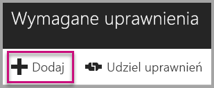

# Samouczek: osadzanie raportu, pulpitu nawigacyjnego lub kafelka usługi Power BI w aplikacji dla klientów
Usługa **Power BI Embedded na platformie Azure** umożliwia osadzanie raportów, pulpitów nawigacyjnych lub kafelków w aplikacji przy użyciu struktury **app owns data** (aplikacja jest właścicielem danych). Struktura **app owns data** dotyczy posiadania aplikacji, która używa usługi Power BI jako osadzonej platformy do analizy. Jest to zazwyczaj scenariusz obejmujący **dewelopera ISV**. Jako **developer ISV** możesz tworzyć zawartość usługi Power BI służącą do wyświetlania raportów, pulpitów nawigacyjnych lub kafelków w aplikacji, która jest w pełni zintegrowana i interaktywna — użytkownicy aplikacji nie muszą posiadać licencji usługi Power BI ani nawet wiedzieć, że praca opiera się na usłudze Power BI. W tym samouczku przedstawiono sposób integrowania raportu w aplikacji przy użyciu zestawu .NET SDK usługi **Power BI** z interfejsem API języka JavaScript usługi **Power BI** w przypadku używania usługi **Power BI Embedded na platformie Azure**  dla klientów korzystających ze struktury **app owns data**.

Z tego samouczka dowiesz się, jak wykonywać następujące czynności:
>[!div class="checklist"]
>* Rejestrowanie aplikacji na platformie Azure.
>* Osadzanie raportu usługi Power BI w aplikacji.

## Wymagania wstępne
Do rozpoczęcia pracy potrzebne jest konto usługi **Power BI Pro**, które będzie **kontem głównym**, oraz subskrypcja platformy **Microsoft Azure**.

* Jeśli nie masz konta usługi **Power BI Pro**, na początku [zacznij korzystać z bezpłatnej wersji próbnej](https://powerbi.microsoft.com/en-us/pricing/).
* Jeśli nie masz subskrypcji platformy Azure, przed rozpoczęciem utwórz [bezpłatne konto](https://azure.microsoft.com/free/?WT.mc_id=A261C142F).
* Musisz mieć własną konfigurację [dzierżawy usługi Azure Active Directory](create-an-azure-active-directory-tenant.md).
* Musisz mieć zainstalowany program [Visual Studio](https://www.visualstudio.com/) (w wersji 2013 lub nowszej).

## Konfigurowanie środowiska deweloperskiego analizy osadzonej

Przed rozpoczęciem osadzania raportów, pulpitów nawigacyjnych lub kafelków w aplikacji należy upewnić się, że środowisko skonfigurowano w sposób umożliwiający osadzanie. W ramach konfiguracji należy wykonać następujące działania.

### Rejestrowanie aplikacji w usłudze Azure Active Directory (Azure AD)

Aplikację można zarejestrować w usłudze Azure Active Directory, aby zapewnić aplikacji dostęp do interfejsów API REST usługi Power BI. Dzięki temu można ustanowić tożsamość aplikacji i określić jej uprawnienia do zasobów REST usługi Power BI.

1. Zaakceptuj [Warunki interfejsu API usługi Microsoft Power BI](https://powerbi.microsoft.com/api-terms).

2. Zaloguj się w witrynie [Azure Portal](https://portal.azure.com).
 
    

3. W okienku nawigacji po lewej stronie wybierz kolejno pozycje **Wszystkie usługi** i **Rejestracje aplikacji**, a następnie kliknij przycisk **Rejestrowanie nowej aplikacji**.
   
     
    

4. Postępuj zgodnie z monitami i utwórz nową aplikację. W przypadku struktury „app owns data” użyj typu aplikacji **Natywna**. Podaj również **Identyfikator URI przekierowania**, którego usługa **Azure AD** używa do zwracania odpowiedzi tokenu. Wprowadź wartość powiązaną z Twoją aplikacją (np. http://localhost:13526/redirect)).

    

### Stosowanie uprawnień do aplikacji w usłudze Azure Active Directory

Konieczne będzie włączenie dodatkowych uprawnień aplikacji oprócz tych, które zostały podane na stronie rejestrowania aplikacji. Musisz zalogować się na konto *główne* używane do osadzania, które musi być kontem administratora globalnego.

### Korzystanie z portalu usługi Azure Active Directory

1. Przejdź do obszaru [Rejestracje aplikacji](https://portal.azure.com/#blade/Microsoft_AAD_IAM/ApplicationsListBlade) w witrynie Azure Portal i wybierz aplikację, której używasz do osadzania.
   
    

2. Wybierz pozycję **Ustawienia**, a następnie w obszarze **Dostęp do interfejsu API** wybierz pozycję **Wymagane uprawnienia**.
   
    

3. Wybierz pozycję **Windows Azure Active Directory**, a następnie upewnij się, że wybrana jest pozycja **Uzyskuj dostęp do katalogu jako zalogowany użytkownik**. Wybierz pozycję **Zapisz**.
   
    

4. Wybierz pozycję **Dodaj**.

    

5. Wybierz pozycję **Wybierz interfejs API**.

    

6. Wybierz pozycję **Usługa Power BI**, a następnie wybierz pozycję **Wybierz**.

    

7. Wybierz wszystkie uprawnienia w obszarze **Delegowane uprawnienia**. W celu zapisania wyborów musisz je zaznaczać pojedynczo. Po zakończeniu wybierz pozycję **Zapisz**.
   
    

8. W obszarze **Wymagane uprawnienia** wybierz pozycję **Udziel uprawnień**.
   
    Wykonanie akcji **Udziel uprawnień** jest konieczne, aby usługa Azure AD nie wysyłała do *konta głównego* monitów o wyrażenie zgody. Jeśli konto, z którego wykonywana jest ta akcja, jest kontem administratora globalnego, udzielisz uprawnień do tej aplikacji wszystkim użytkownikom w swojej organizacji. Jeśli jest to *konto główne*, które nie ma uprawnień administratora globalnego, udzielisz uprawnień do tej aplikacji tylko *kontu głównemu*.
   
    

## Konfigurowanie środowiska usługi Power BI

### Tworzenie obszaru roboczego aplikacji

W przypadku osadzania raportów, pulpitów nawigacyjnych lub kafelków dla klientów należy umieścić zawartość w obszarze roboczym aplikacji. Konto *główne* musi być kontem administratora obszaru roboczego aplikacji.

1. Rozpocznij od utworzenia obszaru roboczego. Wybierz pozycję **Obszary robocze** > **Utwórz obszar roboczy aplikacji**. W tym miejscu zostanie umieszczona zawartość, do której aplikacja musi uzyskiwać dostęp.

    

2. Nadaj nazwę obszarowi roboczemu. Jeśli odpowiedni **Identyfikator obszaru roboczego** nie jest dostępny, edytuj go, aby skorzystać z unikatowego identyfikatora. Będzie to również nazwa aplikacji.

    

3. Istnieje kilka opcji do ustawienia. Jeśli wybierzesz opcję **Publiczny**, wszystkie osoby w organizacji będą mogły zobaczyć zawartość tego obszaru roboczego. Z drugiej strony opcja **Prywatny** oznacza, że tylko członkowie obszaru roboczego będą mogli wyświetlić jego zawartość.

    

    Nie możesz zmienić ustawienia Publiczny/Prywatny po utworzeniu grupy.

4. Ponadto możesz zdecydować, czy członkowie uzyskają dostęp do **edycji** lub **tylko do wyświetlania**.

    

5. Dodaj adresy e-mail osób, które mają mieć dostęp do obszaru roboczego, a następnie wybierz opcję **Dodaj**. Nie można dodawać aliasów grupy, tylko osoby.

6. Zdecyduj wobec każdej osoby, czy jest członkiem, czy administratorem. Administratorzy mogą edytować obszar roboczy, w tym dodawać innych członków. Członkowie mogą edytować zawartość w obszarze roboczym, chyba że mają dostęp tylko do wyświetlania. Administratorzy i członkowie mogą opublikować aplikację.

Teraz możesz wyświetlić nowy obszar roboczy. Usługa Power BI tworzy obszar roboczy i otwiera go. Zostanie on wyświetlony na liście obszarów roboczych, których członkiem jesteś. Jako że jesteś administratorem, możesz wybrać wielokropek (...), aby powrócić i wprowadzić zmiany, dodając nowych członków lub zmieniając ich uprawnienia.

   

### Tworzenie i publikowanie raportów

Raporty i zestawy danych można tworzyć przy użyciu programu Power BI Desktop, a następnie publikować je w obszarze roboczym aplikacji. Aby móc publikować raporty w obszarze roboczym aplikacji, użytkownik końcowy publikujący je musi mieć licencję usługi Power BI Pro.

1. Pobierz przykład [Blog Demo](https://github.com/Microsoft/powerbi-desktop-samples) (Pokaz bloga) z usługi GitHub.

    

2. Otwórz przykładowy raport PBIX w programie **Power BI Desktop**.

   

3. Opublikuj w **obszarze roboczym aplikacji**.

   

    Teraz możesz przeglądać raport w trybie online za pomocą usługi Power BI.

   

## Osadzanie zawartości

Osadzanie dla klientów w ramach aplikacji wymaga pobrania **tokenu dostępu** dla konta głównego z usługi **Azure AD**. Przed wykonywaniem wywołań do interfejsu API usługi Power BI wymagane jest [pobranie tokenu dostępu usługi Azure AD](get-azuread-access-token.md#access-token-for-non-power-bi-users-app-owns-data) dla aplikacji usługi Power BI za pomocą struktury app owns data.

Wykonaj następujące kroki, aby rozpocząć osadzanie zawartości za pomocą przykładowej aplikacji.

1. Pobierz [przykład App Owns Data](https://github.com/Microsoft/PowerBI-Developer-Samples) (dane należą do aplikacji) z usługi GitHub, aby rozpocząć pracę.

    

2. Otwórz plik Web.config w przykładowej aplikacji. Aby pomyślnie uruchomić aplikację, należy wypełnić 5 pól: **clientID**, **groupId**, **reportId**, **pbiUsername** i **pbiPassword**.

      

    * W polu **clientId** podaj **identyfikator aplikacji** z platformy **Azure**. Za pomocą wartości **clientId** aplikacja identyfikuje się dla użytkowników, od których żądasz uprawnień. Aby uzyskać wartość **clientId**, wykonaj następujące czynności:

    1. Zaloguj się w witrynie [Azure Portal](https://portal.azure.com).

        

    2. W okienku nawigacji po lewej stronie wybierz pozycję **Wszystkie usługi** i pozycję **Rejestracje aplikacji**.

        
    3. Wybierz aplikację, dla której chcesz uzyskać wartość **clientId**.

        

    4. Powinien zostać wyświetlony **identyfikator aplikacji** wymieniony jako identyfikator GUID. Użyj tego **identyfikatora aplikacji** jako wartości **clientId** dla aplikacji.

             

    * W polu **groupId** podaj **identyfikator GUID obszaru roboczego aplikacji** z usługi Power BI.

        

    * W polu **reportId** podaj **identyfikator GUID** z usługi Power BI.

            

    * W polu **pbiUsername** określ główne konto użytkownika usługi Power BI.
    * W polu **pbiPassword** podaj hasło głównego konta użytkownika usługi Power BI.

3. Uruchom aplikację!

    Najpierw wybierz pozycję **Uruchom** w programie **Visual Studio**.

    

    Następnie wybierz pozycję **Osadź raport**. W zależności od zawartości, która ma być testowana — raporty, pulpity nawigacyjne lub kafelki — wybierz tę opcję w aplikacji.

    
 
    Teraz możesz przeglądać raport w przykładowej aplikacji.

    

## Przejście do środowiska produkcyjnego

Po zakończeniu tworzenia aplikacji należy zapewnić dedykowaną pojemność w obszarze roboczym aplikacji. Pojemność dedykowana jest wymagana do przejścia do środowiska produkcyjnego.

### Tworzenie pojemności dedykowanej
Utworzenie pojemności dedykowanej pozwala klientowi skorzystać z zalet zasobu dedykowanego. Obszary robocze, które nie są przypisane do pojemności dedykowanej, znajdą się w pojemności udostępnionej. Pojemność dedykowaną można utworzyć za pomocą rozwiązania [pojemności dedykowanej usługi Power BI Embedded](https://docs.microsoft.com/azure/power-bi-embedded/create-capacity) na platformie Azure.

>[!Note]
>Tokeny osadzania z licencją PRO są przeznaczone do celów testowania podczas programowania, więc liczba tokenów osadzania, które może wygenerować konto główne usługi Power BI, jest ograniczona. Aby umożliwić osadzanie w środowisku produkcyjnym, należy zakupić pojemność dedykowaną. Nie ma żadnego ograniczenia liczby generowanych tokenów osadzania za pomocą pojemności dedykowanej. Przejdź do tematu [Get Available Features](https://msdn.microsoft.com/library/mt846473.aspx) (Pobieranie dostępnych funkcji), aby sprawdzić wartość użycia, która wskazuje bieżące użycie osadzania w procentach.
>

### Przypisywanie obszaru roboczego aplikacji do pojemności dedykowanej

Po utworzeniu pojemności dedykowanej przypisz do niej obszar roboczy aplikacji. Aby zakończyć ten proces, wykonaj następujące kroki.

1. W ramach **usługi Power BI** rozwiń obszary robocze i wybierz przycisk wielokropka dla obszaru roboczego, za pomocą którego osadzana jest zawartość. Następnie wybierz pozycję **Edytuj obszary robocze**.

    

2. Rozwiń węzeł **Zaawansowane**, włącz pozycję **Pojemność dedykowana**, a następnie wybierz utworzoną pojemność dedykowaną. Następnie wybierz pozycję **Zapisz**.

    

Aby uzyskać pełen przykład użycia interfejsu API języka JavaScript, można użyć [narzędzia Playground](https://microsoft.github.io/PowerBI-JavaScript/demo). Jest to szybki sposób na zapoznanie się z różnymi typami przykładów usługi Power BI Embedded. Możesz również uzyskać więcej informacji na temat interfejsu API języka JavaScript, odwiedzając [stronę wiki Power BI-JavaScript](https://github.com/Microsoft/powerbi-javascript/wiki).

Jeśli masz dalsze pytania dotyczące usługi Power BI Embedded, odwiedź stronę [często zadawanych pytań](embedded-faq.md).  Jeśli masz problemy z usługą Power BI Embedded w aplikacji, odwiedź stronę [rozwiązywania problemów](embedded-troubleshoot.md).

Masz więcej pytań? [Zadaj pytanie społeczności usługi Power BI](http://community.powerbi.com/)