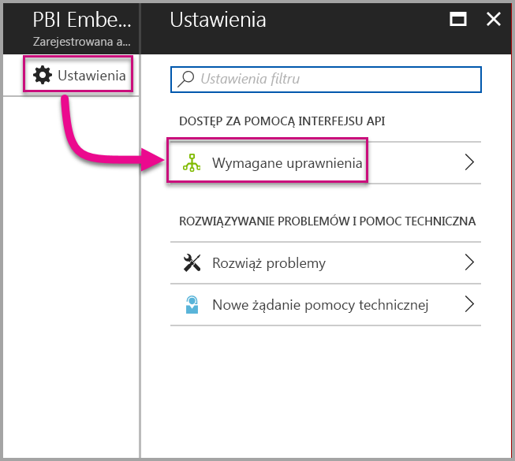

# <a name="tutorial-embed-a-power-bi-report-dashboard-or-tile-into-an-application-for-your-organization"></a>Samouczek: osadzanie raportu, pulpitu nawigacyjnego lub kafelka usługi Power BI w aplikacji dla organizacji

Usługa **Power BI** umożliwia osadzanie raportów, pulpitów nawigacyjnych lub kafelków w aplikacji przy użyciu struktury „user owns data” (użytkownik jest właścicielem danych). Struktura **user owns data** umożliwia aplikacji rozszerzenie usługi Power BI w celu korzystania z analizy osadzonej. W tym samouczku przedstawiono sposób integracji raportu w aplikacji. Zestawu SDK platformy .NET usługi Power BI używasz z interfejsem API języka JavaScript usługi Power BI do osadzania usługi Power BI w aplikacji dla swojej organizacji.


W tym samouczku zapoznasz się z następującymi zadaniami:
> [!div class="checklist"]
> * Rejestrowanie aplikacji na platformie Azure.
> * Osadzanie raportu usługi Power BI w aplikacji.

## <a name="prerequisites"></a>Wymagania wstępne

Do rozpoczęcia pracy potrzebne jest konto usługi Power BI Pro i subskrypcja platformy Microsoft Azure:

* Jeśli nie masz konta usługi Power BI Pro, na początku [zacznij korzystać z bezpłatnej wersji próbnej](https://powerbi.microsoft.com/en-us/pricing/).
* Jeśli nie masz subskrypcji platformy Azure, przed rozpoczęciem utwórz [bezpłatne konto](https://azure.microsoft.com/free/?WT.mc_id=A261C142F).
* Skonfiguruj własną [dzierżawę usługi Azure Active Directory (Azure AD)](create-an-azure-active-directory-tenant.md).
* Zainstaluj [program Visual Studio](https://www.visualstudio.com/) w wersji 2013 lub nowszej.

## <a name="set-up-your-embedded-analytics-development-environment"></a>Konfigurowanie środowiska deweloperskiego analizy osadzonej

Przed rozpoczęciem osadzania raportów, pulpitów nawigacyjnych lub kafelków w aplikacji upewnij się, że środowisko skonfigurowano w sposób umożliwiający osadzanie. W ramach instalacji wykonaj jedną z następujących czynności:

* Możesz użyć [narzędzia instalacji dołączania](https://aka.ms/embedsetup/UserOwnsData), aby szybko zacząć pracę i pobrać przykładową aplikację, która przeprowadzi Cię przez proces tworzenia środowiska i osadzania raportu.

* Jeśli postanowisz ręcznie skonfigurować środowisko, wykonaj kroki w poniższych sekcjach.

### <a name="register-an-application-in-azure-active-directory"></a>Rejestrowanie aplikacji w usłudze Azure Active Directory

Aby zapewnić aplikacji dostęp do interfejsów API REST usługi Power BI, zarejestruj ją w usłudze Azure Active Directory. Następnie możesz ustanowić tożsamość aplikacji i określić jej uprawnienia do zasobów REST usługi Power BI.

1. Zaakceptuj [Warunki interfejsu API usługi Microsoft Power BI](https://powerbi.microsoft.com/api-terms).

2. Zaloguj się w witrynie [Azure Portal](https://portal.azure.com).

    

3. W okienku nawigacji po lewej stronie wybierz pozycję **Wszystkie usługi** i pozycję **Rejestracje aplikacji**. Następnie wybierz pozycję **Rejestrowanie nowej aplikacji**.

    </br>

    

4. Postępuj zgodnie z monitami i utwórz nową aplikację. W przypadku struktury **user owns data** (użytkownik jest właścicielem danych) w obszarze **Typ aplikacji** użyj wartości **Interfejs API/aplikacja internetowa**. Podaj **Adres URL logowania**, którego usługa Azure AD używa do zwracania odpowiedzi tokenu. Wprowadź wartość specyficzną dla swojej aplikacji. Na przykład `http://localhost:13526/`.

    

### <a name="apply-permissions-to-your-application-within-azure-active-directory"></a>Stosowanie uprawnień do aplikacji w usłudze Azure Active Directory

Włącz uprawnienia do swojej aplikacji oprócz tych, które zostały podane na stronie rejestrowania aplikacji. Aby włączyć uprawnienia, zaloguj się przy użyciu konta administratora globalnego.

### <a name="use-the-azure-active-directory-portal"></a>Korzystanie z portalu usługi Azure Active Directory

1. Przejdź do obszaru [Rejestracje aplikacji](https://portal.azure.com/#blade/Microsoft_AAD_IAM/ApplicationsListBlade) w witrynie Azure Portal i wybierz aplikację, której używasz do osadzania.

    

2. Wybierz pozycję **Ustawienia**. Następnie wybierz pozycję **Wymagane uprawnienia** w obszarze **Dostęp do interfejsu API**.

    

3. Wybierz pozycję **Windows Azure Active Directory**. Następnie upewnij się, że wybrano pozycję **Uzyskuj dostęp do katalogu jako zalogowany użytkownik**. Wybierz pozycję **Zapisz**.

    

4. Wybierz pozycję **Dodaj**.

    

5. Wybierz pozycję **Wybierz interfejs API**.

    

6. Wybierz pozycję **Usługa Power BI**. Następnie wybierz pozycję **Wybierz**.

    

7. Wybierz wszystkie uprawnienia w obszarze **Delegowane uprawnienia**. W celu zapisania wyborów zaznaczaj je pojedynczo. Po zakończeniu wybierz pozycję **Zapisz**.

    

## <a name="set-up-your-power-bi-environment"></a>Konfigurowanie środowiska usługi Power BI

### <a name="create-an-app-workspace"></a>Utwórz obszar roboczy aplikacji

W przypadku osadzania raportów, pulpitów nawigacyjnych lub kafelków dla klientów należy umieścić zawartość w obszarze roboczym aplikacji:

1. Rozpocznij od utworzenia obszaru roboczego. Wybierz pozycję **Obszary robocze** > **Utwórz obszar roboczy aplikacji**. W tym obszarze roboczym jest umieszczana zawartość, do której aplikacja musi uzyskiwać dostęp.

    

2. Nadaj nazwę obszarowi roboczemu. Jeśli odpowiedni **Identyfikator obszaru roboczego** nie jest dostępny, edytuj go, aby skorzystać z unikatowego identyfikatora. Ta nazwa musi być również nazwą aplikacji.

    

3. Istnieje kilka opcji do ustawienia. Jeśli wybierzesz opcję **Publiczny**, wszystkie osoby w organizacji będą mogły zobaczyć zawartość tego obszaru roboczego. Opcja **Prywatny** oznacza, że tylko członkowie obszaru roboczego będą mogli wyświetlić jego zawartość.

    

    Nie możesz zmienić ustawienia Publiczny lub Prywatny po utworzeniu grupy.

4. Ponadto możesz zdecydować, czy członkowie uzyskają dostęp do edycji lub tylko do wyświetlania.

    

5. Dodaj adresy e-mail osób, które mają mieć dostęp do obszaru roboczego, a następnie wybierz pozycję **Dodaj**. Nie można dodawać aliasów grupy, tylko osoby.

6. Zdecyduj wobec każdej osoby, czy jest członkiem, czy administratorem. Administratorzy mogą edytować obszar roboczy, w tym dodawać innych członków. Członkowie mogą edytować zawartość w obszarze roboczym, chyba że mają dostęp tylko do wyświetlania. Administratorzy i członkowie mogą opublikować aplikację.

    Teraz możesz wyświetlić nowy obszar roboczy. Usługa Power BI tworzy obszar roboczy i otwiera go. Zostanie on wyświetlony na liście obszarów roboczych, których członkiem jesteś. Jako że jesteś administratorem, możesz wybrać wielokropek (...), aby powrócić i wprowadzić zmiany, dodając nowych członków lub zmieniając ich uprawnienia.

    

### <a name="create-and-publish-your-reports"></a>Tworzenie i publikowanie raportów

Raporty i zestawy danych możesz tworzyć za pomocą programu Power BI Desktop. Następnie możesz publikować te raporty w obszarze roboczym aplikacji. Aby móc publikować raporty w obszarze roboczym aplikacji, użytkownik końcowy publikujący je musi mieć licencję usługi Power BI Pro.

1. Pobierz przykład [Blog Demo](https://github.com/Microsoft/powerbi-desktop-samples) (Pokaz bloga) z usługi GitHub.

    

2. Otwórz przykładowy raport pbix w programie Power BI Desktop.

   

3. Opublikuj go w obszarze roboczym aplikacji.

   

    Teraz możesz przeglądać raport w trybie online za pomocą usługi Power BI.

   

## <a name="embed-your-content-by-using-the-sample-application"></a>Osadzanie zawartości za pomocą przykładowej aplikacji

Aby osadzić zawartość za pomocą przykładowej aplikacji, wykonaj następujące kroki:

1. Aby rozpocząć pracę, pobierz [przykład User Owns Data](https://github.com/Microsoft/PowerBI-Developer-Samples) z usługi GitHub. Istnieją trzy różne przykładowe aplikacje: jedna dla [raportów](https://github.com/Microsoft/PowerBI-Developer-Samples/tree/master/User%20Owns%20Data/integrate-report-web-app), druga dla [pulpitów nawigacyjnych](https://github.com/Microsoft/PowerBI-Developer-Samples/tree/master/User%20Owns%20Data/integrate-dashboard-web-app) i trzecia dla [kafelków](https://github.com/Microsoft/PowerBI-Developer-Samples/tree/master/User%20Owns%20Data/integrate-tile-web-app). Ten artykuł dotyczy aplikacji dla **raportów**.

    

2. Otwórz plik **Cloud.config** w przykładowej aplikacji. Aby pomyślnie uruchomić aplikację, musisz wypełnić kilka pól: **ApplicationID** i **ApplicationSecret**.

    

    W polu **ApplicationID** wprowadź **Identyfikator aplikacji** z platformy Azure. Za pomocą wartości **ApplicationID** aplikacja identyfikuje się dla użytkowników, od których żądasz uprawnień.

    Aby uzyskać wartość **ApplicationID**, wykonaj następujące czynności:

    1. Zaloguj się w witrynie [Azure Portal](https://portal.azure.com).

       

    2. W okienku nawigacji po lewej stronie wybierz pozycję **Wszystkie usługi** i pozycję **Rejestracje aplikacji**.

       

    3. Wybierz aplikację, która musi używać wartości **ApplicationID**.

       

    4. Powinien zostać wyświetlony **identyfikator aplikacji** wymieniony jako identyfikator GUID. Użyj tego **identyfikatora aplikacji** jako wartości **ApplicationID** dla aplikacji.

        

    W polu **ApplicationSecret** wprowadź informacje z sekcji **Klucze** obszaru **Rejestracje aplikacji** na platformie **Azure**.

    Aby uzyskać wartość **ApplicationSecret**, wykonaj następujące czynności:

    1. Zaloguj się w witrynie [Azure Portal](https://portal.azure.com).

       

    2. W okienku nawigacji po lewej stronie wybierz pozycję **Wszystkie usługi** i pozycję **Rejestracje aplikacji**.

       

    3. Wybierz aplikację, która musi używać wartości **ApplicationSecret**.

       

    4. Wybierz pozycję **Ustawienia**.

       

    5. Wybierz sekcję **Klucze**.

       

    6. Wprowadź nazwę w polu **Opis**, a następnie wybierz czas trwania. Następnie wybierz pozycję **Zapisz**, aby pobrać **Wartość** dla aplikacji. Po zamknięciu okienka **Klucze** po zapisaniu wartości klucza pole wartości jest wyświetlane tylko jako ukryte. W tym momencie nie możesz pobrać wartości klucza. W przypadku utraty wartości klucza utwórz nowy klucz w witrynie Azure Portal.

          

    7. W polu **groupId** wprowadź identyfikator GUID obszaru roboczego aplikacji z usługi Power BI.

       

    8. W przypadku identyfikatora **reportId** wprowadź identyfikator GUID z usługi Power BI.

       

3. Uruchom aplikację:

    Wybierz pozycję **Uruchom** w programie **Visual Studio**.

    

    Następnie wybierz pozycję **Pobierz raport**.

    

    Teraz możesz przeglądać raport w przykładowej aplikacji.

    

## <a name="embed-your-content-within-your-application"></a>Osadzanie zawartości w aplikacji

Mimo że kroki osadzania zawartości można wykonać przy użyciu [interfejsów API REST usługi Power BI](https://docs.microsoft.com/rest/api/power-bi/), przykładowe kody opisane w tym artykule są tworzone przy użyciu zestawu SDK platformy .NET.

Aby zintegrować raport z aplikacją internetową, użyj interfejsu API REST usługi Power BI lub zestawu SDK C# usługi Power BI. Aby pobrać raport możesz także użyć tokenu autoryzacji dostępu usługi Azure Active Directory. Następnie załaduj raport przy użyciu tego samego tokenu dostępu. Interfejs API REST usługi Power BI zapewnia dostęp programowy do określonych zasobów usługi Power BI. Aby uzyskać więcej informacji, zobacz [Power BI REST APIs (Interfejsy API REST usługi Power BI)](https://docs.microsoft.com/rest/api/power-bi/) i [Power BI JavaScript API (Interfejs API języka JavaScript usługi Power BI)](https://github.com/Microsoft/PowerBI-JavaScript).

### <a name="get-an-access-token-from-azure-ad"></a>Uzyskiwanie tokenu dostępu z usługi Azure AD

W aplikacji musisz uzyskać token dostępu z usługi Azure AD, aby móc wykonywać wywołania do interfejsu API REST usługi Power BI. Aby uzyskać więcej informacji, zobacz [Uwierzytelnianie użytkowników i uzyskiwanie tokenów dostępu usługi Azure AD dla aplikacji usługi Power BI](get-azuread-access-token.md).

### <a name="get-a-report"></a>Uzyskiwanie raportu

Aby uzyskać raport usługi Power BI, należy użyć operacji [uzyskiwania raportów](https://docs.microsoft.com/rest/api/power-bi/reports/getreports) zwracającej listę raportów usługi Power BI. Z listy raportów możesz uzyskać identyfikator raportu.

### <a name="get-reports-by-using-an-access-token"></a>Uzyskiwanie raportów przy użyciu tokenu dostępu

Operacja [uzyskiwania raportów](https://docs.microsoft.com/rest/api/power-bi/reports/getreports) zwraca listę raportów. Z tej listy raportów można uzyskać pojedynczy raport.

Aby wykonać wywołanie interfejsu API REST, należy użyć nagłówka *Authorization* w formacie *Bearer {token dostępu}*.

#### <a name="get-reports-with-the-rest-api"></a>Uzyskiwanie raportów za pomocą interfejsu API REST

Następujący przykład kodu przedstawia sposób pobierania raportów za pomocą **interfejsu API REST**:

> [!NOTE]  
> Przykład pobierania elementu zawartości do osadzenia jest dostępny w pliku **Default.aspx.cs** w [przykładowej aplikacji](#embed-your-content-using-the-sample-application). Przykładami są raport, pulpit nawigacyjny lub kafelek.

```csharp
using Newtonsoft.Json;

//Get a Report. In this sample, you get the first Report.
protected void GetReport(int index)
{
    //Configure Reports request
    System.Net.WebRequest request = System.Net.WebRequest.Create(
        String.Format("{0}/Reports",
        baseUri)) as System.Net.HttpWebRequest;

    request.Method = "GET";
    request.ContentLength = 0;
    request.Headers.Add("Authorization", String.Format("Bearer {0}", accessToken.Value));

    //Get Reports response from request.GetResponse()
    using (var response = request.GetResponse() as System.Net.HttpWebResponse)
    {
        //Get reader from response stream
        using (var reader = new System.IO.StreamReader(response.GetResponseStream()))
        {
            //Deserialize JSON string
            PBIReports Reports = JsonConvert.DeserializeObject<PBIReports>(reader.ReadToEnd());

            //Sample assumes at least one Report.
            //You could write an app that lists all Reports
            if (Reports.value.Length > 0)
            {
                var report = Reports.value[index];

                txtEmbedUrl.Text = report.embedUrl;
                txtReportId.Text = report.id;
                txtReportName.Text = report.name;
            }
        }
    }
}

//Power BI Reports used to deserialize the Get Reports response.
public class PBIReports
{
    public PBIReport[] value { get; set; }
}
public class PBIReport
{
    public string id { get; set; }
    public string name { get; set; }
    public string webUrl { get; set; }
    public string embedUrl { get; set; }
}
```

#### <a name="get-reports-by-using-the-net-sdk"></a>Uzyskiwanie raportów za pomocą zestawu SDK platformy .NET

Listę raportów możesz uzyskać przy użyciu zestawu SDK .NET zamiast bezpośredniego wywoływania interfejsu API REST. Poniższy przykład kodu pokazuje, jak wyświetlać listę raportu:

```csharp
using Microsoft.IdentityModel.Clients.ActiveDirectory;
using Microsoft.PowerBI.Api.V2;
using Microsoft.PowerBI.Api.V2.Models;

var tokenCredentials = new TokenCredentials(<ACCESS TOKEN>, "Bearer");

// Create a Power BI Client object. It is used to call Power BI APIs.
using (var client = new PowerBIClient(new Uri(ApiUrl), tokenCredentials))
{
    // Get the first report all reports in that workspace
    ODataResponseListReport reports = client.Reports.GetReports();

    Report report = reports.Value.FirstOrDefault();

    var embedUrl = report.EmbedUrl;
}
```

### <a name="load-a-report-by-using-javascript"></a>Ładowanie raportu przy użyciu języka JavaScript

Do załadowania raportu do elementu div na stronie internetowej można użyć języka JavaScript. Poniższy przykład kodu pokazuje sposób pobierania raportu z danego obszaru roboczego:

> [!NOTE]  
> Przykład ładowania elementu zawartości do osadzenia jest dostępny w pliku **Default.aspx** w [przykładowej aplikacji](#embed-your-content-using-the-sample-application). Przykładami są raport, pulpit nawigacyjny lub kafelek.

```javascript
<!-- Embed Report-->
<div> 
    <asp:Panel ID="PanelEmbed" runat="server" Visible="true">
        <div>
            <div><b class="step">Step 3</b>: Embed a report</div>

            <div>Enter an embed url for a report from Step 2 (starts with https://):</div>
            <input type="text" id="tb_EmbedURL" style="width: 1024px;" />
            <br />
            <input type="button" id="bEmbedReportAction" value="Embed Report" />
        </div>

        <div id="reportContainer"></div>
    </asp:Panel>
</div>
```

#### <a name="sitemaster"></a>Site.master

```javascript
window.onload = function () {
    // client side click to embed a selected report.
    var el = document.getElementById("bEmbedReportAction");
    if (el.addEventListener) {
        el.addEventListener("click", updateEmbedReporte, false);
    } else {
        el.attachEvent('onclick', updateEmbedReport);
    }

    // handle server side post backs, optimize for reload scenarios
    // show embedded report if all fields were filled in.
    var accessTokenElement = document.getElementById('MainContent_accessTokenTextbox');
    if (accessTokenElement !== null) {
        var accessToken = accessTokenElement.value;
        if (accessToken !== "")
            updateEmbedReport();
    }
};

// update embed report
function updateEmbedReport() {

    // check if the embed url was selected
    var embedUrl = document.getElementById('tb_EmbedURL').value;
    if (embedUrl === "")
        return;

    // get the access token.
    accessToken = document.getElementById('MainContent_accessTokenTextbox').value;

    // Embed configuration used to describe the what and how to embed.
    // This object is used when calling powerbi.embed.
    // You can find more information at https://github.com/Microsoft/PowerBI-JavaScript/wiki/Embed-Configuration-Details.
    var config = {
        type: 'report',
        accessToken: accessToken,
        embedUrl: embedUrl
    };

    // Grab the reference to the div HTML element that will host the report.
    var reportContainer = document.getElementById('reportContainer');

    // Embed the report and display it within the div container.
    var report = powerbi.embed(reportContainer, config);

    // report.on will add an event handler which prints to Log window.
    report.on("error", function (event) {
        var logView = document.getElementById('logView');
        logView.innerHTML = logView.innerHTML + "Error<br/>";
        logView.innerHTML = logView.innerHTML + JSON.stringify(event.detail, null, "  ") + "<br/>";
        logView.innerHTML = logView.innerHTML + "---------<br/>";
    }
  );
}
```

## <a name="using-a-power-bi-premium-dedicated-capacity"></a>Używanie dedykowanej pojemności usługi Power BI Premium

Tworzenie aplikacji zakończyło się i należy teraz zapewnić dedykowaną pojemność w obszarze roboczym aplikacji.

### <a name="create-a-dedicated-capacity"></a>Tworzenie pojemności dedykowanej

Utworzenie pojemności dedykowanej pozwala skorzystać z zalet zasobu dedykowanego dla zawartości w obszarze roboczym aplikacji. Pojemność dedykowaną możesz utworzyć przy użyciu usługi [Power BI Premium](../service-premium.md).

Poniższa tabela zawiera listę jednostek SKU usługi Power BI Premium dostępnych w ramach usługi [Microsoft Office 365](../service-admin-premium-purchase.md):

| Węzeł pojemności | Łączna liczba rdzeni wirtualnych<br/>(zaplecze + fronton) | Rdzenie wirtualne zaplecza | Rdzenie wirtualne frontonu | Limity zapytania bezpośredniego/połączenia na żywo |
| --- | --- | --- | --- | --- | --- |
| EM1 |1 rdzeń wirtualny |0,5 rdzenia wirtualnego, 10 GB pamięci RAM |0,5 rdzenia wirtualnego |3,75 na sekundę |
| EM2 |2 rdzenie wirtualne |1 rdzeń wirtualny, 10 GB pamięci RAM |1 rdzeń wirtualny |7,5 na sekundę |
| EM3 |4 rdzenie wirtualne |2 rdzenie wirtualne, 10 GB pamięci RAM |2 rdzenie wirtualne |15 na sekundę |
| P1 |8 rdzeni wirtualnych |4 rdzenie wirtualne, 25 GB pamięci RAM |4 rdzenie wirtualne |30 na sekundę |
| P2 |16 rdzeni wirtualnych |8 rdzeni wirtualnych, 50 GB pamięci RAM |8 rdzeni wirtualnych |60 na sekundę |
| P3 |32 rdzenie wirtualne |16 rdzeni wirtualnych, 100 GB pamięci RAM |16 rdzeni wirtualnych |120 na sekundę |
| P4 |64 rdzenie wirtualne |32 rdzenie wirtualne, 200 GB pamięci RAM |32 rdzenie wirtualne |240 na sekundę |
| P5 |128 rdzeni wirtualnych |64 rdzenie wirtualne, 400 GB pamięci RAM |64 rdzenie wirtualne |480 na sekundę |
> [!NOTE]
> - Gdy próbujesz osadzić przy użyciu aplikacji pakietu Microsoft Office, możesz użyć jednostek SKU EM do uzyskania dostępu do zawartości za pomocą bezpłatnej licencji usługi Power BI. Ale nie możesz uzyskać dostępu do zawartości za pomocą bezpłatnej licencji usługi Power BI podczas korzystania z witryny Powerbi.com lub usługi Power BI dla urządzeń przenośnych.
> - Podczas próby osadzenia za pomocą aplikacji pakietu MS Office, używając witryny Powerbi.com lub usługi Power BI dla urządzeń przenośnych, możesz uzyskać dostęp do zawartości za pomocą bezpłatnej licencji usługi Power BI.

### <a name="assign-an-app-workspace-to-a-dedicated-capacity"></a>Przypisywanie obszaru roboczego aplikacji do pojemności dedykowanej

Po utworzeniu pojemności dedykowanej możesz do niej przypisać obszar roboczy aplikacji. Aby zakończyć ten proces, wykonaj następujące kroki:

1. W ramach usługi Power BI rozwiń obszary robocze i wybierz przycisk wielokropka dla obszaru roboczego, za pomocą którego osadzasz zawartość. Następnie wybierz pozycję **Edytuj obszary robocze**.

    

2. Rozwiń pozycję **Zaawansowane** i włącz pozycję **Pojemność dedykowana**. Wybierz utworzoną pojemność dedykowaną. Następnie wybierz pozycję **Zapisz**.

    

3. Po wybraniu pozycji **Zapisz** obok nazwy obszaru roboczego aplikacji powinien zostać wyświetlony symbol diamentu.

    

## <a name="admin-settings"></a>Ustawienia administratora

Administratorzy globalni lub administratorzy usługi Power BI mogą włączać i wyłączać możliwość korzystania z interfejsu API REST dla dzierżawy. Administratorzy usługi Power BI mogą wybrać to ustawienie dla całej organizacji lub dla poszczególnych grup zabezpieczeń. Domyślnie jest ono włączone dla całej organizacji. Możesz wprowadzić te zmiany w [portalu administratora usługi Power BI](../service-admin-portal.md).

## <a name="next-steps"></a>Następne kroki

W tym samouczku przedstawiono sposób osadzania zawartości usługi Power BI w aplikacji za pomocą konta organizacji usługi Power BI. Teraz możesz spróbować osadzić zawartość usługi Power BI w aplikacji przy użyciu aplikacji. Zawartość usługi Power BI możesz również spróbować osadzić dla swoich klientów:

> [!div class="nextstepaction"]
> [Osadź z aplikacji](embed-from-apps.md)

> [!div class="nextstepaction"]
>[Osadź dla swoich klientów](embed-sample-for-customers.md)

Jeśli masz więcej pytań, [zadaj je społeczności usługi Power BI](http://community.powerbi.com/).
