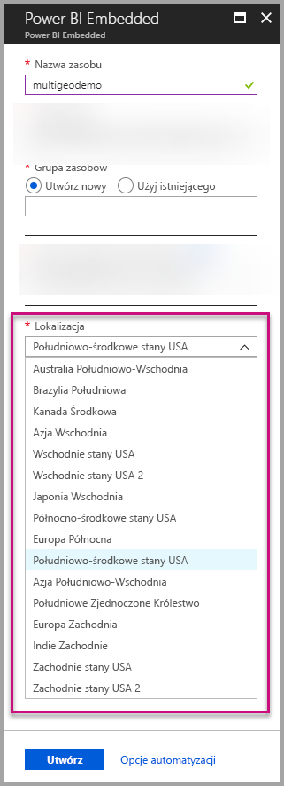
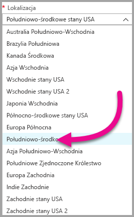
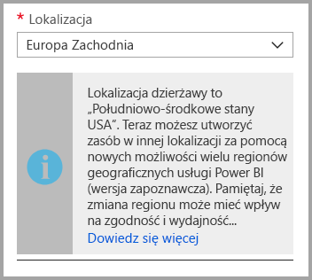
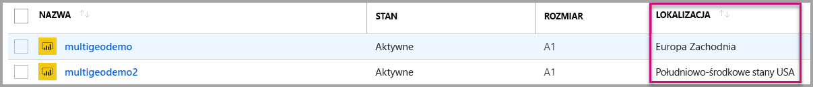
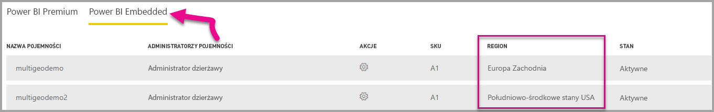

# Obsługa funkcji Multi-Geo dla usługi Power BI Embedded (wersja zapoznawcza)

**Obsługa funkcji Multi-Geo dla usługi Power BI Embedded (wersja zapoznawcza)** oznacza, że niezależni dostawcy oprogramowania i organizacje, które kompilują aplikacje używające usługi Power BI Embedded w celu osadzania analizy w swoich aplikacjach, mogą teraz wdrażać swoje dane w różnych regionach na całym świecie.

Teraz klienci korzystający z usługi **Power BI Embedded** mogą zdefiniować **pojemność A** przy użyciu opcji **Multi-Geo** w oparciu o te same funkcje i ograniczenia, które [usługa Power BI Premium obsługuje przy użyciu funkcji Multi-Geo](../service-admin-premium-Multi-Geo.md).

## Tworzenie nowego zasobu pojemności usługi Power BI Embedded przy użyciu funkcji Multi-Geo

Na ekranie **Tworzenie zasobu** musisz wybrać lokalizację pojemności. Do tej pory była ona ograniczona tylko do lokalizacji dzierżawy usługi Power BI, dlatego była dostępna tylko jedna lokalizacja. Przy użyciu funkcji Multi-Geo można wybierać różne regiony na potrzeby wdrażania pojemności.

Zauważ, że po otwarciu menu rozwijanego lokalizacji dzierżawa główna jest wybierana domyślnie.
  

Jeśli wybierzesz inną lokalizację, zostanie wyświetlony komunikat z prośbą o potwierdzenie wyboru.

## Wyświetlanie lokalizacji pojemności

Możesz łatwo wyświetlać lokalizację swoich pojemności podczas przechodzenia do głównej strony zarządzania usługą Power BI Embedded w witrynie Azure Portal.

Jest ona również dostępna w portalu administracyjnym w witrynie Powerbi.com. W portalu administracyjnym wybierz pozycję „Ustawienia pojemności”, a następnie przejdź na kartę „Power BI Embedded”.

[Dowiedz się więcej na temat tworzenia pojemności przy użyciu usługi Power BI Embedded.](azure-pbie-create-capacity.md)

## Zarządzanie lokalizacją istniejących pojemności

Po utworzeniu nowej pojemności nie można zmienić lokalizacji zasobu usługi Power BI Embedded.

Aby przenieść zawartość usługi Power BI do innego regionu, wykonaj następujące kroki:

1. [Utwórz nową pojemność](azure-pbie-create-capacity.md) w innym regionie.
2. Przypisz wszystkie obszary robocze z istniejącej pojemności do nowej pojemności.
3. Usuń lub wstrzymaj starą pojemność.

Warto zauważyć, że jeśli zdecydujesz się usunąć pojemność bez ponownego przypisania jego zawartości, cała zawartość w tej pojemności zostanie przeniesiona do udostępnionej pojemności, który znajduje się w regionie lokalnym.

## Obsługa interfejsu API dla funkcji Multi-Geo

Aby umożliwić obsługę zarządzania pojemnościami przy użyciu funkcji Multi-Geo za pośrednictwem interfejsu API, wprowadziliśmy pewne zmiany do istniejących interfejsów API:

1. **[Pobieranie pojemności](https://docs.microsoft.com/rest/api/power-bi/capacities/getcapacities)** — interfejs API zwraca listę pojemności z dostępem do użytkownika. Odpowiedź zawiera teraz dodatkową właściwość o nazwie „region”, która określa lokalizację pojemności.
2. **[Przypisywanie do pojemności](https://docs.microsoft.com/rest/api/power-bi/capacities)** — interfejs API umożliwia przypisywanie danego obszaru roboczego do pojemności. Ta operacja nie zezwala na przypisywanie obszarów roboczych do pojemności poza regionem lokalnym ani przenoszenie obszarów roboczych między pojemnościami w różnych regionach. Do wykonania tej operacji użytkownik musi nadal mieć uprawnienia administratora w obszarze roboczym oraz uprawnienia administratora lub uprawnienia do przypisywania w pojemności docelowej.
3. **[Interfejs API usługi Azure Resource Manager](https://docs.microsoft.com/rest/api/power-bi-embedded/capacities)**  — wszystkie operacje interfejsu API usługi Azure Resource Manager, w tym *tworzenie* i *usuwanie*, obsługuje funkcję Multi-Geo.

## Ograniczenia i istotne zagadnienia

* Upewnij się, że wszystkie operacje przenoszenia inicjowane między regionami są zgodne ze wszystkimi firmowymi i rządowymi wymaganiami dotyczącymi zgodności przed zainicjowaniem transferu danych.

* Zapytanie buforowane przechowywane w regionie zdalnym pozostaje w tym regionie podczas magazynowania danych. Inne transferowane dane mogą być jednak przenoszone między różnymi obszarami geograficznymi.

* Podczas przenoszenia danych z jednego regionu do innego w środowisku funkcji Multi-Geo dane źródłowe mogą pozostawać w regionie, z którego dane zostały przeniesione, przez maksymalnie 30 dni. W tym czasie użytkownicy końcowi nie będą mieć dostępu do tych danych. Zostaną one usunięte z tego regionu i zlikwidowane w trakcie 30-dniowego okresu.

* Ogólnie rzecz biorąc, funkcja Multi-Geo nie powoduje zwiększenia wydajności. Ładowanie raportów i pulpitów nawigacyjnych będzie nadal uwzględniać żądania do regionu lokalnego dla metadanych.

## Następne kroki

Dowiedz się więcej o pojemnościach usługi Power BI Embedded i opcjach funkcji Multi-Geo dla wszystkich pojemności, korzystając z poniższych linków.

* [Co to jest usługa Power BI Embedded?](azure-pbie-what-is-power-bi-embedded.md)

* [Tworzenie pojemności usługi Power BI Embedded](azure-pbie-create-capacity.md)

* [Funkcja Multi-Geo w pojemnościach usługi Power BI Premium](../service-admin-premium-multi-geo.md)

Masz więcej pytań? [Zadaj pytanie społeczności usługi Power BI](http://community.powerbi.com/)