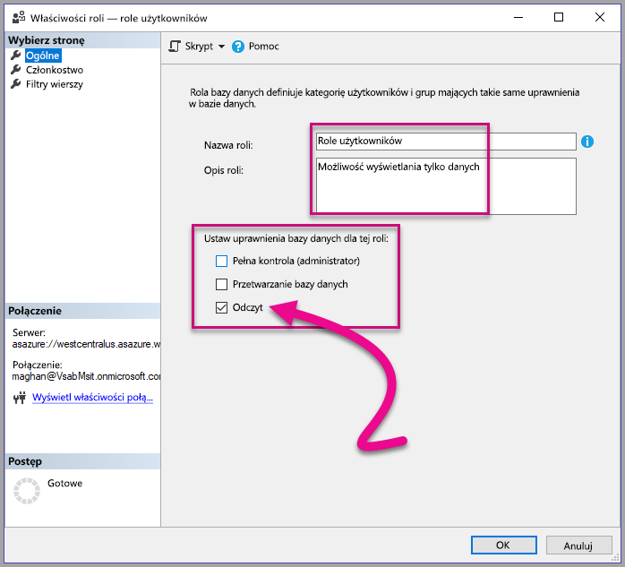

# <a name="use-row-level-security-with-power-bi-embedded-content"></a>Używanie zabezpieczeń na poziomie wiersza w osadzonej zawartości usługi Power BI

**Zabezpieczenia na poziomie wiersza** mogą służyć do ograniczania dostępu użytkowników do danych w ramach pulpitów nawigacyjnych, kafelków, raportów i zestawów danych. Różni użytkownicy mogą pracować z tymi samymi artefaktami, widząc różne dane. Funkcja osadzania obsługuje zabezpieczenia na poziomie wiersza.

Jeśli osadzasz zawartość dla użytkowników innych niż użytkownicy usługi Power BI (aplikacja jest właścicielem danych), co jest typowe w przypadku niezależnych dostawców oprogramowania, ten artykuł jest dla Ciebie. Skonfiguruj token osadzania do konta dla użytkownika i roli.

Jeśli osadzasz zawartość dla użytkowników usługi Power BI (użytkownik jest właścicielem danych) w organizacji, zabezpieczenia RLS działają w taki sam sposób jak bezpośrednio w usłudze Power BI. Nie musisz już nic robić w aplikacji. Aby uzyskać więcej informacji, zobacz [Zabezpieczenia na poziomie wiersza w usłudze Power BI](../service-admin-rls.md).


Aby móc korzystać z zabezpieczeń RLS, ważne jest zrozumienie trzech głównych pojęć: użytkowników, ról i reguł. Przyjrzyjmy się im bliżej:

**Użytkownicy** — użytkownicy końcowi wyświetlający artefakt (pulpit nawigacyjny, kafelek, raport lub zestaw danych). W usłudze Power BI Embedded użytkownicy są identyfikowani przy użyciu właściwości nazwy użytkownika w tokenie osadzania.

**Role** — użytkownicy należą do ról. Rola to kontener reguł. Może mieć nazwę podobną do następujących: *Menedżer sprzedaży* lub *Przedstawiciel handlowy*. Możesz utworzyć role w programie Power BI Desktop. Aby uzyskać więcej informacji, zobacz [Zabezpieczenia na poziomie wiersza w programie Power BI Desktop](../desktop-rls.md).

**Reguły** — role mają reguły, czyli faktyczne filtry, które zostaną zastosowane wobec danych. Reguły mogą być bardzo proste, np. „Kraj = USA”, lub dużo bardziej dynamiczne.
W pozostałej części tego artykułu przedstawiono przykład tworzenia zabezpieczeń RLS, a następnie używania ich w osadzonej aplikacji. Przedstawiony przykład korzysta z pliku PBIX [Retail Analysis Sample](http://go.microsoft.com/fwlink/?LinkID=780547).


## <a name="adding-roles-with-power-bi-desktop"></a>Dodawanie ról przy użyciu programu Power BI Desktop

**Przykład Retail Analysis** przedstawia sprzedaż dla wszystkich sklepów w łańcuchu dostaw. Bez zabezpieczeń na poziomie wiersza każdy menedżer regionalny po zalogowaniu i wyświetleniu raportu zobaczy takie same dane. Na wyższym szczeblu kierowniczym zdecydowano, że każdy menedżer regionalny powinien widzieć tylko sprzedaż dotyczącą sklepów, którymi zarządza. Korzystając z zabezpieczeń na poziomie wiersza, przedstawiciele wyższego szczebla kierowniczego mogą ograniczać dane do poszczególnych menedżerów regionalnych.

Zabezpieczenia na poziomie wiersza są tworzone w programie Power BI Desktop. Po otwarciu zestawu danych i raportu możemy przełączyć się na widok diagramu, aby wyświetlić schemat:


Poniżej przedstawiono kilka istotnych kwestii dotyczących tego schematu:

* Wszystkie miary, takie jak **Total Sales** (sprzedaż łącznie), są przechowywane w tabeli faktów **Sales** (sprzedaż).
* Istnieją cztery dodatkowe powiązane tabele wymiarów: **Item** (element), **Time** (czas), **Store** (sklep) i **District** (region).
* Strzałki w liniach relacji wskazują, w którą stronę filtry mogą przepływać z jednej tabeli do innej. Jeśli na przykład filtr zostanie umieszczony w pozycji **Time[Date]** w bieżącym schemacie będzie filtrować wyłącznie wartości w tabeli **Sales**. Ten filtr nie będzie mieć wpływu na żadne inne tabele, ponieważ wszystkie strzałki w liniach relacji są skierowane do tabeli sprzedaży, a nie od niej.
* Tabela **District** wskazuje menedżera każdego regionu:
  
    

Jeśli na podstawie tego schematu zastosujemy filtr do kolumny **District Manager** w tabeli **District** oraz jeśli ten filtr będzie zgodny z użytkownikiem wyświetlającym raport, odfiltruje on tabele **Store** i **Sales** tak, aby pokazywać dane tylko dla tego menedżera regionalnego.

Oto kroki tej procedury:

1. Na karcie **Modelowanie** wybierz pozycję **Zarządzaj rolami**.

    
2. Utwórz nową rolę o nazwie **Menedżer**.

    
3. W tabeli **District** wprowadź to wyrażenie DAX: **[District Manager] = USERNAME()**.

    
4. Aby upewnić się, że reguły działają, na karcie **Modelowanie** wybierz opcję **Wyświetl jako role**, a następnie wybierz utworzoną rolę **Menedżer** oraz rolę **Inni użytkownicy**. Wprowadź ciąg **AndrewMa** w polu użytkownika.

    

    Raporty pokazują dane tak, jak w przypadku zalogowania użytkownika **AndrewMa**.

Takie zastosowanie filtru powoduje odfiltrowanie wszystkich rekordów w tabelach **District**, **Store** i **Sales**. Jednak ze względu na kierunek filtrowania w relacjach między tabelami **Sales** i **Time** oraz **Sales** i **Item** tabele **Item** i **Time** nie są filtrowane. Aby dowiedzieć się więcej o dwukierunkowym filtrowaniu krzyżowym, pobierz oficjalny dokument [Bidirectional cross-filtering in SQL Server Analysis Services 2016 and Power BI Desktop (Dwukierunkowe filtrowanie krzyżowe w usługach SQL Server Analysis Services 2016 oraz programie Power BI Desktop)](http://download.microsoft.com/download/2/7/8/2782DF95-3E0D-40CD-BFC8-749A2882E109/Bidirectional%20cross-filtering%20in%20Analysis%20Services%202016%20and%20Power%20BI.docx).

## <a name="applying-user-and-role-to-an-embed-token"></a>Stosowanie użytkownika i roli do tokenu osadzania

Teraz po skonfigurowaniu ról programu Power BI Desktop należy wykonać pewne operacje w aplikacji, aby skorzystać z ról.

Użytkownicy są uwierzytelniani i autoryzowani przez aplikację, a tokeny osadzania są używane do udzielania użytkownikom dostępu do konkretnego raportu usługi Power BI Embedded. Usługa Power BI Embedded nie ma żadnych konkretnych informacji o tym, kim jest użytkownik. Aby zabezpieczenia na poziomie wiersza działały, musisz przekazać dodatkowy kontekst w ramach tokenu osadzania w formie tożsamości. Tożsamości można przekazać przy użyciu interfejsu API [tokenu osadzania](https://docs.microsoft.com/rest/api/power-bi/embedtoken).

Interfejs API akceptuje listę tożsamości ze wskazaniem odpowiednich zestawów danych. Aby zabezpieczenia na poziomie wiersza mogły zadziałać, musisz przekazać następujące elementy jako część tożsamości.

* **Nazwa użytkownika (obowiązkowe)** — ciąg, którego można użyć do zidentyfikowania użytkownika podczas stosowania reguł zabezpieczeń na poziomie wiersza. Można wymienić na liście tylko jednego użytkownika. Nazwę użytkownika można utworzyć za pomocą znaków *ASCII*.
* **Role (obowiązkowe)** — ciąg zawierający role do wybrania podczas stosowania reguł zabezpieczeń na poziomie wiersza. W przypadku przekazywania więcej niż jednej roli należy je przekazywać jako tablicę ciągów.
* **Zestaw danych (obowiązkowe)** — zestaw danych, który ma zastosowanie do osadzanego artefaktu.

Możesz utworzyć token osadzania przy użyciu metody **GenerateTokenInGroup** w obszarze **PowerBIClient.Reports**.

Przykładowo możesz zmienić przykład [PowerBIEmbedded_AppOwnsData](https://github.com/Microsoft/PowerBI-Developer-Samples/tree/master/App%20Owns%20Data). *Wiersz 76 i 77 pliku Home\HomeController.cs* można zaktualizować z:

```csharp
// Generate Embed Token.
var generateTokenRequestParameters = new GenerateTokenRequest(accessLevel: "view");

var tokenResponse = await client.Reports.GenerateTokenInGroupAsync(GroupId, report.Id, generateTokenRequestParameters);
```

do

```csharp
var generateTokenRequestParameters = new GenerateTokenRequest("View", null, identities: new List<EffectiveIdentity> { new EffectiveIdentity(username: "username", roles: new List<string> { "roleA", "roleB" }, datasets: new List<string> { "datasetId" }) });

var tokenResponse = await client.Reports.GenerateTokenInGroupAsync("groupId", "reportId", generateTokenRequestParameters);
```

W przypadku wywoływania interfejsu API REST zaktualizowany interfejs API akceptuje teraz dodatkową tablicę JSON o nazwie **identities**, która zawiera nazwę użytkownika, listę ról w postaci ciągu oraz listę zestawów danych w postaci ciągu. 

Użyj poniższego kodu jako przykładu:

```json
{
    "accessLevel": "View",
    "identities": [
        {
            "username": "EffectiveIdentity",
            "roles": [ "Role1", "Role2" ],
            "datasets": [ "fe0a1aeb-f6a4-4b27-a2d3-b5df3bb28bdc" ]
        }
    ]
}
```

Teraz po zebraniu wszystkich elementów, gdy ktoś zaloguje się do aplikacji w celu wyświetlenia tego artefaktu, zobaczy tylko te dane, do których ma dostęp zgodnie z ustawieniami zabezpieczeń na poziomie wiersza.

## <a name="working-with-analysis-services-live-connections"></a>Praca z połączeniami na żywo usług Analysis Services

Zabezpieczeń na poziomie wiersza można użyć z połączeniami na żywo usług Analysis Services w przypadku serwerów lokalnych. Istnieje kilka podstawowych koncepcji, które należy zrozumieć w przypadku stosowania tego typu połączenia.

Efektywną tożsamością zapewnioną dla właściwości nazwy użytkownika musi być użytkownik systemu Windows z uprawnieniami na serwerze usług Analysis Services.

### <a name="on-premises-data-gateway-configuration"></a>Konfiguracja lokalnej bramy danych

[Lokalnej bramy danych](../service-gateway-onprem.md) używa się podczas pracy z połączeniami na żywo usług Analysis Services. Podczas generowania tokenu osadzania z tożsamością na liście konto główne musi być wymienione na liście jako administrator bramy. Jeśli konto główne nie zostało wymienione na liście, zabezpieczenia na poziomie wiersza nie są stosowane do właściwości danych. Użytkownik inny niż administrator bramy może zapewnić role, ale musi określić własną nazwę użytkownika na potrzeby efektywnej tożsamości.

### <a name="use-of-roles"></a>Używanie ról

Role można przekazać wraz z tożsamością w tokenie osadzania. Jeśli żadna rola nie zostanie wybrana, podanej nazwy użytkownika można używać do rozpoznawania skojarzonych ról.

### <a name="using-the-customdata-feature"></a>Używanie funkcji CustomData

Funkcja CustomData działa tylko w przypadku modeli, które znajdują się w usłudze **Azure Analysis Services**, i tylko w trybie **Połącz na żywo**. W przeciwieństwie do użytkowników i ról funkcji CustomData nie można ustawić w pliku pbix. Podczas generowania tokenu przy użyciu funkcji CustomData wymagane jest określenie nazwy użytkownika.

Funkcja CustomData umożliwia dodawanie filtru wiersza podczas przeglądania danych usługi Power BI w aplikacji z użyciem usługi **Azure Analysis Services** jako źródła danych (wyświetlanie danych usługi Power BI połączonych z usługą Azure Analysis Services w aplikacji).

Funkcja CustomData umożliwia przekazanie dowolnego tekstu (ciągu) przy użyciu właściwości parametrów połączenia CustomData. Usługa Analysis Services używa tej wartości za pośrednictwem funkcji *CUSTOMDATA()*.

Jedynym sposobem zastosowania dynamicznych zabezpieczeń na poziomie wiersza (które używają wartości dynamicznych na potrzeby obliczania filtra) w usłudze **Azure Analysis Services** jest użycie funkcji *CUSTOMDATA()*.

Możesz go użyć wewnątrz zapytania DAX roli, a także bez żadnej roli w zapytaniu DAX miary.
Funkcja CustomData jest częścią funkcjonalności generowania tokenów dla następujących artefaktów: pulpit nawigacyjny, raport i kafelek. Pulpity nawigacyjne mogą mieć wiele tożsamości CustomData (po jednej dla każdego kafelka/modelu).

#### <a name="customdata-sdk-additions"></a>Dodatki zestawu SDK funkcji CustomData

Właściwość ciągu CustomData dodano do obowiązującej tożsamości w scenariuszu generowania tokenu.

```json
[JsonProperty(PropertyName = "customData")]
public string CustomData { get; set; }
```

Tożsamość można utworzyć przy użyciu niestandardowych danych za pomocą następującego wywołania:

```csharp
public EffectiveIdentity(string username, IList<string> datasets, IList<string> roles = null, string customData = null);
```

#### <a name="customdata-sdk-usage"></a>Używanie zestawu SDK funkcji CustomData

W przypadku wywoływania interfejsu API REST możesz dodać dane niestandardowe wewnątrz każdej tożsamości, na przykład:

```json
{
    "accessLevel": "View",
    "identities": [
        {
            "username": "EffectiveIdentity",
            "roles": [ "Role1", "Role2" ],
            "customData": "MyCustomData",
            "datasets": [ "fe0a1aeb-f6a4-4b27-a2d3-b5df3bb28bdc" ]
        }
    ]
}
```

Poniżej przedstawiono kroki umożliwiające rozpoczęcie konfigurowania funkcji CustomData() za pomocą aplikacji Power BI Embedded.

1. Utwórz bazę danych usługi Azure Analysis Services. Następnie zaloguj się do serwera usługi Azure Analysis Services za pośrednictwem programu [SQL Server Management Studio](https://docs.microsoft.com/sql/ssms/download-sql-server-management-studio-ssms?view=sql-server-2017).

    

    

2. Utwórz rolę na serwerze usługi Analysis Services.

    

3. Zdefiniuj ustawienia w obszarze **Ogólne**.  W tym miejscu możesz wybrać **nazwę roli** i ustawić uprawnienia bazy danych tylko na **Odczyt**.

    

4. Zdefiniuj ustawienia w obszarze **Członkostwo**. W tym miejscu możesz dodać użytkowników, których dotyczy ta rola.

    

5. Ustaw zapytanie języka DAX **Filtry wierszy** przy użyciu funkcji *CUSTOMDATA()*.

    

6. Utwórz raport usługi PBI i opublikuj go w obszarze roboczym przy użyciu pojemności dedykowanej.

    

7. Użyj interfejsów API usługi Power BI, aby korzystać z funkcji CustomData w aplikacji.  Podczas generowania tokenu przy użyciu funkcji CustomData wymagane jest określenie nazwy użytkownika. Nazwa użytkownika musi być nazwą UPN użytkownika głównego. Użytkownik główny musi być członkiem utworzonych ról. Jeśli nie określono żadnych ról, wszystkie role, do których należy użytkownik główny, są używane do oceny zabezpieczeń na poziomie wiersza.

    > [!Note]
    > Gdy wszystko będzie gotowe do wdrożenia aplikacji w środowisku produkcyjnym, opcja ani pole konta użytkownika głównego nie powinny być widoczne dla użytkownika końcowego.

    Wyświetl [kod](#customdata-sdk-additions), aby dodać funkcję CustomData.

8. Teraz możesz wyświetlić raport w aplikacji przed zastosowaniem wartości Customdata, aby zobaczyć wszystkie dane przechowywane w raporcie.

    

    Następnie zastosuj wartości Customdata, aby zobaczyć, jak inny zestaw danych został przedstawiony w raporcie.
    

## <a name="using-rls-vs-javascript-filters"></a>Porównanie sposobu używania zabezpieczeń na poziomie wiersza i filtrów języka JavaScript

Podejmując decyzję dotyczącą sposobu filtrowania danych w raporcie, możesz użyć **zabezpieczeń na poziomie wiersza** lub **filtrów języka JavaScript**.

[Zabezpieczenia na poziomie wiersza](../service-admin-rls.md) to funkcja, która filtruje dane na poziomie modelu danych. Źródło danych zaplecza kontroluje ustawienia zabezpieczeń na poziomie wiersza. W oparciu o model danych w procesie generowania tokenów osadzania jest ustawiana nazwa użytkownika i role dla sesji. Tych danych nie można zastępować, usuwać ani kontrolować przy użyciu kodu po stronie klienta, dlatego są uważane za bezpieczne. Zalecamy używanie zabezpieczeń na poziomie wiersza w celu bezpiecznego filtrowania danych. Dane można filtrować za pomocą zabezpieczeń na poziomie wiersza, używając jednej z poniższych opcji.

* [Konfigurowanie ról w raporcie usługi Power BI](../desktop-rls.md).
* Konfigurowanie ról na poziomie źródła danych (tylko połączenie usługi Analysis Services na żywo).
* Programowo za pomocą [tokenu osadzania](https://docs.microsoft.com/rest/api/power-bi/embedtoken/datasets_generatetokeningroup) przy użyciu elementu `EffectiveIdentity`. W przypadku używania tokenu osadzania rzeczywisty filtr przekazuje token osadzania dla określonej sesji.

[Filtry języka JavaScript](https://github.com/Microsoft/PowerBI-JavaScript/wiki/Filters#page-level-and-visual-level-filters) umożliwiają zezwalanie użytkownikowi na korzystanie z widoku danych zredukowanych, z określonego zakresu lub odfiltrowanych. Użytkownik ma nadal dostęp do miar, kolumn i tabel schematu modelu i może potencjalnie uzyskiwać dostęp do dowolnych danych w tych elementach. Ograniczony dostęp do danych można stosować tylko za pośrednictwem zabezpieczeń na poziomie wiersza, a nie interfejsów API filtrowania po stronie klienta.

## <a name="considerations-and-limitations"></a>Istotne zagadnienia i ograniczenia

* Przypisywanie użytkowników do ról w usłudze Power BI nie wpływa na zabezpieczenia na poziomie wiersza podczas używania tokenu osadzania.
* Usługa Power BI nie stosuje ustawień zabezpieczeń na poziomie wiersza do administratorów ani członków z uprawnieniami do edycji podczas podawania tożsamości wraz z tokenem osadzania, ale stosuje je wobec danych.
* Połączenia na żywo usług Analysis Services są obsługiwane w przypadku serwerów lokalnych.
* Połączenia na żywo usług Azure Analysis Services obsługują filtrowanie według ról. Dynamiczne filtrowanie może być wykonywane przy użyciu funkcji CustomData.
* Jeśli źródłowy zestaw danych nie wymaga zabezpieczeń RSL, żądanie GenerateToken **nie** może zawierać efektywnej tożsamości.
* Jeśli źródłowy zestaw danych jest modelem w chmurze (modelem w pamięci podręcznej lub typu DirectQuery), efektywna tożsamość musi zawierać co najmniej jedną rolę. W przeciwnym razie rola nie jest przypisywana.
* Lista tożsamości może zawierać wiele tokenów tożsamości na potrzeby osadzania pulpitu nawigacyjnego. Dla wszystkich innych artefaktów lista zawiera jedną tożsamość.

Masz więcej pytań? [Zadaj pytanie społeczności usługi Power BI](https://community.powerbi.com/)