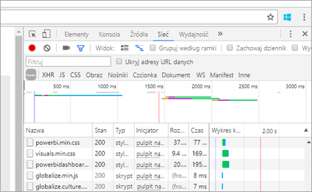
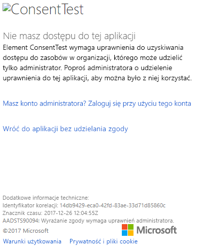
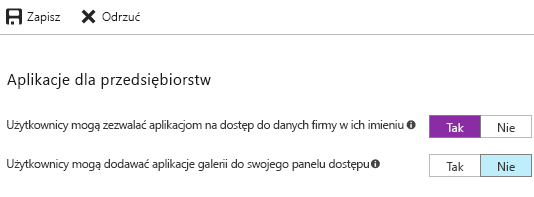

# <a name="troubleshoot-your-embedded-application"></a>Rozwiązywanie problemów z aplikacją osadzoną

W tym artykule omówiono niektóre typowe problemy, które mogą wystąpić podczas osadzania zawartości z usługi Power BI.

## <a name="tools-to-troubleshoot"></a>Narzędzia do rozwiązywania problemów

### <a name="fiddler-trace"></a>Śledzenie za pomocą narzędzia Fiddler

[Fiddler](http://www.telerik.com/fiddler) to bezpłatne narzędzie firmy Telerik, które monitoruje ruch HTTP.  Dzięki niemu ruch można sprawdzać za pomocą interfejsów API usługi Power BI z maszyny klienckiej. To narzędzie może ujawnić błędy i inne istotne informacje.


### <a name="f12-in-browser-for-front-end-debugging"></a>Narzędzia uruchamiane klawiszem F12 w przeglądarce na potrzeby debugowania na poziomie frontonu

Naciśnięcie klawisza F12 powoduje uruchomienie okna dewelopera w przeglądarce. To narzędzie umożliwia zapoznanie się z ruchem sieciowym i innymi informacjami.



### <a name="extract-error-details-from-power-bi-response"></a>Wyodrębnianie szczegółów błędu z odpowiedzi usługi Power BI

Następujący fragment kodu przedstawia sposób wyodrębniania szczegółów błędu z wyjątku HTTP:

```csharp
public static string GetExceptionText(this HttpOperationException exc)
{
    var errorText = string.Format("Request: {0}\r\nStatus: {1} ({2})\r\nResponse: {3}",
    exc.Request.Content, exc.Response.StatusCode, (int)exc.Response.StatusCode, exc.Response.Content);
    if (exc.Response.Headers.ContainsKey("RequestId"))
    {
        var requestId = exc.Response.Headers["RequestId"].FirstOrDefault();
        errorText += string.Format("\r\nRequestId: {0}", requestId);
    }

    return errorText;
}
```

Zalecamy rejestrowanie identyfikatora żądania (i szczegółów błędów na potrzeby rozwiązywania problemów).
Podaj identyfikator żądania podczas kontaktowania się z pomocą techniczną firmy Microsoft.

## <a name="app-registration"></a>Rejestrowanie aplikacji

### <a name="app-registration-failure"></a>Błąd rejestracji aplikacji

Komunikaty o błędach otrzymywane w witrynie Azure Portal lub na stronie rejestracji aplikacji Power BI informują o niewystarczających uprawnieniach. Aby zarejestrować aplikację, należy być administratorem w dzierżawie usługi Azure AD lub włączyć opcje rejestrowania aplikacji dla użytkowników bez uprawnień administratora.

### <a name="power-bi-service-doesnt-appear-in-the-azure-portal-when-registering-a-new-app"></a>Usługa Power BI nie jest wyświetlana w witrynie Azure Portal podczas rejestrowania nowej aplikacji

Co najmniej jeden użytkownik musi mieć utworzone konto w usłudze Power BI. Jeśli **usługa Power BI** nie znajduje się na liście interfejsów API, oznacza to, że żaden użytkownik nie jest zarejestrowany w usłudze Power BI.

## <a name="rest-api"></a>Interfejs API REST

### <a name="api-call-returning-401"></a>Wywołanie interfejsu API zwraca błąd 401

W celu głębszego zbadania problemu może być konieczne użycie narzędzia Fiddler. Zarejestrowana aplikacja w ramach usługi Azure AD może nie mieć wymaganego zakresu uprawnień. Należy upewnić się, że wymagany zakres znajduje się w obrębie rejestracji aplikacji dla usługi Azure AD w ramach witryny Azure Portal.

### <a name="api-call-returning-403"></a>Wywołanie interfejsu API zwraca błąd 403

W celu głębszego zbadania problemu może być konieczne użycie narzędzia Fiddler. Powodów wystąpienia błędu 403 może być kilka.

* Użytkownik przekroczył liczbę osadzonych tokenów, które można wygenerować w przypadku pojemności udostępnionej. Należy kupić pojemność platformy Azure, aby wygenerować osadzone tokeny i przypisać obszar roboczy do tej pojemności. Zobacz [Tworzenie pojemności osadzonej usługi Power BI w witrynie Azure Portal](https://docs.microsoft.com/azure/power-bi-embedded/create-capacity).
* Ważność tokenu uwierzytelniania usługi Azure AD wygasła.
* Uwierzytelniony użytkownik nie jest członkiem grupy (obszaru roboczego aplikacji).
* Uwierzytelniony użytkownik nie jest administratorem grupy (obszaru roboczego aplikacji).
* Nagłówek autoryzacji jest nieprawidłowo wyświetlony. Należy upewnić się, że nie ma żadnych literówek.

Zaplecze aplikacji może wymagać odświeżenia tokenu uwierzytelniania przed wywołaniem metody GenerateToken.

    ```
    GET https://wabi-us-north-central-redirect.analysis.windows.net/metadata/cluster HTTP/1.1
    Host: wabi-us-north-central-redirect.analysis.windows.net
    ...
    Authorization: Bearer eyJ0eXAiOi...
    ...

    HTTP/1.1 403 Forbidden
    ...

    {"error":{"code":"TokenExpired","message":"Access token has expired, resubmit with a new access token"}}
    ```

## <a name="authentication"></a>Uwierzytelnianie

### <a name="authentication-failed-with-aadsts70002-or-aadsts50053"></a>Uwierzytelnianie nie powiodło się, błąd AADSTS70002 lub AADSTS50053

**_(AADSTS70002: Błąd podczas walidacji poświadczeń. AADSTS50053: Nastąpiło zbyt wiele prób zalogowania przy użyciu niepoprawnego identyfikatora użytkownika lub hasła)_**

Jeśli używasz usługi Power BI Embedded i bezpośredniego uwierzytelniania usługi Azure AD oraz podczas logowania otrzymujesz komunikaty, takie jak ***error:unauthorized_client, error_description:AADSTS70002: Błąd podczas walidacji poświadczeń. AADSTS50053: Nastąpiło zbyt wiele prób zalogowania przy użyciu niepoprawnego identyfikatora użytkownika lub hasła***, dzieje się tak, ponieważ bezpośrednie uwierzytelnianie domyślnie nie jest już używane od 14 czerwca 2018 r.

Tę funkcję można ponownie włączyć przy użyciu [zasad usługi Azure AD](https://docs.microsoft.com/azure/active-directory/manage-apps/configure-authentication-for-federated-users-portal#enable-direct-authentication-for-legacy-applications) działających w zakresie organizacji lub [jednostki usługi](https://docs.microsoft.com/azure/active-directory/develop/active-directory-application-objects#service-principal-object).

Zalecamy włączanie tych zasad tylko dla poszczególnych aplikacji.

Aby utworzyć te zasady, musisz być **administratorem globalnym** katalogu, w którym tworzysz i przypisujesz zasady. Poniżej przedstawiono przykładowy skrypt służący do tworzenia zasad i przypisywania ich do SP dla tej aplikacji:

1. Zainstaluj [moduł programu PowerShell w usłudze Azure AD w wersji zapoznawczej](https://docs.microsoft.com/powershell/azure/active-directory/install-adv2?view=azureadps-2.0).

2. Uruchom poniższe polecenia programu PowerShell wiersz po wierszu (upewniając się, że zmienna $sp nie ma więcej wyników niż jedna aplikacja).

```powershell
Connect-AzureAD
```

```powershell
$sp = Get-AzureADServicePrincipal -SearchString "Name_Of_Application"
```

```powershell
$policy = New-AzureADPolicy -Definition @("{`"HomeRealmDiscoveryPolicy`":{`"AllowCloudPasswordValidation`":true}}") -DisplayName EnableDirectAuth -Type HomeRealmDiscoveryPolicy -IsOrganizationDefault $false
```

```powershell
Add-AzureADServicePrincipalPolicy -Id $sp.ObjectId -RefObjectId $policy.Id 
```

Po przypisaniu zasad zaczekaj około 15–20 sekund na propagację przed rozpoczęciem testowania.

### <a name="generate-token-fails-when-providing-effective-identity"></a>Generowanie tokenu kończy się niepowodzeniem podczas dostarczania obowiązującej tożsamości

Przyczyn niepowodzenia metody GenerateToken, po podaniu obowiązującej tożsamości, jest kilka.

* Zestaw danych nie obsługuje obowiązującej tożsamości
* Nie podano nazwy użytkownika
* Nie podano roli
* Nie podano identyfikatora DatasetId
* Użytkownik nie ma odpowiednich uprawnień

Aby sprawdzić, co wywołało ten błąd, wykonaj poniższe czynności.

* Wykonaj polecenie [pobierania zestawu danych](https://docs.microsoft.com/rest/api/power-bi/datasets). Czy właściwość IsEffectiveIdentityRequired jest prawdziwa?
* Nazwa użytkownika jest wymagana w przypadku każdego elementu EffectiveIdentity.
* Jeśli właściwość IsEffectiveIdentityRolesRequired jest prawdziwa, konieczne jest podanie roli.
* Wartość DatasetId jest wymagana dla każdego elementu EffectiveIdentity.
* W przypadku usług Analysis Services użytkownikiem głównym musi być administrator bramy.

### <a name="aadsts90094-the-grant-requires-admin-permission"></a>AADSTS90094: Wyrażanie zgody wymaga uprawnień administratora

**_Objawy:_**</br>
Gdy użytkownik niebędący administratorem próbuje zalogować się do aplikacji po raz pierwszy podczas udzielania zgody, pojawia się jeden z następujących błędów:

* Element ConsentTest wymaga uprawnienia do uzyskiwania dostępu do zasobów w organizacji, którego może udzielić tylko administrator. Poproś administratora o udzielenie uprawnienia do tej aplikacji, aby można było z niej korzystać.
* AADSTS90094: Wyrażanie zgody wymaga uprawnień administratora.

    

Administrator może zalogować się i pomyślnie wyrazić zgodę.

**_Główna przyczyna:_**</br>
Zgoda użytkownika została wyłączona dla dzierżawy.

**_Istnieje kilka możliwych poprawek:_**

*Włącz zgodę użytkownika dla całej dzierżawy (wszyscy użytkownicy, wszystkie aplikacje)*

1. W witrynie Azure Portal przejdź do obszaru „Azure Active Directory” => „Użytkownicy i grupy” => „Ustawienia użytkownika”
2. Włącz ustawienie „Użytkownicy mogą zezwalać aplikacjom na dostęp do danych firmy w ich imieniu” i zapisz zmiany

    

*Udziel uprawnień* dla aplikacji jako administrator — dla całej dzierżawy lub dla określonego użytkownika.

## <a name="data-sources"></a>Źródła danych

### <a name="isv-wants-to-have-different-credentials-for-the-same-data-source"></a>Niezależny dostawca oprogramowania chce mieć inne poświadczenia dla tego samego źródła danych

Źródło danych może mieć jeden zestaw poświadczeń dla jednego użytkownika głównego. Użycie innych poświadczeń wymaga utworzenia dodatkowych użytkowników głównych. Następnie należy przypisać inne poświadczenia w poszczególnych kontekstach użytkowników głównych i wykonać osadzanie przy użyciu tokenu usługi Azure AD tego użytkownika.

## <a name="troubleshoot-your-embedded-application-with-the-ierror-object"></a>Rozwiązywanie problemów z aplikacją osadzoną przy użyciu obiektu IError

[**Obiekt IError** zwrócony przez zdarzenie *błędu* z **zestawu JavaScript SDK**](https://github.com/Microsoft/PowerBI-JavaScript/wiki/Troubleshooting-and-debugging-of-embedded-parts) umożliwia debugowanie aplikacji i dokładniejsze analizowanie przyczyn błędów.

Po uzyskaniu obiektu IError zapoznaj się z odpowiednią tabelą typowych błędów, która pasuje do stosowanego typu osadzania. Porównaj **właściwości obiektu IError** z podanymi w tabeli i znajdź możliwe przyczyny niepowodzenia.

### <a name="typical-errors-when-embedding-for-power-bi-users"></a>Typowe błędy podczas osadzania w przypadku użytkowników usługi Power BI

| Wiadomość | Szczegółowy komunikat | Kod błędu | Możliwe przyczyny |
|-------------------------------------------------------|-----------------------------------------------------------------------------------------------------------------------------|-----------|--------------------------------------------------------|
| TokenExpired | Token dostępu wygasł, prześlij ponownie przy użyciu nowego tokenu dostępu | 403 | Wygasły token  |
| PowerBIEntityNotFound | Nieudane pobieranie raportu | 404 | <li> Nieprawidłowy identyfikator raportu <li> Raport nie istnieje  |
| Nieprawidłowe parametry | Nie określono parametru powerbiToken | Nie dotyczy | <li> Nie podano tokenu dostępu <li> Nie podano identyfikatora raportu |
| LoadReportFailed | Niepowodzenie inicjowania — nie można rozpoznać klastra | 403 | * Nieprawidłowy token dostępu * Typ osadzania jest niezgodny z typem tokenu |
| PowerBINotAuthorizedException | Nieudane pobieranie raportu | 401 | <li> Nieprawidłowy identyfikator grupy <li> Nieautoryzowana grupa |
| TokenExpired | Token dostępu wygasł, prześlij ponownie przy użyciu nowego tokenu dostępu. Nie można renderować wizualizacji raportu o nazwie: <visual title> | Nie dotyczy | Zapytanie o dane — wygasły token |
| OpenConnectionError | Nie można wyświetlić wizualizacji. Nie można renderować wizualizacji raportu o nazwie: <visual title> | Nie dotyczy | Wstrzymano lub usunięto pojemność po otwarciu w ramach sesji raportu powiązanego z pojemnością |
| ExplorationContainer_FailedToLoadModel_DefaultDetails | Nie można załadować schematu modelu skojarzonego z tym raportem. Upewnij się, że masz połączenie z serwerem, i spróbuj ponownie. | Nie dotyczy | <li> Wstrzymano pojemność <li> Usunięto pojemność |

### <a name="typical-errors-when-embedding-for-non-power-bi-users-using-an-embed-token"></a>Typowe błędy podczas osadzania w przypadku użytkowników niekorzystających z usługi Power BI (przy użyciu tokenu osadzania)

| Wiadomość | Szczegółowy komunikat | Kod błędu | Przyczyny |
|-------------------------------------------------------|-------------------------------------------------------------------------------------------------------------------------------|------------|-------------------------------------------------|
| TokenExpired | Token dostępu wygasł, prześlij ponownie przy użyciu nowego tokenu dostępu | 403 | Wygasły token  |
| LoadReportFailed | Nieudane pobieranie raportu | 404 | <li> Nieprawidłowy identyfikator raportu <li> Raport nie istnieje  |
| LoadReportFailed | Nieudane pobieranie raportu | 403 | Identyfikator raportu nie jest zgodny z tokenem |
| LoadReportFailed | Nieudane pobieranie raportu | 500 | Identyfikator podany w raporcie nie jest identyfikatorem GUID |
| Nieprawidłowe parametry | Nie określono parametru powerbiToken | Nie dotyczy | <li> Nie podano tokenu dostępu <li> Nie podano identyfikatora raportu |
| LoadReportFailed | Niepowodzenie inicjowania — nie można rozpoznać klastra | 403 | Nieprawidłowy typ tokenu, niewłaściwy token |
| PowerBINotAuthorizedException | Nieudane pobieranie raportu | 401 | Nieprawidłowy/nieautoryzowany identyfikator grupy |
| TokenExpired | Token dostępu wygasł, prześlij ponownie przy użyciu nowego tokenu dostępu. Nie można renderować wizualizacji raportu o nazwie: <visual title> | Nie dotyczy | Zapytanie o dane — wygasły token |
| OpenConnectionError | Nie można wyświetlić wizualizacji. Nie można renderować wizualizacji raportu o nazwie: <visual title> | Nie dotyczy | Wstrzymano lub usunięto pojemność po otwarciu w ramach sesji raportu powiązanego z pojemnością |
| ExplorationContainer_FailedToLoadModel_DefaultDetails | Nie można załadować schematu modelu skojarzonego z tym raportem. Upewnij się, że masz połączenie z serwerem, i spróbuj ponownie. | Nie dotyczy | <li> Wstrzymano pojemność <li> Usunięto pojemność |

## <a name="content-rendering"></a>Renderowanie zawartości

### <a name="rendering-or-consumption-of-embedded-content-fails-or-times-out"></a>Renderowanie lub zużycie osadzonej zawartości kończy się niepowodzeniem lub przekracza limit czasu

Upewnij się, że osadzony token nie wygasł. Sprawdź, czy osadzony token wygasł i odśwież go. Aby uzyskać więcej informacji, zobacz [Odświeżanie tokenu za pomocą zestawu JavaScript SDK](https://github.com/Microsoft/PowerBI-JavaScript/wiki/Refresh-token-using-JavaScript-SDK-example).

### <a name="report-or-dashboard-doesnt-load"></a>Raport lub pulpit nawigacyjny nie ładuje się

Jeśli użytkownik nie widzi raportu lub pulpitu nawigacyjnego, należy upewnić się, że raport lub pulpit nawigacyjny ładuje się poprawnie w witrynie powerbi.com. Raport lub pulpit nawigacyjny nie działa w aplikacji, jeśli nie jest ładowany w witrynie powerbi.com.

### <a name="report-or-dashboard-is-performing-slowly"></a>Raport lub pulpit nawigacyjny działa wolno

Otwórz plik w programie Power BI Desktop lub w witrynie powerbi.com i sprawdź, czy wydajność pozwala wykluczyć problemy z aplikacją lub osadzaniem interfejsów API.

## <a name="embed-setup-tool"></a>Narzędzie do konfigurowania osadzania

Możesz użyć [narzędzia do konfigurowania osadzania](https://aka.ms/embedsetup), aby szybko pobrać przykładową aplikację. Następnie możesz porównać swoją aplikację z przykładem.

### <a name="prerequisites"></a>Wymagania wstępne

Przed skorzystaniem z narzędzia do konfigurowania osadzania sprawdź, czy zostały spełnione wszystkie wymagania wstępne. Potrzebne jest konto usługi **Power BI Pro** i subskrypcja platformy **Microsoft Azure**.

* Jeśli nie masz konta usługi **Power BI Pro**, na początku [zacznij korzystać z bezpłatnej wersji próbnej](https://powerbi.microsoft.com/en-us/pricing/).
* Jeśli nie masz subskrypcji platformy Azure, przed rozpoczęciem utwórz [bezpłatne konto](https://azure.microsoft.com/free/?WT.mc_id=A261C142F).
* Musisz mieć własną konfigurację [dzierżawy usługi Azure Active Directory](create-an-azure-active-directory-tenant.md).
* Musisz mieć zainstalowany program [Visual Studio](https://www.visualstudio.com/) (w wersji 2013 lub nowszej).

### <a name="common-issues"></a>Typowe problemy

Niektóre typowe problemy, które mogą wystąpić podczas testowania za pomocą narzędzia do konfigurowania osadzania:

#### <a name="using-the-embed-for-your-customers-sample-application"></a>Korzystanie z przykładowej aplikacji osadzania dla klientów

Jeśli korzystasz ze środowiska **osadzania dla klientów**, zapisz i rozpakuj plik *PowerBI-Developer-Samples.zip*. Następnie otwórz folder *PowerBI-Developer-Samples-master\App Owns Data* i uruchom plik *PowerBIEmbedded_AppOwnsData.sln*.

Podczas wybierania pozycji **Udziel uprawnień** (krok udzielania uprawnień), otrzymasz następujący błąd:

    AADSTS70001: Application with identifier <client ID> wasn't found in the directory <directory ID>

Aby rozwiązać ten problem, zamknij okno podręczne, poczekaj kilka sekund i spróbuj ponownie. Może być konieczne kilkukrotne powtórzenie tej akcji. Interwał czasu powoduje problem, który uniemożliwia ukończenie procesu rejestracji aplikacji w czasie, gdy jest on dostępny dla zewnętrznych interfejsów API.

Podczas uruchamiania przykładowej aplikacji jest wyświetlany następujący komunikat o błędzie:

    Password is empty. Please fill password of Power BI username in web.config.

Ten błąd występuje, ponieważ jedyną wartością, która nie jest wstrzykiwana do przykładowej aplikacji, jest hasło użytkownika. Otwórz plik Web.config w rozwiązaniu i podaj hasło użytkownika w polu pbiPassword.

Jeśli zostanie wyświetlony błąd — AADSTS50079: Użytkownik musi używać uwierzytelniania wieloskładnikowego.

    Need to use an AAD account that doesn't have MFA enabled.

#### <a name="using-the-embed-for-your-organization-sample-application"></a>Korzystanie z przykładowej aplikacji osadzania dla organizacji

Jeśli korzystasz ze środowiska **osadzania dla organizacji**, zapisz i rozpakuj plik *PowerBI-Developer-Samples.zip*. Następnie otwórz folder *PowerBI-Developer-Samples-master\User Owns Data\integrate-report-web-app* i uruchom plik *pbi-saas-embed-report.sln*.

Podczas uruchamiania przykładowej aplikacji **osadzania dla organizacji** jest wyświetlany następujący błąd:

    AADSTS50011: The reply URL specified in the request doesn't match the reply URLs configured for the application: <client ID>

Przyczyną występowania tego błędu jest to, że adres URL przekierowania określony dla aplikacji serwera internetowego różni się od adresu URL w przykładzie. Jeśli chcesz zarejestrować przykładową aplikację, podaj adres `http://localhost:13526/` jako adres URL przekierowania.

Jeśli chcesz edytować zarejestrowaną aplikację, dowiedz się, jak edytować [aplikację zarejestrowaną w usłudze AAD](https://docs.microsoft.com/azure/active-directory/develop/active-directory-integrating-applications#updating-an-application), aby aplikacja mogła zapewnić dostęp do internetowych interfejsów API.

Jeśli chcesz edytować dane lub profil użytkownika usługi Power BI, dowiedz się, jak edytować swoje [dane usługi Power BI](https://docs.microsoft.com/power-bi/service-basic-concepts).

Jeśli zostanie wyświetlony błąd — AADSTS50079: Użytkownik musi używać uwierzytelniania wieloskładnikowego.

    Need to use an AAD account that doesn't have MFA enabled.

Aby uzyskać więcej informacji, zobacz [Często zadawane pytania dotyczące usługi Power BI Embedded](embedded-faq.md).

Masz więcej pytań? [Odwiedź społeczność usługi Power BI](http://community.powerbi.com/)

Jeśli potrzebujesz dalszej pomocy, [skontaktuj się z pomocą techniczną](https://powerbi.microsoft.com/en-us/support/pro/?Type=documentation&q=power+bi+embedded) lub [utwórz bilet pomocy technicznej za pośrednictwem witryny Azure Portal](https://ms.portal.azure.com/#blade/Microsoft_Azure_Support/HelpAndSupportBlade/newsupportrequest) i przekaż wyświetlone komunikaty błędów.

## <a name="performance"></a>Wydajność

[Wydajność usługi Power BI Embedded](embedded-performance-best-practices.md)