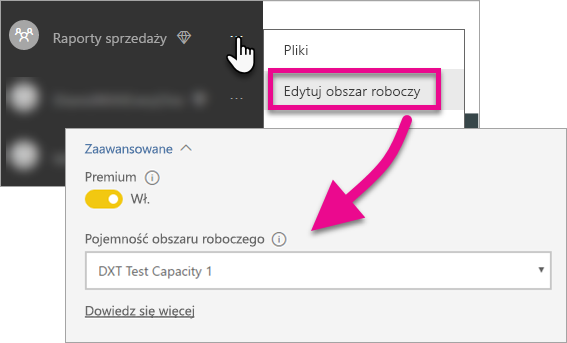

# Osadzanie pulpitów nawigacyjnych, raportów i kafelków usługi Power BI

Poznaj więcej informacji na temat kroków, które musisz wykonać, aby osadzić zawartość usługi Power BI w aplikacji.

Firma Microsoft [ogłosiła udostępnienie usługi Power BI Premium](https://powerbi.microsoft.com/blog/microsoft-accelerates-modern-bi-adoption-with-power-bi-premium/), czyli nowego modelu licencjonowania opartego na pojemnościach, zwiększającego elastyczność uzyskiwania dostępu do zawartości, jej udostępniania i dystrybuowania przez użytkowników. Ta oferta zwiększa również wydajność i skalowalność usługi Power BI. Ogłoszono także usługę Power BI Embedded umożliwiającą tworzenie pojemności na platformie Microsoft Azure. Power BI Embedded koncentruje się na aplikacji i klientach. 

W tym artykule przyjrzymy się osadzaniu zawartości usługi Power BI dla organizacji i klientów. Kroki są podobne w obu scenariuszach. Kroki specyficzne dla osadzania dla klientów są odpowiednio oznaczone.

Istnieje kilka działań, które należy wykonać w związku z aplikacją, aby to umożliwić. Omówimy kroki wymagane w celu umożliwienia tworzenia i wykorzystywania zawartości osadzonej w ramach aplikacji.

> [!NOTE]
> Interfejsy API usługi Power BI nadal odwołują się do obszarów roboczych aplikacji jako grup. Wszystkie odwołania do grup oznaczają, że pracujesz z obszarami roboczymi aplikacji.

## Krok 1. Konfigurowanie środowiska deweloperskiego analizy osadzonej

Przed rozpoczęciem osadzania pulpitów i raportów w aplikacji należy upewnić się, że środowisko skonfigurowano w sposób umożliwiający osadzanie. W ramach konfiguracji należy wykonać następujące działania.

* [Upewnij się, że dysponujesz dzierżawą usługi Azure Active Directory](embedding-content.md#azureadtenant)
* [Utwórz konto usługi Power BI Pro](embedding-content.md#proaccount)

Możesz użyć [narzędzia obsługi dołączania](https://aka.ms/embedsetup), aby szybko rozpocząć pracę i pobrać przykładową aplikację.

Wybierz rozwiązanie, które jest odpowiednie dla Ciebie:
* [Osadzanie dla swoich klientów](embedding.md#embedding-for-your-customers) zapewnia możliwość osadzenia pulpitów nawigacyjnych i raportów u użytkowników, którzy nie mają konta w usłudze Power BI. Uruchom rozwiązanie [osadzania dla klientów](https://aka.ms/embedsetup/AppOwnsData).
* [Osadzanie dla swojej organizacji](embedding.md#embedding-for-your-organization) umożliwia rozszerzanie usługi Power BI. Uruchom rozwiązanie [osadzania dla organizacji](https://aka.ms/embedsetup/UserOwnsData).

Jeśli jednak chcesz ręcznie skonfigurować środowisko, kontynuuj czytanie. 

> [!NOTE]
> Tworzenie aplikacji nie wymaga dedykowanej pojemności. Twórcy aplikacji muszą dysponować licencją usługi Power BI Pro.

### Dzierżawa usługi Azure Active Directory

Osadzanie elementów z usługi Power BI wymaga dzierżawy usługi Azure Active Directory (Azure AD). Ta dzierżawa musi zawierać co najmniej jednego użytkownika usługi Power BI Pro. Należy również zdefiniować aplikację Azure AD w ramach dzierżawy. Można skorzystać z istniejącej dzierżawy usługi Azure AD lub utworzyć nową specjalnie do celów osadzania.

W przypadku osadzania dla klientów należy określić konfigurację dzierżawy do zastosowania.

* Istniejąca firmowa dzierżawa usługi Power BI?
* Oddzielna dzierżawa dla aplikacji?
* Oddzielna dzierżawa dla każdego klienta?

Jeśli nie chcesz użyć istniejącej dzierżawy, możesz zdecydować się na utworzenie nowej dzierżawy dla aplikacji lub jednej dzierżawy dla każdego klienta. Zobacz [Tworzenie dzierżawy usługi Azure Active Directory](create-an-azure-active-directory-tenant.md) lub [Jak uzyskać dzierżawę usługi Azure Active Directory](https://docs.microsoft.com/azure/active-directory/develop/active-directory-howto-tenant).

### Tworzenie konta użytkownika usługi Power BI Pro

Osadzanie zawartości wymaga tylko jednego konta usługi Power BI Pro. Jednak pożądane może być posiadanie kilku różnych użytkowników o określonym dostępie do elementów. Oto przykłady użytkowników, których można rozważyć w ramach dzierżawy.

Poniższe konta muszą istnieć w ramach dzierżawy i mieć przypisaną licencję usługi Power BI Pro. Licencja usługi Power BI Pro jest wymagana do pracy z obszarami roboczymi aplikacji w ramach usługi Power BI.

#### Administrator organizacji/dzierżawy

Zaleca się, aby konto administratora globalnego organizacji/dzierżawy nie było używane jako konto używane przez aplikację w przypadku osadzania dla klientów. Celem tego jest minimalizacja dostępu konta aplikacji w ramach dzierżawy. Zalecane jest, aby użytkownik będący administratorem dzierżawy był administratorem wszystkich obszarów roboczych aplikacji utworzonych na potrzeby osadzania.

#### Konta analityków tworzących zawartość

Może występować wielu użytkowników tworzących zawartość dla usługi Power BI. Wymagane jest konto usługi Power BI Pro dla każdego analityka tworzącego i wdrażającego zawartość w usłudze Power BI.

#### Konto użytkownika *głównego* aplikacji dla osadzania dla swoich klientów

Konto główne to konto używane przez aplikację podczas osadzania zawartości dla klientów. Scenariusz ten dotyczy zazwyczaj aplikacji niezależnych dostawców oprogramowania. Konto główne to jedyne konto wymagane w ramach organizacji. Może być ono także używane jako konto administratora i analityka, ale nie jest to zalecane. Poświadczenia tego konta będą przechowywane w zapleczu aplikacji i używane w celu uzyskania tokenu autoryzacji usługi Azure AD do użycia z interfejsami API usługi Power BI. To konto generuje token osadzania dla aplikacji do użytku dla klientów.

Konto główne to zwykły użytkownik z licencją usługi Power BI Pro używaną z aplikacją. Konto musi być kontem administratora obszaru roboczego aplikacji używanym do osadzania.

###  Rejestrowanie aplikacji i uprawnienia

Aplikację należy zarejestrować w usłudze Azure AD, aby móc wykonywać wywołania interfejsu API REST. Aby uzyskać więcej informacji, zobacz [Rejestrowanie aplikacji usługi Azure AD, aby osadzić zawartość usługi Power BI](register-app.md).

### Tworzenie obszarów roboczych aplikacji

Jeśli osadzasz pulpity nawigacyjne i raporty dla klientów, należy umieścić je w obszarze roboczym aplikacji. Konto *główne* wspomniane powyżej musi być kontem administratora obszaru roboczego aplikacji.

[!INCLUDE [powerbi-service-create-app-workspace](../includes/powerbi-service-create-app-workspace.md)]

> [!NOTE]
> Użytkownik bez uprawnień administratora może utworzyć maksymalnie 250 obszarów roboczych aplikacji. Aby utworzyć więcej obszarów roboczych aplikacji, należy użyć konta administratora dzierżawy.
>

### Tworzenie i przekazywanie raportów

Raporty i zestawy danych można tworzyć przy użyciu programu Power BI Desktop, a następnie publikować je w obszarze roboczym aplikacji. Aby móc publikować raporty w obszarze roboczym aplikacji, użytkownik końcowy publikujący je musi mieć licencję usługi Power BI Pro.

## Krok 2. Osadzanie zawartości

W ramach aplikacji konieczna jest autoryzacja przy użyciu usługi Power BI. W przypadku osadzania zawartości dla klientów poświadczenia konta *głównego* są przechowywane w aplikacji. Aby uzyskać więcej informacji, zobacz [Uwierzytelnianie użytkowników i uzyskiwanie tokenów dostępu usługi Azure AD dla aplikacji usługi Power BI](get-azuread-access-token.md).

Po uwierzytelnieniu w aplikacji użyj interfejsów API usługi Power BI i języka JavaScript do osadzania pulpitów nawigacyjnych i raportów w aplikacji. 

W przypadku **osadzania dla swojej organizacji**, zobacz poniższe poradniki:

* [Integrowanie pulpitu nawigacyjnego w aplikacji](integrate-dashboard.md)
* [Integrowanie kafelka w aplikacji](integrate-tile.md)
* [Integrowanie raportu w aplikacji](integrate-report.md)

W przypadku **osadzania dla klientów**, działania typowego dla niezależnych dostawców oprogramowania, zobacz poniższe artykuły:

* [Integrowanie pulpitu nawigacyjnego, kafelka lub raportu w aplikacji](embed-sample-for-customers.md)

Osadzanie dla klientów wymaga tokenu osadzania. Aby dowiedzieć się więcej, zobacz [Token osadzania](https://docs.microsoft.com/rest/api/power-bi/embedtoken).

## Krok 3. Promowanie rozwiązania do środowiska produkcyjnego

Przejście do środowiska produkcyjnego wymaga kilku dodatkowych kroków.

### Osadzanie dla swojej organizacji

W przypadku osadzania dla swojej organizacji wystarczy jedynie powiadomić innych, jak uzyskać dostęp do aplikacji. 

Użytkownicy wersji bezpłatnej mogą korzystać z zawartości osadzonej z obszaru roboczego aplikacji (grupy), jeśli dedykowana pojemność wspiera ten obszar. Użytkownika wersji bezpłatnej należy umieścić na liście członków obszaru roboczego aplikacji (grupy). W przeciwnym razie wyświetlany jest błąd nieupoważnionego dostępu 401. Poniższa tabela zawiera listę dostępnych jednostek SKU usługi Power BI Premium dostępnych w ramach usługi Office 365.

| Węzeł pojemności | Całkowita liczba rdzeni *(Wewnętrzna baza danych + fronton)* | Rdzenie wewnętrznej bazy danych | Rdzenie frontonu | Limity zapytania bezpośredniego/połączenia na żywo | Maksymalne renderowanie strony w godzinie szczytu |
| --- | --- | --- | --- | --- | --- |
| EM3 |4 rdzenie wirtualne |2 rdzenie, 10 GB pamięci RAM |2 rdzenie | |601–1200 |
| P1 |8 rdzeni wirtualnych |4 rdzenie, 25 GB pamięci RAM |4 rdzenie |30 na sekundę |1201–2400 |
| P2 |16 rdzeni wirtualnych |8 rdzeni, 50 GB pamięci RAM |8 rdzeni |60 na sekundę |2401–4800 |
| P3 |32 rdzenie wirtualne |16 rdzeni, 100 GB pamięci RAM |16 rdzeni |120 na sekundę |4801–9600 |

> [!NOTE]
> Aby móc kupić usługę Power BI Premium, musisz być administratorem globalnym lub administratorem rozliczeń swojej dzierżawy. Aby uzyskać informacje o sposobie zakupu usługi Power BI Premium, zobacz [Jak kupić usługę Power BI Premium](../service-admin-premium-purchase.md).

>[!Note]
>[Skonfiguruj środowisko analizy osadzonej dla swojej organizacji.](#step-1-setup-your-embedded-analytics-development-environment)
>

### Osadzanie dla swoich klientów

W przypadku osadzania dla swoich klientów należy wykonać następujące działania.

* Jeśli korzystasz z oddzielnej dzierżawy na potrzeby programowania, musisz upewnić się, że obszary robocze aplikacji oraz pulpity nawigacyjne i raporty są dostępne w środowisku produkcyjnym. Upewnij się, że utworzono aplikację w usłudze Azure AD dla dzierżawy produkcyjnej i przypisano odpowiednie uprawnienia aplikacji, zgodnie z instrukcjami w kroku 1.
* Kup pojemność odpowiednią do potrzeb. Poniższa tabela pomaga w określeniu, których jednostek SKU pojemności usługi Power BI Embedded możesz potrzebować. Więcej informacji można znaleźć w [oficjalnym dokumencie dotyczącym planowania pojemności na potrzeby osadzonej analizy](https://aka.ms/pbiewhitepaper). Gdy wszystko będzie gotowe do zakupu, możesz dokonać zakupu w witrynie [Microsoft Azure Portal](https://portal.azure.com). Aby uzyskać więcej informacji na temat tworzenia pojemności osadzonej usługi Power BI Embedded, zobacz artykuł [Create Power BI Embedded capacity in the Azure portal](https://docs.microsoft.com/azure/power-bi-embedded/create-capacity) (Tworzenie pojemności osadzonej usługi Power BI Embedded w witrynie Azure Portal).

> [!IMPORTANT]
> Ponieważ tokeny osadzania są przeznaczone tylko do celów testowania przez deweloperów, liczba tokenów osadzania, które może wygenerować konto główne usługi Power BI, jest ograniczona. Dla scenariuszy osadzania w środowisku produkcyjnym [należy kupić pojemność](https://docs.microsoft.com/power-bi/developer/embedded-faq#technical). Po zakupie pojemności dedykowanej nie ma żadnego ograniczenia generowania tokenów osadzania. Przejdź do pozycji [Dostępne funkcje](https://docs.microsoft.com/rest/api/power-bi/availablefeatures), aby sprawdzić, ilu bezpłatnych osadzonych tokenów już użyto.

| Węzeł pojemności | Całkowita liczba rdzeni *(Wewnętrzna baza danych + fronton)* | Rdzenie wewnętrznej bazy danych | Rdzenie frontonu | Limity zapytania bezpośredniego/połączenia na żywo | Maksymalne renderowanie strony w godzinie szczytu |
| --- | --- | --- | --- | --- | --- |
| A1 |1 rdzeń wirtualny |0,5 rdzenia, 3 GB pamięci RAM |0,5 rdzenia | 5 na sekundę |1–300 |
| A2 |2 rdzenie wirtualne |1 rdzeń, 5 GB pamięci RAM |1 rdzeń | 10 na sekundę |301–600 |
| A3 |4 rdzenie wirtualne |2 rdzenie, 10 GB pamięci RAM |2 rdzenie | 15 na sekundę |601–1200 |
| A4 |8 rdzeni wirtualnych |4 rdzenie, 25 GB pamięci RAM |4 rdzenie |30 na sekundę |1201–2400 |
| A5 |16 rdzeni wirtualnych |8 rdzeni, 50 GB pamięci RAM |8 rdzeni |60 na sekundę |2401–4800 |
| A6 |32 rdzenie wirtualne |16 rdzeni, 100 GB pamięci RAM |16 rdzeni |120 na sekundę |4801–9600 |

* Edytuj obszar roboczy aplikacji i przypisz go do pojemności dedykowanej w obszarze Zaawansowane.

    

* Wdróż zaktualizowaną aplikację w środowisku produkcyjnym i rozpocznij osadzanie pulpitów nawigacyjnych i raportów usługi Power BI.

>[!Note]
>[Skonfiguruj środowisko analizy osadzonej dla klientów.](#step-1-setup-your-embedded-analytics-development-environment) 
>

## Ustawienia administratora

Administratorzy globalni oraz administratorzy usługi Power BI mogą włączać i wyłączać możliwość korzystania z interfejsu API REST dla dzierżawy. Administratorzy usługi Power BI mogą wybrać to ustawienie dla całej organizacji oraz dla poszczególnych grup zabezpieczeń. Domyślnie jest ono włączone dla całej organizacji Należy to zrobić za pomocą [portalu administracyjnego usługi Power BI](../service-admin-portal.md).

## Następne kroki

[Osadzanie przy użyciu usługi Power BI](embedding.md)  
[Jak migrować zawartość kolekcji obszarów roboczych usługi Power BI Embedded do usługi Power BI](migrate-from-powerbi-embedded.md)  
[Power BI Premium — co to jest?](../service-premium.md)  
[Jak kupić usługę Power BI Premium](../service-admin-premium-purchase.md)  
[Repozytorium Git interfejsu API języka JavaScript](https://github.com/Microsoft/PowerBI-JavaScript)  
[Repozytorium Git języka C# usługi Power BI](https://github.com/Microsoft/PowerBI-CSharp)  
[Przykład osadzania przy użyciu języka JavaScript](https://microsoft.github.io/PowerBI-JavaScript/demo/)  
[Oficjalny dokument dotyczący planowania pojemności na potrzeby osadzonej analizy](https://aka.ms/pbiewhitepaper)  
[Oficjalny dokument na temat usługi Power BI Premium](https://aka.ms/pbipremiumwhitepaper)  

Masz więcej pytań? [Zadaj pytanie społeczności usługi Power BI](http://community.powerbi.com/)