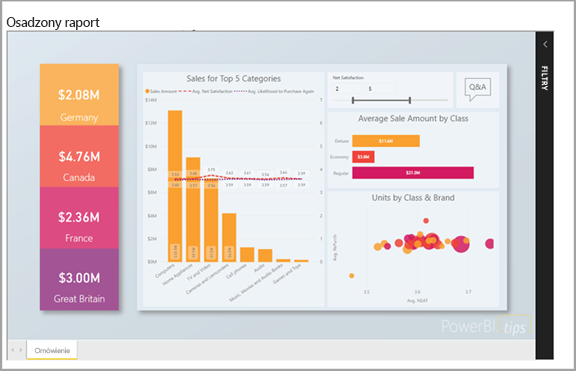

# Analiza osadzona w usłudze Power BI

Usługa Power BI (SaaS) i usługa Power BI Embedded na platformie Azure (PaaS) mają interfejsy API umożliwiające osadzanie pulpitów nawigacyjnych i raportów. Oznacza to wachlarz możliwości oraz dostęp do najnowszych funkcji usługi Power BI — takich jak pulpity nawigacyjne, bramy i obszary robocze aplikacji — podczas osadzania zawartości.

Możesz użyć [narzędzia do konfigurowania osadzania](https://aka.ms/embedsetup), aby szybko rozpocząć pracę i pobrać przykładową aplikację.

Wybierz rozwiązanie, które jest odpowiednie dla Ciebie:

* [Osadzanie dla swojej organizacji](embedding.md#embedding-for-your-organization) umożliwia rozszerzanie usługi Power BI. Uruchom rozwiązanie [osadzania dla organizacji](https://aka.ms/embedsetup/UserOwnsData).
* [Osadzanie dla swoich klientów](embedding.md#embedding-for-your-customers) zapewnia możliwość osadzenia pulpitów nawigacyjnych i raportów u użytkowników, którzy nie mają konta w usłudze Power BI. Uruchom rozwiązanie [osadzania dla klientów](https://aka.ms/embedsetup/AppOwnsData).

## Korzystanie z interfejsów API

Istnieją dwa główne scenariusze osadzania zawartości usługi Power BI.  Osadzanie dla użytkowników w organizacji (mających licencję usługi Power BI) i osadzanie dla użytkowników i klientów bez konieczności posiadania licencji usługi Power BI. Interfejs API REST usługi Power BI umożliwia oba scenariusze.

W przypadku klientów i użytkowników bez licencji usługi Power BI można osadzać pulpity nawigacyjne i raporty w swojej niestandardowej aplikacji przy użyciu tego samego interfejsu API, aby obsłużyć swoją organizację lub klientów. Klienci widzą dane zarządzane przez aplikację. Ponadto użytkownicy usługi Power BI w organizacji będą mieć dodatkowe opcje wyświetlania *swoich danych* bezpośrednio w usłudze Power BI lub w kontekście osadzonej aplikacji. Możesz wykorzystać wszystkie zalety języka JavaScript i interfejsów API REST do swoich potrzeb osadzania.

Aby zobaczyć przykład działania osadzania, zobacz [Przykład osadzania przy użyciu języka JavaScript](https://microsoft.github.io/PowerBI-JavaScript/demo/).

## Osadzanie dla swojej organizacji

**Osadzanie dla swojej organizacji** umożliwia rozszerzanie usługi Power BI. Osadzanie dla swojej organizacji wymaga, aby użytkownicy Twojej aplikacji zalogowali się w usłudze Power BI, gdy będą chcieli wyświetlić swoją zawartość. Gdy ktoś w Twojej organizacji się loguje, ma dostęp tylko do pulpitów nawigacyjnych i raportów, których jest właścicielem lub które zostały mu udostępnione w usłudze Power BI.

*Do przykładów osadzania dla swojej organizacji należą aplikacje wewnętrzne, takie jak [SharePoint Online](https://powerbi.microsoft.com/blog/integrate-power-bi-reports-in-sharepoint-online/), [integracja aplikacji Microsoft Teams (musisz mieć prawa administratora)](https://powerbi.microsoft.com/blog/power-bi-teams-up-with-microsoft-teams/) i [Microsoft Dynamics](https://docs.microsoft.com/dynamics365/customer-engagement/basics/add-edit-power-bi-visualizations-dashboard).*

W przypadku osadzania dla swojej organizacji zobacz:

* [Integrowanie raportu w aplikacji](embed-sample-for-your-organization.md)

Podczas osadzania dla użytkowników usługi możliwości samoobsługi, takie jak edytowanie, zapisywanie i inne, są dostępne za pośrednictwem [interfejsu API języka JavaScript](https://github.com/Microsoft/PowerBI-JavaScript).

Możesz użyć [narzędzia do konfigurowania osadzania](https://aka.ms/embedsetup/UserOwnsData) na potrzeby osadzania w organizacji, aby szybko zacząć pracę i pobrać przykładową aplikację, która przeprowadzi Cię przez proces integracji raportu organizacji.

## Osadzanie dla swoich klientów

**Osadzanie dla swoich klientów** umożliwia osadzanie pulpitów nawigacyjnych i raportów dla użytkowników, którzy nie mają konta w usłudze Power BI. Osadzanie dla swoich klientów jest także znane jako usługa **Power BI Embedded**.

Usługa [Power BI Embedded](azure-pbie-what-is-power-bi-embedded.md) jest usługą platformy **Microsoft Azure** zapewniającą niezależnym dostawcom oprogramowania (ISV, independent software vendor) i deweloperom możliwość szybkiego osadzania atrakcyjnych wizualizacji, raportów i pulpitów nawigacyjnych w aplikacji w ramach modelu opartego na pojemności i rozliczanego godzinowo.

Usługa Power BI Embedded zapewnia korzyści niezależnym dostawcom oprogramowania, deweloperom i klientom. Na przykład niezależny dostawca oprogramowania może zacząć bezpłatnie tworzyć wizualizacje przy użyciu aplikacji Power BI Desktop. Niezależni dostawcy oprogramowania mogą szybciej wprowadzać produkty na rynek, minimalizując prace nad wizualizacjami analiz, oraz wyróżnić się wśród konkurencji dzięki różnorodnej obsłudze danych. Niezależni dostawcy oprogramowania mogą też pobierać dodatkowe opłaty za korzyści oferowane przez analizę osadzoną.

Dzięki usłudze Power BI Embedded Twoi klienci nie muszą nic wiedzieć o usłudze Power BI. Do utworzenia aplikacji osadzonej jest potrzebne tylko jedno konto usługi Power BI Pro. Konto usługi Power BI Pro działa jako konto główne dla aplikacji (pomyśl o koncie głównym jako o koncie serwera proxy). Konto Power BI Pro umożliwia też generowanie osadzonych tokenów zapewniających dostęp do pulpitów nawigacyjnych i raportów w ramach usługi Power BI. Należą one do Twojej usługi i są przez nią zarządzane.

Deweloperzy korzystający z usługi Power BI Embedded mogą skupić się na tworzeniu głównych funkcji aplikacji zamiast na tworzeniu wizualizacji i analiz. Deweloperzy mogą szybko realizować wymagania klientów dotyczące raportów i pulpitów nawigacyjnych, a także łatwo osadzać zawartość dzięki w pełni udokumentowanym interfejsom API i zestawom SDK. Niezależni dostawcy oprogramowania mogą udostępniać w swoich aplikacjach eksplorację danych z łatwą nawigacją, aby umożliwiać swoim klientom podejmowanie szybkich decyzji na podstawie danych przy użyciu dowolnego urządzenia.

> [!IMPORTANT]
> Chociaż osadzanie ma zależność od usługi Power BI, nie ma zależności od usługi Power BI dla Twoich klientów. Nie będą oni musieli tworzyć konta w usłudze Power BI w celu wyświetlenia zawartości osadzonej w aplikacji.

Gdy wszystko jest gotowe do przejścia do środowiska produkcyjnego, obszar roboczy Twojej aplikacji musi zostać przypisany do dedykowanej pojemności. Usługa Power BI Embedded, w ramach platformy Microsoft Azure, oferuje [pojemności dedykowane](azure-pbie-create-capacity.md) do wykorzystania dla Twoich aplikacji.

Aby uzyskać szczegółowe informacje na temat osadzania, zobacz [Jak osadzić pulpity nawigacyjne, raporty i kafelki usługi Power BI](embed-sample-for-customers.md).

## Następne kroki

Teraz możesz spróbować osadzić zawartość usługi Power BI w aplikacji lub spróbować osadzić zawartość usługi Power BI dla klientów.

> [!div class="nextstepaction"]
> [Osadź dla swojej organizacji](embed-sample-for-your-organization.md)

> [!div class="nextstepaction"]
> [Co to jest usługa Power BI Embedded?](azure-pbie-what-is-power-bi-embedded.md)

> [!div class="nextstepaction"]
>[Osadź dla swoich klientów](embed-sample-for-customers.md)

Masz więcej pytań? [Zadaj pytanie społeczności usługi Power BI](http://community.powerbi.com/)