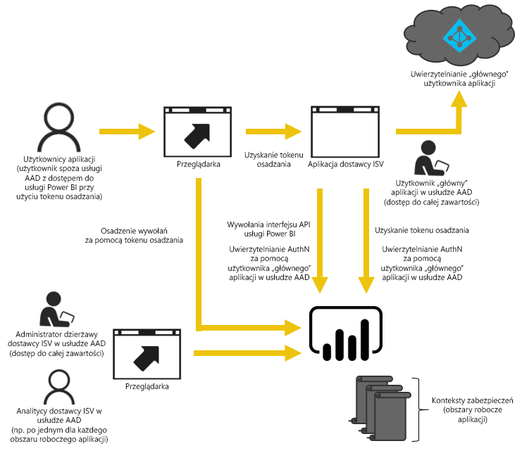

# Osadzanie przy użyciu usługi Power BI
Usługa Power BI oferuje interfejsy API do osadzania Twoich pulpitów nawigacyjnych i raportów w aplikacjach. Interfejsy API usługi Power BI oferują spójny zestaw funkcji oraz dostęp do najnowszych elementów usługi Power BI — takich jak pulpity nawigacyjne, bramy i obszary robocze aplikacji — podczas osadzania zawartości.

## Pojedynczy interfejs API
Istnieją dwa główne scenariusze osadzania zawartości usługi Power BI. Osadzanie dla swojej organizacji i osadzanie dla swoich klientów. Interfejs API REST usługi Power BI umożliwia oba scenariusze. Pozwala Ci to osadzać pulpity nawigacyjne i raporty w swojej niestandardowej aplikacji przy użyciu tego samego interfejsu API, aby obsłużyć swoją organizację lub klientów. Możesz wykorzystać wszystkie zalety języka JavaScript i interfejsów API REST do swoich potrzeb osadzania.

Aby zobaczyć przykład działania osadzania, zobacz [Przykład osadzania przy użyciu języka JavaScript](https://microsoft.github.io/PowerBI-JavaScript/demo/).

## Osadzanie dla swojej organizacji
Osadzanie dla swojej organizacji umożliwia rozszerzanie usługi Power BI. Wymaga to, aby użytkownik końcowy Twojej aplikacji zalogował się w usłudze Power BI, gdy chcesz wyświetlić swoją zawartość. Gdy ktoś w Twojej organizacji się zaloguje, będzie miał dostęp tylko do pulpitów nawigacyjnych i raportów, które zostały mu udostępnione w usłudze Power BI. 

*Do przykładów osadzania dla swojej organizacji należą wewnętrzne aplikacje internetowe, składnik Web Part usługi SharePoint Online i integracja aplikacji Microsoft Teams.*

W przypadku osadzania dla swojej organizacji zobacz poniższe tematy:

* [Integrowanie pulpitu nawigacyjnego w aplikacji](integrate-dashboard.md)
* [Integrowanie kafelka w aplikacji](integrate-tile.md)
* [Integrowanie raportu w aplikacji](integrate-report.md)

Podczas osadzania dla użytkowników usługi możliwości samoobsługi, takie jak edytowanie, zapisywanie i inne, są dostępne za pośrednictwem [interfejsu API języka JavaScript](https://github.com/Microsoft/PowerBI-JavaScript).

## Osadzanie dla swoich klientów
Osadzanie dla swoich klientów zapewnia możliwość osadzenia pulpitów nawigacyjnych i raportów u użytkowników, którzy nie mają konta w usłudze Power BI. Twoi klienci nie muszą nic wiedzieć o usłudze Power BI. Wymagane jest przynajmniej jedno konto usługi Power BI Pro. Konto usługi Power BI Pro będzie działać jako konto główne dla Twojej aplikacji. Myśl o tym, jak o koncie serwera proxy. Konto Power BI Pro umożliwia też generowanie osadzonych tokenów zapewniających dostęp do pulpitów nawigacyjnych i raportów w ramach usługi Power BI. 

*Przykładem osadzania dla swoich klientów jest aplikacja niezależnego dostawcy oprogramowania sprzedawana innym firmom.*

Aby osadzić pulpity nawigacyjne, raporty i kafelki, użyj tych samych interfejsów API, które byłyby używane do osadzania dla swojej organizacji.

> [!IMPORTANT]
> Chociaż osadzanie ma zależność od usługi Power BI, nie ma zależności od usługi Power BI dla Twoich klientów. Nie będą oni musieli tworzyć konta w usłudze Power BI w celu wyświetlenia zawartości osadzonej w aplikacji.
> 
> 

Gdy wszystko jest gotowe do przejścia do środowiska produkcyjnego, obszar roboczy Twojej aplikacji musi zostać przypisany do pojemności. Usługa Power BI Embedded, w ramach platformy Microsoft Azure, oferuje pojemność do wykorzystania dla Twoich aplikacji.

Aby uzyskać szczegółowe informacje na temat osadzania, zobacz [Jak osadzić pulpity nawigacyjne, raporty i kafelki usługi Power BI](embedding-content.md).

Jeśli była używana usługa Kolekcje obszarów roboczych usługi Power BI w ramach platformy Azure, zobacz [Migracja zawartości z usługi platformy Azure Kolekcje obszarów roboczych usługi Power BI](migrate-from-powerbi-embedded.md), aby uzyskać informacje o sposobie migracji swojej zawartości.

## Następne kroki
[Jak osadzić pulpity nawigacyjne, raporty i kafelki usługi Power BI](embedding-content.md)  
[Jak migrować zawartość kolekcji obszarów roboczych usługi Power BI Embedded do usługi Power BI](migrate-from-powerbi-embedded.md)  
[Power BI Premium — co to jest?](../service-premium.md)  
[Repozytorium Git interfejsu API języka JavaScript](https://github.com/Microsoft/PowerBI-JavaScript)  
[Repozytorium Git języka C# usługi Power BI](https://github.com/Microsoft/PowerBI-CSharp)  
[Przykład osadzania przy użyciu języka JavaScript](https://microsoft.github.io/PowerBI-JavaScript/demo/)  
[Oficjalny dokument dotyczący planowania pojemności na potrzeby osadzonej analizy](https://aka.ms/pbiewhitepaper)  
[Oficjalny dokument na temat usługi Power BI Premium](https://aka.ms/pbipremiumwhitepaper)  

Masz więcej pytań? [Zadaj pytanie społeczności usługi Power BI](http://community.powerbi.com/)

