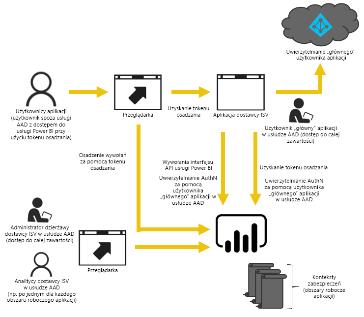
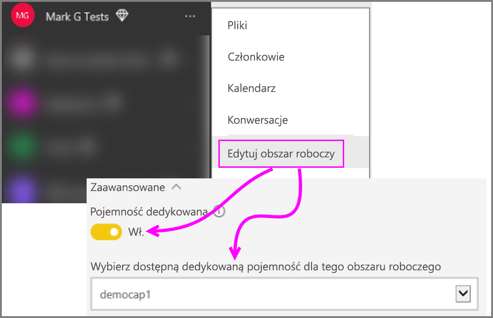

# Jak migrować zawartość kolekcji obszarów roboczych usługi Power BI do usługi Power BI Embedded
Dowiedz się, jak przeprowadzić migrację z kolekcji obszarów roboczych usługi Power BI do usługi Power BI Embedded i uzyskać korzyści związane z osadzaniem zawartości w aplikacjach.

Firma Microsoft niedawno [ogłosiła udostępnienie usługi Power BI Embedded](https://powerbi.microsoft.com/en-us/blog/power-bi-embedded-capacity-based-skus-coming-to-azure/), czyli nowego modelu licencjonowania opartego na pojemnościach, zwiększającego elastyczność uzyskiwania dostępu do zawartości, jej udostępniania i dystrybuowania przez użytkowników. Ta oferta zwiększa również wydajność i skalowalność.

Korzystanie z usługi Power BI Embedded oznacza wspólne środowisko interfejsów API, spójny zestaw funkcji oraz dostęp do najnowszych elementów usługi Power BI — takich jak pulpity nawigacyjne, bramy i obszary robocze aplikacji — podczas osadzania zawartości. Od teraz będzie można rozpocząć pracę z programem Power BI Desktop, a następnie przejść do wdrożenia przy użyciu usługi Power BI Embedded.

Bieżąca kolekcja obszarów roboczych usługi Power BI będzie nadal dostępna przez ograniczony czas. Klienci objęci umową Enterprise Agreement będą mieli do niej dostęp do czasu wygaśnięcia aktualnych umów; klienci, którzy uzyskali kolekcję obszarów roboczych usługi Power BI Embedded bezpośrednio lub za pośrednictwem partnera CSP, zachowają dostęp przez rok od daty ogólnej dostępności usługi Power BI Embedded.  W tym artykule przedstawiono wskazówki dotyczące migracji z kolekcji obszarów roboczych usługi Power BI do nowego środowiska Power BI Embedded oraz zmian, których można spodziewać się w aplikacji.

> [!IMPORTANT]
> Mimo że podczas migracji używana jest zależność od usługi Power BI Embedded, zależność taka nie będzie dotyczyła użytkowników aplikacji osadzonej przy użyciu **tokenu osadzania**. Nie będą oni musieli tworzyć konta w usłudze Power BI w celu wyświetlenia zawartości osadzonej w aplikacji. Tej metody osadzania można użyć w celu obsługi użytkowników osadzonych niekorzystających z usługi Power BI.
> 

Przed rozpoczęciem migracji do nowej usługi Power BI Embedded, możesz skorzystać z krótkiego przewodnika, który pomoże Ci skonfigurować nowe środowisko usługi Power BI Embedded za pomocą [narzędzia obsługi dołączania](https://aka.ms/embedsetup).

Wybierz rozwiązanie, które jest odpowiednie dla Ciebie:
* **Osadź dla swoich klientów** — jeśli interesuje Cię rozwiązanie, w którym [aplikacja jest właścicielem danych](https://aka.ms/embedsetup/AppOwnsData). [Osadzanie dla swoich klientów](embedding.md#embedding-for-your-customers) zapewnia możliwość osadzenia pulpitów nawigacyjnych i raportów u użytkowników, którzy nie mają konta w usłudze Power BI. 
* **Osadź dla swojej organizacji** — jeśli interesuje Cię rozwiązanie, w którym [użytkownik jest właścicielem danych](https://aka.ms/embedsetup/UserOwnsData). [Osadzanie dla swojej organizacji](embedding.md#embedding-for-your-organization) umożliwia rozszerzanie usługi Power BI.

## Przygotowanie do migracji
W ramach przygotowania do migracji z kolekcji obszarów roboczych usługi Power BI do usługi Power BI Embedded należy wykonać kilka czynności. Potrzebna jest dostępna dzierżawa oraz licencja użytkownika usługi Power BI Pro.

1. Upewnij się, że masz dostęp do dzierżawy usługi Azure Active Directory (Azure AD).
   
    Należy określić, jaka konfiguracja dzierżawy będzie używana.
   
   * Istniejąca firmowa dzierżawa usługi Power BI?
   * Oddzielna dzierżawa dla aplikacji?
   * Oddzielna dzierżawa dla każdego klienta?
     
     Jeśli zdecydujesz się na utworzenie nowej dzierżawy dla aplikacji lub dla każdego klienta, zobacz [Tworzenie dzierżawy usługi Azure Active Directory](create-an-azure-active-directory-tenant.md) lub [Jak uzyskać dzierżawę usługi Azure Active Directory](https://docs.microsoft.com/azure/active-directory/develop/active-directory-howto-tenant).
2. Utwórz w nowej dzierżawie użytkownika, który będzie pełnił funkcję głównego konta aplikacji. Dla tego użytkownika należy utworzyć konto usługi Power BI i przypisać do niego licencję usługi Power BI Pro.

## Konta w usłudze Azure AD
W dzierżawie muszą istnieć następujące konta.

> [!NOTE]
> Aby możliwe było korzystanie z obszarów roboczych aplikacji, należy przypisać do tych kont licencje usługi Power BI Pro.
>

1. Użytkownik będący administratorem dzierżawy.
   
    Zaleca się, aby ten użytkownik był członkiem wszystkich obszarów roboczych aplikacji utworzonych na potrzeby osadzania.
2. Konta analityków tworzących zawartość.
   
    Ci użytkownicy powinni być przypisani do obszarów roboczych aplikacji stosownie do potrzeb.
3. *Główne* konto użytkownika lub konto osadzone.
   
    Poświadczenia tego konta będą przechowywane w zapleczu aplikacji i używane w celu uzyskania tokenu usługi Azure AD do użycia z interfejsami API REST usługi Power BI. To konto będzie używane w celu wygenerowania tokenu osadzania dla aplikacji. To konto musi być też administratorem obszarów roboczych aplikacji tworzonych na potrzeby osadzania.
   
> [!NOTE]
> Jest to zwykłe konto użytkownika w organizacji, które będzie używane na potrzeby osadzania.
>

## Rejestrowanie aplikacji i uprawnienia
Konieczne będzie zarejestrowanie aplikacji w usłudze Azure AD i przydzielenie określonych uprawnień.

### Rejestrowanie aplikacji
Aplikację należy zarejestrować w usłudze Azure AD, aby móc wykonywać wywołania interfejsu API REST. W tym celu należy przejść do witryny Azure Portal i wykonać dodatkowe czynności konfiguracyjne, poza rejestracją na stronie rejestracji aplikacji usługi Power BI. Aby uzyskać więcej informacji, zobacz [Rejestrowanie aplikacji usługi Azure AD, aby osadzić zawartość usługi Power BI](register-app.md).

Należy zarejestrować aplikację przy użyciu **głównego** konta aplikacji.

## Tworzenie obszarów roboczych aplikacji (wymagane)
Możesz użyć obszarów roboczych aplikacji w celu zapewnienia lepszej izolacji, jeśli aplikacja obsługuje wielu klientów. Raporty i pulpity nawigacyjne poszczególnych klientów będą izolowane. Możesz także użyć oddzielnego konta usługi Power BI dla każdego obszaru roboczego aplikacji, aby dodatkowo odizolować środowiska poszczególnych klientów.

> [!IMPORTANT]
> Na potrzeby osadzania dla użytkowników niekorzystających z usługi Power BI nie można używać osobistego obszaru roboczego.
> 
> 

Utworzenie obszaru roboczego aplikacji w usłudze Power BI wymaga użytkownika z licencją Pro. Użytkownik usługi Power BI, który utworzy obszar roboczy aplikacji, będzie domyślnie administratorem tego obszaru roboczego.

> [!NOTE]
> Administratorem obszaru roboczego musi być *główne* konto aplikacji.
> 
> 

## Migracja zawartości
Migrację zawartości z kolekcji obszarów roboczych do usługi Power BI Embedded można przeprowadzić równolegle z korzystaniem z bieżącego rozwiązania, bez konieczności przerywania działania.

Możesz użyć **narzędzia do migracji**, ułatwiającego kopiowanie zawartości z usługi Power BI Embedded do usługi Power BI Embedded. Jest to przydatne zwłaszcza wówczas, gdy masz dużo zawartości. Aby uzyskać więcej informacji, zobacz [Narzędzie do migracji usługi Power BI Embedded](migrate-tool.md).

Migracja zawartości opiera się przede wszystkim na dwóch interfejsach API.

1. Interfejs API „Download PBIX” pobiera pliki PBIX przekazane do usługi Power BI od października 2016 r.
2. Interfejs API „Import PBIX” przekazuje wszelkie pliki PBIX do usługi Power BI.

Aby skorzystać z fragmentów kodu związanych z tym procesem, zobacz [Fragmenty kodu umożliwiające migrację zawartości z kolekcji obszarów roboczych usługi Power BI](migrate-code-snippets.md).

### Typy raportów
Istnieje kilka typów raportów, a każdy wymaga nieco innej procedury migracji.

#### Buforowany zestaw danych i raport
Buforowane zestawy danych to pliki PBIX zawierające zaimportowane dane, a nie połączenie na żywo czy połączenie zapytania bezpośredniego.

**Procedura**

1. Wywołaj interfejs API pobierania pliku PBIX z obszaru roboczego w usłudze PaaS.
2. Zapisz plik PBIX.
3. Wywołaj importowanie pliku do obszaru roboczego w usłudze SaaS.

#### Zestaw danych i raport z zapytaniem bezpośrednim
**Procedura**

1. Wywołaj metodę GET https://api.powerbi.com/v1.0/collections/{collection_id}/workspaces/{wid}/datasets/{dataset_id}/Default.GetBoundGatewayDataSources i zapisz odebrane parametry połączenia.
2. Wywołaj interfejs API pobierania pliku PBIX z obszaru roboczego w usłudze PaaS.
3. Zapisz plik PBIX.
4. Wywołaj importowanie pliku do obszaru roboczego w usłudze SaaS.
5. Zaktualizuj parametry połączenia za pośrednictwem wywołania — POST https://api.powerbi.com/v1.0/myorg/datasets/{dataset_id}/Default.SetAllConnections
6. Pobierz identyfikator GW i identyfikator źródła danych za pośrednictwem wywołania — GET https://api.powerbi.com/v1.0/myorg/datasets/{dataset_id}/Default.GetBoundGatewayDataSources
7. Zaktualizuj poświadczenia użytkownika za pośrednictwem wywołania — PATCH https://api.powerbi.com/v1.0/myorg/gateways/{gateway_id}/datasources/{datasource_id}

#### Starsze zestawy danych i raporty
Są to zestawy danych/raporty utworzone przed październikiem 2016 r. Interfejs API „Download PBIX” nie obsługuje plików PBIX przekazanych przed październikiem 2016 r.

**Procedura**

1. Pobierz plik PBI ze środowiska deweloperskiego (wewnętrznej kontroli źródła).
2. Wywołaj importowanie pliku do obszaru roboczego w usłudze SaaS.

#### Zestaw danych i raport interfejsu wypychania
Interfejs API „Download PBIX” nie obsługuje zestawów danych *interfejsu API wypychania*. Nie można przenosić danych zestawu danych interfejsu API wypychania z usługi PaaS do usługi SaaS.

**Procedura**

1. Wywołaj interfejs API „Create dataset” z zestawem danych Json, aby utworzyć zestaw danych w obszarze roboczym usługi SaaS.
2. Skompiluj ponownie raport dla utworzonego zestawu danych.*

Można użyć obejścia w celu przeprowadzenia migracji raportu interfejsu API wypychania z usługi PaaS do usługi SaaS, wykonując następujące czynności.

1. Przekaż dowolny zastępczy plik PBIX do obszaru roboczego usługi PaaS.
2. Sklonuj raport interfejsu API wypychania i powiąż go z zastępczym plikiem PBIX z kroku 1.
3. Pobierz raport interfejsu API wypychania z zastępczym plikiem PBIX.
4. Przekaż zastępczy plik PBIX do obszaru roboczego usługi SaaS.
5. Utwórz zestaw danych wypychania w obszarze roboczym usługi SaaS.
6. Ponownie powiąż raport z zestawem danych interfejsu API wypychania.

## Tworzenie i przekazywanie nowych raportów
Oprócz zawartości migrowanej z kolekcji obszarów roboczych usługi Power BI można również tworzyć raporty i zestawy danych przy użyciu programu Power BI Desktop, a następnie publikować te raporty w obszarze roboczym aplikacji. Aby móc publikować raporty w obszarze roboczym aplikacji, użytkownik końcowy publikujący je musi mieć licencję usługi Power BI Pro.

## Ponowne kompilowanie aplikacji
1. Należy zmodyfikować aplikację w celu korzystania z interfejsów API REST usługi Power BI oraz lokalizacji raportu w witrynie powerbi.com.
2. Ponownie skompiluj uwierzytelnianie AuthN/AuthZ przy użyciu *głównego* konta aplikacji. Możesz skorzystać z [tokenu osadzania](https://docs.microsoft.com/rest/api/power-bi/embedtoken), aby zezwolić temu użytkownikowi na działanie w imieniu innych użytkowników.
3. Możesz osadzać raporty z witryny powerbi.com w aplikacji.

## Mapowanie użytkowników na użytkownika usługi Power BI
Użytkownicy zarządzani w aplikacji będą mapowani na poświadczenia *głównego* konta usługi Power BI używanego na potrzeby aplikacji. Poświadczenia tego *głównego* konta usługi Power BI dla aplikacji będą w niej przechowywane i używane do tworzenia tokenów osadzania.

## Przechodzenie do zastosowania produkcyjnego
Gdy wszystko będzie gotowe do przejścia do zastosowania produkcyjnego, należy wykonać następujące czynności.

* Jeśli korzystasz z oddzielnej dzierżawy na potrzeby programowania, należy upewnić się, że obszary robocze aplikacji oraz pulpity nawigacyjne i raporty są dostępne w środowisku produkcyjnym. Należy także upewnić się, że utworzono aplikację w usłudze Azure AD dla dzierżawy produkcyjnej i przypisano odpowiednie uprawnienia aplikacji, zgodnie z instrukcjami w kroku 1.
* Kup pojemność odpowiednią do potrzeb. Aby lepiej zrozumieć, jaka wielkość i typ pojemności są Ci potrzebne, zobacz [oficjalny dokument dotyczący planowania pojemności na potrzeby analizy usługi Power BI Embedded](https://aka.ms/pbiewhitepaper). [Zakupu pojemności](https://portal.azure.com/#create/Microsoft.PowerBIDedicated) możesz dokonać na platformie Azure.
* Edytuj obszar roboczy aplikacji i przypisz go do pojemności Premium w obszarze Zaawansowane.
 
    
    
* Wdróż zaktualizowaną aplikację w środowisku produkcyjnym i rozpocznij osadzanie raportów z usługi Power BI Embedded.

## Po migracji
Należy wyczyścić odpowiednie zasoby na platformie Azure.

* Usuń wszystkie obszary robocze poza wdrożonym rozwiązaniem z usługi Azure Embedded kolekcji obszarów usługi Power BI.
* Usuń wszelkie kolekcje obszarów roboczych na platformie Azure.

## Następne kroki
[Osadzanie przy użyciu usługi Power BI](embedding.md)  
[Narzędzie migracji kolekcji obszarów roboczych usługi Power BI](migrate-tool.md)  
[Fragmenty kodu umożliwiające migrację zawartości z kolekcji obszarów roboczych usługi Power BI](migrate-code-snippets.md)  
[Jak osadzić pulpity nawigacyjne, raporty i kafelki usługi Power BI](embedding-content.md)  
[Power BI Premium — co to jest?](../service-premium.md)  
[Repozytorium Git interfejsu API języka JavaScript](https://github.com/Microsoft/PowerBI-JavaScript)  
[Repozytorium Git języka C# usługi Power BI](https://github.com/Microsoft/PowerBI-CSharp)  
[Przykład osadzania przy użyciu języka JavaScript](https://microsoft.github.io/PowerBI-JavaScript/demo/)  
[Oficjalny dokument dotyczący planowania pojemności na potrzeby osadzonej analizy](https://aka.ms/pbiewhitepaper)  
[Oficjalny dokument na temat usługi Power BI Premium](https://aka.ms/pbipremiumwhitepaper)  

Masz więcej pytań? [Zadaj pytanie społeczności usługi Power BI](http://community.powerbi.com/)