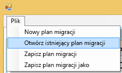
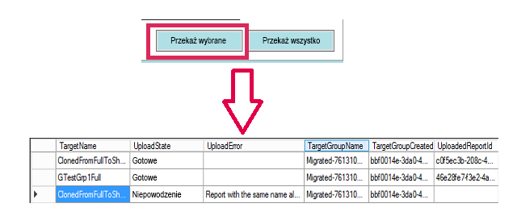
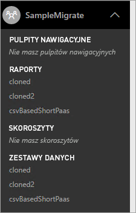

# <a name="power-bi-embedded-migration-tool"></a>Narzędzie do migracji usługi Power BI Embedded
To narzędzie migracji może służyć do kopiowania raportów z usługi Power BI Embedded platformy Azure (PaaS) do usługi Power BI (SaaS).

Migrację zawartości z kolekcji obszarów roboczych do usługi Power BI można przeprowadzić równolegle z korzystaniem z bieżącego rozwiązania, bez konieczności przerywania działania.

## <a name="limitations"></a>Ograniczenia
* Wypychanych zestawów danych nie można pobrać i muszą one zostać odtworzone przy użyciu interfejsów API REST usługi Power BI dla usługi Power BI.
* Pliki PBIX zaimportowane przed 26 listopada 2016 r. nie będą dostępne do pobrania.

## <a name="download"></a>Pobieranie
Przykładowe narzędzie do migracji możesz pobrać z usługi [GitHub](https://github.com/Microsoft/powerbi-migration-sample). Możesz pobrać plik zip repozytorium albo możesz go sklonować lokalnie. Po pobraniu możesz otworzyć plik *powerbi-migration-sample.sln* w programie Visual Studio, aby skompilować i uruchomić narzędzie do migracji.

## <a name="migration-plans"></a>Plany migracji
Plan migracji to tylko metadane, które tworzą katalog zawartości w usłudze Power BI Embedded, i sposób, w jaki chcesz je opublikować w usłudze Power BI.

### <a name="start-with-a-new-migration-plan"></a>Rozpoczynanie od nowego planu migracji
Plan migracji to metadane elementów dostępnych w usłudze Power BI Embedded, które chcesz następnie przenieść do usługi Power BI. Plan migracji jest przechowywany jako plik XML.

Należy rozpocząć od utworzenia nowego planu migracji. Aby utworzyć nowy plan migracji, wykonaj następujące czynności.

1. Wybierz pozycję **Plik** > **Nowy plan migracji**.
   
    
2. W oknie dialogowym **Wybieranie grupy zasobów usługi Power BI Embedded** należy wybrać listę rozwijaną Środowisko i wybrać środowisko produkcyjne.
3. Zostanie wyświetlony monit o zalogowanie. Użyj nazwy logowania subskrypcji platformy Azure.
   
   > [!IMPORTANT]
   > To **nie** jest konto organizacji w usłudze Office 365, za pomocą którego logujesz się do usługi Power BI.
   > 
   > 
4. Wybierz subskrypcję platformy Azure, która przechowuje Twoje kolekcje obszarów roboczych usługi Power BI Embedded.
   
    
5. Poniżej listy subskrypcji wybierz **grupę zasobów** zawierającą Twoje kolekcje obszarów roboczych, a następnie wybierz pozycję **Wybierz**.
   
    
6. Wybierz pozycję **Analizuj**. Spowoduje to pobranie spisu elementów w Twojej subskrypcji platformy Azure, aby można było rozpocząć plan.
   
    
   
   > [!NOTE]
   > Proces analizowania może potrwać kilka minut w zależności od liczby kolekcji obszarów roboczych i ilości zawartości istniejącej w kolekcji obszarów roboczych.
   > 
   > 
7. Po zakończeniu **analizy** zostanie wyświetlony monit o zapisanie planu migracji.

W tym momencie plan migracji został połączony z subskrypcją platformy Azure. Przeczytaj treść poniżej, aby zrozumieć przepływ pracy dla planu migracji. Obejmuje to analizę i planowanie migracji, pobieranie, tworzenie grup oraz przekazywanie.

### <a name="save-your-migration-plan"></a>Zapisywanie planu migracji
Plan migracji możesz zapisać do wykorzystania w przyszłości. Spowoduje to utworzenie pliku XML, który zawiera wszystkie informacje z planu migracji.

Aby zapisać swój plan migracji, wykonaj następujące czynności.

1. Wybierz pozycję **Plik** > **Zapisz plan migracji**.
   
    
2. Nadaj nazwę plikowi lub użyj wygenerowanej nazwy pliku i wybierz pozycję **Zapisz**.

### <a name="open-an-existing-migration-plan"></a>Otwieranie istniejącego planu migracji
Zapisany plan migracji możesz także otworzyć, aby kontynuować pracę przy migracji.

Aby otworzyć istniejący plan migracji, wykonaj następujące czynności.

1. Wybierz pozycję **Plik** > **Otwórz istniejący plan migracji**.
   
    
2. Wybierz swój plik migracji, a następnie wybierz pozycję **Otwórz**.

## <a name="step-1-analyze--plan-migration"></a>Krok 1. Analizowanie i planowanie migracji
Karta **Analizowanie i planowanie migracji** zawiera widok tego, co znajduje się aktualnie w Twojej grupie zasobów subskrypcji platformy Azure.


Na potrzeby przykładu zajmiemy się grupą *SampleResourceGroup*.

### <a name="paas-topology"></a>Topologia PaaS
Jest to lista pozycji *Grupa zasobów > Kolekcje obszarów roboczych > Obszary robocze*. Kolekcje grup zasobów i obszarów roboczych zostaną wyświetlone z przyjazną nazwą. Obszary robocze zostaną wyświetlone z identyfikatorem GUID.

Elementy na liście będą również wyświetlane z kolorem i numerem w formacie (#/#). Wskazuje to liczbę raportów, które można pobrać. Kolor czarny oznacza, że można pobrać wszystkie raporty.

Kolor czerwony oznacza, że nie można pobrać niektórych raportów. Liczba po lewej stronie wskazuje całkowitą liczbę raportów, które można pobrać. Liczba po prawej stronie wskazuje całkowitą liczbę raportów w ramach grupy.

Wybranie elementu w obrębie topologii PaaS umożliwia wyświetlenie raportów w sekcji raportów.

### <a name="reports"></a>Raporty
W sekcji raportów są wyświetlane dostępne raporty wraz z informacją, czy można je pobrać.


### <a name="target-structure"></a>Struktura docelowa
Za pomocą **struktury docelowej** można przekazać do narzędzia informacje, dokąd elementy zostaną pobrane i jak mają zostać przekazane.

#### <a name="download-plan"></a>Plan pobierania
Ścieżka zostanie automatycznie utworzona. W razie potrzeby możesz zmienić tę ścieżkę. Jeśli zmienisz ścieżkę, musisz wybrać pozycję **Aktualizuj ścieżki**.

> [!NOTE]
> Nie powoduje to faktycznego pobrania. Jest to tylko określenie struktury, do której będą pobierane raporty.
> 
> 

#### <a name="upload-plan"></a>Plan przekazywania
W tym miejscu możesz określić prefiks używany dla obszarów roboczych aplikacji, które zostaną utworzone w ramach usługi Power BI. Po prefiksie znajdzie się identyfikator GUID obszaru roboczego istniejącego na platformie Azure.


> [!NOTE]
> Nie powoduje to rzeczywistego utworzenia grup w usłudze Power BI. Zostanie jedynie zdefiniowana struktura nazewnictwa grup.
> 
> 

Jeśli zmienisz prefiks, musisz wybrać pozycję **Generuj plan przekazywania**.

Możesz kliknąć prawym przyciskiem myszy grupę i w razie potrzeby wybrać opcję zmiany nazwy grupy bezpośrednio w ramach planu przekazywania.


> [!NOTE]
> Nazwa *grupy* nie może zawierać spacji ani nieprawidłowych znaków.
> 
> 

## <a name="step-2-download"></a>Krok 2. Pobieranie
Na karcie **Pobieranie** zostanie wyświetlona lista raportów i skojarzonych metadanych. Zobaczysz stan eksportu wraz ze stanem poprzedniego eksportu.


Dostępne są dwie opcje.

* Wybierz konkretne raporty, a następnie wybierz pozycję **Pobierz wybrane**
* Wybierz pozycję **Pobierz wszystko**.


W przypadku pomyślnego pobrania zobaczysz stan *Gotowe* i będzie on wskazywać, że plik PBIX istnieje.

Po zakończeniu pobierania wybierz kartę **Tworzenie grup**.

## <a name="step-3-create-groups"></a>Krok 3. Tworzenie grup
Po pobraniu dostępnych raportów możesz przejść do karty **Tworzenie grup**. Ta karta utworzy obszary robocze aplikacji w usłudze Power BI na podstawie planu migracji, który został utworzony. Utworzy ona obszar roboczy aplikacji o nazwie znajdującej się na karcie **Przekazywanie** w obszarze **Analizowanie i planowanie migracji**.


W celu utworzenia obszarów roboczych aplikacji możesz wybrać pozycję **Utwórz wybrane grupy** albo **Utwórz wszystkie brakujące grupy**.

Po wybraniu jednej z tych opcji pojawi się monit o zalogowanie. *Podaj poświadczenia dla usługi Power BI, w której chcesz utworzyć obszary robocze aplikacji.*


Spowoduje to utworzenie obszaru roboczego aplikacji w usłudze Power BI. Nie powoduje to przekazania raportów do obszaru roboczego aplikacji.

Aby sprawdzić, czy obszar roboczy aplikacji został utworzony, możesz zalogować się do usługi Power BI i zweryfikować, czy ten obszar roboczy istnieje. Zauważysz, że obszar roboczy jest pusty.


Po utworzeniu obszaru roboczego możesz przejść na kartę **Przekazywanie**.

## <a name="step-4-upload"></a>Krok 4. Przekazywanie
Na karcie **Przekazywanie** możesz przekazać raporty do usługi Power BI. Będzie widoczna lista raportów, które pobraliśmy na karcie Pobieranie, oraz nazwa grupy docelowej określona na podstawie planu migracji.


Przekazać możesz wybrane lub wszystkie raporty. Możesz też zresetować stan przekazywania, aby ponownie przekazać elementy.

Dostępna jest również opcja wyboru działania do podjęcia, jeśli raport o takiej samej nazwie już istnieje. Możesz wybierać spośród pozycji **Przerwij**, **Ignoruj** i **Zastąp**.




### <a name="duplicate-report-names"></a>Zduplikowane nazwy raportów
Jeśli raport ma taką samą nazwę, jak istniejący raport, ale jest to inny raport, musisz zmienić nazwę **TargetName** raportu. Nazwę możesz zmienić, ręcznie edytując plik XML planu migracji.

Musisz zamknąć narzędzie migracji, aby wprowadzić zmiany, a następnie ponownie otworzyć narzędzie i plan migracji.

W powyższym przykładzie sklonowanie jednego z raportów nie powiodło się, ponieważ raport o takiej samej nazwie istnieje. Jeśli zajrzymy do pliku XML planu migracji, zobaczymy poniższe dane.

```
<ReportMigrationData>
    <PaaSWorkspaceCollectionName>SampleWorkspaceCollection</PaaSWorkspaceCollectionName>
    <PaaSWorkspaceId>4c04147b-d8fc-478b-8dcb-bcf687149823</PaaSWorkspaceId>
    <PaaSReportId>525a8328-b8cc-4f0d-b2cb-c3a9b4ba2efe</PaaSReportId>
    <PaaSReportLastImportTime>1/3/2017 2:10:19 PM</PaaSReportLastImportTime>
    <PaaSReportName>cloned</PaaSReportName>
    <IsPushDataset>false</IsPushDataset>
    <IsBoundToOldDataset>false</IsBoundToOldDataset>
    <PbixPath>C:\MigrationData\SampleResourceGroup\SampleWorkspaceCollection\4c04147b-d8fc-478b-8dcb-bcf687149823\cloned-525a8328-b8cc-4f0d-b2cb-c3a9b4ba2efe.pbix</PbixPath>
    <ExportState>Done</ExportState>
    <LastExportStatus>OK</LastExportStatus>
    <SaaSTargetGroupName>SampleMigrate</SaaSTargetGroupName>
    <SaaSTargetGroupId>6da6f072-0135-4e6c-bc92-0886d8aeb79d</SaaSTargetGroupId>
    <SaaSTargetReportName>cloned</SaaSTargetReportName>
    <SaaSImportState>Failed</SaaSImportState>
    <SaaSImportError>Report with the same name already exists</SaaSImportError>
</ReportMigrationData>
```

Dla elementu, który zakończył się niepowodzeniem, możemy zmienić nazwę SaaSTargetReportName.

```
<SaaSTargetReportName>cloned2</SaaSTargetReportName>
```

Następnie możemy ponownie otworzyć plan w narzędziu do migracji i przekazać raport, którego przekazanie nie powiodło się.

Po powrocie do usługi Power BI możemy stwierdzić, że raporty i zestawy danych zostały przekazane do obszaru roboczego aplikacji.



<a name="upload-local-file"></a>

### <a name="upload-a-local-pbix-file"></a>Przekazywanie lokalnego pliku PBIX
Przekazać możesz lokalną wersję pliku programu Power BI Desktop. Musisz zamknąć narzędzie, zmodyfikować plik XML i umieścić pełną ścieżkę do lokalnego pliku PBIX we właściwości **PbixPath**.

```
<PbixPath>[Full Path to PBIX file]</PbixPath>
```

Po zakończeniu edycji kodu XML ponownie otwórz plan w narzędziu do migracji i przekaż raport.

<a name="directquery-reports"></a>

### <a name="directquery-reports"></a>Raporty zapytania bezpośredniego
Musisz przeprowadzić aktualizację, aby zaktualizować parametry połączenia dla raportów zapytania bezpośredniego. Możesz to zrobić w witrynie *powerbi.com* lub programowo wykonać zapytanie dotyczące parametrów połączenia z poziomu usługi Power BI Embedded (PaaS). Przykład możesz znaleźć w artykule [Wyodrębnianie parametrów połączenia zapytania bezpośredniego z raportu usługi PaaS](migrate-code-snippets.md#extract-directquery-connection-string-from-paas-report).

Następnie możesz zaktualizować parametry połączenia dla zestawu danych w ramach usługi Power BI (SaaS) i ustawić poświadczenia dla źródła danych. Aby zobaczyć, jak to zrobić, możesz przyjrzeć się następującym przykładom.

* [Aktualizowanie parametrów połączenia zapytania bezpośredniego w obszarze roboczym usługi SaaS](migrate-code-snippets.md#update-directquery-connection-string-is-saas-workspace)
* [Konfigurowanie poświadczeń zapytania bezpośredniego w obszarze roboczym usługi SaaS](migrate-code-snippets.md#set-directquery-credentials-in-saas-workspace)

## <a name="embedding"></a>Osadzanie
Teraz, gdy raporty zostały poddane migracji z usługi Power BI Embedded platformy Azure do usługi Power BI, możesz zaktualizować swoją aplikację i zacząć osadzanie raportów w tym obszarze roboczym aplikacji.

Aby uzyskać więcej informacji, zobacz [Jak migrować zawartość kolekcji obszarów roboczych usługi Power BI Embedded do usługi Power BI](migrate-from-powerbi-embedded.md).

## <a name="next-steps"></a>Następne kroki
[Osadzanie przy użyciu usługi Power BI](embedding.md)  
[Jak migrować zawartość kolekcji obszarów roboczych usługi Power BI Embedded do usługi Power BI](migrate-from-powerbi-embedded.md)  
[Power BI Premium — co to jest?](../service-premium.md)  
[Repozytorium Git interfejsu API języka JavaScript](https://github.com/Microsoft/PowerBI-JavaScript)  
[Repozytorium Git języka C# usługi Power BI](https://github.com/Microsoft/PowerBI-CSharp)  
[Przykład osadzania przy użyciu języka JavaScript](https://microsoft.github.io/PowerBI-JavaScript/demo/)  
[Oficjalny dokument na temat usługi Power BI Premium](https://aka.ms/pbipremiumwhitepaper)  

Masz więcej pytań? [Zadaj pytanie społeczności usługi Power BI](http://community.powerbi.com/)

