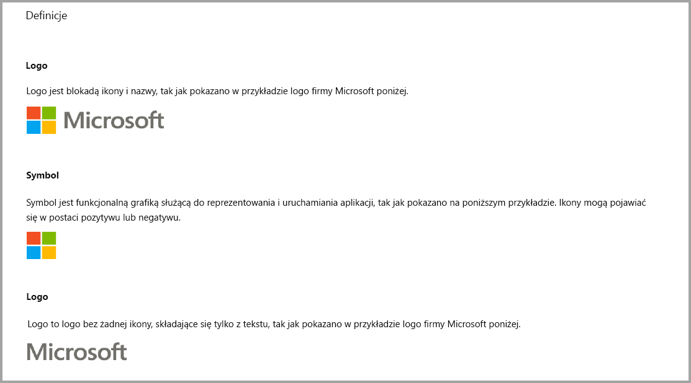
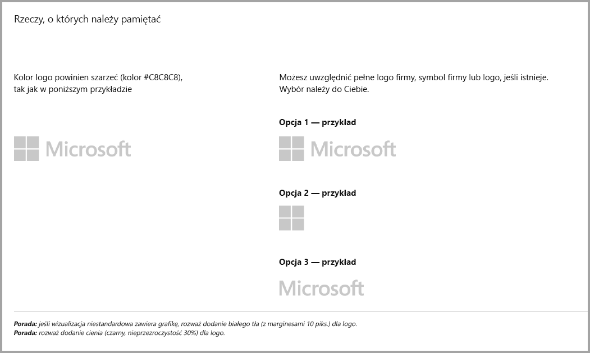
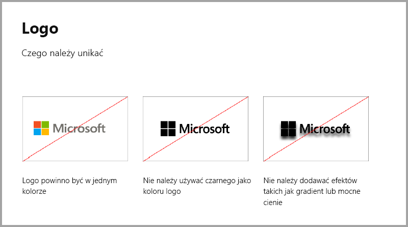
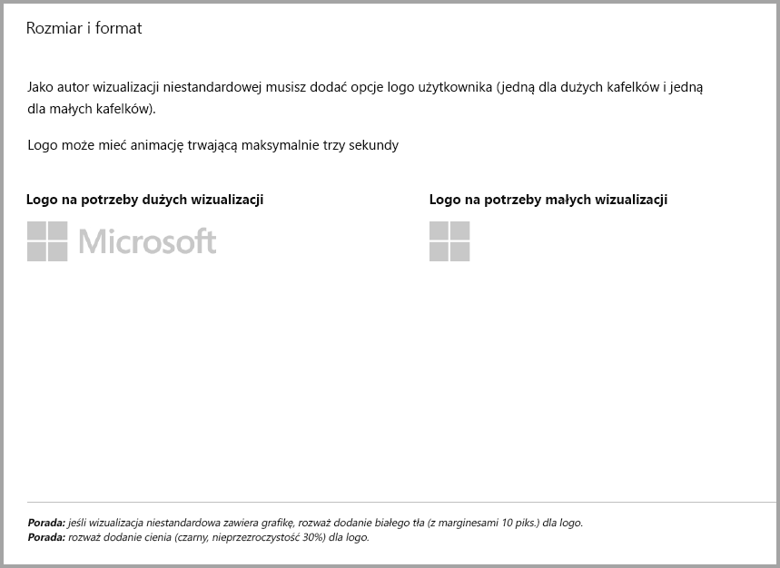
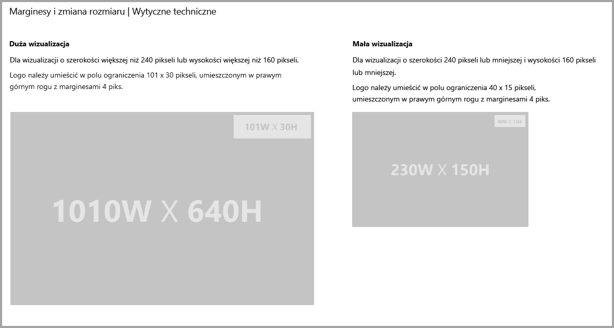
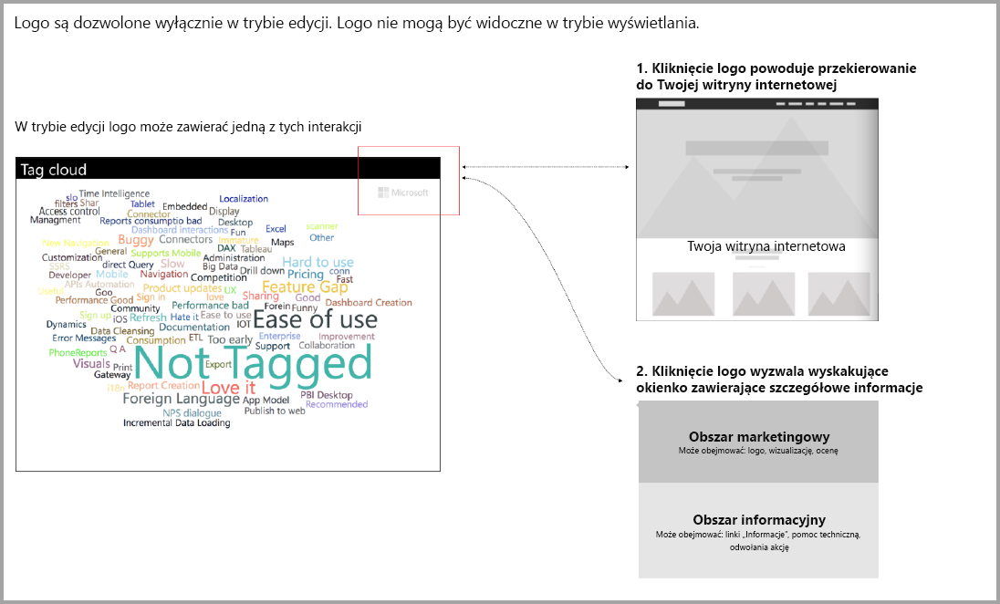

# Wskazówki dotyczące wizualizacji usługi Power BI wymagająych dodatkowego zakupu

Do niedawna na platformie **Marketplace (AppSource)** akceptowane były tylko bezpłatne wizualizacje usługi Power BI. Te zasady zostały zmienione — obecnie można przesyłać do witryny **AppSource** również wizualizacje z oznaczeniem „Może być konieczny dodatkowy zakup”. Wizualizacje wymagające dodatkowego zakupu są podobne do dodatków oferowanych w Sklepie Office z oznaczeniem „zakupy w aplikacji”. Deweloperzy mogą również przesyłać te wizualizacje do certyfikacji po ich zatwierdzeniu przez zespół platformy **AppSource** i spełnieniu wymagań dotyczących certyfikacji opisanych w [artykule dotyczącym certyfikowanych wizualizacji niestandardowych](../power-bi-custom-visuals-certified.md).

> [!Note]
> Certyfikowana wizualizacja nie może korzystać z zewnętrznych zasobów ani usług.

## Co ulega zmianie w procesie przesyłania?

Deweloperzy mogą przekazywać swoje wizualizacje zawierające funkcje wymagające zakupu w aplikacji do witryny AppSource za pośrednictwem pulpitu nawigacyjnego sprzedawcy, tak samo, jak w przypadku wizualizacji bezpłatnych. Aby wskazać, że przekazywana wizualizacja zawiera funkcje wymagające zakupu w aplikacji, deweloperzy powinni w uwagach na pulpicie nawigacyjnym sprzedawcy wpisać „Visual with in-app purchases” (Wizualizacja z zakupami w aplikacji). Ponadto deweloperzy muszą przekazać klucz licencji lub token, umożliwiający zespołowi weryfikacyjnemu weryfikację funkcji wymagających zakupu w aplikacji. Po weryfikacji i zatwierdzeniu wizualizacji będzie ona widoczna w witrynie AppSource z adnotacją „Może być konieczny dodatkowy zakup” w sekcji zawierającej opcje ceny.

## Co to jest wizualizacja usługi Power BI zawierająca funkcje wymagające zakupu w aplikacji?

Wizualizacja zawierająca funkcje wymagające zakupu w aplikacji to bezpłatna wizualizacja, która jednak oprócz bezpłatnych funkcji zawiera również funkcje dodatkowe, których użycie wymaga dodatkowej opłaty. Deweloperzy muszą poinformować użytkowników o tym, jakie funkcje wymagają dodatkowego zakupu, w opisie wizualizacji. Obecnie firma Microsoft nie zapewnia natywnych interfejsów API do obsługi zakupów w aplikacjach i dodatkach. Deweloperzy mogą korzystać z dowolnego systemu płatności innej firmy do obsługi tych zakupów. Zapoznaj się z [zasadami](https://docs.microsoft.com/office/dev/store/validation-policies#2-apps-or-add-ins-can-display-certain-ads) sklepu.

## Wytyczne dotyczących logo

W tej sekcji opisano specyfikacje dotyczące logo i logotypów dodawanych w wizualizacjach.

> [!NOTE]
> Logo są dozwolone wyłącznie w trybie edycji. Logo nie mogą być widoczne w trybie wyświetlania.

## Najlepsze rozwiązania

### Strona docelowa wizualizacji

Strona docelowa pozwala wyjaśnić użytkownikom, w jaki sposób mogą korzystać z wizualizacji oraz jak mogą zakupić licencję. Nie należy umieszczać na niej automatycznie odtwarzanych filmów wideo. Należy dodać tylko treści przydatne dla użytkowników, na przykład informacje lub linki do informacji o zakupie licencji oraz instrukcje korzystania z funkcji wymagających zakupu w aplikacji.

### Klucz licencji i token

Dla wygody użytkowników dodaj pola związane z kluczem licencji lub tokenem w górnej części okienka Formatowanie.

## Następne kroki

Dowiedz się, jak publikować swoje wizualizacje niestandardowe w usłudze [AppSource](office-store.md) do użytku przez inne osoby.
