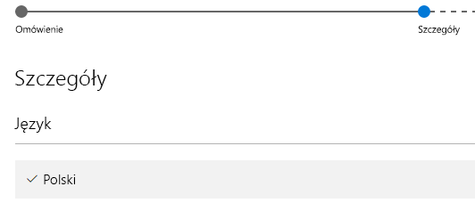

# Publikowanie wizualizacji niestandardowych w Sklepie Office
Dowiedz się, jak publikować swoje wizualizacje niestandardowe w Sklepie Office do użytku przez inne osoby.

Po utworzeniu wizualizacji niestandardowej możesz opublikować ją w Sklepie Office do użytku przez inne osoby. Wymaga to pewnych przygotowań. Więcej informacji na temat tworzenia wizualizacji niestandardowych można znaleźć w artykule [Tworzenie niestandardowych wizualizacji przy użyciu narzędzi deweloperskich](../service-custom-visuals-getting-started-with-developer-tools.md).

Co to jest Sklep Office? Krótko mówiąc, to jest miejsce, gdzie można znaleźć aplikacje (dodatki) dla oprogramowania Office 365. [Sklep Office](https://appsource.microsoft.com/marketplace/apps?product=power-bi-visuals) łączy miliony użytkowników usługi Office 365 z rozwiązaniami, które pomagają im pracować wydajniej, bardziej wnikliwie lub ładniej niż wcześniej.

## Przygotowywanie wizualizacji niestandardowej do przesłania
Po zakończeniu kodowania i testowania wizualizacji niestandardowej oraz spakowaniu jej w plik pbiviz należy przygotować także następujące elementy.

| Element | Wymagane | Opis |
| --- | --- | --- |
| Pakiet pbiviz zawiera wszystkie wymagane metadane |Tak |Nazwa wizualizacji Nazwa wyświetlana GUID Wersja Opis Nazwisko i adres e-mail autora |
| Przykładowy plik raportu pbix |Tak |Aby przedstawić swoją wizualizację, należy pomóc użytkownikom w zapoznaniu się z nią. Należy podkreślić wartość zapewnianą użytkownikowi przez wizualizację oraz podać przykłady zastosowania, opcji formatowania itp. Na końcu można także dodać stronę *z poradami* zawierającą porady i wskazówki, listę kwestii, których należy unikać itp. |
| Ikona |Tak |Należy dołączyć logo wizualizacji niestandardowej, które będzie wyświetlane w sklepie. Plik może mieć format png, jpg, jpeg lub gif. Musi mieć rozmiar dokładnie 300 pikseli (szerokość) x 300 pikseli (wysokość). Rozmiar pliku nie może przekraczać 512 KB. |
| Zrzuty ekranu |Tak |Należy dołączyć co najmniej jeden zrzut ekranu. Plik może mieć format png, jpg, jpeg lub gif. Musi mieć rozmiar dokładnie 1366 pikseli (szerokość) x 768 pikseli (wysokość). Rozmiar pliku nie może przekraczać 1024 KB. *W celu zwiększenia popularności warto dodać etykiety podkreślające przydatność kluczowych funkcji przedstawionych na każdym zrzucie ekranu.* |
| Link do pomocy w pobieraniu |Tak |Podaj adres URL, pod którym użytkownicy napotykający problemy z wizualizacją mogą uzyskać wsparcie. Adres URL powinien zawierać element https:// lub http://. |
| Link do dokumentu dotyczącego prywatności |Tak |Podaj link do zasad ochrony prywatności klientów korzystających z wizualizacji. Link powinien zawierać element https:// lub http://. |
| Umowa licencyjna użytkownika oprogramowania (EULA) |Tak |Należy przekazać plik EULA. Może to być Twoja własna umowa EULA lub domyślna umowa EULA stosowana w Sklepie Office dla wizualizacji niestandardowych usługi Power BI. Aby użyć domyślnej umowy EULA, wklej następujący adres URL do okna dialogowego przekazywania pliku „Umowa licencyjna użytkownika oprogramowania” na pulpicie nawigacyjnym sprzedawcy: [https://visuals.azureedge.net/app-store/Power BI - Default Custom Visual EULA.pdf](https://visuals.azureedge.net/app-store/Power BI - Default Custom Visual EULA.pdf). |
| Link do filmu |Nie |Aby zwiększyć zainteresowanie użytkowników wizualizacją niestandardową, zaleca się podanie linku do filmu dotyczącego wizualizacji. Adres URL powinien zawierać element https:// lub http://. |
| Repozytorium GitHub |Nie |Zaleca się podanie poprawnego, publicznego linku do repozytorium [GitHub](https://www.github.com) zawierającego źródła wizualizacji oraz przykładowe dane umożliwiające innym deweloperom przesyłanie opinii i sugerowanie usprawnień kodu. |

## Przesyłanie do usługi Power BI
Proces przesyłania zaczyna się od przesłania wiadomości e-mail do zespołu ds. wizualizacji niestandardowych usługi Power BI. Możesz wysłać wiadomość na adres [pbivizsubmit@microsoft.com](mailto:pbivizsubmit@microsoft.com).

Do wiadomości dołącz plik pbiviz oraz przykładowy raport w pliku pbix. Zespół usługi Power BI odpowie, przesyłając instrukcje oraz plik XML pakietu aplikacji do przesłania. Ten pakiet aplikacji XML jest wymagany w celu przesłania wizualizacji za pośrednictwem centrum deweloperów Office.

> [!NOTE]
> W celu podniesienia jakości oraz upewnienia się, że nie powodują problemów z istniejącymi raportami, aktualizacje istniejących wizualizacji docierają do środowiska produkcyjnego 2 tygodnie po zatwierdzeniu w sklepie.
> 
> 

## Przesyłanie do Sklepu Office
Po otrzymaniu pliku XML pakietu aplikacji od zespołu usługi Power BI przejdź do [Centrum deweloperów Office](https://sellerdashboard.microsoft.com/Application/Summary), aby przesłać wizualizację do Sklepu Office.

> [!NOTE]
> Logowanie do [Centrum deweloperów Office](https://dev.office.com/) wymaga prawidłowego konta dewelopera Office. Konto dewelopera Office musi być Kontem Microsoft (Live ID, np. hotmail.com lub outlook.com).
> 
> [!IMPORTANT]
> Przed przesłaniem wizualizacji do Sklepu Office należy przesłać wiadomość e-mail z plikiem pbiviz i plikiem pbix do zespołu usługi Power BI. Umożliwia to zespołowi usługi Power BI przesłanie plików na publiczny serwer udziałów. W przeciwnym wypadku Sklep Office nie będzie w stanie pobrać plików. Pliki należy przesyłać wraz z każdą nową wizualizacją, aktualizacją istniejącej wizualizacji oraz poprawkami odrzuconych propozycji dla Sklepu Office.
> 
> 

### Proces przesyłania wizualizacji
Wykonaj poniższe działania, aby ukończyć proces przesyłania.

1. Wybierz opcję **Dodaj nową aplikację**.
   
    
2. Wybierz opcję **Niestandardowa wizualizacja usługi Power BI** i kliknij przycisk **Dalej**.
3. Wybierz opcję **+** w sekcji **Pakiet aplikacji** i wybierz plik XML pakietu aplikacji otrzymany od zespołu usługi Power BI w oknie dialogowym otwierania pliku.
   
    
4. Powinno zostać wyświetlone potwierdzenie, że jest to poprawny pakiet aplikacji Power BI.
   
    
5. Podaj szczegółowe dane w sekcji **Informacje ogólne**.
   
   * *Tytuł przesyłanej wizualizacji:* nazwa przesyłanej wizualizacji wyświetlana w centrum deweloperów
   * *Wersja:* numer wersji jest wypełniany automatycznie na podstawie danych z pakietu aplikacji.
   * *Data wydania (UTC):* wybierz datę wydania aplikacji w sklepie. W przypadku wybrania przyszłej daty aplikacja nie będzie dostępna w sklepie do momentu jej nadejścia.
   * *Kategoria:* pierwsza kategoria jest wypełniana automatycznie jako „Wizualizacja danych + BI”. Tak oznaczane są wszystkie wizualizacje niestandardowe usługi Power BI. Można podać maksymalnie 2 dodatkowe kategorie, aby ułatwić użytkownikom wyszukiwanie wizualizacji
   * *Uwagi dotyczące testowania:* opcjonalne, jeśli chcesz podać dodatkowe instrukcje dla testerów firmy Microsoft
   * *Moja aplikacja wywołuje, obsługuje lub zawiera kryptografię albo szyfrowanie lub korzysta z tych funkcji:* pozostaw niezaznaczone
   * *Udostępnij ten dodatek w wykazie dodatków pakietu Office na tablecie iPad:* pozostaw niezaznaczone
6. Przekaż logo wizualizacji, wybierając opcję **+** w sekcji **Logo aplikacji**. Następnie wybierz plik ikony w oknie dialogowym otwierania pliku. Plik musi mieć format png, jpg, jpeg lub gif. Musi mieć wymiary dokładnie 300 pikseli (szerokość) x 300 pikseli (wysokość), a jego rozmiar nie może przekraczać 512 KB.
   
    
7. Wprowadź informacje w obszarze **Dokumenty wsparcia**.
   
   * Link do dokumentu dotyczącego wsparcia
   * Link do dokumentu dotyczącego prywatności
   * Link do filmu
   * Umowa licencyjna użytkownika oprogramowania (EULA)
     
       Należy przekazać plik EULA. Może to być Twoja własna umowa EULA lub domyślna umowa EULA stosowana w Sklepie Office dla wizualizacji niestandardowych usługi Power BI. Aby użyć domyślnej umowy EULA, wklej następujący adres URL do okna dialogowego przekazywania pliku „Umowa licencyjna użytkownika oprogramowania” na pulpicie nawigacyjnym sprzedawcy: [https://visuals.azureedge.net/app-store/Power BI - Default Custom Visual EULA.pdf](https://visuals.azureedge.net/app-store/Power BI - Default Custom Visual EULA.pdf).
8. Kliknij przycisk **Dalej**, aby przejść do strony **Szczegóły**.
9. Wybierz opcję **Język** i wybierz język z listy.
   
    
10. Wypełnij szczegóły „Opis”.
    
    * *Nazwa aplikacji (w tym języku):* wprowadź tytuł aplikacji, który powinien być widoczny w sklepie.
    * *Krótki opis:* wprowadź krótki opis aplikacji, do 100 znaków, który powinien być wyświetlany w sklepie. Opis ten będzie widoczny na stronach najwyższego poziomu razem z logo. Można użyć opisu z pakietu pbiviz.
    * *Długi opis:* podaj bardziej szczegółowy opis aplikacji, który będzie wyświetlany na stronie szczegółów aplikacji. Jeśli chcesz pozwolić społeczności na usprawnianie wizualizacji przez udostępnienie jej na zasadach open source, podaj tutaj link do repozytorium publicznego, takiego jak GitHub.
11. Prześlij co najmniej jeden zrzut ekranu. Plik może mieć format png, jpg, jpeg lub gif. Musi mieć rozmiar dokładnie 1366 pikseli (szerokość) x 768 pikseli (wysokość). Rozmiar pliku nie może przekraczać 1024 KB. *W celu zwiększenia popularności warto dodać etykiety podkreślające przydatność kluczowych funkcji przedstawionych na każdym zrzucie ekranu.*
12. Jeśli chcesz dodać kolejne języki, wybierz pozycję **Dodaj język** i powtórz kroki 10 i 11. Dodanie kolejnych języków pomoże użytkownikom w wyświetlaniu szczegółów wizualizacji niestandardowej w swoim języku. Dla niewymienionych języków opcją domyślną jest pierwszy wybrany język.
13. Po zakończeniu dodawania języków kliknij przycisk **Dalej**, aby przejść do strony **Blokowanie dostępu**.
14. Jeśli nie chcesz pozwolić użytkownikom z określonych krajów i regionów na używanie oraz kupowanie aplikacji, zaznacz to pole i wybierz pozycje z listy.
15. Kliknij przycisk **Dalej**, aby przejść do strony **Cennik**.
16. Obecnie obsługiwane są jedynie wizualizacje *bezpłatne*, a dodatkowe zakupy w ramach wizualizacji (zakupy w aplikacji) nie są dozwolone. Wybierz opcję **Ta aplikacja jest bezpłatna**. 
    
    > [!NOTE]
    > W przypadku wybrania dowolnej opcji innej niż bezpłatna lub jeśli wizualizacja zawiera zakupy w aplikacji, wizualizacja zostanie odrzucona.
    > 
    > 
17. Możesz teraz wybrać opcję „Zapisz jako szkic” i przesłać wizualizację później lub wybrać opcję **Prześlij do zatwierdzenia**, aby przesłać wizualizację niestandardową do Sklepu Office.

## Śledzenie stanu przesyłania i wykorzystania
Możesz sprawdzić [zasady weryfikacji](https://dev.office.com/officestore/docs/validation-policies#13-power-bi-custom-visuals).

Po przesłaniu wizualizacji możesz sprawdzić stan przesyłania w [pulpicie nawigacyjnym aplikacji](https://sellerdashboard.microsoft.com/Application/Summary/).

## Certyfikacja wizualizacji
Po utworzeniu wizualizacji możesz opcjonalnie uzyskać jej certyfikację. Certyfikat oznacza, że może ona działać w ramach usługi Power BI oraz być używana z innymi funkcjami usługi, na przykład eksportem do programu PowerPoint. W celu uzyskania szczegółowych informacji, patrz [*Certyfikowanie* wizualizacji niestandardowej](../power-bi-custom-visuals-certified.md).

## Następne kroki
[Tworzenie niestandardowych wizualizacji przy użyciu narzędzi deweloperskich](../service-custom-visuals-getting-started-with-developer-tools.md)  
[Wizualizacje w usłudze Power BI](../power-bi-report-visualizations.md)  
[Wizualizacje niestandardowe w usłudze Power BI](../power-bi-custom-visuals.md)  
[*Certyfikowanie* wizualizacji niestandardowej](../power-bi-custom-visuals-certified.md)

Masz więcej pytań? [Zadaj pytanie społeczności usługi Power BI](http://community.powerbi.com/)

