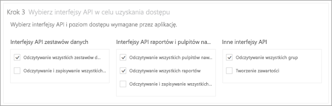
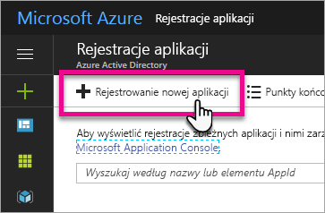
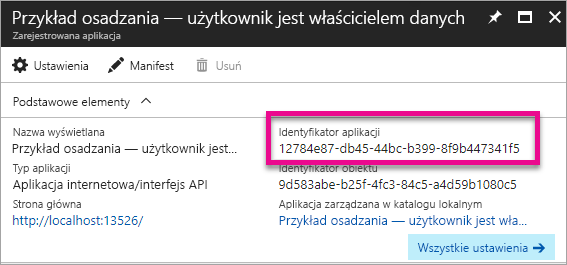
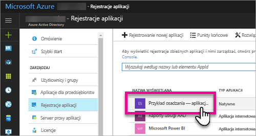
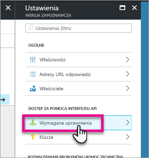
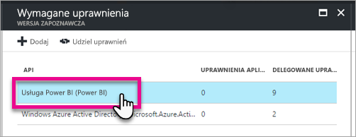
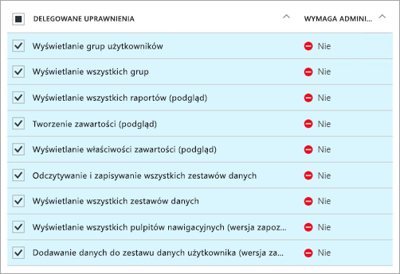
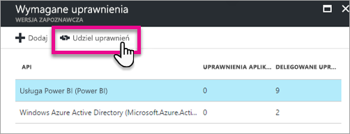

# <a name="register-an-azure-ad-app-to-embed-power-bi-content"></a>Rejestrowanie aplikacji usługi Azure AD, aby osadzić zawartość usługi Power BI
Dowiedz się, jak zarejestrować aplikację w usłudze Azure Active Directory (Azure AD), a następnie użyć jej w celu osadzenia zawartości usługi Power BI.

Aplikację można zarejestrować w usłudze Azure AD, aby zapewnić aplikacji dostęp do interfejsów API REST usługi Power BI. Dzięki temu można ustanowić tożsamość aplikacji i określić jej uprawnienia do zasobów REST usługi Power BI.

> [!IMPORTANT]
> Do zarejestrowania aplikacji usługi Power BI potrzebna jest [dzierżawa i konto użytkownika organizacyjnego usługi Azure Active Directory](create-an-azure-active-directory-tenant.md). Jeśli nie zarejestrujesz się w usłudze Power BI, korzystając z konta użytkownika z Twojej dzierżawy, rejestracja aplikacji nie zakończy się pomyślnie.

Istnieją dwa sposoby rejestrowania aplikacji. Pierwszy sposób obejmuje użycie [narzędzia do rejestrowania aplikacji usługi Power BI](https://dev.powerbi.com/apps/), a drugi polega na dokonaniu rejestracji bezpośrednio w witrynie Azure Portal. Narzędzie rejestrowania aplikacji usługi Power BI to opcja najłatwiejsza, ponieważ wystarczy wypełnić tylko kilka pól. Jeśli chcesz wprowadzić zmiany w aplikacji, użyj witryny Azure Portal.

## <a name="register-with-the-power-bi-app-registration-tool"></a>Rejestracja za pomocą narzędzia rejestrowania aplikacji usługi Power BI
Aplikację należy zarejestrować w usłudze **Azure Active Directory**, aby ustanowić dla niej tożsamość i określić uprawnienia do zasobów REST usługi Power BI. Gdy rejestrujesz aplikację (np. aplikację konsolową lub witrynę internetową), otrzymujesz identyfikator, którego aplikacja używa do identyfikowania się dla użytkowników żądających uprawnień.

Oto sposób rejestrowania aplikacji za pomocą narzędzia rejestrowania aplikacji usługi Power BI:

1. Przejdź do witryny [dev.powerbi.com/apps](https://dev.powerbi.com/apps).
2. Wybierz pozycję **Zaloguj się przy użyciu istniejącego konta**.
3. Podaj nazwę w polu **Nazwa aplikacji**.
4. Wybór w polu Typ aplikacji zależy od typu używanej aplikacji.
   
   * W przypadku aplikacji, które działają na urządzeniach klienckich, wybierz typ **Aplikacja natywna**. Typ **Aplikacja natywna** należy wybrać w przypadku osadzania zawartości dla klientów — bez względu na rodzaj aplikacji (nawet dla aplikacji internetowych).
   * W przypadku aplikacji internetowych lub internetowych interfejsów API wybierz typ **Aplikacja internetowa po stronie serwera**.

5. Wprowadź **Adres URL przekierowania** i **Adres URL strony głównej**. **Adres URL przekierowania** działa z dowolnym prawidłowym adresem URL.
   
    Pole **Adres URL strony głównej** jest dostępne tylko po wybraniu typu aplikacji **Aplikacja internetowa po stronie serwera**.
   
    W przykładach dotyczących *osadzania zawartości dla klientów* i *integrowania aplikacji internetowej pulpitu nawigacyjnego* adresem **URL przekierowania** jest `http://localhost:13526/Redirect`. W przykładzie dotyczącym raportów i kafelków adresem **URL przekierowania** jest `http://localhost:13526/`.
6. Wybierz interfejsy API dla aplikacji, która ma dostęp. Więcej informacji o uprawnieniach dostępu do usługi Power BI zawiera temat [Uprawnienia usługi Power BI](power-bi-permissions.md).
   
    
7. Wybierz przycisk **Zarejestruj aplikację**.
   
    Otrzymasz **Identyfikator klienta**, a w przypadku wybrania typu **Aplikacja internetowa po stronie serwera**, otrzymasz **Klucz tajny klienta**. **Identyfikator klienta** można później, w razie potrzeby, pobrać z witryny Azure Portal. W przypadku utraty **Klucza tajnego klienta** musisz utworzyć nowy klucz w witrynie Azure Portal.

8. Musisz przejść do platformy Azure, aby wybrać pozycję **Udziel uprawnień**.
   > [!Note]
   > Tylko administrator globalny w dzierżawie platformy Azure może wykonać tę czynność

* Przejdź do platformy Azure.
* Wyszukaj i wybierz pozycję **Rejestracje aplikacji**.
* Wybierz aplikację.
* Wybierz pozycję **Ustawienia**.
* Wybierz pozycję **Wymagane uprawnienia**.
* Wybierz pozycję **Usługa Power BI**, aby zweryfikować uprawnienia wybrane w witrynie rejestracji aplikacji.
* Wybierz pozycję **Udziel uprawnień**.

Teraz możesz używać zarejestrowanej aplikacji jako części aplikacji niestandardowej na potrzeby interakcji z usługą Power BI.

> [!IMPORTANT]
> Jeśli osadzasz zawartość dla klientów, musisz skonfigurować dodatkowe uprawnienia w witrynie Azure Portal. Więcej informacji zawiera sekcja [Stosowanie uprawnień do Twojej aplikacji](#apply-permissions-to-your-application).
> 

## <a name="register-with-the-azure-portal"></a>Rejestrowanie za pomocą witryny Azure Portal
Drugą opcją rejestracji aplikacji jest dokonanie rejestracji bezpośrednio w witrynie Azure Portal. Aby zarejestrować aplikację, wykonaj następujące kroki.

1. Zaakceptuj [Warunki interfejsu API usługi Microsoft Power BI](https://powerbi.microsoft.com/api-terms).
2. Zaloguj się w witrynie [Azure Portal](https://portal.azure.com).
3. Wybierz dzierżawę usługi Azure AD, wybierając swoje konto w prawym górnym rogu strony.
4. W okienku nawigacji po lewej stronie wybierz pozycję **Więcej usług**, wybierz pozycję **Rejestracje aplikacji** w obszarze **Bezpieczeństwo i obsługa tożsamości**, a następnie wybierz przycisk **Rejestrowanie nowej aplikacji**.
   
    
5. Postępuj zgodnie z monitami i utwórz nową aplikację.
   
   * W przypadku aplikacji internetowych podaj adres URL logowania, czyli podstawowy adres URL Twojej aplikacji, pod którym użytkownicy mogą się logować, na przykład `http://localhost:13526`.
   * W przypadku aplikacji natywnych podaj Identyfikator **URI przekierowania**, którego usługa Azure AD używa do zwracania odpowiedzi tokenu. Wprowadź wartość specyficzną dla Twojej aplikacji, na przykład `http://myapplication/Redirect`.

Więcej informacji o sposobie rejestrowania aplikacji w usłudze Azure Active Directory zawiera temat [Integrowanie aplikacji z usługą Azure Active Directory](https://docs.microsoft.com/azure/active-directory/develop/active-directory-integrating-applications)

## <a name="how-to-get-the-client-id"></a>Jak uzyskać identyfikator klienta
Gdy zarejestrujesz aplikację, otrzymasz **Identyfikator klienta**.  Za pomocą **Identyfikatora klienta** aplikacja identyfikuje się dla użytkowników, od których żąda uprawnień.

Oto jak uzyskać identyfikator klienta:

1. Zaloguj się w witrynie [Azure Portal](https://portal.azure.com).
2. Wybierz dzierżawę usługi Azure AD, wybierając swoje konto w prawym górnym rogu strony.
3. W okienku nawigacji po lewej stronie wybierz pozycję **Więcej usług** i pozycję **Rejestracje aplikacji**.
4. Wybierz aplikację, dla której chcesz uzyskać identyfikator klienta do użycia.
5. Zobaczysz **Identyfikator aplikacji**, który będzie widoczny jako identyfikator GUID. To jest identyfikator klienta dla tej aplikacji.
   
    

## <a name="apply-permissions-to-your-application-within-azure-ad"></a>Stosowanie uprawnień do Twojej aplikacji w usłudze Azure AD
> [!IMPORTANT]
> Ta sekcja dotyczy tylko aplikacji, które **osadzają zawartość dla Twojej organizacji**.
> 

Konieczne będzie włączenie dodatkowych uprawnień aplikacji, oprócz tych, które zapewnia strona rejestracji aplikacji. W tym celu można się posłużyć portalem usługi Azure AD lub zrobić to programowo.

Musisz się zalogować na *konto główne* używane do osadzania albo na konto administratora globalnego.

### <a name="using-the-azure-ad-portal"></a>Korzystanie z portalu usługi Azure AD
1. Przejdź do obszaru [Rejestracje aplikacji](https://portal.azure.com/#blade/Microsoft_AAD_IAM/ApplicationsListBlade) w witrynie Azure Portal i wybierz aplikację, której używasz do osadzania.
   
    
2. Wybierz pozycję **Wymagane uprawnienia** w obszarze **Dostęp do interfejsu API**.
   
    

3. W obszarze **Wymagane uprawnienia** wybierz pozycję **Usługa Power BI (Power BI)**.
   
    
   
   > [!NOTE]
   > Jeśli aplikacja została utworzona bezpośrednio w portalu usługi Azure AD, pozycja **Usługa Power BI (Power BI)** może być niedostępna. W takim przypadku wybierz pozycję **+ Dodaj**, a następnie pozycję **1 Wybierz interfejs API**. Na liście interfejsów API wybierz pozycję **Usługa Power BI**, a następnie pozycję **Wybierz**.  Jeśli pozycja **Usługa Power BI (Power BI)** jest niedostępna w obszarze **+ Dodaj**, zarejestruj co najmniej jednego użytkownika w usłudze Power BI.
   > 
   > 
4. Wybierz wszystkie uprawnienia w obszarze **Delegowane uprawnienia**. W celu zapisania wyborów musisz je zaznaczać pojedynczo. Po zakończeniu wybierz pozycję **Zapisz**.
   
    
5. W obszarze **Wymagane uprawnienia** wybierz pozycję **Udziel uprawnień**.
   
    Wykonanie akcji **Udziel uprawnień** jest konieczne, aby usługa Azure AD nie wysyłała do *konta głównego* monitów o wyrażenie zgody. Jeśli konto, z którego wykonywana jest ta akcja, jest kontem administratora globalnego, udzielisz uprawnień do tej aplikacji wszystkim użytkownikom w swojej organizacji. Jeśli jest to *konto główne*, które nie ma uprawnień administratora globalnego, udzielisz uprawnień do tej aplikacji tylko *kontu głównemu*.
   
    

### <a name="applying-permissions-programmatically"></a>Stosowanie uprawnień programowo
1. Musisz uzyskać jednostki usług (użytkowników) w swojej dzierżawie. Więcej informacji o tym, jak to zrobić, zawiera temat [Get servicePrincipal](https://developer.microsoft.com/en-us/graph/docs/api-reference/beta/api/serviceprincipal_get).
   
    Interfejs API *Get servicePrincipal* możesz wywołać bez podawania parametru {id}, dzięki czemu uzyskasz wszystkie jednostki usług w danej dzierżawie.
2. Znajdź jednostkę usługi o właściwości **appId** równej identyfikatorowi klienta Twojej aplikacji.
3. Utwórz nowy plan usługi, jeśli taki plan nie istnieje jeszcze dla Twojej aplikacji.
   
    ```
    Post https://graph.microsoft.com/beta/servicePrincipals
    Authorization: Bearer ey..qw
    Content-Type: application/json
    {
    "accountEnabled" : true,
    "appId" : "{App_Client_ID}",
    "displayName" : "{App_DisplayName}"
    }
    ```
4. Udzielanie uprawnień do aplikacji interfejsowi API usługi Power BI
   
   Jeśli używasz istniejącej dzierżawy i nie interesuje Cię udzielanie uprawnień w imieniu wszystkich użytkowników dzierżawy, możesz udzielić uprawnień konkretnemu użytkownikowi, zmieniając wartość właściwości **contentType** na **Principal**.

   Dla właściwości **consentType** można podać wartość **AllPrincipals** lub **Principal**.

   * Wartość **AllPrincipals** może być używana tylko przez administratora dzierżawy w celu udzielenia uprawnień w imieniu wszystkich użytkowników w dzierżawie.
   * Wartość **Principal** służy do udzielania uprawnień w imieniu konkretnego użytkownika. W takim przypadku należy dodać dodatkowe właściwości do treści żądania — *principalId={User_ObjectId}*.
    
     Wykonanie akcji *Udziel uprawnień* jest konieczne, aby usługa Azure AD nie wysyłała do konta głównego monitów o wyrażenie zgody, co nie jest możliwe w przypadku logowania nieinterakcyjnego.
   
     ```json
     Post https://graph.microsoft.com/beta/OAuth2PermissionGrants
     Authorization: Bearer ey..qw
     Content-Type: application/json
     { 
     "clientId":"{Service_Plan_ID}",
     "consentType":"AllPrincipals",
     "resourceId":"c78a3685-1ce7-52cd-95f7-dc5aea8ec98e",
     "scope":"Dataset.ReadWrite.All Dashboard.Read.All Report.Read.All Group.Read Group.Read.All Content.Create Metadata.View_Any Dataset.Read.All Data.Alter_Any",
     "expiryTime":"2018-03-29T14:35:32.4943409+03:00",
     "startTime":"2017-03-29T14:35:32.4933413+03:00"
     }
     ```
    Wartość **resourceId** *c78a3685-1ce7-52cd-95f7-dc5aea8ec98e* nie jest uniwersalna, lecz zależna od dzierżawy. Jest to wartość objectId aplikacji „Usługa Power BI” w dzierżawie usługi AAD.

    Użytkownik może szybko uzyskać tę wartość w witrynie Azure Portal:
    1. https://portal.azure.com/#blade/Microsoft_AAD_IAM/StartboardApplicationsMenuBlade/AllApps
    2. należy wyszukać ciąg „Usługa Power BI” w polu wyszukiwania

5. Udzielanie uprawnień do aplikacji usłudze Azure Active Directory (AAD)
   
   Dla właściwości **consentType** można podać wartość **AllPrincipals** lub **Principal**.

   * Wartość **AllPrincipals** może być używana tylko przez administratora dzierżawy w celu udzielenia uprawnień w imieniu wszystkich użytkowników w dzierżawie.
   * Wartość **Principal** służy do udzielania uprawnień w imieniu konkretnego użytkownika. W takim przypadku należy dodać dodatkowe właściwości do treści żądania — *principalId={User_ObjectId}*.
    
   Wykonanie akcji *Udziel uprawnień* jest konieczne, aby usługa Azure AD nie wysyłała do konta głównego monitów o wyrażenie zgody, co nie jest możliwe w przypadku logowania nieinterakcyjnego.

   ```json
   Post https://graph.microsoft.com/beta/OAuth2PermissionGrants
   Authorization: Bearer ey..qw
   Content-Type: application/json
   { 
   "clientId":"{Service_Plan_ID}",
   "consentType":"AllPrincipals",
   "resourceId":"61e57743-d5cf-41ba-bd1a-2b381390a3f1",
   "scope":"User.Read Directory.AccessAsUser.All",
   "expiryTime":"2018-03-29T14:35:32.4943409+03:00",
   "startTime":"2017-03-29T14:35:32.4933413+03:00"
   }
   ```

## <a name="next-steps"></a>Następne kroki
Po zarejestrowaniu aplikacji w usłudze Azure AD musisz uwierzytelnić użytkowników w swojej aplikacji. Aby dowiedzieć się więcej, zapoznaj się z tematem [Uwierzytelnianie użytkowników i uzyskiwanie tokenu dostępu usługi Azure AD dla aplikacji usługi Power BI](get-azuread-access-token.md).

Masz więcej pytań? [Zadaj pytanie społeczności usługi Power BI](http://community.powerbi.com/)
