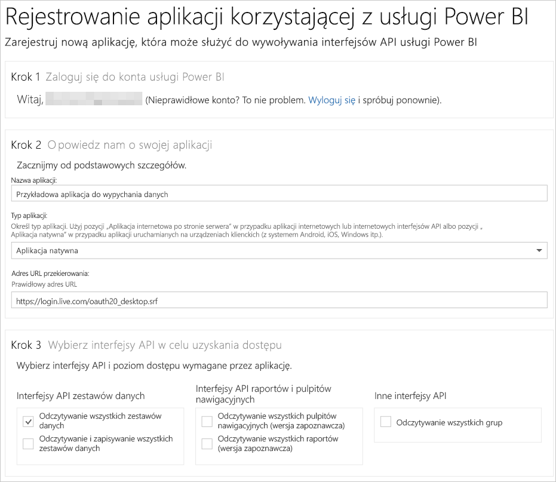

# Krok 1. Rejestrowanie aplikacji w usłudze Azure AD
Ten artykuł jest częścią przewodnika krok po kroku dotyczącego [wypychania danych do zestawu danych](walkthrough-push-data.md).

Pierwszym krokiem wypychania danych do zestawu danych usługi Power BI jest zarejestrowanie aplikacji w usłudze Azure AD. Ten krok należy wykonać jako pierwszy, aby uzyskać **Identyfikator klienta** identyfikujący aplikację w usłudze Azure AD. Bez **identyfikatora klienta** usługa Azure AD nie będzie mogła uwierzytelnić aplikacji.

> **UWAGA**: Przed zarejestrowaniem aplikacji w usłudze Power BI musisz [utworzyć konto w usłudze Power BI](create-an-azure-active-directory-tenant.md).
> 
> 

Poniżej przedstawiono kroki, które należy wykonać, aby zarejestrować aplikację w usłudze Azure AD.

## Rejestrowanie aplikacji w usłudze Azure AD
1. Przejdź do witryny dev.powerbi.com/apps.
2. Kliknij przycisk **Zaloguj się przy użyciu istniejącego konta** i zaloguj się na swoim koncie usługi Power BI.
3. W polu **Nazwa aplikacji** wprowadź nazwę, na przykład „Przykładowa aplikacja do wypychania danych”.
4. W polu **Typ aplikacji** wybierz pozycję **Aplikacja natywna**.
5. Wprowadź **adres URL przekierowania**, taki jak **https://login.live.com/oauth20_desktop.srf**. W przypadku **natywnej aplikacji klienckiej** identyfikator URI przekierowania udostępnia usłudze **Azure AD** więcej informacji na temat konkretnej aplikacji, która będzie w tej usłudze uwierzytelniana. Standardowy identyfikator URI aplikacji klienta to https://login.live.com/oauth20_desktop.srf.
6. W kroku **Wybór interfejsów API na potrzeby uzyskiwania dostępu** wybierz pozycję **Odczytuj i zapisuj wszystkie zestawy danych**. Aby uzyskać informacje o wszystkich uprawnieniach aplikacji usługi Power BI, zobacz [Uprawnienia usługi Power BI](power-bi-permissions.md).
7. Kliknij przycisk **Rejestracja aplikacji** i zapisz wygenerowany **identyfikator klienta**. **Identyfikator klienta** identyfikuje aplikację w usłudze Azure AD.

Poniżej przedstawiono, jak powinna wyglądać strona **Rejestrowanie aplikacji na potrzeby usługi Power BI**:

W następnych krokach przedstawiono sposób [uzyskiwania tokenu dostępu do uwierzytelniania](walkthrough-push-data-get-token.md).

[Następny krok >](walkthrough-push-data-get-token.md)

## Następne kroki
[Tworzenie konta w usłudze Power BI](create-an-azure-active-directory-tenant.md)  
[Uzyskiwanie tokenu dostępu do uwierzytelniania](walkthrough-push-data-get-token.md)  
[Przewodnik: Wypychanie danych do zestawu danych](walkthrough-push-data.md)  
[Rejestrowanie aplikacji](register-app.md)  
[Omówienie interfejsu API REST usługi Power BI](overview-of-power-bi-rest-api.md)  

Masz więcej pytań? [Zadaj pytanie społeczności usługi Power BI](http://community.powerbi.com/)

