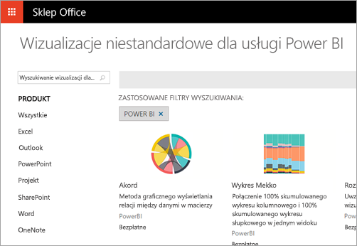

# Co deweloperzy mogą robić z usługą Power BI?
Usługa Power BI oferuje szeroką gamę opcji dla deweloperów. Obejmuje to różne możliwości: od osadzania po wizualizacje niestandardowe i przesyłanie strumieniowe zestawów danych.

## Osadzanie
Usługi Power BI i Power BI Embedded na platformie Azure są dostarczane razem, aby zapewnić pojedynczy interfejs API do osadzania pulpitów nawigacyjnych i raportów. Oznacza to wspólne środowisko interfejsów API, spójny zestaw funkcji oraz dostęp do najnowszych elementów usługi Power BI — takich jak pulpity nawigacyjne, bramy i obszary robocze aplikacji — podczas osadzania zawartości. W celu uzyskania szczegółowych informacji zobacz [Osadzanie przy użyciu usługi Power BI](embedding.md).

## Wizualizacje niestandardowe
Wizualizacje niestandardowe umożliwiają tworzenie własnych wizualizacji do użytku w raportach usługi Power BI. Wizualizacje niestandardowe są pisane w języku TypeScript, który jest nadzbiorem języka JavaScript obsługującym niektóre funkcje zaawansowane oraz wczesny dostęp do funkcji ES6/ES7. Style wizualizacji są obsługiwane za pomocą kaskadowych arkuszy stylów (CSS). Dla wygody używany jest kompilator wstępny języka Less, obsługujący niektóre funkcje zaawansowane, takie jak zagnieżdżanie, zmienne, domieszki, warunki, pętle itp. Jeśli nie chcesz używać żadnych z tych funkcji, możesz zapisać w pliku języka Less zwykły kod CSS.

Aby uzyskać więcej informacji na temat sposobu projektowania i publikowania wizualizacji niestandardowej, zobacz [Publikowanie wizualizacji niestandardowych w Sklepie Office](office-store.md).

## Wypychanie danych do usługi Power BI
Za pomocą interfejsu API usługi Power BI możesz wypychać dane do zestawu danych. Umożliwia to dodanie wiersza do tabeli w zestawie danych. Nowe dane mogą wówczas zostać odzwierciedlone na kafelkach na pulpicie nawigacyjnym i w wizualizacjach w raporcie.

Aby uzyskać więcej informacji, zobacz [Wypychanie danych do pulpitu nawigacyjnego](walkthrough-push-data.md)

## Następne kroki
[Osadzanie przy użyciu usługi Power BI](embedding.md)  
[Jak migrować zawartość kolekcji obszarów roboczych usługi Power BI Embedded do usługi Power BI](migrate-from-powerbi-embedded.md)  
[Repozytorium Git interfejsu API języka JavaScript](https://github.com/Microsoft/PowerBI-JavaScript)  
[Repozytorium Git języka C# usługi Power BI](https://github.com/Microsoft/PowerBI-CSharp)  
[Publikowanie wizualizacji niestandardowych w Sklepie Office](office-store.md)  
[Repozytorium Git wizualizacji usługi Power BI](https://github.com/Microsoft/PowerBI-visuals)  
[Przykład osadzania przy użyciu języka JavaScript](https://microsoft.github.io/PowerBI-JavaScript/demo/)  
[Interfejs API usługi Power BI w witrynie Apiary](http://docs.powerbi.apiary.io/#)  
[Oficjalny dokument na temat usługi Power BI Premium](https://aka.ms/pbipremiumwhitepaper)  
Masz więcej pytań? [Odwiedź społeczność usługi Power BI](http://community.powerbi.com/)

