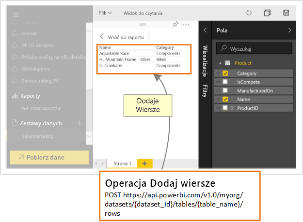

# Co deweloperzy mogą robić z usługą Power BI?

Deweloperzy mają różne opcje uwzględniania zawartości usługi Power BI w aplikacjach. Jako deweloper możesz korzystać z tych opcji, w tym **osadzania przy użyciu usługi Power BI**, **wizualizacji niestandardowych** i **wypychania danych do usługi Power BI**.

## Osadzanie zawartości usługi Power BI

Usługa Power BI (SaaS) i usługa Power BI Embedded na platformie Azure (PaaS) mają interfejsy API umożliwiające osadzanie pulpitów nawigacyjnych i raportów. Oznacza to możliwość uzyskiwania dostępu do najnowszych funkcji usługi Power BI — takich jak pulpity nawigacyjne, bramy i obszary robocze aplikacji — podczas osadzania zawartości.

Możesz użyć [narzędzia do konfigurowania osadzania](https://aka.ms/embedsetup), aby szybko rozpocząć pracę i pobrać przykładową aplikację.

Wybierz rozwiązanie, które jest odpowiednie dla Ciebie:

* [Osadzanie dla swoich klientów](embedding.md#embedding-for-your-customers) zapewnia możliwość osadzenia pulpitów nawigacyjnych i raportów u użytkowników, którzy nie mają konta w usłudze Power BI. Uruchom rozwiązanie [osadzania dla klientów](https://aka.ms/embedsetup/AppOwnsData).

* [Osadzanie dla swojej organizacji](embedding.md#embedding-for-your-organization) umożliwia rozszerzanie usługi Power BI. Uruchom rozwiązanie [osadzania dla organizacji](https://aka.ms/embedsetup/UserOwnsData).

Aby dowiedzieć się więcej na temat osadzania w usłudze Power BI, zobacz [Osadzanie przy użyciu usługi Power BI](embedding.md).

## Tworzenie wizualizacji niestandardowych

Wizualizacje niestandardowe w usłudze Power BI służą do tworzenia unikatowego typu wizualizacji dostosowanych do potrzeb użytkownika lub jego firmy. Często te wizualizacje niestandardowe są tworzone przez deweloperów. Są one kompilowane, gdy bogaty zestaw wizualizacji dostępny w usłudze Power BI nie spełnia Twoich potrzeb.

Wizualizacje niestandardowe umożliwiają tworzenie własnych wizualizacji do użycia w raportach usługi Power BI. Wizualizacje niestandardowe są pisane w języku TypeScript będącym nadzbiorem języka JavaScript. Język TypeScript obsługuje niektóre zaawansowane funkcje i wczesny dostęp do funkcji ES6/ES7. Style wizualizacji są obsługiwane za pomocą kaskadowych arkuszy stylów (CSS). Dla wygody używany jest kompilator wstępny języka Less, obsługujący niektóre funkcje zaawansowane, takie jak zagnieżdżanie, zmienne, warunki, pętle, oraz inne funkcje. Jeśli nie chcesz używać żadnych z tych funkcji, możesz zapisać w pliku języka Less zwykły kod CSS.

Aby uzyskać więcej informacji na temat projektowania wizualizacji niestandardowych, zobacz [Tworzenie niestandardowych wizualizacji przy użyciu narzędzi deweloperskich](../service-custom-visuals-getting-started-with-developer-tools.md).

## Korzystanie z automatyzacji interfejsu API

W usłudze Power BI są wyświetlane interakcyjne pulpity nawigacyjne, które można tworzyć i aktualizować z wielu różnych źródeł danych w czasie rzeczywistym. Używając dowolnego języka programowania obsługującego wywołania REST, można tworzyć aplikacje integrujące się z pulpitem nawigacyjnym usługi Power BI w czasie rzeczywistym. Można również integrować kafelki i raporty usługi Power BI w aplikacje.

Deweloperzy mogą również tworzyć własne wizualizacje danych, które mogą być używane w interakcyjnych raportach i pulpitach nawigacyjnych.

Aby zapoznać się z niektórymi czynnościami, które można wykonywać za pomocą interfejsów API usługi Power BI, zobacz [What can developer do with the Power BI APIs?](overview-of-power-bi-rest-api.md) (Co deweloper może zrobić przy użyciu interfejsów API usługi Power BI?).

## Następne kroki

[Osadzanie przy użyciu usługi Power BI](embedding.md)  

[Tworzenie wizualizacji niestandardowej w usłudze Power BI](https://microsoft.github.io/PowerBI-visuals/docs/step-by-step-lab/developing-a-power-bi-custom-visual/)

[Co deweloperzy mogą robić z interfejsem API usługi Power BI?](overview-of-power-bi-rest-api.md)

[Centrum deweloperów usługi Power BI](https://powerbi.microsoft.com/developers/)