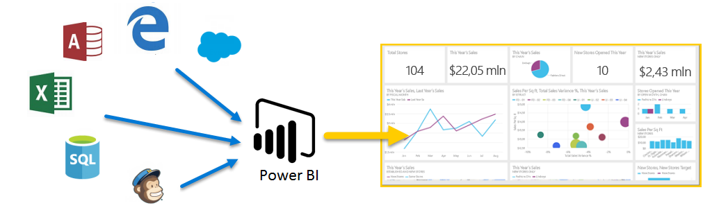
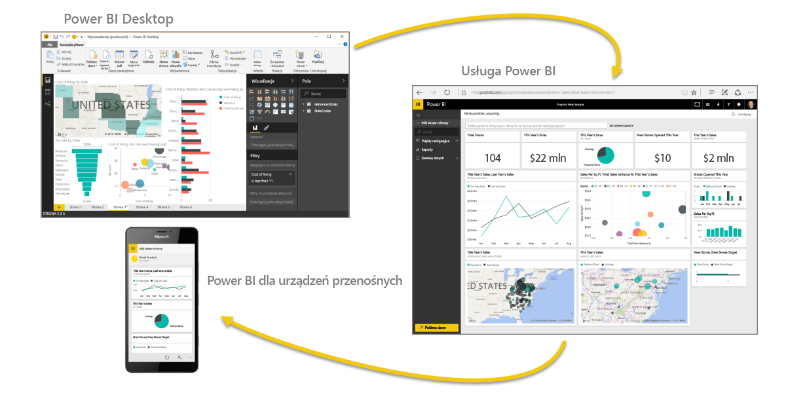

Witamy w przewodniku **Nauka krok po kroku** dla usługi Power BI. Ten realizowany samodzielnie kurs online wyjaśnia działanie usługi Power BI, przedstawiając po kolei poszczególne tematy, dzięki czemu możesz zdobywać wiedzę od podstaw.

Kurs został zaprojektowany w taki sposób, aby przedstawiać informacje w zrozumiałych fragmentach oraz w logicznej kolejności, co pomoże w poznaniu koncepcji, szczegółów i przykładów. Zawiera on też wiele wizualizacji i wideo ułatwiających naukę.

Kurs **Nauka krok po kroku** zawiera wiele **sekcji**, a każda z nich zawiera wiele **tematów**. Po kilku pierwszych tematach w sekcji **Wprowadzenie** niemal każdy temat zawiera wideo omawiające poznawane zagadnienia. Zawartość poniżej wideo to bardziej szczegółowe objaśnienia zagadnienia, które umożliwiają poznawanie i naukę we własnym tempie.

Jeśli jesteś **początkującym** użytkownikiem usługi Power BI, ten kurs umożliwi Ci rozpoczęcie pracy, a jeśli jesteś **weteranem** usługi Power BI, ten kurs połączy pojęcia i wypełni luki. Mamy nadzieję, że kurs Ci się spodoba, i nie możemy się doczekać możliwości dodania dalszej zawartości w przyszłości.

## Co to jest usługa Power BI?
Usługa **Power BI** to zbiór usług oprogramowania, aplikacji i łączników, które działają razem, aby przekształcić niepowiązane źródła danych w spójne, atrakcyjne wizualnie i interaktywne analizy. Niezależnie od tego, czy dane to prosty arkusz kalkulacyjny programu Excel, czy też kolekcja chmurowych i lokalnych hybrydowych hurtowni danych, usługa **Power BI** umożliwia łatwe łączenie ze źródłami danych, wizualizowanie (lub odnajdywanie) ważnych informacji i udostępnianie ich wszystkim wybranym osobom.

Usługa **Power BI** może być szybka i prosta — pozwalając na szybki wgląd w szczegółowe dane pochodzące z arkusza kalkulacyjnego programu Excel lub lokalnej bazy danych. Lecz usługa **Power BI** jest także niezawodna i gotowa do pracy w przedsiębiorstwie obejmującej intensywne modelowanie i analizy w czasie rzeczywistym, a także niestandardowe programowanie. Dlatego może być osobistym narzędziem do raportowania i wizualizacji, a także służyć jako aparat obsługujący analizy i proces podejmowania decyzji na potrzeby grupy projektów, działów lub całych firm.

## Elementy usługi Power BI
Usługa Power BI składa się z aplikacji klasycznej systemu Windows o nazwie **Power BI Desktop**, usługi online typu SaaS (*oprogramowanie jako usługa*) o nazwie **Power BI** oraz **aplikacji** mobilnych Power BI dostępnych dla telefonów i tabletów z systemem Windows, a także dla urządzeń z systemami iOS i Android.

Te trzy elementy — **aplikacja klasyczna**, **usługa** i **aplikacje mobilne** — zaprojektowano tak, aby umożliwić użytkownikom tworzenie, udostępnianie i używanie analiz biznesowych w sposób najbardziej efektywny dla nich lub ról, które pełnią.

## Jak usługa Power BI dopasowuje się do Twojej roli
Sposób używania usługi Power BI może zależeć od Twojej roli w projekcie lub zespole. A inne osoby, w innych rolach, mogą używać usługi Power BI inaczej i także skutecznie.

Na przykład możesz używać przede wszystkim **usługi Power BI**, lecz Twój współpracownik zagłębiony w liczbach i raportach biznesowych może intensywnie korzystać z programu **Power BI Desktop** (i publikować z niego raporty do usługi Power BI, z którymi następnie Ty się zapoznajesz). Inny współpracownik, w dziale sprzedaży, może używać głównie aplikacji Power BI dla telefonu do monitorowania postępu realizacji planów sprzedaży i analizowania nowych potencjalnych klientów.

Możesz także korzystać z każdego z elementów usługi **Power BI** w innym czasie, w zależności od celu pracy lub roli w danym projekcie lub przedsięwzięciu.

Być może przeglądasz zapasy i postęp produkcji za pomocą pulpitu nawigacyjnego w czasie rzeczywistym w usłudze, a także używasz programu **Power BI Desktop** do tworzenia raportów dotyczących statystyki zaangażowania klientów dla zespołu. Sposób korzystania z usługi Power BI może zależeć od tego, która funkcja lub usługa środowiska Power BI jest najlepsza w danej sytuacji, lecz wszystkie one są dostępne dla Ciebie — i dlatego to środowisko jest takie elastyczne i atrakcyjne.

Bardziej szczegółowo omawiamy te trzy elementy — **program klasyczny**, **usługę** i aplikacje **mobilne** — nieco później w tym kursie **Nauka krok po kroku**. W ramach kolejnych artykułów utworzymy także raporty w programie Power BI Desktop, udostępnimy je w usłudze i przeanalizujemy na urządzeniu mobilnym.

## Przepływ pracy w usłudze Power BI
Typowy przepływ pracy w usłudze Power BI rozpoczyna się od programu **Power BI Desktop**, w którym tworzy się raport. Następnie raport jest publikowany do **usługi** Power BI i udostępniany, tak aby użytkownicy aplikacji **Power BI Mobile** mogli skorzystać z informacji.

Nie zawsze odbywa się to w ten sposób, lecz użyjemy tego przepływu, aby ułatwić zapoznanie się z różnymi częściami usługi Power BI i sposobem, w jaki wzajemnie się uzupełniają.

Teraz, gdy już przedstawiliśmy zarys tego kursu, usługi Power BI i jej trzech głównych elementów, spójrzmy na to, jak wygląda korzystanie z usługi **Power BI**.

