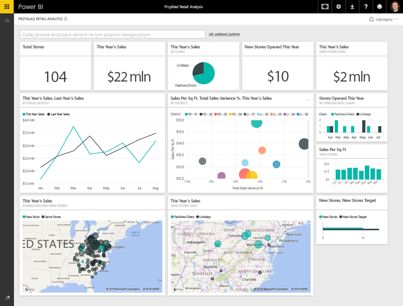
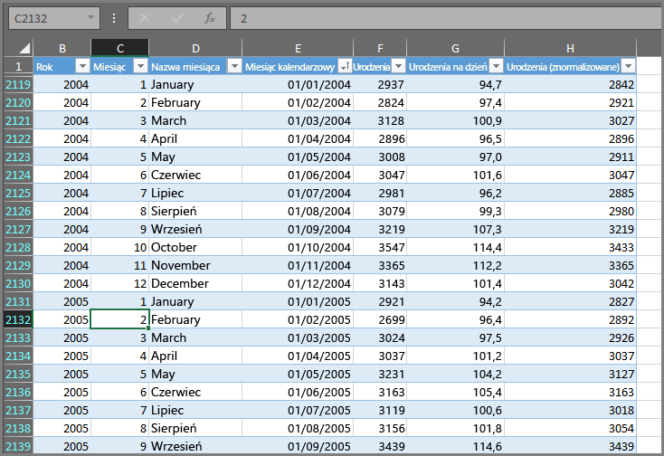
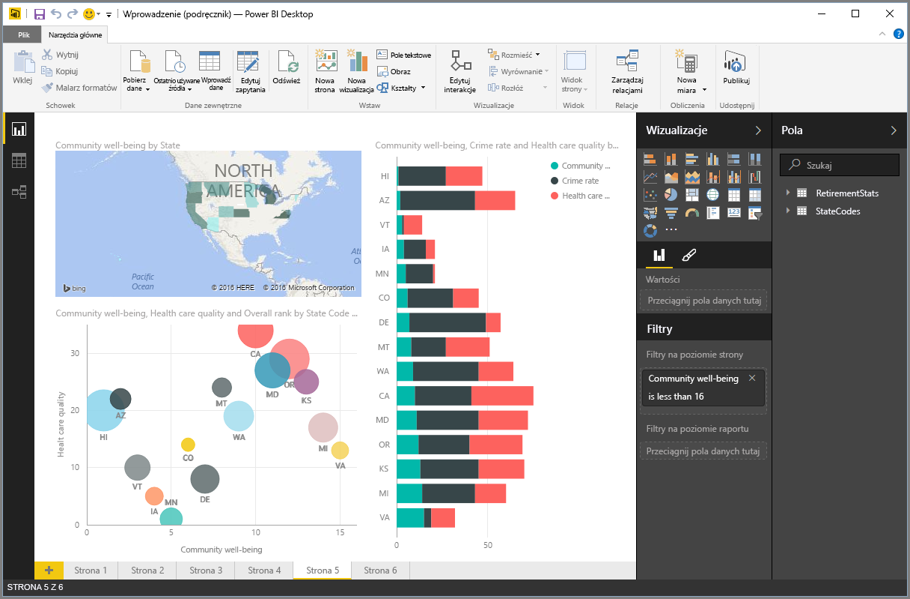
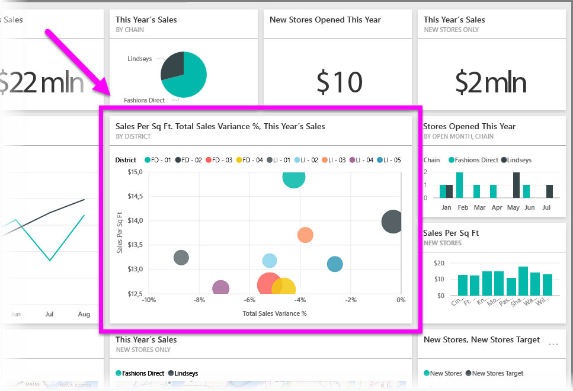

Wszystko, co można zrobić w usłudze Power BI, sprowadza się do kilku podstawowych **bloków konstrukcyjnych**. Po zrozumieniu sposobu działania tych bloków konstrukcyjnych możesz poszerzyć swoją wiedzę o nich i rozpocząć tworzenie rozbudowanych i złożonych raportów. W końcu nawet pozornie złożone obiekty są tworzone z podstawowych bloków konstrukcyjnych — budynki są tworzone z drewna, stali, betonu i szkła. Samochody składają się z metalu, tkaniny i gumy. Oczywiście budynki i samochody także mogą być proste lub rozbudowane — w zależności od układu tych podstawowych bloków konstrukcyjnych.

Spójrzmy na podstawowe bloki konstrukcyjne, omówmy pewne proste rzeczy, które można z nich zbudować, a następnie rzućmy okiem także na to, jak złożone rzeczy można tworzyć.

Podstawowe bloki konstrukcyjne w usłudze Power BI to:

* Wizualizacje
* Zestawy danych
* Raporty
* Pulpity nawigacyjne
* Kafelki

## Wizualizacje
**Wizualizacja** (nazywana również czasem **elementem wizualnym**) to wizualna reprezentacja danych, taka jak wykres, graf, mapa oznaczona kolorami lub inne ciekawe rzeczy, które można utworzyć, aby wizualnie przedstawić dane. Usługa Power BI udostępnia szeroką gamę różnych typów wizualizacji i cały czas są dodawane kolejne. Na poniższej ilustracji przedstawiono kolekcję różnych wizualizacji, które zostały utworzone w usłudze Power BI.

Wizualizacje mogą być proste — takie jak pojedyncza liczba oznaczająca coś ważnego — lub złożone — takie jak mapa gradientów oznaczona kolorami, która przedstawia opinie głosujących na temat pewnego społecznego problemu lub zagadnienia. Celem wizualizacji jest przedstawienie danych w sposób, który zawiera także kontekst i analizy, które byłyby trudne do określenia na podstawie prostej tabeli liczb lub tekstu.

## Zestawy danych
**Zestaw danych** to kolekcja danych, której usługa Power BI używa do tworzenia wizualizacji.

Może to być prosty zestaw danych oparty na pojedynczej tabeli ze skoroszytu programu Excel podobny do przedstawionego na poniższej ilustracji.

**Zestawy danych** mogą być też kombinacją wielu różnych źródeł, które można filtrować i łączyć w celu udostępnienia unikatowej kolekcji danych (zestawu danych) do użycia w usłudze Power BI.

Na przykład możesz utworzyć zestaw danych z trzech różnych pól bazy danych, jednej tabeli z witryny internetowej i wyników online kampanii marketingowej prowadzonej za pomocą poczty e-mail. Ta unikatowa kombinacja jest nadal uważana za pojedynczy **zestaw danych**, nawet jeśli została złożona z wielu różnych źródeł.

Filtrowanie danych przed wprowadzeniem ich do usługi Power BI pozwala skoncentrować się na danych, które są ważne. Na przykład możesz filtrować bazę danych kontaktowych, tak aby dołączyć do zestawu danych tylko tych klientów, którzy otrzymali wiadomości e-mail w ramach kampanii marketingowej. Następnie możesz utworzyć wizualizacje na podstawie tego podzestawu (przefiltrowanej kolekcji) zawierającego klientów objętych kampanią. Filtrowanie pomaga skoncentrować się na danych i pracy.

Ważną i przydatną częścią usługi Power BI jest wiele dołączonych **łączników** danych. Niezależnie od tego, czy Twoje dane znajdują się w programie Excel, bazie danych SQL, na platformie Azure lub w programie Oracle, czy też w usługach, takich jak Facebook, Salesforce lub MailChimp, usługa Power BI udostępnia wbudowane łączniki, które pozwalają na łatwe łączenie z tymi danymi, filtrowanie ich w razie potrzeby i umieszczanie w zestawie danych.

Gdy zestaw danych jest już gotowy, możesz rozpocząć tworzenie wizualizacji wyświetlających różne części tego zestawu danych za pomocą różnych metod i analizowanie za pomocą tego, co widzisz. W tym miejscu pojawiają się raporty.

## Raporty
W usłudze Power BI **raport** to kolekcja wizualizacji, które są wyświetlane razem na jednej lub wielu stronach. Tak jak każdy inny raport, utworzony jako prezentacja handlowa lub napisany w ramach pracy szkolnej, w usłudze Power BI **raport** to kolekcja elementów, które są ze sobą powiązane. Poniższy obraz przedstawia **raport** w programie Power BI Desktop — w tym przypadku piątą stronę w sześciostronicowym raporcie. Możesz także utworzyć raporty w usłudze Power BI.

Raporty umożliwiają tworzenie wielu wizualizacji na wielu różnych stronach w razie potrzeby, a także rozmieszczanie ich w sposób, który najlepiej przekazuje treści.

Raport może dotyczyć sprzedaży kwartalnej, wzrostu produkcji w określonym segmencie lub wzorców migracji niedźwiedzi polarnych. Niezależnie od tematu, raporty umożliwiają zbieranie i organizowanie wizualizacji na jednej lub wielu stronach.

## Pulpity nawigacyjne
Jeśli wszystko jest gotowe do udostępnienia pojedynczej strony raportu lub kolekcji wizualizacji, należy utworzyć **pulpit nawigacyjny**. Podobnie jak deska rozdzielcza w samochodzie, **pulpit nawigacyjny** w usłudze Power BI to kolekcja wizualizacji z jednej strony, którą można udostępnić innym. Często wybrana grupa wizualizacji daje szybki wgląd w dane lub sytuację, którą chcesz przedstawić.

Pulpit nawigacyjny musi mieścić się na jednej stronie często nazywanej kanwą (kanwa to puste tło w programie Power BI Desktop lub usłudze, gdzie umieszcza się wizualizacje). Traktuj kanwę tak jak artysta lub malarz — jako obszar roboczy, gdzie można tworzyć, łączyć i przerabiać interesujące i atrakcyjne wizualizacje.
Pulpity nawigacyjne możesz udostępniać innym użytkownikom lub grupom, które mogą wtedy korzystać z nich za pomocą usługi Power BI lub na urządzeniu mobilnym.

## Kafelki
W usłudze Power BI **kafelek** to pojedyncza wizualizacja w raporcie lub na pulpicie nawigacyjnym. Jest to prostokątne pole, które zawiera daną wizualizację. Na poniższej ilustracji widzisz jeden kafelek (wyróżniony za pomocą jasnego pola) otoczony przez inne kafelki.

Podczas *tworzenia* raportu lub pulpitu nawigacyjnego w usłudze Power BI możesz dowolnie przenosić lub zmieniać układ kafelków, aby zaprezentować informacje. Kafelek możesz dowolnie powiększyć, zmienić jego szerokość lub wysokość i przysunąć go do innych kafelków.

Podczas *wyświetlania* lub *używania* pulpitu nawigacyjnego lub raportu — jeśli nie należy do Ciebie ani nie jesteś jego twórcą, co oznacza, że został dla Ciebie udostępniony — możesz korzystać z niego, ale nie możesz zmieniać rozmiaru ani układu kafelków.

## Wszystko w jednym miejscu
To są podstawowe informacje o usłudze Power BI i jej blokach konstrukcyjnych. Poświęćmy chwilę na przegląd.

Usługa Power BI to kolekcja usług, aplikacji, i łączników, które umożliwiają łączenie z danymi — gdziekolwiek się znajdują — filtrowanie ich w razie potrzeby, a następnie wprowadzanie do usługi Power BI, gdzie możesz tworzyć atrakcyjne wizualizacje i udostępniać je innym użytkownikom.  

Teraz, po zapoznaniu się z podstawowymi blokami konstrukcyjnymi usługi Power BI, jest oczywiste, że możesz tworzyć zestawy danych, które mają znaczenie *dla Ciebie*, i wizualnie atrakcyjne raporty, które przekazują informacje. Informacje prezentowane za pomocą usługi Power BI nie muszą być złożone ani skomplikowane, aby być atrakcyjne.

Dla niektórych osób użycie pojedynczej tabeli programu Excel w zestawie danych, a następnie udostępnienie pulpitu nawigacyjnego zespołowi będzie niezwykle wartościową metodą korzystania z usługi Power BI.

Dla innych użycie tabel usługi Azure SQL Data Warehouse w czasie rzeczywistym połączonych z innymi bazami i źródłem w czasie rzeczywistym, a następnie przefiltrowanie danych w czasie rzeczywistym w celu utworzenia zestawu danych monitorującego postęp produkcji minuta po minucie będzie wartością, której szukają w usłudze Power BI.

W obu tych przypadkach proces będzie taki sam: utworzenie zestawów danych, zbudowanie atrakcyjnych wizualizacji i udostępnienie ich innym. Także wynik będzie w obu przypadkach taki sam (odpowiednio dla zastosowania): ujarzmienie ciągle rozszerzającego się zasobu danych i przekształcenie go w analizy, które są podstawą działań.

Niezależnie do tego, czy analizy danych wymagają prostych, czy złożonych zestawów danych, usługa Power BI umożliwia szybkie rozpoczęcie pracy i rozwija się wraz z Twoimi potrzebami do takiej złożoności, jakiej wymaga świat Twoich danych. A ponieważ usługa Power BI jest produktem firmy Microsoft, możesz liczyć na jej niezawodność, rozszerzalność, przyjazność dla pakietu Office i gotowość do zastosowania w przedsiębiorstwie.

Teraz zobaczmy, jak to działa. Zaczniemy do szybkiego rzutu okiem na usługę Power BI.

