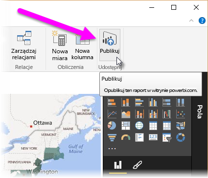

W tym temacie przyglądamy się bliżej temu, jak współpracują dwie pierwsze części usługi Power BI:

* Tworzenie raportu w programie **Power BI Desktop**
* Publikowanie tego raportu w **usłudze Power BI**

Rozpoczniemy pracę w programie Power BI Desktop, wybierając pozycję **Pobierz dane**. Zostanie wyświetlona kolekcja źródeł danych, umożliwiając wybranie źródła danych. Poniższy obraz przedstawia wybieranie strony internetowej jako źródła. W powyższym wideo Will wybrał skoroszyt programu **Excel**.

Niezależnie od wybranego źródła danych, usługa Power BI łączy się z tym źródłem danych i wyświetla dane, które są w nim dostępne. Innym przykładem jest poniższy obraz, który przedstawia stronę internetową z analizą różnych stanów i ciekawymi statystykami dotyczącymi emerytury.

W widoku **Raport** programu Power BI Desktop możesz rozpocząć tworzenie raportów.

Widok **Raport** ma pięć głównych obszarów:

1. Wstążka, która wyświetla typowe zadania związane z raportami i wizualizacjami.
2. Widok **Raport** (czyli kanwa), w którym tworzy się i rozmieszcza wizualizacje.
3. Obszar karty **Strony** u dołu, który umożliwia wybranie lub dodanie strony raportu.
4. Okienko **Wizualizacje**, w którym można zmieniać wizualizacje, dostosowywać kolory lub osie, stosować filtry, przeciągać pola i wykonywać inne czynności.
5. Okienko **Pola**, w którym można przeciągać elementy zapytania i filtry do widoku **Raport** lub obszaru **Filtry** okienka **Wizualizacje**.

Okienka **Wizualizacje** i **Pola** można zwinąć, wybierając małą strzałkę wzdłuż krawędzi, co daje więcej miejsca w widoku **Raport** na tworzenie atrakcyjnych wizualizacji. Podczas modyfikowania wizualizacji te strzałki będą wskazywać w górę lub w dół, co oznacza, że odpowiednio można rozwinąć lub zwinąć tę sekcję.

Aby utworzyć wizualizację, po prostu przeciągnij pole z listy **Pola** do widoku **Raport**. W takim razie przeciągnijmy pole Stan z obszaru *RetirementStats* i zobaczmy, co się stanie.

Popatrz... Program Power BI Desktop automatycznie utworzył wizualizację opartą na mapie, ponieważ rozpoznał, że pole Stan zawiera dane geolokalizacji.

Teraz przeskoczmy nieco do przodu do momentu, gdy po utworzeniu raportu z kilkoma wizualizacjami jesteśmy gotowi do opublikowania go w usłudze Power BI. Na wstążce **Narzędzia główne** w programie Power BI Desktop wybierz polecenie **Publikuj**.

Zostanie wyświetlony monit logowania do usługi Power BI.

Po zalogowaniu i zakończeniu procesu publikowania zostanie wyświetlone następujące okno dialogowe. Możesz wybrać link (poniżej napisu **Sukces!**), aby przejść do usługi Power BI i zobaczyć właśnie opublikowany raport.

Po zalogowaniu się do usługi Power BI zobaczysz plik programu Power BI Desktop właśnie opublikowany w usłudze. Na poniższej ilustracji raport utworzony w programie Power BI Desktop jest pokazany w sekcji **Raporty**.

W tym raporcie mogę wybrać ikonę **Przypnij**, aby przypiąć tę wizualizację do pulpitu nawigacyjnego. Na poniższej ilustracji przedstawiono wyróżnioną ikonę pinezki z jasnym polem i strzałką.

Gdy ją wybiorę, zostanie wyświetlone następujące okno dialogowe, umożliwiające przypięcie wizualizacji do istniejącego pulpitu nawigacyjnego lub utworzenie nowego pulpitu nawigacyjnego.

Po przypięciu kilku wizualizacji z raportu możemy zobaczyć je na pulpicie nawigacyjnym.

Oczywiście za pomocą usługi Power BI można zrobić o wiele więcej, na przykład udostępnić utworzone pulpity nawigacyjne. Udostępnianie omówimy w dalszej części kursu.

Następnie przyjrzymy się funkcji, która umożliwia automatyczne tworzenie pulpitów nawigacyjnych po prostu przez połączenie z usługą w chmurze, taką jak Facebook, Salesforce i wiele innych.

